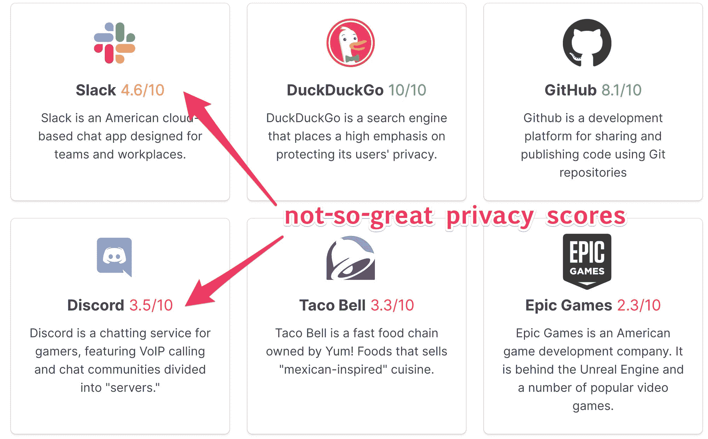
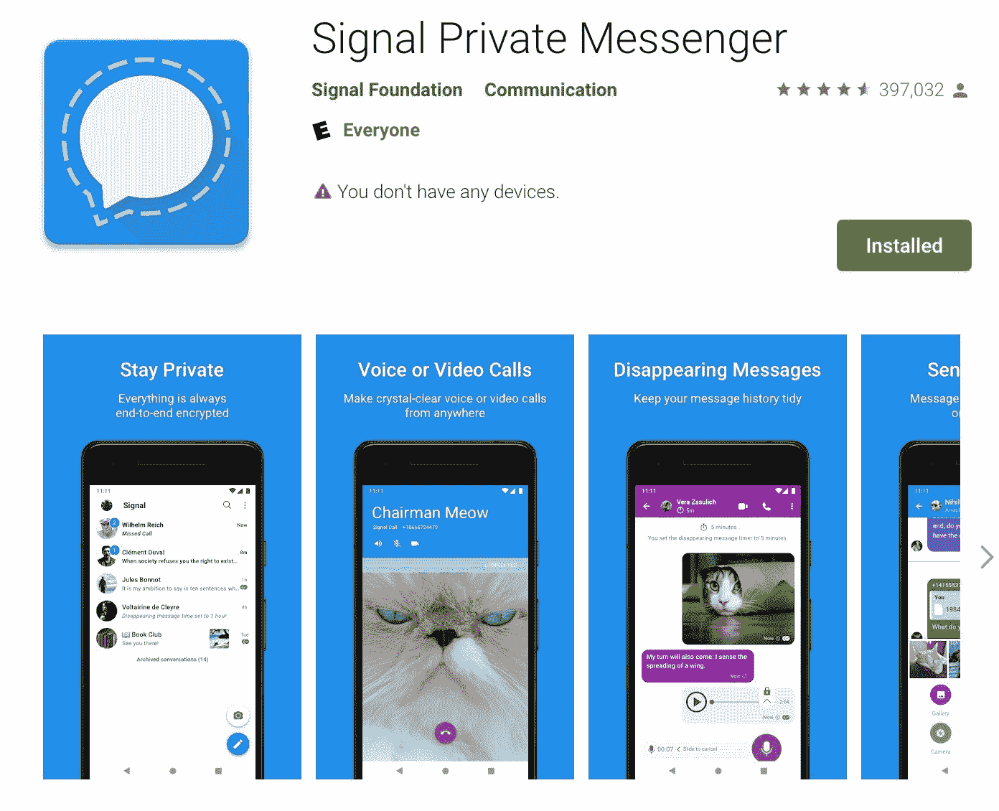
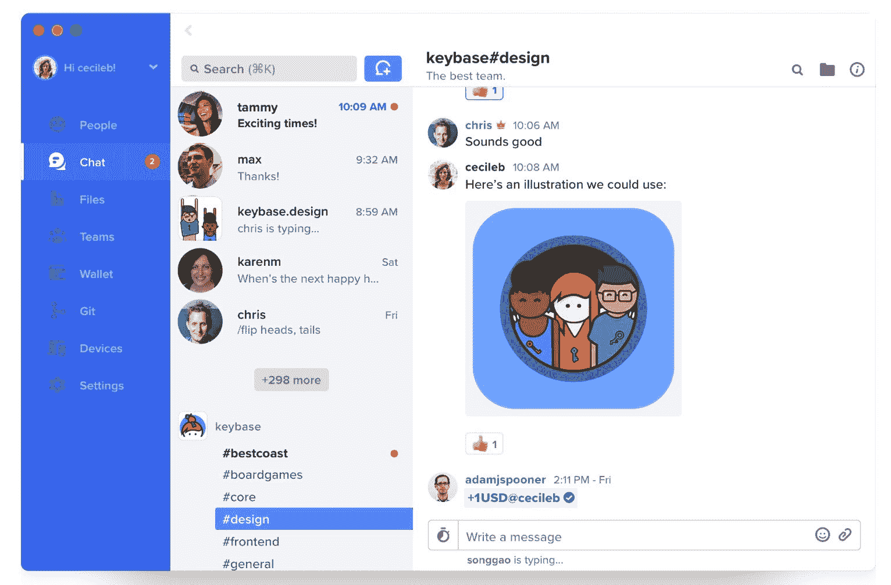
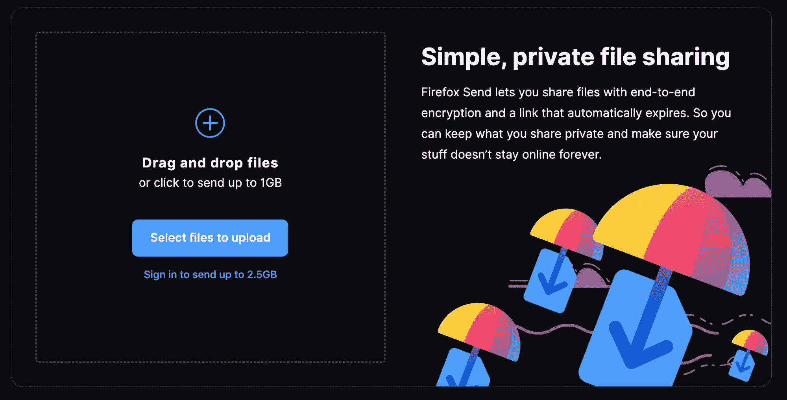
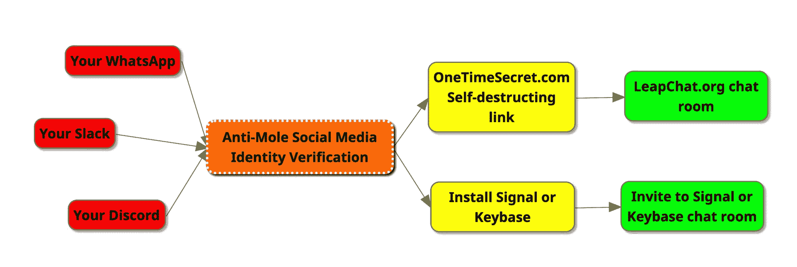

# 如何建立一个极其安全的私人群聊

> 原文：<https://www.freecodecamp.org/news/how-to-secure-private-group-chat/>

像 Discord 和 Slack 这样的聊天室工具比以往更受欢迎。但是他们从来没有打算作为一个敏感的讨论或安全的文件共享的地方。

Discord 主要用于在线游戏中的语音聊天。Slack 的根源在于企业沟通。

这些聊天工具都不是以隐私为核心设计的。

另一个很多人使用的事实上的聊天工具——Twitter——是为快速、公开的状态更新而设计的。他们添加了直接信息，但这些也不是特别隐私。

根据分析大型科技公司隐私政策的网站 PrivacySpy 的说法，这三个选项对你来说都不够隐私。

根据他们的隐私政策，Discord、Slack 和 Twitter 可能都愿意将你的数据交给其他人，甚至不需要传票或法院命令。

可能会有这样的情况，政府——甚至私人公司——可以获得你的信息。他们甚至会把它们公之于众。

如果这种可能性困扰着你，不要害怕。如果你真的想在不危及你的团队或泄露你的秘密的情况下与朋友交谈，你有很多选择。

这篇文章将向你展示几种创建群聊的方法，在这种情况下，任何公司都没有权力将你的对话交给任何人。

# 如何使用信息应用安全聊天

首先，有安全专家设计的消息工具。

你可能会听到马克·扎克伯格谈论 WhatsApp 和 Facebook Messenger 如何使用加密技术。或者蒂姆·库克谈谈 iMessage 如何使用加密技术。

所有这三个消息工具都是闭源的，所以很难知道它们对你的消息加密有多安全，以及公司内外的哪些人可以访问它们。

这意味着对于敏感的谈话来说，这些工具不够私密。

不过，确实有开源的私人信息工具。这给了他们额外的责任。

# 使用信号私人信使安全聊天

Signal Private Messenger in the Google Play Store

[信号私信](https://signal.org/download/)有端到端加密，使用验证号。

Signal 还提供了消失信息、加密电话和许多其他安全通信功能。对于眼前的话题，Signal 提供群聊。

Signal 是免费的，可以在 iOS、Android 和你的桌面上运行。我用了好几年了。

Signal 的主要缺点是，你需要下载一个应用程序，并将你的帐户与你的电话号码相关联。这不是一个匿名通信工具。如果你是——比方说——一个记者会见消息来源——你可能需要找到一个更安全的选择。

# 使用 Keybase 安全聊天

A screenshot from Keybase

另一个消息工具是 [Keybase](https://keybase.io/download) 。这是一款文件共享工具，内置了安全聊天功能。

与 Signal 不同，Keybase 确实将你的加密信息存储在他们的服务器上，所以理论上它不太安全。但它是开源的，他们使用的加密理论上要花费价值数十亿美元的超级计算机时间，才能用今天的技术破解。

Keybase 还要求安装软件并证明你的身份——最常见的是通过你的社交媒体账户发布公共帖子。

# 但是，如果你真的真的希望你的群聊是私密的，不需要安装应用程序...

我将列出一些工具，如果我想围绕一个敏感话题组建一个小组，或者在一个独裁政权的国家内部组建一个小组，我会用到这些工具。

给你个警告——我们要进入一些真正的间谍惊悚片了。没有什么比通过日报上的填字游戏进行交流更复杂的了，但是同样深奥。

# 如何创建你的私人聊天室

如果你只是希望能够安全地聊天，而不需要很多设置时间，这是我所知道的最安全的聊天室工具: [LeapChat](https://www.leapchat.org) 。

这个基本的聊天室使用端到端加密。它对传输中和静止的消息进行加密。当信息到达你的浏览器时，它会对信息进行解码。

不需要使用电子邮件地址或电话号码登录，甚至不需要记住密码。如果你知道房间的网址，你可以选择一个用户名并开始聊天。

但是知道一个 LeapChat 房间的 URL 的唯一方法是从其他人那里得到它。你不会猜到的。因为这些 URL 有 25 个英语单词长，并且每个单词都来自 EFF 列表的 7776 个单词。这意味着可能的组合数量约为 1 古戈尔(10 的 100 次方——比已知宇宙中的原子数量还要多)。

但 URL 是一长串英文单词的好处是，如果有必要，你可以使用助记工具记住它，并且你可以很容易地大声读给别人听。

# 如何安全地共享您聊天室的网址

所以你可能想知道-分享我的新 LeapChat 房间的 URL 的最安全的方法是什么？

在这种情况下，您应该使用某种自毁式重定向 URL。这样，即使有人在你已经使用过的信息中发现了这个网址，他们也不知道这个链接最终会指向哪里。

你可以使用像 [One Time Secret](https://onetimesecret.com) 这样的开源服务来分享你的 URL。

文件共享呢？如果你想设置的话，你可以使用 Keybase 或 Signal 安全地共享一个包含安全聊天室链接的文本文件。

但是有一个更简单的方法。Mozilla 为最大 1gb 的文件提供匿名的端到端加密文件共享服务。您甚至可以将下载链接设置为在使用后过期。

# 如何让鼹鼠远离你的聊天室

现在，您拥有了与朋友进行真正私密、安全的群聊所需的所有工具。但是你如何识别你的朋友是否是他们所说的那个人呢？

任何组织都会有潜在的“内奸”问题。

如果入侵者能够设法进入您的团队，那么无论您多么认真地实施安全措施都没有关系。他们可以做你告诉他们做的任何隐私对策，并继续访问。

所以在你把你的小组转移到一个更安全的地方之前，你需要确定你小组中的人是他们所说的那个人。

假设团队中的人应该知道彼此是谁(并且这不是匿名人的会议)，我有一个非常可靠的方法来实现这一点。这类似于 Keybase 使用社交媒体上的公开帖子来确认您的身份的方法。但我的方法更加谨慎。

你需要做的就是让他们更新他们的 LinkedIn 个人资料，加入一个随机的词，比如“拨奏”。然后你可以查看他们的 LinkedIn 个人资料，确认他们拥有控制权。

LinkedIn 是一个很好的社交网络，因为几乎每个专业人士都有一个。创建一个新帐户并积累现实世界的联系和背书是一件很麻烦的事情。他们不需要创建一个帖子，他们只需更新他们的个人资料足够长的时间，让你验证他们是他们所说的人，然后可以恢复他们的个人资料更改。

因此，一旦您当前聊天的成员通过了您的真实身份检查，您就可以给他们一个自毁 URL，让他们进入您的 LeapChat 房间，或者交换信号或 Keybase 加密密钥，然后在那里聊天。

# 如何删除您现有的 Discord / Slack / Twitter DM 社区

坏消息是，在你删除账户后，这些服务中的大部分将继续存储你的数据。

即使你明确要求他们删除你所有的数据，也没有办法确定你的数据已经被删除了。不可能证明你的数据不再存在于某个地方的备份中。

木已成舟。说的就是说的。

但你确实可以控制公司未来能够存储你的哪些信息。

如果您有旧的不一致或松弛的管理员权限，您可以删除它。即使这实际上不会删除他们服务器上的所有数据，它也会阻止新成员加入这个群并筛选你的聊天记录。这将减少你的任何秘密在未来泄露出去的可能性。

你也可以删除自己在 Slacks 和 Discords 上的账户。这应该会删除您的旧邮件。

# 同样，这里是如何将你的懈怠，不和谐，其他小组聊天转移到一个更安全的家-所有在一个流程图。

# 如果你真的真的想要安全，一些额外的工具

## 用 Tor 浏览

Tor 代表“洋葱路由器”，指的是它使用许多洋葱状的层来掩盖网络活动。它是免费的、开源的，而且相当容易使用。

Tor 给人的感觉和其他浏览器一样，有着相似的功能集。是火狐的一个分支。由于所有额外的数据包重定向，它只是稍微慢了一点。

但是如果你真的想安心地浏览网页，使用 Tor，任何人几乎都不可能跟踪你。

[在此下载 Tor 浏览器](https://www.torproject.org/download/)。

一旦你安装了 Tor，你就可以访问来验证一切工作正常。

## 使用 Protonmail 帐户发送电子邮件

Protonmail 是一款注重隐私的电子邮件工具。你知道它是安全的，因为它是瑞士的。？

您需要向 Protonmail 提供一个真实的电子邮件地址，以便创建您的帐户，但该电子邮件地址将以加密形式存储。

对于每一个目的，你可能需要不止一个 Protonmail 地址。

还要记住，电子邮件也存储在收件人邮件服务的服务器上。因此，如果你给一个有 Gmail 地址的人发邮件，你的邮件也会被存储在谷歌的服务器上。

## 就是这样。保持警惕，朋友们。