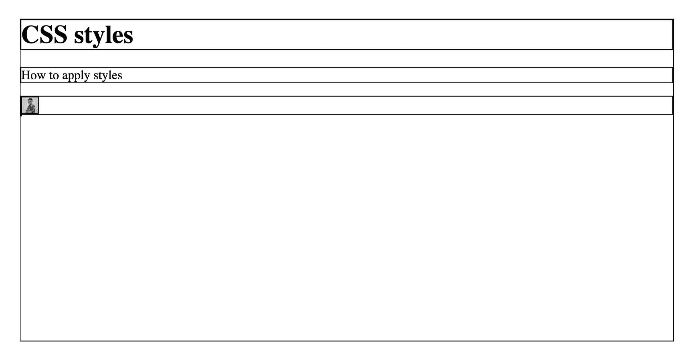
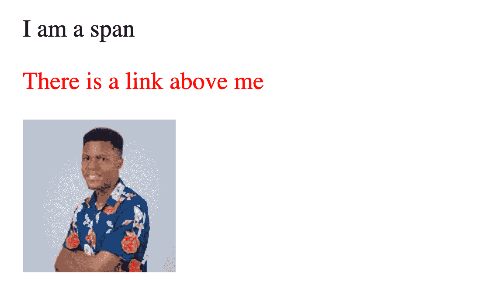
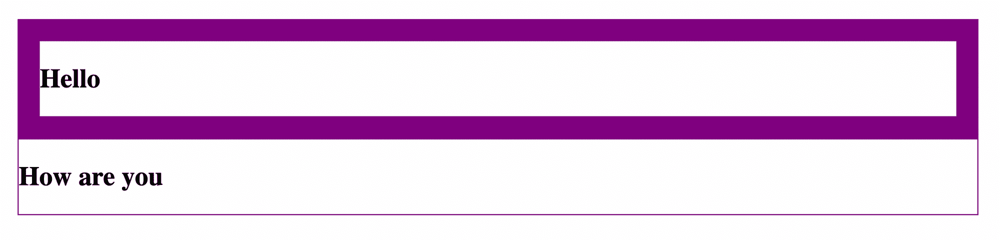
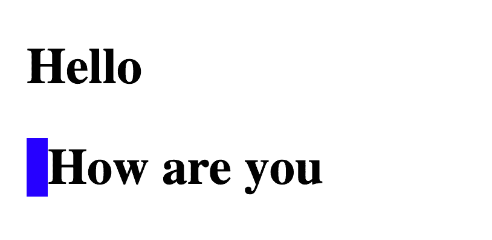
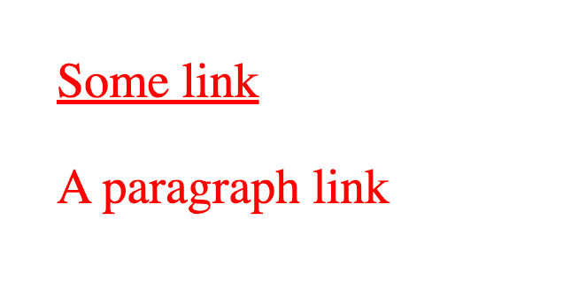
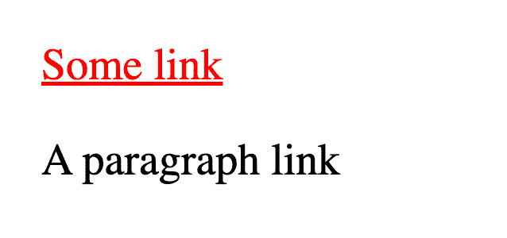
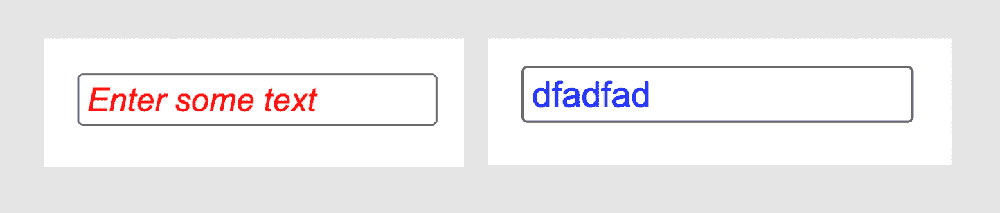

# CSS 选择器类型–如何在 CSS 中选择要样式化的元素

> 原文：<https://www.freecodecamp.org/news/how-to-select-elements-to-style-in-css/>

当你想用 CSS 样式化一个元素时，你首先必须“选择”它。在本文中，我将向您展示实现这一目标的七(7)种方法。

下面是 CSS 中样式元素的语法:

```
selector {
  /* styles here */
} 
```

您已经有了“定位”您想要样式化的元素的选择器，然后您有了一个左花括号。在大括号之后，您有了使用不同 CSS 属性的样式，并且您用一个右花括号来结束它。

有许多方法可以定位元素。你可以调用这些方法**选择器类型**。

如果你喜欢的话，这里有一个关于在 CSS 中选择元素样式的示例视频。

下面是 CSS 中的七种选择器类型。

## 1.如何在 CSS 中使用通用选择器(*)呢

通用选择器**星号** (*)，允许您选择任何类型的所有元素进行造型。这里有一个例子:

```
* {
  border: 1px solid black;
} 
```

假设我们对下面的 HTML 使用这种样式:

```
<body>
    <h1>CSS styles</h1>
    <p>How to apply styles</p>
    <div>
        
    </div>
</body> 
```

结果如下:



你可以看到`body`、`h1`、`p`、`div`和`img`元素都有 **1px 纯黑**的`border`，因为我们使用了通用选择器。

## 2.如何在 CSS 中通过标记名设置元素的样式

您还可以通过使用元素的标记名来选择要设置样式的元素。这里有一个例子:

```
p {
  color: red;
}

img {
  width: 100px;
  height: 100px;
} 
```

这些样式声明将**红色**的`color`应用于所有`p`元素，并将 **200px** 的`width`和`height`应用于所有`img`元素。

下面是上面的样式如何处理这个 HTML:

```
<span>I am a span</span>
<p>There is a span above me</p>
 
```

结果是:



你可以看到`span`没有被样式化——只有`img`和`p`被样式化了。

## 3.如何在 CSS 中设计类的样式

元素接受不同的属性(也称为特性)，包括类。您可以基于在元素上指定的类来定位元素。这里有一个例子:

```
<div class="container">
    <h2>Hello</h2>
</div>

<div>
    <h2>How are you</h2>
</div> 
```

这里有两个`div`,但是只有一个具有带有**容器**值的 class 属性。你可以用一个**周期** ( **)来设计这个类的样式。**)然后是这样的课:

```
div {
  border: 1px solid purple;
}

.container {
  border-width: 20px;
} 
```

结果如下:



从 CSS 中，我们指定所有的`div`元素都应该有一个 **1px 纯紫**的`border`。但是对于带有**容器** `class`的元素，从结果中可以看出它的`border-width`为 20px。

## 4.如何在 CSS 中设置 id 的样式

类似于`class`属性，您可以在一个元素上指定一个`id`,您可以将它作为 CSS 样式的目标。

这里有一个例子:

```
<div class="container">
    <h2>Hello</h2>
</div>

<div id="container">
    <h2>How are you</h2>
</div> 
```

您可以通过使用一个**散列** ( **#** )和 id 来定位这里的`id`元素，如下所示:

```
#container {
  border-left: 10px solid blue;
} 
```

结果如下:



使用带有**容器** `id`的元素(无论是`div`、`p`还是任何类型)，我们只对第二个`div`元素应用了样式。

然而，与类不同的是，`id` s 必须是**唯一的**。两个或多个元素不能有相同的`id`,因为这会导致意外的行为。

## 5.如何在 CSS 中设置其他属性的样式

我们已经看到了如何定位`class`和`id`属性。如果你想瞄准其他属性呢？你可以。使用**方括号** ( **【属性】**)。这是怎么回事？

让我们看一个例子:

```
<a href="#">
    Some link
</a>

<p href="https://google.com">
    A paragraph link
</p> 
```

在这个例子中，我们有两个元素:一个`a`标签和一个`p`标签。要设置这两个元素的样式，可以直接使用它们的标记名:

```
p, a {
  color: red;
} 
```

逗号允许您一次将样式应用于多个选择器。

但是另一种可以设计这两种元素样式的方法是使用它们的属性。它们都有一个`href`属性。

请记住，`p`标签不支持`href`属性。我只是用它来举例说明。

下面是如何使用`href`属性来设计这两个元素的样式:

```
[href] {
  color: red;
} 
```

这个 CSS 将匹配所有带有`href`属性的元素。

结果如下:



这两个元素都有`href`属性，因此它们被选择用于我们的样式。这里，我们使用了没有值的属性`href`。您还可以指定一个特定于目标的值，如下所示:

```
[href="#"] {
  color: red;
} 
```

结果如下:



只有`a`标签有带 **#** 值的`href`属性，所以这是唯一匹配我们样式的元素，正如你从上面的图片中看到的。

## 6.如何在 CSS 中使用伪类

伪类是选择器类型，允许您选择处于特定状态的元素。举几个例子，下面是一些受支持的状态:

*   `hover`(当鼠标悬浮在一个元素上时)
*   `disabled`(当输入或按钮等元素被禁用时)
*   `required`(需要表格元素时)

更多内容可以在[伪类 MDN 文档](https://developer.mozilla.org/en-US/docs/Web/CSS/Pseudo-classes)中找到。

当元素处于这些状态时，可以应用样式。您可以通过在州后面使用一个冒号 ( **:** )来选择州。这里有一个例子:

```
<!DOCTYPE html>
<button>
    Hover me
</button> 
```

`<!DOCTYPE html>`行对于指定它是 HTML5 非常重要，这样伪类才能工作。

这是 CSS:

```
:hover {
  background-color: black;
  color: white;
} 
```

这个 CSS 将把这些样式应用到你悬停的任何元素上。结果是这样的:


左边的图像没有悬停状态。在右边，你可以看到应用于`body`和`button`的样式，因为我们正停留在它们上面。

通过悬停在`button`上，您也悬停在`body`上，因为`button`是`body`的子节点。

## 7.如何在 CSS 中使用伪元素选择器

伪元素(不同于伪类)用于选择“元素的特定部分”。不是整个元素，只是一部分。您还可以使用它们向现有元素添加伪(人工)元素。

这里有一篇关于 CSS 中的[伪元素和伪类的详细文章](https://dillionmegida.com/p/pseudo-elements-vs-pseudo-classes-in-css/)

以下是一些受支持的伪元素选择器:

*   `selection`:元素的高亮部分
*   `first-line`:段落的第一行
*   `placeholder`:输入元素的占位符文本

更多信息可以在 [MDN 伪元素文档](https://developer.mozilla.org/en-US/docs/Web/CSS/Pseudo-elements)中找到。

要使用伪元素选择器来应用样式，可以使用**双冒号** ( **::** )，后跟伪元素。这里有一个例子:

```
<!DOCTYPE html>
<input placeholder="Enter some text" /> 
```

这是这个 HTML 的 CSS:

```
input {
  color: blue;
}

::placeholder {
  color: red;
  font-style: italic;
} 
```



`::placeholder`伪元素选择器为所有表单元素的“占位符部分”设置样式。正如你在上面的例子中看到的，`input`元素本身有一个`color`样式的**蓝色**，但是占位符部分有不同的样式。

## 包扎

在本文中，我向您展示了七种方法，您可以用这些方法来设计想要设计的元素。我们已经看到:

*   通用选择器，用于选择所有元素
*   用于选择与标记名匹配的元素的标记名
*   用于选择具有类属性的元素的类
*   用于选择具有 id 属性的元素的 id
*   用于选择具有带或不带指定值的属性的元素的属性
*   用于选择处于特定状态的元素的伪类
*   用于选择元素特定部分的伪元素

您还可以组合这些选择器，使您想要定位的元素更加具体。你可以使用**组合子**来实现。

组合子允许您根据匹配选择器的元素之间的关系，使用多个选择器来定位元素。如果你想了解更多，这里有一篇我写的关于组合子的[文章。](https://www.freecodecamp.org/news/css-combinators-to-select-elements/)

给你一个快速预览——组合子用于多种选择器类型之间，它们允许你根据元素与其他元素的关系来设计元素的样式。

感谢您的阅读！