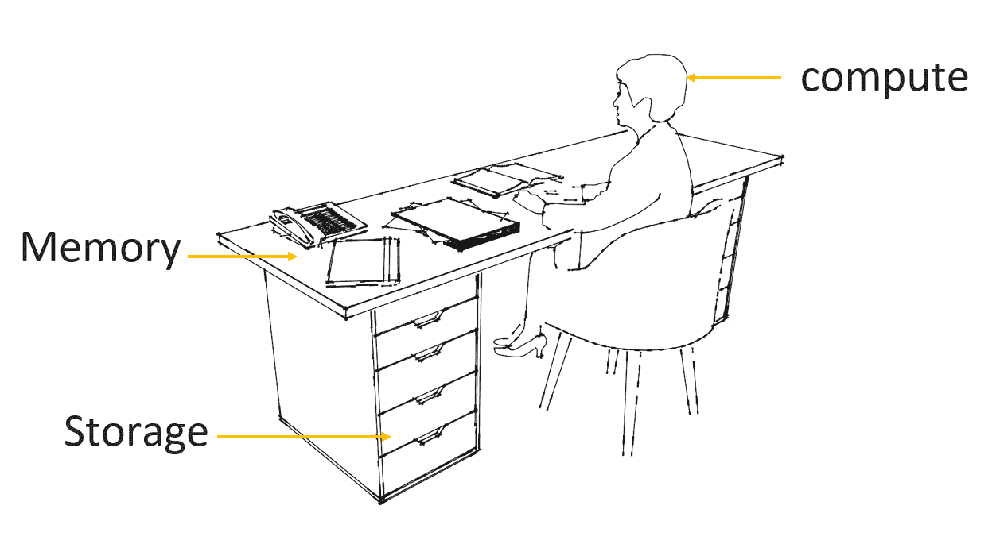
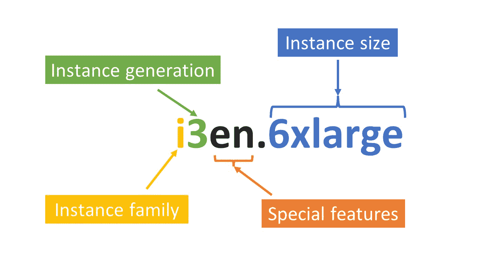

# 如何选择正确的 EC2 实例——EC2 实例及其功能指南

> 原文：<https://www.freecodecamp.org/news/how-to-select-the-right-ec2-instance/>

EC2(弹性计算云)是 AWS 最广泛使用的计算服务。这也是 AWS 推出的最早的服务之一，因为它始于 2006 年。

在本文中，我将介绍一些您在选择 EC2 实例时应该考虑的事情。

您可以认为 EC2 实例与您的个人计算机没有太大的不同。如果你打算买一台电脑，你可能会想到三个宽泛的技术考虑因素(当然，忽略你可能有的任何审美或设计偏好):

1.  它能处理多少数据？
2.  它有多少内存？
3.  它有多少存储空间？

在选择 EC2 实例时，您也应该考虑这三个问题。不同之处在于，您只是从 AWS 租用实例，而不是像购买个人计算机那样购买。

每个 EC2 实例由以下部分组成:

1.  CPU–可以实现多少处理能力
2.  记忆
3.  存储——这仅适用于一些具有物理连接存储的实例(称为[实例存储](https://docs.aws.amazon.com/AWSEC2/latest/UserGuide/InstanceStorage.html))。对于其他 EC2 实例，您需要单独选择使用 EBS(弹性块存储)的网络存储。

## 计算、内存和存储–一个类比

EC2 实例的一个很好的类比是您的办公桌。

你的大脑是计算机，你的桌面是存储器，你的抽屉是存储器。注意，这个类比(像所有的类比一样)有其局限性。它的目的是在 EC2 实例中巧妙地划分计算、内存和存储的角色。

计算到底是什么意思？计算与*并行性相关—*同时执行多个任务的能力。

人类大脑可以处理一定程度的并行性。例如，你可以一边打电话一边记笔记。然而，你不能同时写两封不同的信，或者一边做笔记一边看书一边打电话。

这些活动不能并行执行，因为我们的大脑可以粗略地认为是一个单核的 CPU。为了提高计算能力，我们需要提高并行性，这可以通过拥有多个 CPU 内核来实现。更多的内核意味着更多的并行性，也就意味着更多的计算能力。

内存和存储理论上是一回事。我们用它们来存储数据。但实际上，它们是物理上不同的基础架构，因为没有一个存储设备既快速又非易失。

内存速度快且易失，而存储速度慢且非易失。放在你桌面上的东西可以很快很容易地获取，就像电脑内存中的数据一样。但是，在繁忙的办公室里过夜留在你桌子上的任何东西都有被移动、丢失或被盗的风险。你的桌面就像电脑的内存一样，是不稳定的。

另一方面，存储是非易失性的，但读/写速度较慢。就像你书桌抽屉里的物品不太可能丢失，但需要更长时间才能拿到手。

## 如何选择正确的 EC2 实例

因此，在选择 EC2 实例时，CPU、内存，有时还有存储是您可以利用的三个杠杆。回想一下，除了具有物理连接存储的存储优化实例之外，存储通常是与使用 EBS 卷的 EC2 实例分开选择的。

当您选择一个实例类型时，您实际上选择了对您的工作负载最重要的指标的最低单位价格。该指标可以是 CPU/GPU 性能、内存或存储。

有五种 AWS 实例类型:

*   通用:通过选择通用实例，您采取了一种平衡的方法，而不是针对任何一个指标进行优化。
*   计算优化:通过选择计算优化实例，您可以优化每单位 CPU 性能(CPU 内核数量)的最低价格。
*   加速计算:通过选择加速计算实例，您可以优化每单位 GPU 性能的最低价格(将此视为高性能计算工作负载所需的专用 CPU)。
*   存储优化:通过选择存储优化实例，您可以优化每单位存储容量和效率的最低价格。
*   内存优化:通过选择内存优化实例，您可以优化每单位内存的最低价格。

让我们更详细地看一下实例类型。

AWS 对此有一个很好的概述，我总结如下:

1.  **通用**–适用于需要平衡计算、内存和网络的工作负载。理想的用例是 web 服务器。
2.  **计算优化**–适用于需要高性能处理器的工作负载。每 CPU 核心数量的最低成本。非常适合科学建模和游戏等计算密集型工作负载。
3.  **加速计算**–**适用于比计算优化实例需要更多计算资源的工作负载。这种类型的实例使用 GPU(图形处理单元)，这是一种专门为机器学习和高性能计算工作负载设计的 CPU。**
4.  ****存储优化** -适用于需要高速读写大量数据的工作负载，即高 IOPS(每秒输入/输出操作数)。

    与其他实例不同，这些不使用单独的 EBS 卷进行存储。相反，它们带有物理连接的存储卷(称为[实例存储](https://docs.aws.amazon.com/AWSEC2/latest/UserGuide/InstanceStorage.html))。这意味着数据不必通过网络，从而实现高 IOPS。

    理想的用例是 NoSQL 数据库——如 Elasticsearch、MongoDB、Cassandra 和一些数据仓库应用程序。然而，实例存储卷有一个问题:存储在那里的任何数据都不会在实例生命周期之后继续存在。因此，如果实例停止、休眠、终止或失败，您将丢失该实例上的所有数据。

    因此，存储优化实例的理想使用情形是需要高 IOPs 的工作负载**和**能够容忍一个实例的故障(通常通过将数据复制到另一个实例来实现冗余)。**
5.  ****内存优化–**适用于需要大量 RAM 的工作负载。每单位内存的最低成本。非常适合内存数据库、缓存和 SQL 数据库。**

## **EC2 实例名称剖析**

**您可能遇到过像 t2.nano、r6a.large 或 i3en.6xlarge 这样的 EC2 实例名，这些字母和数字到底是什么意思？**

**我们以 i3en.6xlarge 这样复杂的名字为例，分解一下。**

**

Anatomy of an EC2 instance name broken down** 

### **实例族**

**从左向右阅读，第一个字母是实例族。每个系列仅属于一种实例类型，即通用、计算优化、加速计算、存储优化或内存优化。**

**没有必要死记硬背地试图了解哪个实例族属于哪个实例类型。随着您越来越多地使用 AWS，它几乎会成为您的第二天性。如果你愿意，你可以在这里看一下[作为参考。](https://aws.amazon.com/ec2/instance-types/)**

**上面的 i3en.6xlarge 实例属于“I”系列，这是一个存储优化的实例。**

### **实例生成**

**这是显示实例生成的数字。数字越大，这一代越新。**

**当给同一个实例提供不同代之间的选择时，理想情况下，您应该总是选择最新的代。最新一代的实例通常带有最新的硬件。这通常意味着相对于老一代产品，单位性能成本更低。**

**上例中的 i3en.6xlarge 实例是第三代实例。**

### **特殊特点**

**这些是实例生成后出现的可选字母。每个字母表示该实例的一些特殊特征。**

**在这种情况下，“ **e** 表示**额外的** **容量**(可以是 RAM 或存储器)，而“ **n** 表示实例是**网络** **优化的**。这意味着它具有高网络带宽，这意味着该实例可以处理高数据传输率，通常以每秒 Gb 为单位。**

**其他特殊字符及其功能如下:**

*   ****a**–AMD 处理器**
*   ****g**–AWS Graviton 处理器**
*   ****I**–英特尔处理器**
*   ****d**–实例存储容量**
*   ****b**–块存储优化**
*   ****z**–高频**

**这些额外的特性不是免费的，所以如果您需要这些额外的特性，请只选择具有额外特性的实例。**

### **实例大小**

**大小出现在句号之后。它由两部分组成:一个数字和表示大小的字母。尺寸选项范围从纳米到超大。**

**该数字仅出现在 xlarge 实例中。它表示实例比 xlarge 大多少。所以 2 倍大是 1 倍大的两倍，6 倍大是 1 倍大的 6 倍。**

**但是，两倍或六倍大到底意味着什么呢？**

**对于相同的实例类型，句号后面的数字充当计算(vCPUs 的数量)、内存(RAM 的数量)和存储大小(并非总是如此——一些实例使用 EBS 卷，其中存储可以独立于实例进行扩展)的乘数。另一方面，存储优化实例使用物理连接的实例存储，该存储根据实例大小进行扩展。).**

**i3en.xlarge 实例有 4 个 vCPUs、32 GiB 内存和 2500 GB 存储容量。一辆 i3en。 **6** xlarge 大了六倍，因为它的**是 vCPUs 数量的六倍**(24)，内存的六倍(192 GiB)，存储容量的六倍(15，000 GB)。**

## **将所有这些整合在一起——如何选择您的实例**

**因此，假设您需要为您的 web 服务器或 NoSQL 数据库选择一个 EC2 实例，那么应该遵循哪些逻辑步骤呢？**

### **步骤 1:选择实例类型**

**在通用、计算优化、加速计算、存储优化和内存优化之间做出选择是第一个也是最重要的决定。随后的每一个决定都是由这个决定决定的。**

**在这里，您所做的决策主要是成本决策——您试图**优化对您的工作负载最重要的指标的最低单位成本**。**

**如果您的工作负载是通用的，如 web 服务器，请选择通用实例。如果您的工作负载是计算密集型的，请选择计算优化的实例类型。如果您的工作负载是内存或存储密集型的，同样的逻辑也适用。**

### **步骤 2:选择实例族**

**选择正确的实例族的一个很好的心理模型是仔细阅读您计划在该实例上运行的应用程序的技术文档，并使用他们的建议。**

**例如，Elasticsearch(一个全文搜索引擎数据库)推荐“I”类实例——特别是“i3”。回想一下，实例族后面的数字就是实例代，最新的通常是最大的。**

**当新一代的“I”家族到来时，Elasticsearch 可能会推荐“i4”实例。选择实例族时，可以通过类比进行推理。看看应用程序推荐什么，因为这是减少任何遗漏或错误的好方法。**

**该应用程序背后的公司将有很多测试不同家庭的经验，并将代表你做实验。没有必要重新发明轮子(当然，除非您的工作量确实很小，并且不存在最佳实践)。**

### **步骤 3:选择具有特殊功能的实例**

**只有在绝对必要时才这样做。你将为此支付额外的费用。**

### **步骤 4:选择实例大小**

**这完全取决于您的工作量，通常是一个迭代过程。您可以在监控 CPU 和内存利用率的同时运行一些测试，看看您选择的大小是否合适。**

**您通常试图拥有一些安全余量，因此如果您的工作负载平均消耗了 90%的内存和 CPU，您可能需要选择一个更大的实例。90%的利用率不会为您在测试过程中可能产生的任何估计误差提供太多的余量。**

**决定你需要的净空高度更多的是艺术而不是工程，所以在这方面没有硬性的定性数字。但作为一个粗略的指南，利用率在 90%范围内是不好的，80%范围是可以接受的，70%及以下是好的。**

**您需要提供一些余量，以防止在高峰需求期间出现任何性能问题。**

## **包扎**

**当您选择实例类型时，您实际上是在选择对您的工作负载最重要的指标的最低单位价格。这是你正在从事的任何项目的重要基础，因为它确保你为每单位业绩支付最低的金额。**

**选择实例大小是难题中最困难的部分，可能是一个迭代过程，您从小规模开始，进行测试，然后根据需要进行扩展。**