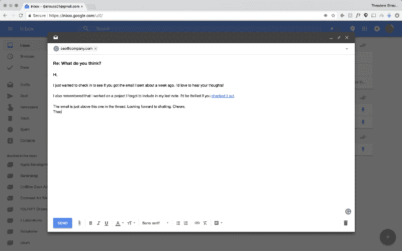
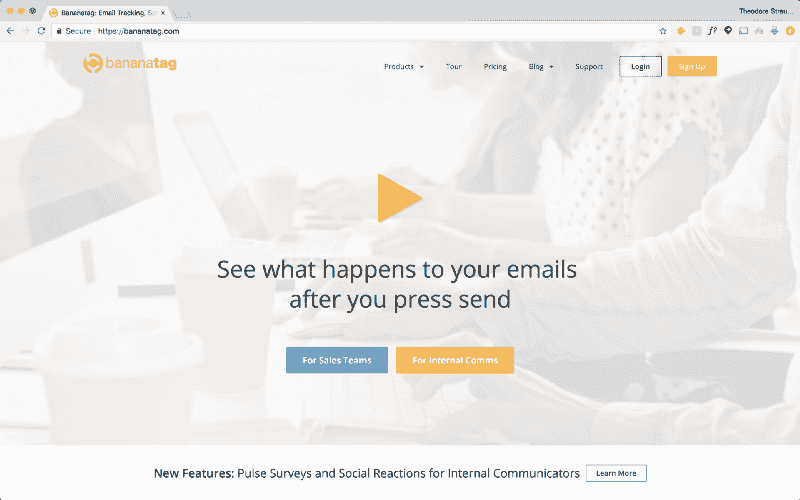
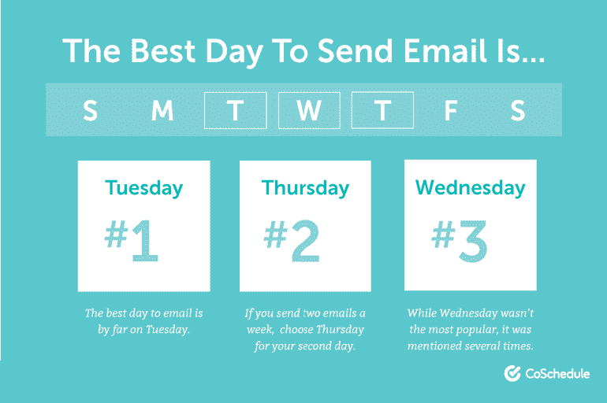
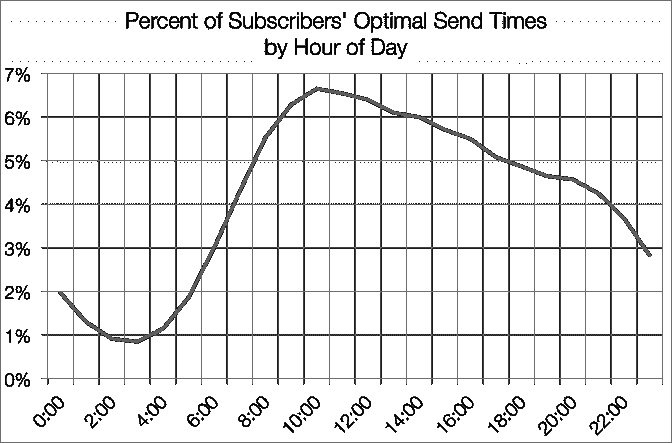
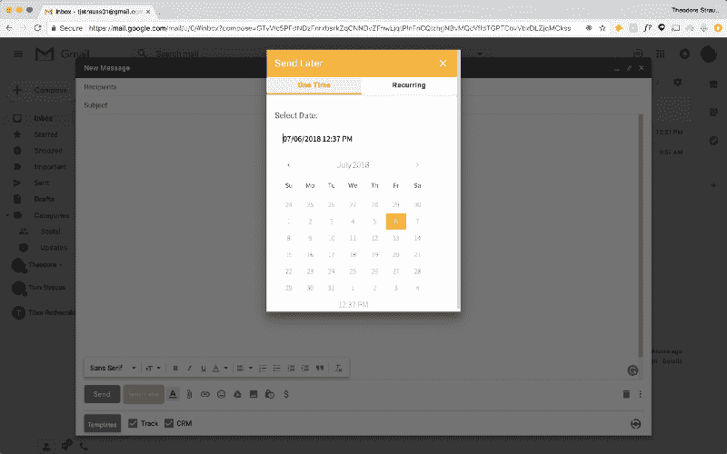
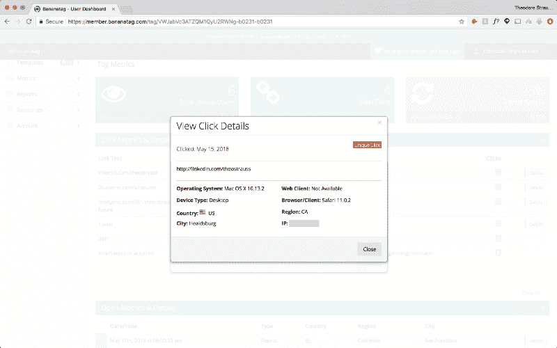

# 如何以正确的方式发送电子邮件:跟踪、跟进并获得回复。

> 原文：<https://www.freecodecamp.org/news/how-to-send-an-email-the-right-way-track-follow-up-and-get-a-response-5a607ae45797/>

作者西奥·施特劳斯

# 如何以正确的方式发送电子邮件:跟踪、跟进并获得回复。

#### 电子邮件人的银河指南:第三部分

How can I track this email?

正如我在前两篇文章中讨论的，我 17 岁，所以我的关系网还不算太大。对我来说，冷冰冰的邮件是联系创始人最简单、最直接的方式。在过去的一年里，我给首席执行官、创始人和设计负责人发了 100 多封电子邮件，并想出了如何确保回复的方法。

与大多数人的想法相反，发电子邮件并不像写、发和等待那么简单。一旦你点击发送按钮，旅程才刚刚开始。

> 快速提示:这是关于冷邮件系列的第三篇文章。如果你还没有读过 [如何在几分钟内找到任何一位 CEO 的电子邮件地址](https://medium.freecodecamp.org/how-to-find-any-ceos-email-address-in-minutes-70dcb96e02b0) *或* [如何为一位 CEO 设计一封 100%阅读率、点击率和回复率](https://medium.freecodecamp.org/how-to-design-a-cold-email-for-a-ceo-with-a-100-read-click-and-response-rate-84edb1b2603b)，*的冷冰冰的电子邮件，我建议在开始之前先看看这些。*

这篇文章是关于最大化你得到回应的机会。因此，我们将深入探讨何时发送电子邮件、如何跟踪电子邮件以及为什么应该跟进以增加收到回复的机会。所以，坐下来，打开 Chrome，我们开始工作吧。

### 点击*前发送*

现在，你看到的发送按钮只做一件事:把你的邮件从草稿文件夹移到收件人的收件箱。为了密切关注你的电子邮件的进展，该电子邮件需要启用跟踪功能。

#### 什么是电子邮件追踪器？

在最基本的层面上，电子邮件跟踪器可以跟踪你的电子邮件。它会告诉你什么时候被打开过。

但是，随着你越来越深入，追踪器可以揭示更多的信息:

*   它被打开过几次了
*   它被打开的地方
*   谁打开了它
*   当他们访问你的网站时
*   他们在你的网站上去了哪里

为什么这些事情很重要？有了你的电子邮件在何时何地被打开的数据，你就可以推断出他们是在旅行，是在家，甚至是在办公室。找出接近他们的最佳时机至关重要。

了解是否有多个设备打开了你的电子邮件，可以让你知道你联系的那个人是否把你的短信转发给了同事。

而且，知道他们在你的网站上是否去过，去了哪里，可以让你设计一个后续的工作来推动他们没有看到的你已经完成的工作。

稍后，我们将详细讨论*如何*使用跟踪器。

#### 我应该使用哪个电子邮件跟踪器？

外面有很多追踪器。都有利弊。这是我在一个不太知名的平台上发现的最好的一个，叫做 [Bananatag](http://bananatag.com) 。

Bananatag 工作得如此好的原因是您预先获得了所有的高级功能。免费计划和专业计划的唯一区别是你一天能发多少封邮件(你每天能收到 5 封+你推荐的每个朋友 25 封)。

我试过 Yesware、SalesHandy 和 Mailtrack。毫无疑问，巴纳塔格名列榜首。

#### 如何启用 Bananatag

在发送您的电子邮件之前，请访问 Bananatag 的网站，并按照指示设置您的帐户。按照说明操作后，Bananatag 会与您的电子邮件客户端集成。当你打开一封电子邮件草稿时，你会看到 Bananatag 设置，尽管它默认是跟踪的。

### 发送电子邮件的最佳时间

在电子邮件的世界里，时间就是一切。根据我的研究和测试，我找到了一个能产生最佳结果的日期和时间。

#### 星期几

那么发送电子邮件的最佳日期是哪一天呢？

我在周二发了所有的邮件，T2 的日程安排和我得出的结论是一样的。原因如下:

大多数人认为发送电子邮件的最佳时间是周一，也就是周末回来的第一天。但是，星期一实际上是一周中最忙的一天。创始人不仅会在周末收到大量电子邮件，还会花一天的大部分时间来计划一周的会议。

其他人认为星期三是最好的，因为它是一周的中间。但是，随着一周时间的推移，首席执行官们已经陷入了他们的日常工作，并最终确定了他们一周的时间表。

星期二是这两者之间的中间点。工作量从周一开始逐渐减少，他们也不再保持周一工作的心态。

#### 一天中的时间

MailChimp 制作了这张图表，分解了一天中客户收到邮件最多的时间。很容易看出，上午 10 - 11 点是“最佳”发送时间。我对早上和晚上发送的电子邮件进行了 A/B 测试，我发现这取决于你在给谁写信。

一般来说，我在早上 7:50 发送。原因在于，大多数 CEO 8 点起床，9 点上班。大多数人每天早上做的第一件事是什么？查看他们的电子邮件。在他们醒来之前偷偷把你的邮件放进去，可以确保他们看到你的邮件在他们列表的最上面。

然而，这并不是对每个人都适用。众所周知，初创公司的创始人进入办公室的时间比较晚，可能在 10 点或 11 点左右。试着找一篇他们经历了一个惯例的文章，或者找一篇他们最早发的微博。**总是尽量在他们醒来前 10 分钟发送。**

#### 在您想要的时候发送电子邮件

Bananatag 的另一个伟大特性是电子邮件调度。

当你打开 Gmail 草稿时，Bananatag 集成提供了一个“稍后发送”的按钮。如果你点击它，你会看到一个日历，它允许你选择你想要发送电子邮件的日期和时间。

所以，如果你不想准时醒来，这可以确保你在拿信出门的时候不需要这么做。

### 点击发送后

一旦你的邮件飞出了门，是时候冷静下来，直到他们打开它。如果你计时准确，他们会在几分钟内打开你的便条。

第一次开放意义不大。他们可能只是点击它，然后马上按下删除键，他们可能已经读完了整本书。只有当他们点击链接或回复时，这才变得令人兴奋。

#### 跟踪链接

一旦接收者点击一个链接，整个游戏就改变了。为什么？Bananatag 给你他们的 IP 地址。

当你写一封冷冰冰的电子邮件时，要点是传达你已经完成的事情，并展示你最好的作品。不幸的是，大多数时候，人们倾向于看吸引他们的东西，而这可能不是你想让他们看到的。你的后续行动是让他们回到正轨的地方。

有了他们的 IP 地址，你就有能力跟踪他们在你的网站上的活动，因为大多数分析平台(谷歌、Squarespace 等)都支持页面访问。索引的 IP 地址，你可以看到你的网站上的网页，他们去了。

如果一周后，他们浏览了你的网站，但没有回复，那就又是游戏时间了。

#### 起草后续行动

跟进不仅是展示你真的有兴趣联系他们的机会，也是将他们的注意力引向你或你的工作中更令人印象深刻的部分的机会。

下面是我使用的跟进示例，我将它插入到第一封邮件的回复中:

> *嗨[名字]，*

> 我只是想看看你有没有收到我大约一周前发的电子邮件。我很想听听你们的想法！

> 我还记得我做了一个项目，但我忘了把它写在我的最后一个笔记里。如果你[检查一下](http://link)，我会很激动。

> 这封邮件就在这封邮件的上面。期待聊天。干杯，
> *西奥*

在接下来的文章中，我简明扼要地提醒他们我的笔记，链接到他们没有看到的我最好的作品，然后结束。

利用你对他们在你的网站上出现过或没有出现过的地方的了解，你可以有效地增加你得到回复的机会。

### 从这里去哪里

读完这个由三部分组成的系列文章后，你已经准备好去征服电子邮件世界了。记住，自信是关键。

如果你喜欢这篇文章，按住它。icon(可以到 50，你懂的)。

[跟随我的媒介](http://medium.com/@theostrauss)从新的角度了解更多关于设计的知识。在接下来的几个月里，我将深入研究设计将如何与未来相交。在这一页上，你会看到关于自动驾驶汽车的案例研究，以及强调打破 UI/UX 世界界限的界面的帖子。

你也可以在 [Instagram](http://instagram.com/theostrauss) 和 [Twitter](http://twitter.com/theodorestrauss) 上找到我！