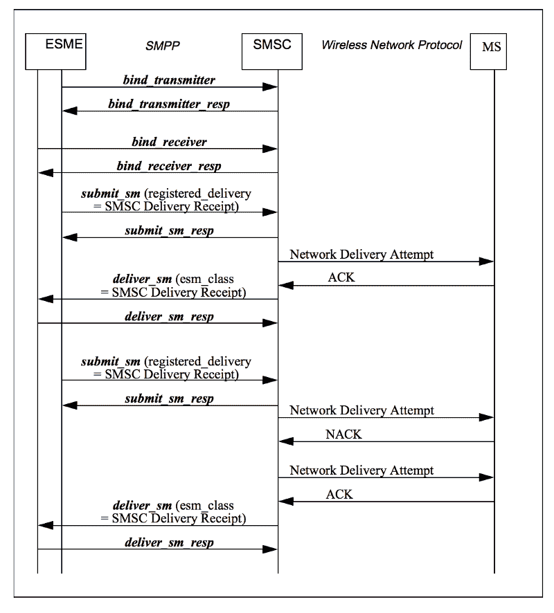

# 如何通过 SMPP 网关在 Node.js 中发送短信

> 原文：<https://www.freecodecamp.org/news/how-to-send-an-sms-in-node-js-via-smpp-gateway-9c7b12e4600a/>

### 介绍

SMPP(短消息点对点)是电信行业使用的协议。它在(SMSC)和 ESME 之间交换短信。SMSC 充当中间人来存储消息并路由它。ESME 是向 SMSC 发送短信的系统。

本教程将帮助您使用自己的 SMSC 网关发送短信。

### **入门**

#### SMPP 用在哪里？

SMPP 特别适合大容量和高吞吐量的 SMS 应用。它具有以下特点:

*   客户端与服务器建立的连接是持久的，并且可以无限期保持打开。像 HTTP 这样使用瞬时连接的协议没有连接开销。
*   SMPP 客户端和 SMPP 服务器都可以发出请求。
*   请求是异步处理的。这意味着可以发出请求，而不必首先等待接收对较早请求的响应。

#### **如何使用**

我们将使用 Node.js [node-smpp](https://github.com/farhadi/node-smpp) 来实现。

SMPP 请求:

*   **绑定**建立 SMPP 会话的请求
*   **submit_sm** 客户端发出的向手机发送消息的请求
*   **deliver_sm** 由服务器发出的将消息从手机转发到客户端的请求，包括送达回执
*   服务器和客户端发出的保持 SMPP 会话活动的请求
*   **解除绑定**由服务器或客户端发出的终止 SMPP 会话的请求

#### **工作原理**

在适当的情况下，必须在 ESME(外部短消息实体)和消息中心或 SMPP 路由实体之间建立 SMPP 会话。

该会话是使用与 SMPP 协议通信的 SMPP 客户端创建的。存在 SMPP PDU(协议数据单元或分组)的连续交换，以确保建立正确的绑定/连接。

SMPP 客户端负责处理短信，并将它们发送到 SMPP 服务器。当 SMS 的状态发生变化时，SMPP 服务器还会将**交付报告**发送回客户端。

Node.js 将帮助我们实现高 MPS，因为它异步执行所有 I/O 操作。

传统上，I/O 操作要么同步运行(阻塞)，要么通过产生并行线程来异步执行工作。

这种老方法消耗大量内存，并且众所周知难以编程。

相反，当节点应用程序需要执行 I/O 操作时，它会向事件循环发送一个异步任务以及一个回调函数。然后，它继续执行程序的其余部分。

当异步操作完成时，事件循环返回到任务以执行其回调。

#### **存储转发报文模式**

SMS 的传统方法是在转发消息以传递给接收 SME 之前，将消息存储在 SMSC 存储区(例如，消息数据库)。在这种模式下，消息会一直安全地存储，直到 SMSC 完成所有传递尝试。这种消息传递模式通常被称为“存储和转发”。



### 步骤 1:创建 SMPP 会话

首先，我们需要用 IP 地址和端口创建一个新的`smpp`会话。

```
const smpp = require('smpp');
const session = new smpp.Session({host: '0.0.0.0', port: 9500});
```

### 步骤 2:绑定收发器

一旦连接，我们将在`connect`事件上绑定它:

```
let isConnected = false
session.on('connect', () => {
  isConnected = true;

  session.bind_transceiver({
      system_id: 'USER_NAME',
      password: 'USER_PASSWORD',
      interface_version: 1,
      system_type: '380666000600',
      address_range: '+380666000600',
      addr_ton: 1,
      addr_npi: 1,
  }, (pdu) => {
    if (pdu.command_status == 0) {
        console.log('Successfully bound')
    }

  })
})

session.on('close', () => {
  console.log('smpp is now disconnected') 

  if (isConnected) {        
    session.connect();    //reconnect again
  }
})

session.on('error', error => { 
  console.log('smpp error', error)   
  isConnected = false;
});
```

### 第三步:发送短信

现在我们连接上了，让我们发送短信:

```
function sendSMS(from, to, text) {
   from = `+${from}`  

// this is very important so make sure you have included + sign before ISD code to send sms

   to = `+${to}`

  session.submit_sm({
      source_addr:      from,
      destination_addr: to,
      short_message:    text
  }, function(pdu) {
      if (pdu.command_status == 0) {
          // Message successfully sent
          console.log(pdu.message_id);
      }
  });
}
```

现在，在发送短信后，SMSC 将发送发送报告，说明短信已发送。

希望这篇教程对你有用。如果你有任何关于**的问题，请随时联系 [out](https://101node.io) 。**

#### **延伸阅读:**

如果你想了解更多关于 SMPP 的信息，请查看:[http://opensmpp.org/specifications.html](http://opensmpp.org/specifications.html)

如果你认为这是一本值得一读的书，请不要犹豫鼓掌！

关注 Shailesh Shekhawat 以便在我发布新帖子时获得通知。

*最初发布于 2018 年 9 月 16 日 [101node.io](https://101node.io/blog/send-sms-in-node-js-via-smpp-gateway/) 。*