# 如何发送大型视频文件–通过电子邮件共享大型文件

> 原文：<https://www.freecodecamp.org/news/how-to-send-large-video-files-share-a-big-file-with-email/>

通过电子邮件发送大文件很有挑战性。这是因为每个电子邮件客户端都有文件共享的大小限制。

Gmail 和雅虎将文件大小限制在 25MB，而 outlook 和 iCloud 将文件大小限制在 20MB。

因此，如果您决定发送(例如)一个大于 25MB 的视频文件，您可能会收到一条消息被服务器拒绝的错误消息，因为它太大了。

一些电子邮件客户端不会显示错误，而是建议您应该如何发送大视频文件。

比如 Gmail 会建议你把视频上传到 Google Drive:
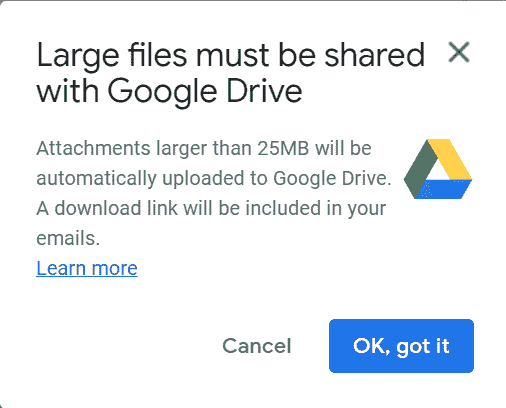

而且 Outlook 会建议你把视频上传到微软 OneDrive:
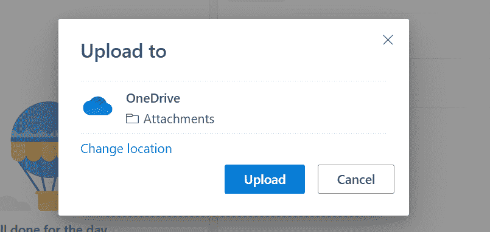

那么你如何通过电子邮件发送一个大的视频文件呢？这就是我将在本文中向您展示的内容。

## 如何使用 Google Drive 通过电子邮件发送大型视频文件

Google Drive 是 Google 提供的基于云的存储服务，用于共享文件。

如本文所示，Gmail 会提示您将大于 25MB 的视频文件上传到 Google Drive，然后将视频转换为可访问的链接。

如果你使用的是 Outlook 或 Yahoo 之类的电子邮件客户端，你仍然可以使用 Google Drive 发送大视频。

将视频上传到您的 Google Drive，点击“获取链接”按钮:
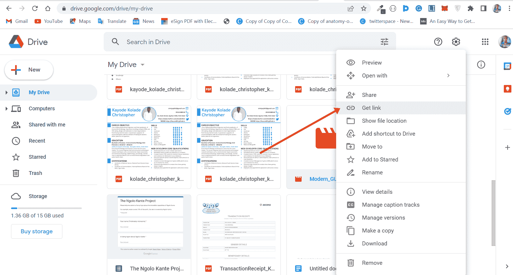

将访问权限从受限更改为“任何有链接的人”:
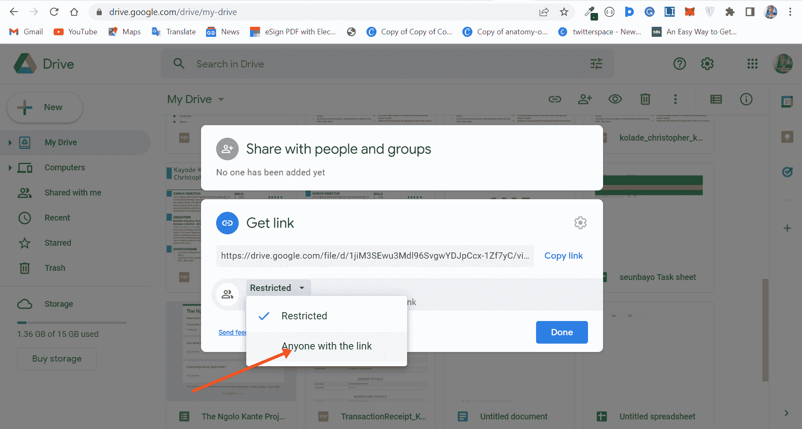

点击“复制链接”，然后“完成”:

点击“撰写”并将链接粘贴到您的电子邮件编辑器中。提供其他所有必要的详细信息，然后单击“发送”按钮:
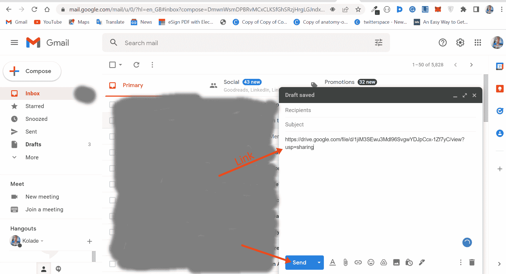

## 如何使用 Dropbox 通过电子邮件发送大型视频文件

Dropbox 是另一种基于云的存储服务，可以让你在多个设备上备份和同步文件。如果您有 Dropbox 帐户，您可以向其中上传最多 50GB 的文件。

要使用 Dropbox 通过电子邮件发送大型视频文件，请将视频上传到您的 Dropbox 帐户，并复制链接:
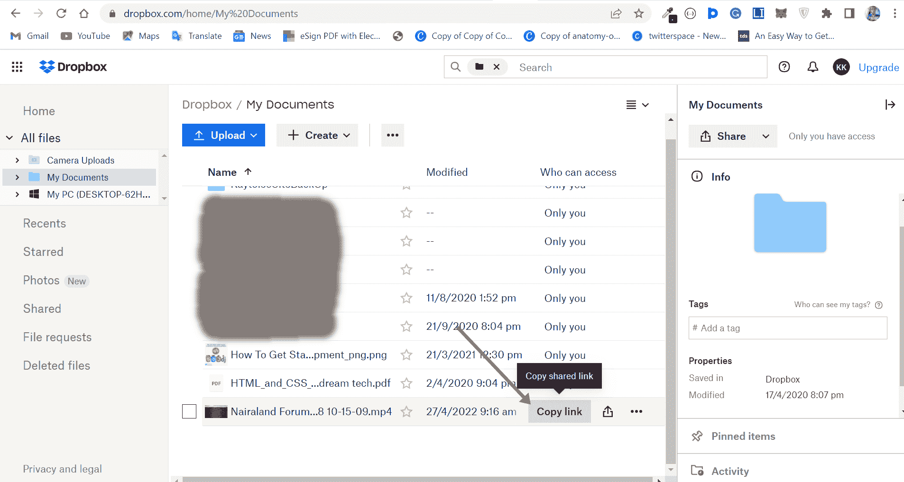

撰写您的电子邮件并粘贴链接以发送大视频文件:
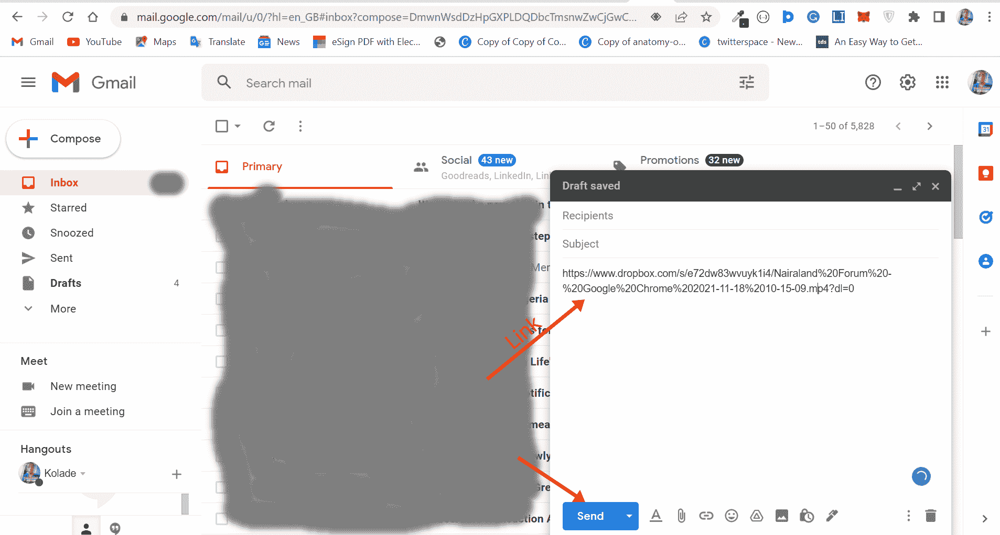

## 如何使用视频共享服务通过电子邮件发送大型视频文件

您可以使用 YouTube 和 Vimeo 等视频共享服务，通过电子邮件发送大型视频文件。

是的，你可以在没有 YouTube 频道的情况下上传视频到 YouTube。只要你有一个 Gmail 账户，你就可以使用谷歌服务，包括 YouTube。因此，如果你有一个谷歌账户，从技术上讲，你可以有一个 YouTube 频道。

要上传视频到 YouTube，点击右上角的创建按钮，选择“上传视频”:
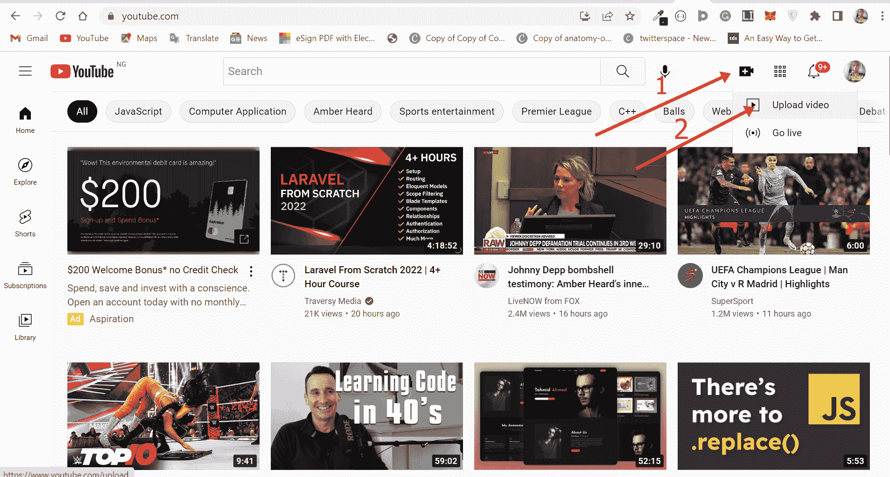

点击“选择文件”选择设备上的文件:
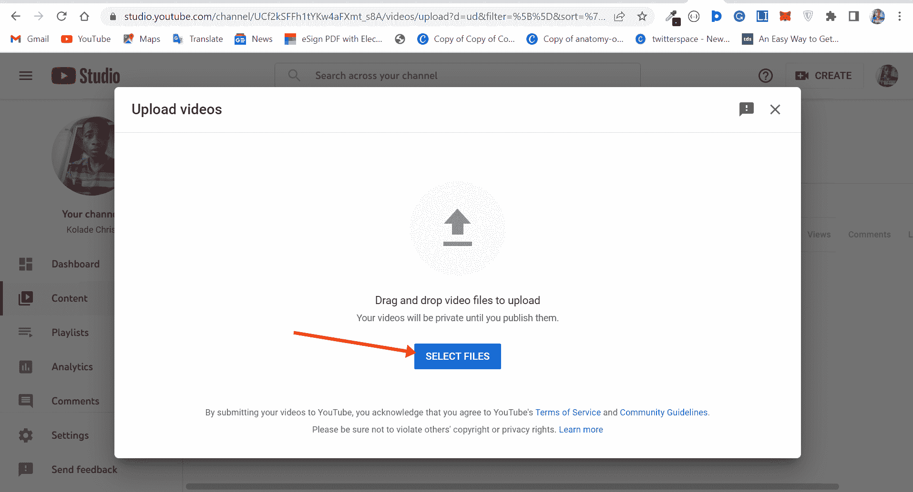

给视频起个名字和描述，复制链接，点击“下一步”:
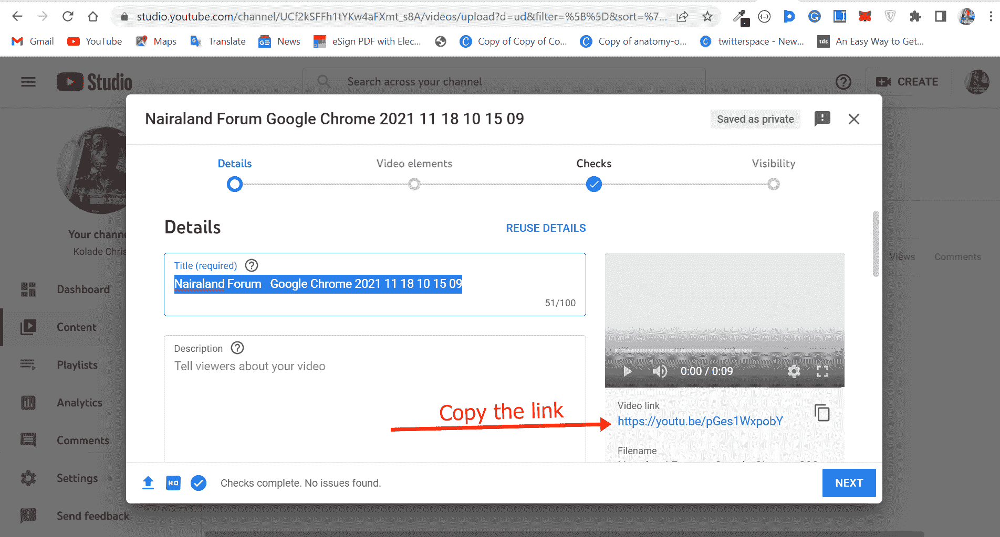

按照其他提示，选择您希望公开还是保密视频，然后点击“保存”:
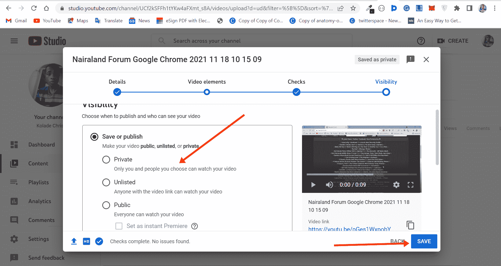

转到您的电子邮件客户端编辑器，粘贴链接，这样您就可以发送大视频文件:
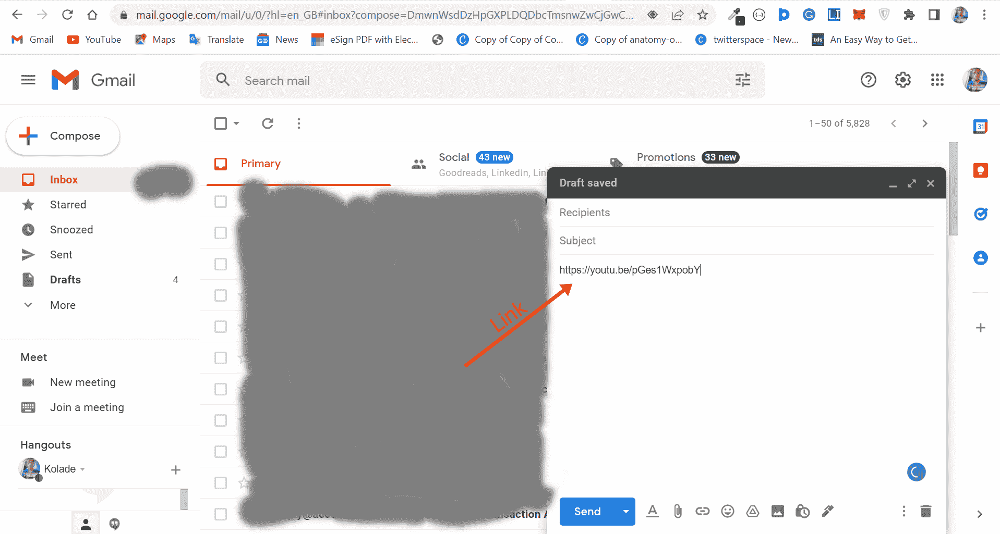

## 最后的想法

您不能直接通过电子邮件客户端发送大型视频文件，但是您可以利用本文中讨论的方法来发送大型视频文件。

通过电子邮件发送大型视频文件的另一种方法是通过本机压缩器或第三方文件压缩器压缩视频。只要文件小于 20-25MB，就可以通过邮件发送。

但是如果你压缩了视频，它仍然不小于 20-25MB，那么你应该使用本文指出的任何方法。