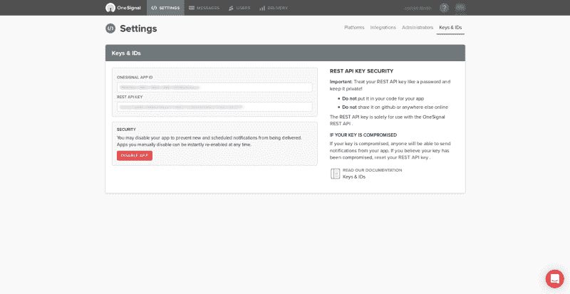
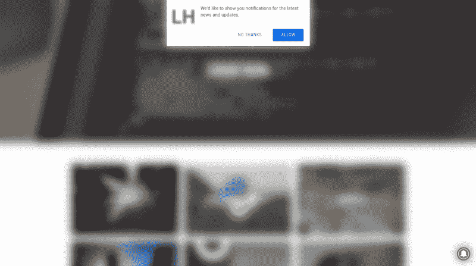

# 如何使用 Python 向您的 Web 应用程序发送通知

> 原文：<https://www.freecodecamp.org/news/how-to-send-notifications-to-your-web-app-using-python-ba490b893292/>

卢卡斯·希尔德

# 如何使用 Python 向您的 Web 应用程序发送通知


Photo by [Daria Nepriakhina](https://unsplash.com/photos/guiQYiRxkZY?utm_source=unsplash&utm_medium=referral&utm_content=creditCopyText) on [Unsplash](https://unsplash.com/search/photos/send?utm_source=unsplash&utm_medium=referral&utm_content=creditCopyText)

本地应用最近变得非常受欢迎，主要是因为离线工作、过渡、易于分发以及推送通知等功能。但不幸的是，你需要很好的 Java 或 Swift 之类的语言知识来创建一个有价值的原生应用。

### 渐进式网络应用

渐进式 Web 应用程序(pwa)是在浏览器中运行的 JavaScript 应用程序。他们努力将一些本地应用程序的功能带到网络上。如果你对 HTML、CSS，尤其是 JavaScript 有基本的了解，那么 pwa 很容易开发。此外，如果网站上的桌面设备已经可以访问您的服务，那么添加 Web 应用程序的功能比开发原生移动应用程序更容易。

### 通知

通知让用户了解新消息，告诉他们有新的博客文章，等等。

许多原生应用向用户发送推送通知。但是使用 PWAs 和通知 API 也是可能的。


Photo by [Jamie Street](https://unsplash.com/@jamie452?utm_source=medium&utm_medium=referral) on [Unsplash](https://unsplash.com?utm_source=medium&utm_medium=referral)

### 单一信号

在本教程中，我们将使用 [OneSingal](https://onesignal.com) 向我们的 web 应用程序发送通知。OneSignal 是一个强大的工具，它提供了一个简单的界面来推送通知。他们还提供了一个 Rest API，我们将用它来发送通知。

### 设置一个信号

要发送推送通知，您需要先设置一个信号。因此，你需要一个帐户上的一个信号。前往他们的网站并点击右上角的“登录”。

接下来，你需要创建一个应用程序。给它起个名字，选择“设置平台”。在这里，您选择“所有浏览器”。之后，您选择“自定义代码”作为集成。然后你必须提供一些关于你的网站的信息。

在应用程序的设置区域，有一个名为“钥匙和身份证”的标签。复制两把钥匙以备后用。



重要提示:不要共享你的 REST API 密钥。保密！

这就是建立一个信号。那很容易！

### 设置我们的网站

在下一部分中，我们将在我们的网站中添加通知功能。网站将不得不等待 OneSignal 发送的通知，并将它们显示给用户。

为了让浏览器知道您正在创建一个渐进式 Web 应用程序，我们将在项目的根目录下添加一个名为 **manifest.json** 的文件。

```
{  "name": "My Application",  "short_name": "Application",  "start_url": ".",  "display": "standalone",  "background_color" : "#fff" ,  "description": "We send notifications to you",  "gcm_sender_id": "482941778795",  "gcm_sender_id_comment": "Do not change the GCM Sender ID"}
```

前六个键值对描述了应用程序的外观。 **gcm_send_id** 对于发送通知很重要。如果你想了解更多关于 **manifest.json** 的信息，可以看看 [Mozilla 文档](https://developer.mozilla.org/de/docs/Web/Manifest)。

您的浏览器不会自动查找清单。你必须把它的路径放在每一个 HTML 文档的*&*lt；h *e* ad >标签。

```
<head>    ...    <link rel="manifest" href="manifest.json">    ...</head>
```

此外，我们需要一些 JavaScript 代码来连接我们的网站到一个信号。

你可以把代码放在脚本标签中的*&*lt；h *e* ad >部分。不要忘记用您自己的 OneSignal 应用 id 替换**我的-** 应用 id。

```
<head>    <script src="https://cdn.onesignal.com/sdks/OneSignalSDK.js" async=""></script>        <script>        var OneSignal = window.OneSignal || [];        OneSignal.push(function () {            OneSignal.init({                appId: "my-app-id",                autoRegister: false,                notifyButton: {                    enable: true,                },            });        });    <script></head>
```



Prompt the user to subscribe to your notifications

当您希望提示用户订阅您的通知时，您可以执行这段代码。

```
OneSignal.push(function () {    OneSignal.showHttpPrompt();});
```

此外，您需要一个服务人员，它在后台监听通知。因此，在项目的根目录中需要两个文件。

**onesignalsdkupdateworker . js**

```
importScripts('https://cdn.onesignal.com/sdks/OneSignalSDKWorker.js');
```

**OneSignalSDKWorker.js**

```
importScripts('https://cdn.onesignal.com/sdks/OneSignalSDKWorker.js');
```

### 使用 Python 访问 API

OneSignal 有一个简单易用的 Rest API。端点记录在 [OneSignal 开发者文档](https://documentation.onesignal.com/docs)中。


Photo by [Max Nelson](https://unsplash.com/@maxcodes?utm_source=medium&utm_medium=referral) on [Unsplash](https://unsplash.com?utm_source=medium&utm_medium=referral)

要访问它，我们需要发送 HTTP 请求。因此，我们将使用名为 [**的库请求**](http://docs.python-requests.org/en/master/) 。要安装它，可以使用 Python 的包管理器 pip。

```
pip install requests
```

这是我们需要发送通知的 API 端点:[https://onesignal.com/api/v1/notifications](https://onesignal.com/api/v1/notifications)。

HTTP 协议有几种方法。在这种情况下，我们想发出一个 POST 请求。为此，我们需要导入请求并执行一个函数。

```
import requests
```

```
requests.post("https://onesignal.com/api/v1/notifications")
```

OneSignal 希望验证只有您可以向您的网站发送通知。因此，您必须添加一个 HTTP 头，其中包含来自 OneSignal 的 Rest API 键。

```
requests.post(    "https://onesignal.com/api/v1/notifications",    headers={"Authorization": "Basic my-rest-api-key"})
```

记得用您的 Rest API 密钥替换 **my-rest-api-key** 。

此外，您需要一些关于通知的基本信息。

```
data = {    "app_id": "my-app-id",    "included_segments": ["All"],    "contents": {"en": "Hello"}}
```

```
requests.post(    "https://onesignal.com/api/v1/notifications",    headers={"Authorization": "Basic my-rest-api-key"},    json=data)
```

用您自己的应用 id 替换**我的应用 id** 。接下来，您可以选择谁将接收您的通知。示例值为`"All", "Active Users", "Inactive Users”`。但是您也可以创建自己的细分市场。最后一个，你用英语添加一些信息内容。如果你需要另一种语言，你也可以在这里添加。

**就是这样！如果您订阅了通知，您应该会收到推送通知。**


### 使用 API 包装发送通知

因为我的代码因为许多不同的通知而变得有些混乱，所以我[为一个信号](https://github.com/Lanseuo/onesignal-notifications)创建了一个 API 包装器。

#### API 包装

但是什么是 API 包装器呢？API 包装器使您更容易访问 API。你可以说是一个 API 换一个 API。您调用 API 包装器，而不是直接调用 API。

您可以从 pip 安装名为 **OneSignal-Notifications** 的包装器。

```
pip install onesignal-notifications
```

现在您可以导入它并设置您的客户端。

```
from onesignal import OneSignal, SegmentNotificationclient = OneSignal("MY_APP_ID", "MY_REST_API_KEY")
```

要发送通知，您必须初始化类**segment Notification***，并使用方法 **send** 。*

```
*`notification_to_all_users = SegmentNotification(    {        "en": "Hello from OneSignal-Notifications"    },    included_segments=SegmentNotification.ALL)client.send(notification_to_all_users)`*
```

*也许这对你来说是不必要的，因为它需要更多的代码行。但是如果你有几个通知，它会使过程更容易，你的代码更漂亮。*

*例如，如果你想发送一个通知，这是基于某些条件的，API 包装器有一个自定义类。*

```
*`from onesignal import OneSignal, FilterNotification, Filterclient = OneSignal("MY_APP_ID", "MY_REST_API_KEY")`*
```

```
*`filter_notification = FilterNotification(    {        "en": "Hello from OneSignal-Notifications"    },    filters=[        Filter.Tag("my_key", "<", "5"),        "AND",        Filter.AppVersion(">", "5"),        "OR",        Filter.LastSession(">", "1"),    ])`*
```

*您可以提供许多自定义参数来调整您的通知。例如，您可以在通知中添加按钮。所有参数的所有列表可以在这里找到[。](https://lanseuo.github.io/onesignal-notifications/guide/send-notification.html#common-parameters)*

```
*`from onesignal import OneSignal, FilterNotification, Filterclient = OneSignal("MY_APP_ID", "MY_REST_API_KEY")`*
```

```
*`filter_notification = SegmentNotification(    {        "en": "Hello from OneSignal-Notifications"    },    web_buttons=[        {          "id": "like-button",          "text": "Like",          "icon": "http://i.imgur.com/N8SN8ZS.png",          "url": "https://github.com/Lanseuo/onesignal-notifications"}    ],    included_segments=SegmentNotification.ALL)`*
```

*如果你想了解更多关于 **OneSignal-Notifications** 的信息，你可以在 [GitHub 知识库](https://github.com/Lanseuo/onesignal-notifications)或者[文档](https://lanseuo.github.io/onesignal-notifications)中查看。*