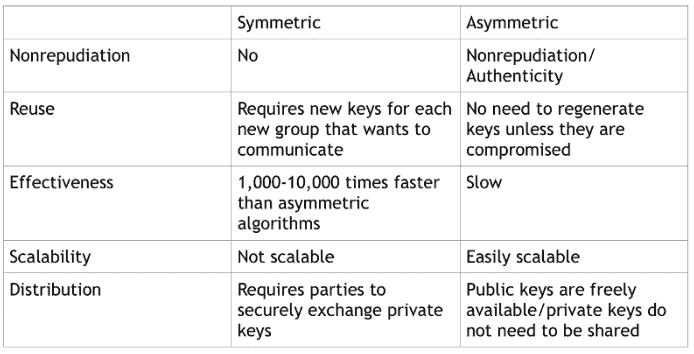

# 如何发送秘密消息

> 原文：<https://www.freecodecamp.org/news/how-to-send-secret-messages/>

密码学是在最基本的层面上使用代码和密码来保护信息的科学。加密是对消息进行编码，目的是只让预期的接收者理解消息的含义。这是一个双向功能(您需要能够撤销对消息所做的任何扰乱)。这是为了保护传输中的数据。

最早的密码之一涉及简单的移位。例如，如果您只是将字母表中的所有字母移动一些，字母表可能如下所示:

ABCDEFGHIJKLMNOPQRSTUVWXYZ

NOPQRSTUVWXYZABCDEFGHIJKLM

然后，字母表中的每个字母对应一个不同的字母，但如果你还不知道是哪一个，就很难弄清楚了。使用这种密码，信息“你好”翻译成“Uryyb”。

不幸的是，分析的进步，特别是由非常强大的计算机驱动的模式分析，使得这些类型的密码非常容易被破解。

为了应对这种情况，我们开发了非常强大、复杂的算法。这些加密可以分为两种基本类型—对称算法和非对称算法。

对称算法也称为“秘密密钥”算法，非对称算法称为“公开密钥”算法。两者的关键区别在于，对称算法使用相同的密钥进行编码和解码(见下图一)，而非对称算法使用不同的密钥进行加密和解密(见下图二)。

在上图中可以看到，使用对称加密，如果 Bob 和 Midge 要通信，Bob 首先用密钥加密他的消息(加密后的消息称为密文)。然后他把它送给米基。Midge 然后用相同的密钥解密该消息，并且能够读取该消息。要发回消息，过程正好相反。

这个过程快速、可扩展，并且非常安全。它的问题是，它要求双方已经拥有相同的密钥。如果没有，他们需要通过不安全的通道传递，这实质上消除了加密的安全性。

使用非对称加密，如上图所示，如果 Bob 和 Midge 想要通信，Bob 用 Midge 的公钥加密他的消息并发送给她。然后，她用自己的私钥解密该消息以阅读它。要发回消息，过程正好相反。

这样，任何人都可以向 Midge 发送消息，因为她可以向任何人提供她的公钥，但只有她可以解密消息(因为她对自己的私钥保密)。它还解决了沿不安全通道传递密钥的需要，因为根本不需要传递秘密。缺点是需要每个想要通信的人都有两个不同的密钥(不可伸缩)，而且相对比较慢。

一般来说，在谈到加密时，最重要的考虑因素是:

*   身份验证/不可否认性——您是否能证明消息来自何处(我能确定是谁发送了这条消息吗？).
*   重复使用—我可以继续使用这个密钥吗？还是每次新的通信都需要重新生成这个密钥？
*   有效性—我传输大量数据的速度有多快？
*   可伸缩性——这对大型团队来说可行吗？
*   分发——如何将密钥分发给与您通信的人，而又不将秘密泄露给其他任何人？

这就是对称加密和非对称加密之间开始出现显著差异的地方，总结如下:

为了两全其美，许多现代加密协议将使用非对称加密来建立连接并创建共享秘密。然后，他们将转向对称加密，以从速度差异中获益。

> 我对加密学了解得越多，就越觉得爱丽丝和鲍勃应该当面谈谈。
> 
> — Paul Reinheimer (@preinheimer) [March 13, 2017](https://twitter.com/preinheimer/status/841273046317060105?ref_src=twsrc%5Etfw)