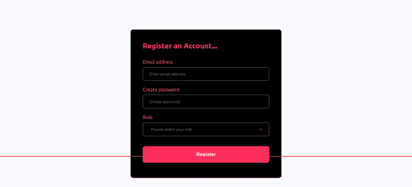

# 如何将 react-drop-select 的默认值从数组转换为字符串

> 原文：<https://www.freecodecamp.org/news/how-to-send-the-right-data-type-from-a-form-to-the-backend-server/>

Web 表单在 internet 上的许多站点中扮演着重要的角色，作为 web 开发人员，您应该知道如何构建 web 表单。

从好的登录表单到注册表单和调查表单(或者现在叫它们什么)，它们的主要目的是接收数据并将其发送到后端服务器进行存储。

在本文中，我们将了解如何使用 JavaScript 将从表单中获取的数据从一种类型转换为另一种类型。但是，在进一步阅读本文之前，您应该了解以下内容:

*   React.js 的基础知识
*   如何在 React.js 中保留表单状态
*   如何创建受控输入组件

此外，在本文中，我们将讨论:

*   如何通过 API 将获得的表单数据发送到后端服务器
*   如何获得 react-drop-select 包的`options`数组中标签的确切值？

现在您已经知道了开始这篇文章需要什么，让我们开始吧。

## 入门指南

在本文中，我们将使用 React 构建一个简单的表单，这样我们就可以理解这个过程是如何工作的。为此，我们将使用 [Next.js](https://nextjs.org) 来引导我们的应用程序。如果你是 Next.js 的新手，你可以看看他们的文档[这里](https://nextjs.org/docs/getting-started)。

现在，让我们获取这个项目中需要的所有依赖项。因为这是一个 Next.js 项目，所以让我们从设置一个 next-app 开始:

```
npx create-next-app name-of-your-app 
```

上面的命令将安装我们在 Next.js 应用程序函数中需要的所有重要依赖项。我们在这个项目中需要的下一个依赖项是:

*   **xios** 用于数据提取，以及
*   **styled-组件**对应用程序进行样式化。

下面的命令为我们完成了这项工作:

```
npm install styled-components react-dropdown-select axios --save-dev 
```

典型的 Next.js 项目结构不同于 [create-react-app](https://create-react-app.dev) 的结构。为了保持这篇文章的简洁，我们不会讨论完整的应用程序结构——我们将只关注适用于我们的内容。

话虽如此，我们还是来看看下面的 app 结构吧:

```
|__pages
|   |-- _app.js
|   |-- index.js
|__src
|   |__components
|   |    |__role
|   |    |   |__style
|   |    |     |-- role.styled.js
|   |    |__index.js        
|   |
|   |__containers
|   |    |__dropdown-select 
|   |        |-- index.js
|   
|__
```

## 应用程序结构概述

在上一节中，我们获得了这个项目所需的依赖项。在这一节中，我们将看看项目结构和每个文件执行的功能。

pages 目录是应用程序进行所有路由的地方。这是 Nextjs 的开箱即用特性。它为您节省了硬编码独立路线的压力。

`pages/api`:这个 API 目录让你有一个 Next.js 应用的后台。在同一个代码库中。这意味着您不必像通常那样为 REST 或 GraphQL APIs 创建单独的存储库，然后将它们部署在 Heroku 等后端托管平台上。

对于 API 目录，每个文件都被视为一个 API 端点。如果您查看 API 文件夹，您会注意到其中有一个名为 user.js 的文件。该文件成为端点，这意味着可以使用该文件的路径作为基本 URL 来执行 API 调用。

是我们所有组件与 DOM 相联系的地方。如果您看一下组件结构，您会看到所有组件都作为 pageProps 传递给了组件 Props。

它类似于使用 Create-React-App 时的 index.js 文件。这里唯一的区别是，您没有将应用程序挂接到名为“root”的 DOM 节点

```
React.render(document.getElementById("root"), <App />)
```

`index.js`是 pages 文件夹中的默认路径。这是我们将在这个项目中做大部分工作的地方。当您运行下面的命令时，它会启动一个开发服务器，并且 index.js 的内容会呈现在网页上。

`components/role`是包含下拉选择组件及其样式的组件文件

最后，`containers/dropdown-select`是我们构建表单组件的地方。

## 如何构建表单和管理状态

现在我们已经看到了应用程序中文件夹/文件的一些基本功能，让我们开始构建表单组件。在这篇文章中，我们不会把重点放在编写样式上。

下面的代码片段显示了不带状态变量的表单组件的基本结构。我们将采取一步一步的方法来理解代码片段中发生了什么。

```
import React from "react";
import styled from "styled-components";
import { InputGroup } from "../../components/role/style/role.styled";
import Role from "../../components/role";
import axios from "axios";

const AuthForm = styled.form`
	...
`;

const DropDownSelect = () => {
  return (
    <AuthForm onSubmit="">
      <h2>Register an Account...</h2>
      <InputGroup>
        <label htmlFor="email">Email address</label>
        <input
          name="email"
          id="email"
          type="email"
          placeholder="Enter email address"
          className="inputs"
        />
      </InputGroup>
      <InputGroup>
        <label htmlFor="password">Create password</label>
        <input
          name="password"
          id="password"
          type="password"
          placeholder="Create password"
          className="inputs"
        />
      </InputGroup>
      <Role />
   </AuthForm>
  );
};

export default DropDownSelect; 
```

上面的组件没有任何方法来跟踪用户在表单域中输入的内容，我们不希望这样。为了解决这个问题，我们将利用 React 的`useState()`钩子来监控状态

让我们从创建状态变量开始。您会注意到，组件中有三个输入字段，这意味着我们必须创建三个状态变量。

```
 const [email, setEmail] = React.useState("");
 const [password, setPassword] = React.useState("");
 const [role, setRole] = React.useState();
```

但是我们需要一种方法来跟踪我们发送到后端服务器的数据的状态，所以我们需要另一个状态变量来监控我们的异步数据获取(POST)请求的状态。

React 生态系统中一个非常流行的模式是创建一个加载组件来指示这个过程。

```
const [loading, setLoading] = React.useState(false);
```

现在我们已经准备好了，我们可以使用`onChange()`属性来设置我们的输入字段。

```
<input
  name="email"
  id="email"
  type="email"
  placeholder="Enter email address"
  className="inputs"
  value={email}
  onChange={(e) => setEmail(e.target.value)}
/>
```

然后对剩余的输入字段重复该过程。但是，有一个条件。您会注意到，我们已经导入了`<Role />`组件，并且已经向该组件传递了一些预定义的属性。在深入之前，我们先来看看组件本身。

## 角色组件

这个组件利用了`react-dropdown-select`包的功能，它将一组值放入它的属性中。

最不需要的道具是`options`道具，它接收带有`label`和`value`键的对象数组

```
const options = [
   { label: "Manager", value: "Manager" },
   { label: "Worker", value: "Worker" }
] 
```

让我们看看下面的组件:

```
import React from "react";
import { InputGroup } from "./style/role.styled";
import Select from "react-dropdown-select";
import propTypes from "prop-types";

const Role = ({ userRole, roleChange }) => {
  const options = [
    { label: "Worker", value: "Worker" },
    { label: "Manager", value: "Manager" },
  ];

  return (
    <React.Fragment>
      <InputGroup>
        <label htmlFor="fullname">Role</label>
        <Select
          value={userRole}
          options={options}
          placeholder="Please select your role"
          required={true}
          dropdownPosition="top"
          className="select"
          color="#ff5c5c"
          onChange={roleChange}
        />
      </InputGroup>
    </React.Fragment>
  );
};

export default Role;

Role.propTypes = {
  ...
}; 
```

我之前提到过`<Role />`组件有自己的自定义道具，你可以在上面看到。

该组件接受两个属性:`userRole`根据用户选择的选项跟踪输入，以及`roleChange`属性作为值传递给`<Select />`组件的`onChange()`属性。

组件有各种可以传递给它的道具。从指定选项菜单在页面上的位置的`dropdownPosition`属性，到影响选项菜单中项目样式的`color`属性，等等。你可以在这里看一看其中的一些[。](https://www.npmjs.com/package/react-dropdown-select)

我们创建了一个导入语句，将 React `"prop-types"`模块放在这个组件文件的顶部。我们将使用该模块来验证传入该组件的数据类型。

```
Role.propTypes = {
  userRole: propTypes.array.isRequired,
  roleChange: propTypes.func.isRequired,
};
```

从上面的片段中，我们说明了将作为值传递给`userRole`的数据类型必须是 JavaScript 数组数据类型，并且`roleChange`必须是函数。除此之外的任何内容都会导致错误。

## 如何使用角色组件

现在，我们已经学习了`<Role />`组件并了解了它的工作原理，让我们看看如何在下面的应用程序中使用它:

```
import React from "react";
import styled from "styled-components";
import { InputGroup } from "../../components/role/style/role.styled";
import Role from "../../components/role";

const AuthForm = styled.form`
 ...  
`;

const DropDownSelect = () => {
  const [role, setRole] = React.useState();

  return (
    <AuthForm onSubmit={handleSignUp}>
      <h2>Register an Account...</h2>
      // previous details    
      <Role
        userRole={role}
        roleChange={(role) => setRole(role.map((role) => role.value))}
      />
   </AuthForm>
  );
};

export default DropDownSelect; 
```

上面的代码片段展示了如何使用`<Role />`组件。你也可以看到正在使用的定制道具。`userRole`被赋予`role`状态值。

你可能想知道为什么我们没有给声明的`role`状态赋值。这是因为**react-drop-select**中的`<Select />`组件有一个数组的默认数据类型值，所以不需要在`useState()`钩子中设置数组。

`roleChange`道具看起来与我们之前在输入字段中使用 **onChange** 道具的方式完全不同。在这里，我们必须将所需的项目放在一个单独的数组中，这样当用户选择一个选项时，我们就能够获得准确的数据。

```
roleChange={(role) => setRole(role.map((role) => role.value))}
```

如果你还记得的话，我们有一个名为`options`的数组，它有键值对`label`和`value`。上面的代码片段帮助我们将`value`键放入一个全新的数组中，因为这是我们所需要的，并且这可以通过 JavaScript 的内置`map()`方法来实现。

当用户点击任何选项时，我们将得到一个数组，其中只包含一个被选中的项目。比方说，用户单击“Worker”选项，存储在表单状态中的值是:`['Worker']`。

但是我们不希望将这种数据类型发送到服务器——我们需要一个字符串。你可能会问，我们如何解决这个问题？我们将在下一节看到如何做到这一点。

## 如何将表单数据发送到服务器

在前面的章节中，我们学习了 Next.js 应用程序的结构，以及如何在 React 表单中构建和管理状态。

在这一节中，我们将通过 API 把从表单中获得的数据发送到后端服务器。

```
import React from "react";
import styled from "styled-components";
import { InputGroup } from "../../components/role/style/role.styled";
import Role from "../../components/role";
import axios from "axios";

const AuthForm = styled.form`
  ...
`;

const DropDownSelect = () => {
  ...
  const [loading, setLoading] = React.useState(false);

  const handleSignUp = async (e) => {
    e.preventDefault();

    try {
      setLoading(true);

      const response = await axios({
        method: "POST",
        url: "https://your-api-endpoint.com",
        data: {
          email,
          password,
          role: role.toString(),
        },
        headers: {
          "Content-Type": "application/json",
        },
      });
    } catch (error) {
      console.log(error);
    }
  };

  return (
    <AuthForm onSubmit={handleSignUp}>
      <h2>Register an Account...</h2>
	  // form feilds
      <button className="btn">{loading ? "Registering" : "Register"}</button>
    </AuthForm>
  );
};

export default DropDownSelect;
```

我们将关注异步数据调用函数`handleSignup`，我们将使用它通过 API 端点向服务器发送数据。

```
const handleSignUp = async (e) => {
    e.preventDefault();

    try {
      setLoading(true);

      const response = await axios({
        method: "POST",
        url: "https://your-api-endpoint.com",
        data: {
          email,
          password,
          role: role.toString(),
        },
        headers: {
          "Content-Type": "application/json",
        },
      });
    } catch (error) {
      console.log(error);
    }
  };
```

`loading`状态的初始值被设置为`false`，但是在`try`块中，它是`true`。这意味着，如果异步数据调用正在进行，加载值应该是`true`。如果不是，应该是`false`。

我们之前提到过，我们不希望将数组数据类型作为输入值发送给服务器。相反，我们需要一个字符串。我们通过使用 JavaScript 的原生字符串方法[ `toString()` ]来转换这种数据类型。

```
data: {
  role: role.toString()
}
```

在下面的操作中可以看到`loading`状态值。我们使用三元运算符来检查 loadin 状态变量是否为真。如果是，按钮中的文本将是**“注册”**。如果没有，文字保持不变。

```
<button className="btn">{loading ? "Registering" : "Register"}</button>
```

你可以玩下面的片段来确认结果是否准确。

```
const options = [
   { label: "Worker", value: "Worker" },
   { label: "Manager", value: "Manager" }
]

// create a new array with the key value that you want
const mappedOptions = options.map(option => option.value)
console.log(mappedOptions) // ['Worker', 'Manager']

// convert the mapped option array to a string value
const mappedOptionsToString = mappedOptions.toString()
console.log(mappedOptionsToString)
```

## 结论

如果您的后端 API 允许您将数组数据类型作为输入字段的值发送，您可以使用您在这里学到的内容，因为 react-drop-select 包允许您这样做。

但是在输入字段需要的值是字符串的情况下，您可以考虑使用 JavaScript 的原生`toString()`方法。

这里是到已部署的演示应用程序的[链接](https://exdemo.netlify.app/demo/dropdown)和一个 GIF，它向您展示了应用所有样式后的样子:



感谢您阅读这篇文章。如果您发现它有帮助，请与您的同行分享。