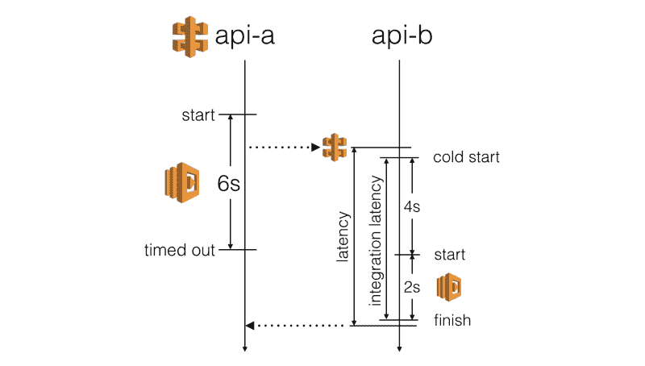
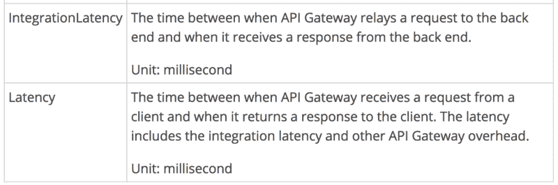
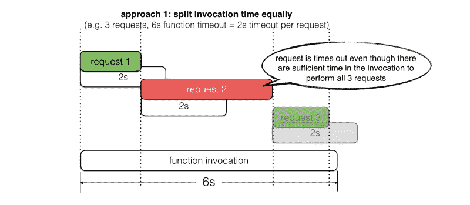
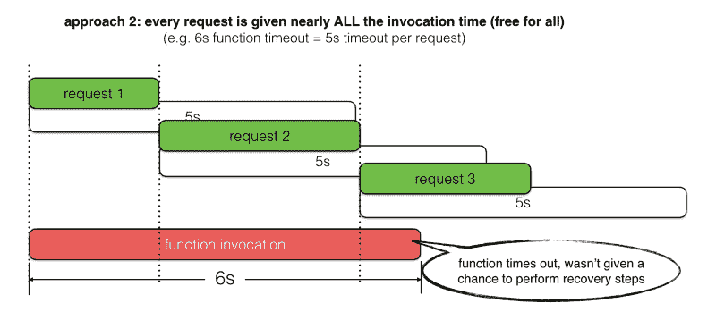
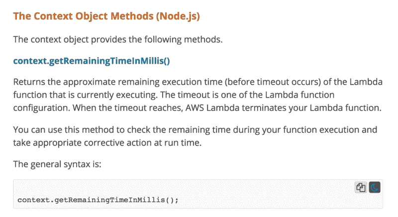
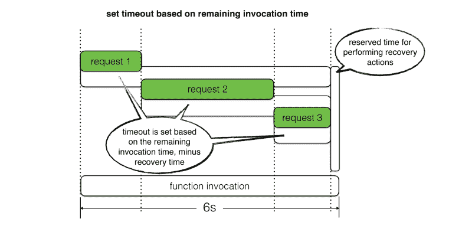
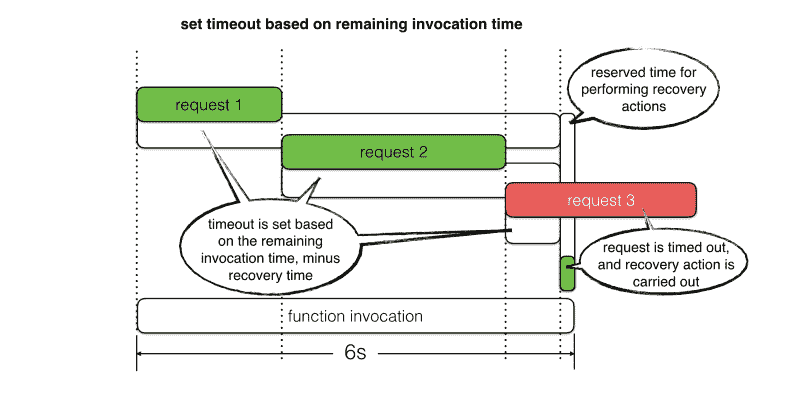
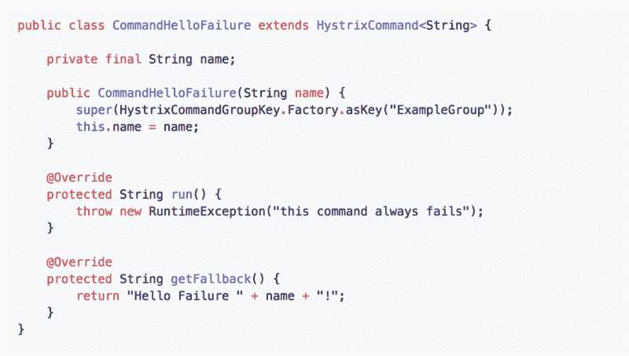
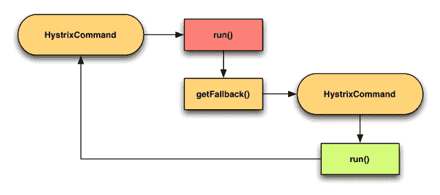

# 如何使用 Lambda 调用上下文动态设置超时

> 原文：<https://www.freecodecamp.org/news/how-to-set-timeouts-dynamically-using-lambda-invocation-context-3e78fa832a5b/>

作者:崔琰

# 如何使用 Lambda 调用上下文动态设置超时

使用 API Gate way 和 Lamb da，您被迫在服务器端使用短时间暂停:

*   **API Gate way 在所有集成点上的最大超时时间为 29 秒**
*   对于 AWS Lamb da 功能，[无服务器](https://serverless.com/framework/)框架使用默认的 **6s**

然而，你已经限制了*对 Lamb da 函数冷启动时间的影响*。你无法控制 API Gate way 增加了多少开销。因此，您从调用功能中体验到的实际延迟远没有您想象的那么可预测。



[https://docs.aws.amazon.com/AmazonCloudWatch/latest/monitoring/api-gateway-metrics-dimensions.html](https://docs.aws.amazon.com/AmazonCloudWatch/latest/monitoring/api-gateway-metrics-dimensions.html)

我们不希望缓慢的 HTTP 响应导致调用功能超时。这对用户体验有负面影响。相反，我们应该在调用函数超时之前停止等待响应。

> 超时策略的目标是为 HTTP 请求提供成功的最佳机会，前提是这样做不会导致调用函数本身出错

> -我

大多数时候，我看到人们使用固定的超时值，但通常很难决定:

*   太短了，你就不会给这个请求成功的最好机会。例如，在邀请中还有 5s，但是超时设置为 3s。
*   太长的话，你就有让请求超时调用函数的风险。例如，在邀请中还有 5 秒，但是超时设置为 6 秒。

事实上，在一个函数调用中，我们经常执行不止一个 HTTP 请求，这使得事情变得更加复杂。举个例子，

1.  *从 DynamoDB 中读取*
2.  对数据执行业务逻辑
3.  *将更新保存到 DynamoDB*
4.  *将事件发布到 Kinesis*

让我们看看两种常见的选择超时值的方法，以及它们的不足之处。



requests are not giv­en the best chance to suc­ceed



requests are allowed too much time to exe­cute and caused the func­tion to time­out.

我建议我们应该**根据剩余的调用时间量**来设置请求超时，而不是遵循这些方法。我们还应该预留一些时间，以便在出现故障时执行**恢复步骤**。

您可以通过`context`对象来查看当前活动还剩多少时间。



[https://docs.aws.amazon.com/lambda/latest/dg/nodejs-prog-model-context.html](https://docs.aws.amazon.com/lambda/latest/dg/nodejs-prog-model-context.html)

举个例子，如果一个函数的`timeout`是 6s，而我们已经调用了 1s。如果我们为恢复预留 500 毫秒，那么我们还有 4.5 秒的时间来等待 HTTP 响应。

通过这种方法，我们可以两全其美:

*   根据我们剩余的实际参与时间，允许请求获得成功的最佳机会



requests are giv­en the best chance to suc­ceed, with­out being restrict­ed by an arbi­trar­i­ly deter­mined time­out.

*   防止因超时而导致的缓慢响应，这为我们提供了执行恢复操作的机会。



slow respons­es are timed out before they cause the call­ing func­tion to time out

但是在这些请求超时之后*你打算做什么呢？既然您找不到需要对每个表单执行的任何操作，难道您不需要用 HTTP 错误来响应吗？*

恢复措施至少应包括:

*   尽可能详细地记录超时事件。例如，请求目标、超时值、[相关 id](https://theburningmonk.com/2017/09/capture-and-forward-correlation-ids-through-different-lambda-event-sources/)和请求对象。
*   跟踪客户在`serviceX.timedout`遇到的问题，以便进行监控，并在情况失控时提醒团队
*   在响应正文中返回应用程序错误代码和原始请求 ID。然后，客户端应用程序可以显示用户朋友的消息，如`*“Oops, looks like this fea­ture is cur­rent­ly unavail­able, please try again lat­er. If this is urgent, please con­tact us at xxx@domain.com and quote the request ID f19a7dca. Thank you for your coop­er­a­tion :-)”*`

```
{   "errorCode": 10021,   "requestId": "f19a7dca",   "message": "service X timed out" }
```

在某些 *场景*中，你还可以更优雅地使用后退来恢复。

网飞的 Hys trix 图书馆通过其大量使用的*命令*模式支持多种风格的后退。我推荐阅读它的[维基页面](https://github.com/Netflix/Hystrix/wiki/How-To-Use)，因为那里有大量有用的信息和想法。


每个 *Hystrix* 命令都让你指定一个后退动作。



您也可以通过各自的`getFallback`方法来链接命令，从而将回退链接在一起。



例如，

1.  exe 里面可爱的一个 DynamoDB read】
2.  在`getFallback`方法中，执行`CommandB`,如果可用，它将返回先前缓存的响应
3.  如果没有缓存的响应，那么`CommandB`将失败并触发它自己的`getFallback`方法
4.  Exe cute `CommandC`，它返回一个存根响应

如果你还没有看过，你应该去看看 Hys trix。大多数嵌入到 *Hys trix* 中的模式可以很容易地在我们的无服务器应用程序中采用，以帮助它们更好地适应故障。