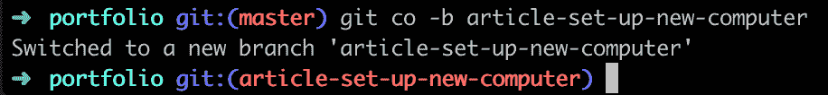
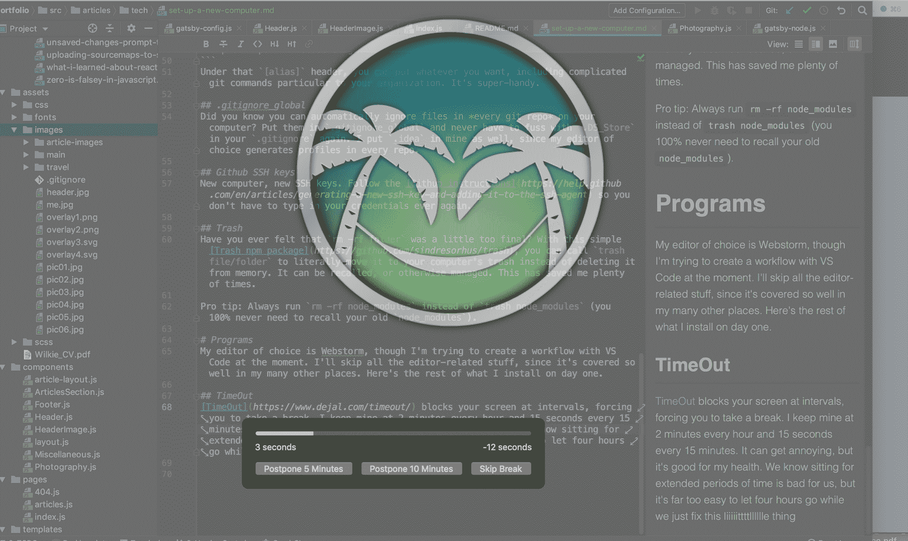

# 如何为你的新 MacBook 设置编码

> 原文：<https://www.freecodecamp.org/news/how-to-set-up-a-brand-new-macbook/>

我在周一开始了一份新工作(非常棒，谢谢你的关心)，这意味着一台全新的 MacBook Pro。幸运的是，我还有我的旧工作电脑(我的上一份工作可能不太好，因为我每天都要带着自己的电脑...).但是下一次，我可能不得不上交我的新工作电脑，所以我想创建一个我的设置记录。也许对别人也有帮助！对了，这些程序几乎都是 F-R-E-E。

# 终点站

设置好你的终端是绝对必要的，这样你才能高效地工作。如果你运行的是默认终端，没有任何调整，这些提示可以帮你节省大量的时间和挫折。

## iTerm2

继续下载 [iTerm2](https://iterm2.com/) ，然后对所有的特性感到非常满意。我最喜欢的是:

*   上下滚动(箭头键)浏览命令。键入部分命令进行过滤，然后滚动。
*   自动复制——只需高亮 iTerm 中的文本，它就会自动复制到剪贴板。

## oh my zsh

如果你和我一样，想让你的终端为你工作，那就[哦，我的天啊](https://github.com/robbyrussell/oh-my-zsh)。下面是我的终端提示符的样子:



zsh demo in terminal

当我有未提交的更改时，我会在光标左侧看到一个黄色的 x。这对于意识到我有变化是非常方便的。

你可以用 oh my zsh 做很多事情——这里有一个库，你可以用不同的方式来设计你的终端。我用主题“robbyrussel”。请注意，对于别名和对终端设置的其他修改，您可能还想使用`.zshrc`而不是`.bashrc`。

当我们在这里的时候，让我们为终端别名大声欢呼。我喜欢我的终端使用的“内部”语言。下面是我放入`.zshrc`的几个。我不再需要所有这些命令，但是我把它们留在这里是为了展示一些长得离谱的命令，这些命令可以作为非常短的命令的别名。

```
alias j-u='jest --updateSnapshot'
alias ytu='yarn test-update'
alias dcu='docker-compose up'
alias dcd='docker-compose down'
alias lint-front='docker-compose exec front yarn gulp lint'
alias back-bash='docker-compose exec back bash' 
```

## .gitconfig

您的计算机上可能有一个`.gitconfig`,但是您可能没有使用 git 别名来节省一些击键次数。这是我的:

```
# This is Git's per-user configuration file.
[user]
    name = amberwilkie
    email = amber@amberwilkie.com
[alias]
    co = checkout
    st = status
    ci = commit
    lp = log --oneline
    poh = push origin head
    rc = rebase --continue
    prom = pull --rebase origin master 
```

在那个`[alias]`标题下，您可以放入任何您想要的东西，包括您的组织特有的复杂 git 命令。超级好用。

## 。gitignore _ global-全域

你知道吗，你可以自动忽略你电脑上*每个 git repo* 里的文件？把它们放在`.gitignore_global`里，再也不用担心`.DS_Store`在你的`.gitignore`里了。我也将`.idea`放在我的编辑器中，因为我选择的编辑器会在每个回购中生成配置文件。

## Github SSH 密钥

新电脑，新的 SSH 密钥。按照 [Github 的指示](https://help.github.com/en/articles/generating-a-new-ssh-key-and-adding-it-to-the-ssh-agent)去做，这样你就再也不用输入你的凭证了。

## 废物

有没有觉得`rm -rf folder`有点太最终了？有了这个简单的[垃圾 npm 包](https://github.com/sindresorhus/trash)，你可以调用`trash file/folder`将它移到你电脑的垃圾中，而不是从内存中删除它。它可以被召回或以其他方式管理。这让我节省了很多时间。

专业提示:总是跑`rm -rf node_modules`而不是`trash node_modules`(你 100%不需要回忆你以前的`node_modules`)。

## 家酿和木桶

如果你有一台 mac，你已经知道你需要[家酿](/usr/bin/ruby-e " $(curl-fsSL[https://raw . githubusercontent . com/home brew/install/master/install](https://raw.githubusercontent.com/Homebrew/install/master/install))"
)和[木桶](https://github.com/Homebrew/homebrew-cask)。第一个是安装包，第二个是以二进制分发的应用程序。

```
/usr/bin/ruby -e "$(curl -fsSL https://raw.githubusercontent.com/Homebrew/install/master/install)"
brew install cask 
```

# 程序

我选择的编辑器是 Webstorm，尽管我现在正试图用 VS 代码创建一个工作流。我将跳过所有与编辑器相关的东西，因为它在我的许多其他地方都讨论得很好。以下是我第一天安装的其余部分。

## 超时

[超时](https://www.dejal.com/timeout/)每隔一段时间就屏蔽你的屏幕，强迫你休息一下。我保持每小时 2 分钟，每 15 分钟 15 秒。这很烦人，但对我的健康有好处。我们知道长时间坐着对我们不好，但是当我们只是解决 liiiiittttlllllle 的问题时，让四个小时过去太容易了。顺便说一句，当我写这一段的时候，我的休息时间突然出现了。(通常图像和计时器是对齐的，不知道这是怎么回事。)



TimeOut running on a Mac

您可以将图像设置为您想要的任何形状，并且可以添加文本。

## gitx

我很想安装 gitx，因为我在我的旧电脑上广泛使用它。可惜已经不维持了！我一直在试验其他 git UIs，但是没有一个能满足我的需求。需要更多的调查。如果你有一个旧版本的 Mac，你可能会得到这个原始的，非常有用的工具。如果你能写母语，考虑贡献！
GitX 对于快速检查你当前提交的变更并编辑这些变更非常有用。

## 阿尔弗烈德

我总是安装阿尔弗雷德，虽然老实说，我还没有花时间去恋爱。我知道开发人员每天都在使用成千上万的特性。这是我的生产力改进清单上要解决的问题！我可能会购买 power pack，这样我就可以访问改进的剪贴板，它看起来棒极了。


我之前用的是 [Clipy](https://github.com/Clipy/Clipy) ，但是你将要粘贴的东西的视觉预览看起来非常有用。

但是无论你做什么，得到一个该死的剪贴板扩展！只有一个剪贴板插槽是不可能的。有多少次你不得不在复制和粘贴之间来来回回？拥有一个更好的剪贴板管理器大大提高了我作为开发人员的效率。

## 景象

这个程序允许你将窗口贴紧到屏幕的不同部分。我的新工作场所给我提供了一个更大的 4k 显示器，但那东西实在是太大了，当我把它插上电源时，我的窗口就漂浮在桌面的海洋中。眼镜允许我用键盘快捷键把它们放到它们应该在的地方。神奇！

## Giphy 捕获

这听起来可能很傻，但是作为一个在前端工作的 web 开发人员(有时)，我发现自己需要制作简短的 gif 来不断地解释功能。Giphy Capture 是我找到的最好的工具——它很直观，能做你需要它做的一切。

这就是我认为作为一名网络开发人员在 Mac 上工作的核心！自然地，根据需要，一千个其他的程序随之而来，但是这些是我发现在开始时不可缺少的设置和程序。如果你有其他有用的工具，我很乐意听听。

*这篇文章最初出现在 [wilkie.tech](https://wilkie.tech/tech/set-up-a-new-computer/) 上。在推特上聊天会很棒。我是 [@heyamberwilkie](https://twitter.com/heyamberwilkie) 。*