# 如何使用 React 传单和传单 Gatsby Starter 设置自定义地图框底图样式

> 原文：<https://www.freecodecamp.org/news/how-to-set-up-a-custom-mapbox-basemap-with-gatsby-and-react-leaflet/>

构建地图可能非常强大，但通常您会受困于地图影像的开源选项，这可能对数据的可读性没有帮助。我们如何利用 Mapbox 的切片 API 向 React 传单应用程序添加自定义底图？

*   我们要建造什么？
*   [什么是 Mapbox？](#what-is-mapbox)
*   [第 1 部分:创建自定义地图框样式](#part-1-creating-a-custom-mapbox-style)
*   [第 2 部分:添加自定义 TileLayer 以反应传单](#part-2-adding-a-custom-tilelayer-to-react-leaflet)
*   [第 3 部分:向 Gatsby 入门传单添加自定义底图](#part-3-adding-a-custom-basemap-to-gatsby-starter-leaflet)
*   [保护您的地图框密钥](#securing-your-mapbox-key)
*   [想了解更多关于地图的知识？](#want-to-learn-more-about-maps)

[https://www.youtube.com/embed/KcPJr1b_rv0?feature=oembed](https://www.youtube.com/embed/KcPJr1b_rv0?feature=oembed)

## 我们要建造什么？

我们将在我们的[地图框](https://www.mapbox.com/)账户中创建一个新的基本[地图框样式](https://www.mapbox.com/mapbox-studio/)。创建完成后，我们将使用他们的[地图 API](https://docs.mapbox.com/api/maps/) 向我们的 [React 传单](https://react-leaflet.js.org/)应用程序添加一个自定义底图。

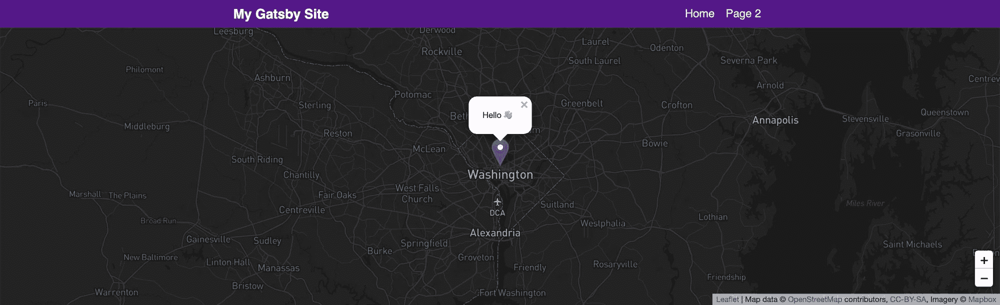

Gatsby Starter Leaflet with Mapbox basemap

对于我们的地图，我们将使用我创建的这个[Gatsby Starter](https://github.com/colbyfayock/gatsby-starter-leaflet)传单，它将允许您轻松地创建一个新的地图应用程序。在我们开始之前，我将带你了解如何只使用 React 传单组件来添加它。

## 一款地图应用？

没错。世界各地都在使用地图来研究地理位置的数据集。它们是科学家和其他试图帮助世界的人的重要工具。

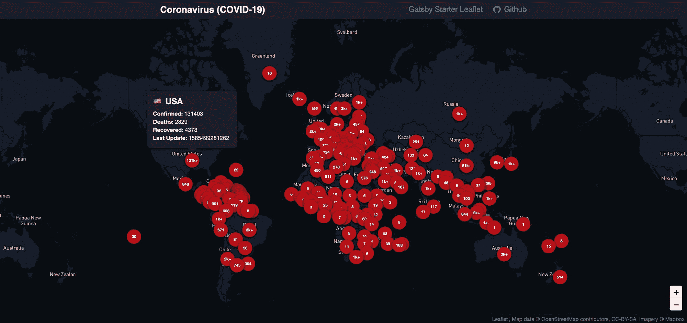

Coronavirus (COVID-19) custom map

如果你想了解更多关于构建地图和向其中添加数据的信息，你可以先看看我的其他文章，比如创建 T2 冠状病毒(新冠肺炎)地图或 T4 夏季公路旅行地图，以及一些关于为什么每个人都能绘制地图的灵感。

## 什么是 Mapbox？

Mapbox 是一个地图平台，允许其客户创建自定义的地图解决方案。它们还利用各种 API 为构建地图要素提供强大的功能。

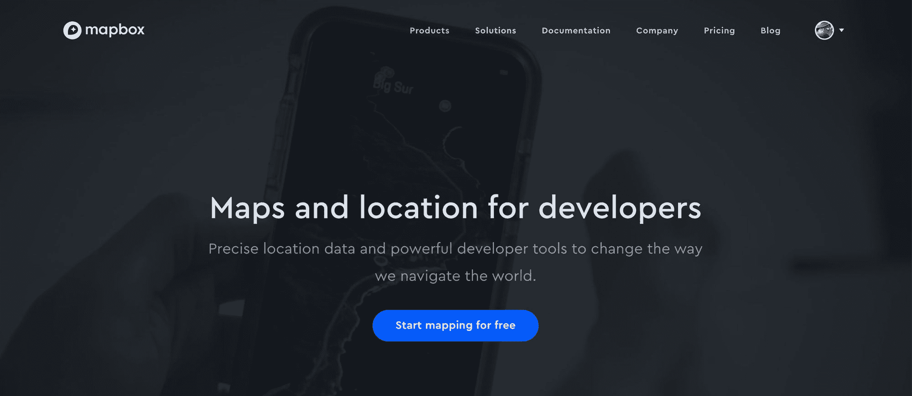

[mapbox.com](https://www.mapbox.com/)

出于我们的目的，我们将利用他们的地图 API，特别是他们的静态图块 API，来提供我们创建的自定义地图样式。

## 第 1 部分:创建自定义地图框样式

为了获得我们想要的地图外观和感觉，拥有一个有助于使我们的数据不受干扰地呈现出来的底图非常重要。另外，有时候拥有一张自定义地图也很有趣。

### Mapbox 帐户

我们需要设置自定义地图框样式的第一件事是拥有一个帐户。我不会告诉你这个过程，但是你可以去地图盒子的网站免费注册:【mapbox.com】T2

### 创建新的自定义样式

在 Mapbox 中创建新的样式并不像听起来那么难。虽然如果你想要一些独特的东西会变得非常复杂，但我们可以复制一个 Mapbox 的默认样式来开始。

首先，登录后点击右上角的账户链接，进入 Mapbox 的[工作室仪表盘](https://studio.mapbox.com/)。

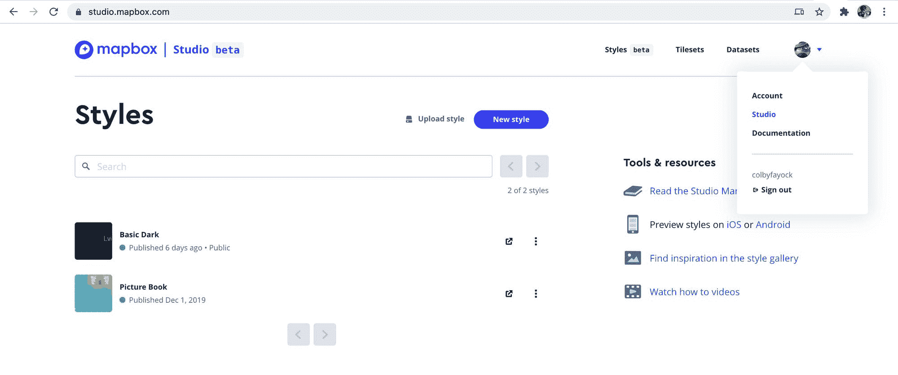

Mapbox Studio

一旦我们在我们的工作室仪表板上，我们想选择新的风格按钮。

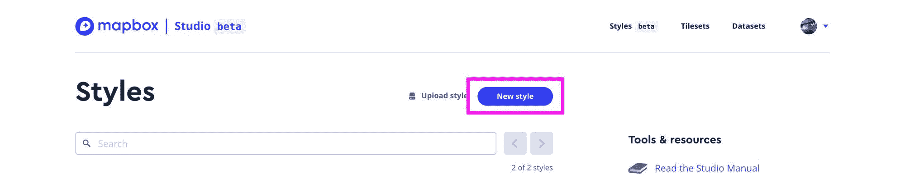

Create a new style in Mapbox Studio

点击按钮后，会弹出一个对话框，让你选择一个模板。你可以在这里选择你想要的任何东西，但我会选择带有深色变化的单色。选择模板后，单击“定制”按钮。

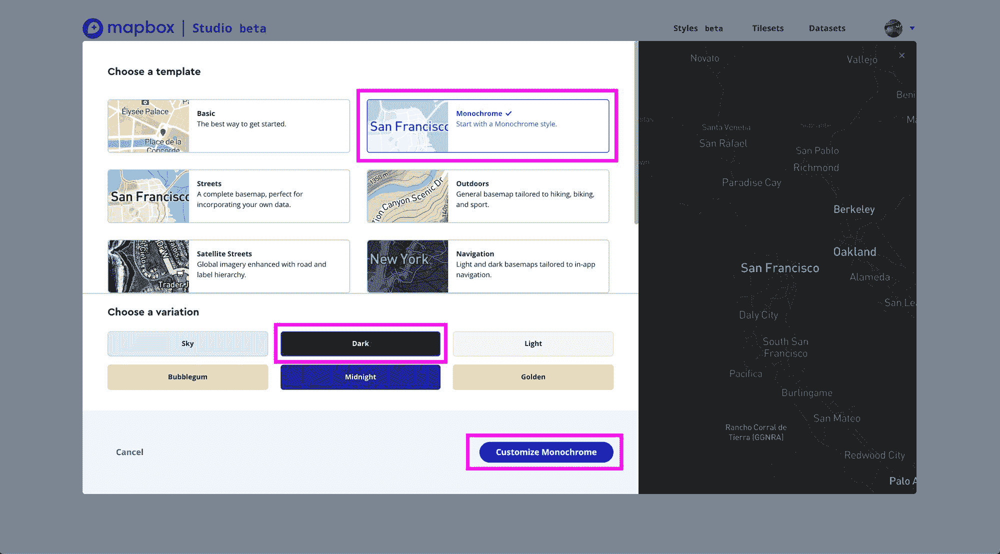

Select and customize a template for a new style in Mapbox Studio

现在，我们进入了自定义用户界面。

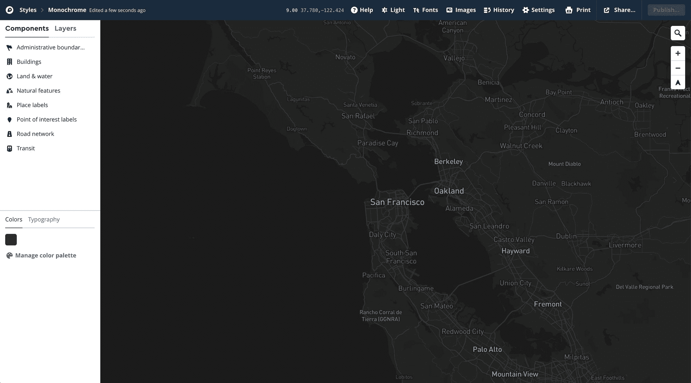

Mapbox customize style UI

从这里开始，你可以做你想做的事情。有大量的选项来定制你的地图。尝试深入这里有点复杂，但是 [Mapbox 提供了一些资源](https://docs.mapbox.com/studio-manual/overview/)来帮助你提高效率。

### 生成地图框标记

一旦您对您的新样式感到满意，并且所有内容都已发布，我们希望生成一个令牌，用于提供对我们地图的访问。

前往地图箱仪表板的帐户部分。

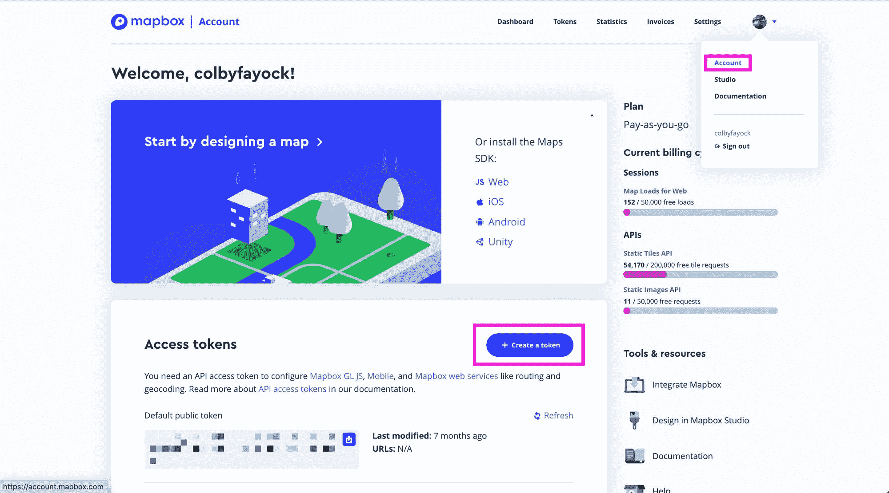

Creating a new token in Mapbox

Mapbox 为您提供了一个可以在应用程序中使用的“默认”令牌。你可以自由使用这个，但是我建议你创建一个新的令牌，你可以提供一个唯一的名字，这样如果你超过了 Mapbox 的免费层，你就可以跟踪你的使用情况。

此外，最好为每个应用程序保留一个单独的令牌，这样您可以轻松地轮换一个单独的密钥，而不必更新使用它的每个应用程序。

单击“创建令牌”后，您可以根据自己的意愿设置密钥，选择范围和权限，但出于我们的目的，您可以为我们的地图选中所有公共范围，这是默认设置。

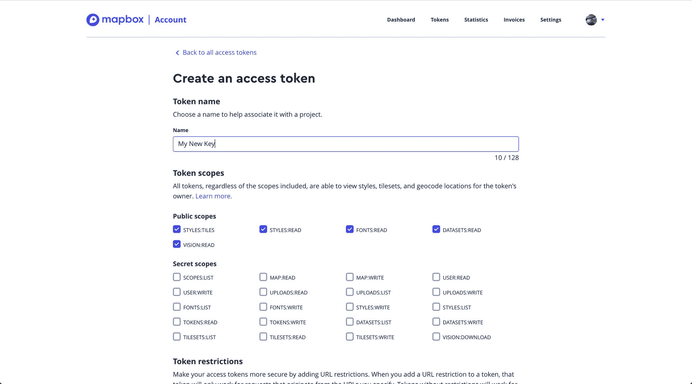

Create a new access token in Mapbox

### 配置我们的自定义端点

对于本教程，我们将使用 [Mapbox 的静态图块服务](https://docs.mapbox.com/api/maps/#static-tiles)。

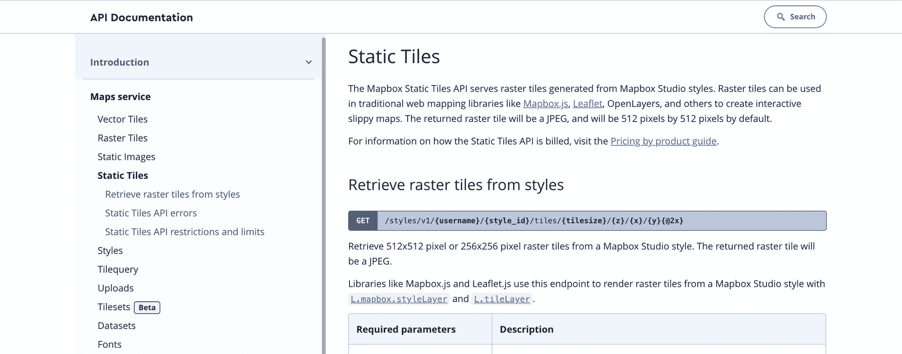

Mapbox Static Tiles Maps API

我们的端点将如下所示:

```
https://api.mapbox.com/styles/v1/{username}/{style_id}/tiles/256/{z}/{x}/{y}@2x?access_token={access_token} 
```

这里有几个参数我们需要了解:

*   用户名:这将是你的地图箱帐户的用户名
*   style_id:这将是您之前创建的样式的 id
*   z，x，y:这些是传单以编程方式换出的参数，所以我们想让它们保持原样
*   access_token:这是您在上面创建的地图框键

为了找到您的用户名和样式 ID，我们可以使用新 Mapbox 样式的样式 URL 来获取这些值。

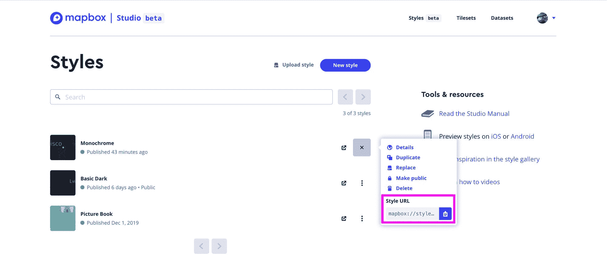

Finding the Style URL in Mapbox Studio

在我的例子中，我的样式 URL 看起来像:

```
mapbox://styles/colbyfayock/ck8lryjfq0jdo1ip9ctmuhc6p 
```

`colbyfayock`是我的用户名，`ck8lryjfq0jdo1ip9ctmuhc6p`是我的风格 ID。

一旦我更新了端点参数，最终的 tilepoint URL 将如下所示:

```
https://api.mapbox.com/styles/v1/colbyfayock/ck8lryjfq0jdo1ip9ctmuhc6p/tiles/256/{z}/{x}/{y}@2x?access_token=MYACCESSTOKEN 
```

## 第 2 部分:添加自定义 TileLayer 来反应传单

当使用 React Leaflet 构建地图时，您的主要组件将是一个包装整个应用程序的`<Map>`。这就是为[传单](https://leafletjs.com/)设置你的[地图实例](https://leafletjs.com/reference-1.6.0.html#map-example)的过程。

出于我们的目的，我们将使用 [React 传单主页](https://react-leaflet.js.org/)上的示例作为我们的起点。

### 反应小叶瓷砖层组分

在您的`<Map>`组件中，您包含了一个`<TileLayer>`组件，它定义了您的地图所基于的世界的图像。

React 传单主页上的示例使用公开版本的 [OpenStreetMap](https://www.openstreetmap.org/) 作为他们的 TileLayer，这是一个由世界各地的人们创建和更新的开源地图项目。

```
<Map center={position} zoom={13}>
  <TileLayer
    url="https://{s}.tile.openstreetmap.org/{z}/{x}/{y}.png"
    attribution="&copy; <a href=&quot;http://osm.org/copyright&quot;>OpenStreetMap</a> contributors"
  />
</Map> 
```

这给了你一个基本的地图，但我们想在 Mapbox 中交换，这样我们就可以为我们的地图设置一个自定义的外观和感觉。

### 自定义地图框平铺层

为了添加我们的自定义样式，我们需要更新`TileLayer`组件的`url`和`attribution`属性。

对于 URL，它只是我们之前创建的自定义样式端点，因此在我的示例中，它看起来像:

```
https://api.mapbox.com/styles/v1/colbyfayock/ck8lryjfq0jdo1ip9ctmuhc6p/tiles/256/{z}/{x}/{y}@2x?access_token=MYACCESSTOKEN 
```

对于属性，我们希望将 Mapbox 作为服务，因此我们希望将属性设置为:

```
Map data &copy; <a href=&quot;https://www.openstreetmap.org/&quot;>OpenStreetMap</a> contributors, <a href=&quot;https://creativecommons.org/licenses/by-sa/2.0/&quot;>CC-BY-SA</a>, Imagery &copy; <a href=&quot;https://www.mapbox.com/&quot;>Mapbox</a> 
```

当插入到我们的`TileLayer`中时，我们的代码应该是这样的:

```
<Map center={position} zoom={13}>
  <TileLayer
    url="https://api.mapbox.com/styles/v1/colbyfayock/ck8lryjfq0jdo1ip9ctmuhc6p/tiles/256/{z}/{x}/{y}@2x?access_token=MYACCESSTOKEN"
    attribution="Map data &copy; <a href=&quot;https://www.openstreetmap.org/&quot;>OpenStreetMap</a> contributors, <a href=&quot;https://creativecommons.org/licenses/by-sa/2.0/&quot;>CC-BY-SA</a>, Imagery &copy; <a href=&quot;https://www.mapbox.com/&quot;>Mapbox</a>"
  />
</Map> 
```

打开地图后，我们应该会看到新的底图！

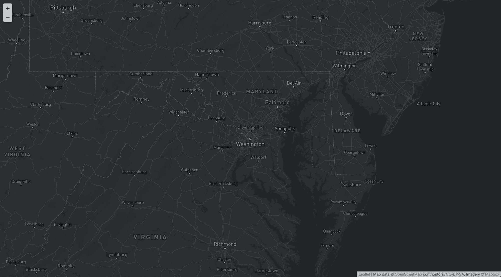

React Leaflet with a Mapbox basemap

### 看代码！

如果你想看看我是怎么做的，[看看提交的差异提交](https://github.com/colbyfayock/my-mapbox-react-leaflet/commits/master)。

唯一需要注意的是，我在项目的根目录下创建了一个`.env.development.local`文件，其中存储了一个名为`REACT_APP_MAPBOX_KEY`的新环境变量来存储我的 Mapbox 键。

## 第 3 部分:向 Gatsby 入门手册添加自定义底图

我已经写了[几篇](https://www.colbyfayock.com/2020/03/how-to-create-a-coronavirus-covid-19-dashboard-map-app-with-gatsby-and-leaflet) [其他](https://www.colbyfayock.com/2020/03/how-to-create-a-summer-road-trip-mapping-app-with-gatsby-and-leaflet) [文章](https://www.colbyfayock.com/2020/03/anyone-can-map-inspiration-and-an-introduction-to-the-world-of-mapping/)关于[如何开始](https://www.freecodecamp.org/news/easily-spin-up-a-mapping-app-in-react-with-leaflet/)使用我的[传单 Gatsby Starter](https://github.com/colbyfayock/gatsby-starter-leaflet) ，但是对于这一部分，我们想要有一个基本的应用程序，我们可以用它来改变我们的`TileLayer`端点。

### 设置 React 传单 Gatsby 应用程序

要开始，请查看 Starter github 上的说明:

[https://github.com/colbyfayock/gatsby-starter-leaflet](https://github.com/colbyfayock/gatsby-starter-leaflet)

一旦你准备好了，你应该有一个基本的地图应用程序准备好了！


New Leaflet Gatsby app in the browser

### 配置我们的地图框服务

我们要做的第一件事是将 Mapbox 作为服务添加到我们的`src/data/map-services.js`文件中。

以我们在第 1 部分中创建的自定义端点 url 为例，让我们设置一个名为 Mapbox 的新对象，其 URL 和属性类似于我们在第 2 部分中所做的。

```
export const mapServices = [
  {
    name: ‘OpenStreetMap’,
    attribution: '&copy; <a href="http://osm.org/copyright”>OpenStreetMap</a> contributors’,
    url: ‘https://{s}.tile.openstreetmap.org/{z}/{x}/{y}.png’
  },
  {
    name: ‘Mapbox’,
    attribution: ‘Map data &copy; <a href=&quot;https://www.openstreetmap.org/&quot;>OpenStreetMap</a> contributors, <a href=&quot;https://creativecommons.org/licenses/by-sa/2.0/&quot;>CC-BY-SA</a>, Imagery &copy; <a href=&quot;https://www.mapbox.com/&quot;>Mapbox</a>’,
    url: `https://api.mapbox.com/styles/v1/colbyfayock/ck8c2foj72lqk1jnug0g2haw0/tiles/256/{z}/{x}/{y}@2x?access_token=MY_ACCESS_TOKEN`
  }
]; 
```

### 使用我们的 Mapbox 地图服务

一旦设置好地图框服务，剩下的工作就是打开`src/pages/index.js`文件，找到`mapSettings`对象定义，并将`defaultBaseMap`属性更新为`Mapbox`。

```
const mapSettings = {
  center: CENTER,
  defaultBaseMap: ‘Mapbox’,
  zoom: DEFAULT_ZOOM,
  mapEffect
}; 
```

保存更改，在浏览器中刷新地图，现在您应该可以看到自定义底图样式了！

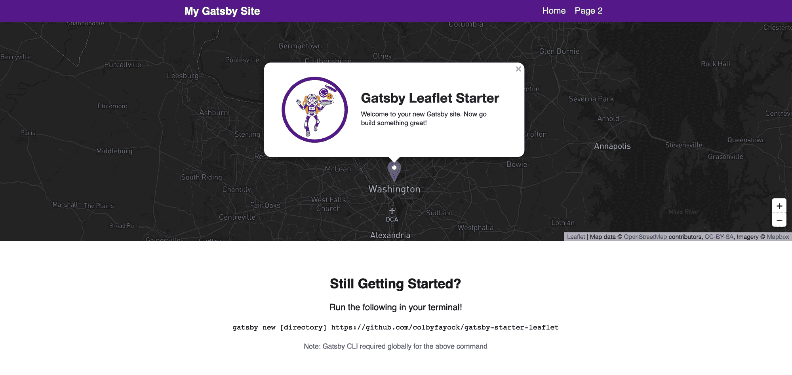

Gatsby Starter Leaflet with custom Mapbox basemap in browser

### 看代码！

如果你想看看我是怎么做的，[用提交](https://github.com/colbyfayock/my-mapbox-gatsby-starter-leaflet/commit/9baa1b7003504dec5c938328ea9b54477f65ec58)检查一下差异。

唯一需要注意的是，我在项目的根目录下创建了一个`.env.development`文件，其中存储了一个名为`GATSBY_MAPBOX_KEY`的新环境变量来存储我的 Mapbox 键。

## 保护您的地图框密钥

### 环境变量

大多数使用单个键的开发过程通常会将键设置为环境变量。环境变量是不存在于代码本身中的配置设置。

这一点很重要，因为它防止您的密钥被签入到代码中，从安全角度来看这是不好的，但它也允许您为不同的环境提供不同的密钥。

当生成您的密钥时，请尽量记住这一点，因为从长远来看，这可以节省您的时间。

### 锁定您的地图框键

在创建令牌或编辑令牌时的设置中，Mapbox 允许您仅指定您希望从其访问密钥的 URL。

尽管 Mapbox 有一个慷慨的免费层，你可能想把它锁定在你使用它的 URL 上。您可以创建多个密钥，其中一个可以在您的网站上公开使用，另一个可以用于您的本地开发。

这很有帮助，例如，您有一个永远不会公开用于开发目的的密钥，但是您有一个使用部署的密钥，该密钥只能锁定到该 URL。

如果有人拿了你的钥匙，他们可以把它插到他们自己的网站上，用光你所有的免费等级，潜在地增加你的账单！

## 想了解更多关于地图的知识？

您可以查看我的一些其他资源来开始:

*   [如何创建冠状病毒(新冠肺炎)仪表盘&地图 App in React with Gatsby 和传单](https://www.colbyfayock.com/2020/03/how-to-create-a-coronavirus-covid-19-dashboard-map-app-with-gatsby-and-leaflet)
*   [谁都会地图！灵感和对地图世界的介绍](https://www.colbyfayock.com/2020/03/anyone-can-map-inspiration-and-an-introduction-to-the-world-of-mapping)
*   [如何用盖茨比和传单创建一个夏季公路旅行地图应用](https://www.colbyfayock.com/2020/03/how-to-create-a-summer-road-trip-mapping-app-with-gatsby-and-leaflet)
*   [如何用盖茨比和 React 传单创建自己的圣诞老人追踪器](https://www.colbyfayock.com/2019/12/create-your-own-santa-tracker-with-gatsby-and-react-leaflet/)
*   [如何使用传单以简单的方式创建地图应用](https://www.freecodecamp.org/news/easily-spin-up-a-mapping-app-in-react-with-leaflet/)

[](https://twitter.com/colbyfayock)

*   [？在 Twitter 上关注我](https://twitter.com/colbyfayock)
*   [？️订阅我的 Youtube](https://youtube.com/colbyfayock)
*   [✉️注册我的简讯](https://www.colbyfayock.com/newsletter/)