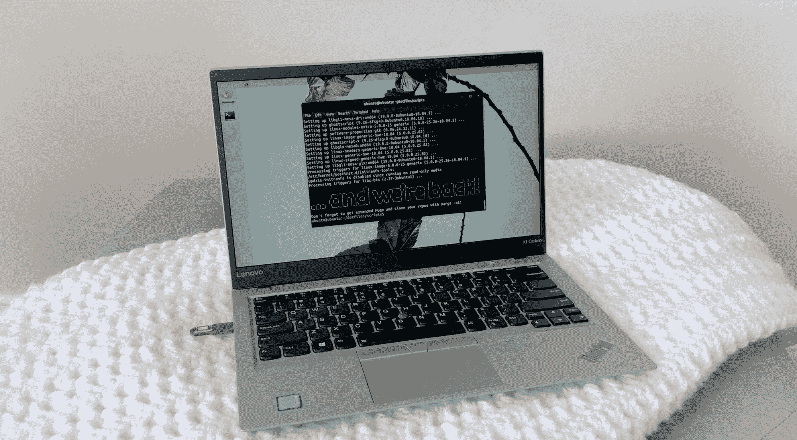

# 如何只使用点文件和 Bash 脚本来设置一个全新的 Ubuntu 桌面

> 原文：<https://www.freecodecamp.org/news/how-to-set-up-a-fresh-ubuntu-desktop-using-only-dotfiles-and-bash-scripts/>

关于 GitHub 上的开源文件，我最喜欢的一点是能够看到其他人如何做(一些人可能会这样称呼)平常的事情，比如设置他们的`.bashrc`和其他点文件。虽然我对 ricing 的热情不如我第一次来到 Linux 端时，但当我发现一个配置设置使事情变得更漂亮、更快，因此更好时，我仍然非常兴奋。

我最近遇到了一些这样的事情，尤其是在汤姆·哈德森的网络文件中。Tom 似乎喜欢编写脚本，其中包括自动设置符号链接，安装 Ubuntu 应用程序和其他程序。这让我开始思考。我可以自动设置一台新机器来复制我当前的机器吗？

作为一个通常倾向于把东西拆开来看看它们是如何工作的人，我知道我有时会把我的笔记本电脑弄得一团糟。(通常是我不在家的时候，而我的备份硬盘不在。)在那些罕见但确实不方便的情况下，当我的电脑变成它原来的外壳时，(ba-dum-ching)如果有一种快速、简单的方法将矮胖子重新组装起来就好了，这正是我喜欢的方式。

与创建一个[磁盘映像并在稍后](https://askubuntu.com/questions/19901/how-to-make-a-disk-image-and-restore-from-it-later)恢复它相比，bash 脚本集合更容易创建、维护和移动。它们不需要特殊的设施，只需要一种外部运输方式。这就像传递食谱，而不是整个 bundt 蛋糕。(嗯，蛋糕。)

此外，像这样的功能在设置虚拟机或 VM，甚至只是虚拟专用服务器或 VPS 时会非常有用。(现在我写这篇文章，这两者可能会成为我更具破坏性的实验的更宽容的目标…活到老，学到老！)

嗯，经过一些搜索和挖掘，我现在有了一套可以做到这一点的脚本:



*看[这里是](https://victoria.dev/verbose/how-to-set-up-a-fresh-ubuntu-desktop-using-only-dotfiles-and-bash-scripts)的设置视频。*

这是在一个新的 Ubuntu 桌面上测试运行设置脚本的结尾，从一个可启动的 USB 加载。它在三分钟内恢复了我所有的程序和设置！

这篇文章将讲述如何使用 bash 脚本实现运行 Ubuntu Desktop(在我的例子中是 Ubuntu LTS 18.04)的计算机的自动设置。涵盖的大部分信息适用于所有的 Linux 桌面风格，尽管有些语法可能会有所不同。bash 脚本涵盖了三个主要领域:链接点文件、从 Ubuntu 和其他地方安装软件，以及设置桌面环境。我们将涉及这些领域中的每一个，并检查重要的部分，以便您可以开始编写自己的脚本。

# Dotfiles

点文件是大多数 Linux 爱好者所说的配置文件。它们通常位于用户的主目录中(在 bash 脚本中用[内置](https://www.tldp.org/LDP/abs/html/internal.html#BUILTINREF)变量`$HOME`表示),并控制各种程序的外观和行为。文件名以`.`开头，表示 Linux 中的隐藏文件(因此是“点”文件)。以下是一些常见的点文件和它们的用处。

## `.bashrc`

`.bashrc`文件是交互式非登录 shells 在启动时执行的命令列表。[交互式 vs 非交互式外壳](https://www.tldp.org/LDP/abs/html/intandnonint.html)可能有点混乱，但我们没必要在这里担心。对于我们的目的来说，任何时候你打开一个新的终端，看到一个提示，并可以在其中输入命令，你的`.bashrc`就会被执行。

通过创建减少击键次数的别名，或者通过显示包含有用信息的有用提示，该文件中的行有助于改进您的工作流。它甚至可以运行用户创建的程序，比如艾迪·T2。更多想法，可以看看 GitHub 上的[我的`.bashrc`文件。]( https://github.com/victoriadrake/dotfiles/blob/ubuntu-19.10/.bashrc)

## `.vimrc`

`.vimrc`点文件配置所有文本编辑器的冠军， [Vim](https://www.vim.org/about.php) 。(如果你还没有使用键盘快捷键，我强烈推荐[，这是一个和](https://vim-adventures.com/)一起学习 Vim 的有趣游戏。)

在`.vimrc`中，我们可以设置编辑器偏好，如显示设置、颜色和自定义键盘快捷键。可以在 GitHub 上看一下[我的`.vimrc`。]( https://github.com/victoriadrake/dotfiles/blob/ubuntu-19.10/.vimrc)

根据您使用的程序，其他点文件可能有用，如`.gitconfig`或`.tmux.conf`。探索 GitHub 上的 dotfiles 是一种很好的方式，可以让你了解哪些内容对你有用！

# 链接点文件

我们可以使用一个脚本来创建符号链接，或者为我们所有的点文件创建[符号链接](https://en.wikipedia.org/wiki/Symbolic_link#POSIX_and_Unix-like_operating_systems)。这允许我们将所有文件保存在一个中央存储库中，在那里可以很容易地管理它们，同时还在程序期望找到配置文件的地方提供了一种占位符。这通常是(但不总是)用户主目录。例如，由于我将我的点文件存储在 GitHub 上，所以我将它们保存在一个路径类似于`~/github/dotfiles/`的目录中，而文件本身是符号链接的，因此路径类似于`~/.vimrc`。

为了以编程方式检查和处理任何现有的文件和符号链接，然后创建新的文件和符号链接，我们可以使用[这个优雅的 shell 脚本](https://github.com/victoriadrake/dotfiles/blob/master/scripts/symlink.sh)。我称赞它只是因为我公然从[汤姆的设置脚本](https://github.com/tomnomnom/dotfiles/blob/master/setup.sh)中窃取了它的核心，所以我不能因为它有多可爱而邀功。

`symlink.sh`脚本试图为我们的`$HOME`中的每个点文件创建符号链接。它首先检查符号链接是否已经存在，或者同名的常规文件或目录是否存在。在前一种情况下，符号链接被移除并重新制作；在后一种情况下，文件或目录被重命名，然后创建符号链接。

# 安装软件

探索 shell 脚本的美妙之处之一是发现仅使用命令行可以实现多少功能。作为一个第一次接触计算机是通过图形操作系统的人，我发现在终端工作非常快。

有了 Ubuntu，我们可能需要的大多数程序都可以通过默认的 Ubuntu 软件库获得。我们通常使用命令`apt search <program>`来搜索它们，并使用`sudo apt install <program>`来安装它们。我们想要的一些软件可能不在默认的存储库中，或者可能在最新版本中没有提供。在这些情况下，我们仍然可以在 Ubuntu 中使用 [PPA 或者个人包存档](https://en.wikipedia.org/wiki/Ubuntu#Package_Archives)来安装这些程序。我们只是必须小心，我们选择的 PPAs 来自官方来源。

如果我们想要的程序没有出现在默认的软件仓库中，或者似乎没有 PPA，我们仍然可以通过命令行安装它。快速搜索“安装命令行”应该会得到一些答案。

因为 bash 脚本只是我们可以在终端中单独运行的命令集合，所以创建一个脚本来安装所有我们想要的程序就像将所有命令放入一个脚本文件中一样简单。我选择在默认的存储库(由[我的`aptinstall.sh`脚本](https://github.com/victoriadrake/dotfiles/blob/ubuntu-19.10/scripts/aptinstall.sh)安装)和包含外部资源的程序(由[我的`programs.sh`脚本处理)之间组织我的安装脚本。]( https://github.com/victoriadrake/dotfiles/blob/ubuntu-19.10/scripts/programs.sh)

# 设置桌面环境

最近，当我得到一个新的桌面时(有意或无意)，我似乎总是忘记要花多长时间来记住、找到并更改所有的桌面环境设置。键盘快捷键，工作区，声音设置，夜间模式…它加起来！

值得庆幸的是，所有这些设置都必须以非图形格式存储在某个地方，这意味着如果我们能够发现如何做到这一点，我们就有可能找到一种方法，用 bash 脚本轻松地操作这些设置。请看终端命令，`gsettings list-recursively`。

GNOME 桌面环境有很多设置。我们可以让列表更容易滚动(如果你像我一样，有时会说“让我看看所有的东西，想出我想要什么！”)通过管道连接到`less` : `gsettings list-recursively | less`。或者，如果我们对我们可能要找的东西有所暗示，我们可以使用`grep` : `gsettings list-recursively | grep 'keyboard'`。

我们可以用`gsettings set`命令操作我们的设置。有时很难找到我们想要的设置的语法，所以当我们第一次构建脚本时，我建议使用 GUI 进行更改，然后找到我们更改的`gsettings`行并记录它的值。

为了获得一些灵感，你可以在 GitHub 上查看[我的`desktop.sh`设置脚本。]( https://github.com/victoriadrake/dotfiles/blob/ubuntu-19.10/scripts/desktop.sh)

# 把所有的放在一起

拥有模块化的脚本(一个用于符号链接，两个用于安装程序，另一个用于桌面设置)对于保持事情有条理和能够运行一些而不是所有的自动设置是有用的。例如，如果我要建立一个只使用命令行的 VPS，我就不需要安装图形程序或桌面设置。

然而，在我确实想运行所有脚本的情况下，一个接一个地运行有点乏味。幸运的是，由于 bash 脚本本身可以由终端命令运行，我们可以简单地编写另一个主脚本来运行它们！

下面是我处理新 Ubuntu 桌面机设置的主要脚本:

```
#!/bin/bash

./symlink.sh
./aptinstall.sh
./programs.sh
./desktop.sh

# Get all upgrades
sudo apt upgrade -y

# See our bash changes
source ~/.bashrc

# Fun hello
figlet "... and we're back!" | lolcat
```

我额外增加了升级线。它将确保安装在我们新桌面上的程序有最新的更新。现在，一个简单的 bash 命令就能搞定一切！

你可能已经注意到，虽然我们的桌面现在看起来和运行起来都很熟悉，但这些脚本没有覆盖一个非常重要的领域:我们的文件。希望您有一个备份方法，用于那些涉及某种形式的可靠外部硬件的应用程序。如果没有，并且如果您倾向于将您的工作放在 GitHub 或 GitLab 之类的外部存储库主机上，我有一种方法可以用 bash 一行程序自动克隆和备份您的 GitHub 存储库。

然而，依赖外部存储库主机并不能提供 100%的覆盖率。因此，不会放入外部托管存储库(私有或其他)的文件不能被提取。Git 忽略了不能从包含的文件中生成的对象，比如私钥和秘密，将不会被重新创建。然而，这些文件可能足够小，你可以在几个加密的 USB 闪存驱动器上放一大堆(如果你没有私钥备份，也许你应该先备份？).

也就是说，我希望这篇文章至少给了你一些关于 dotfiles 和 bash 脚本如何帮助自动设置一个新桌面的灵感。如果你发现了一些有用的设置，也请通过分享你的点文件来帮助他人发现它们！