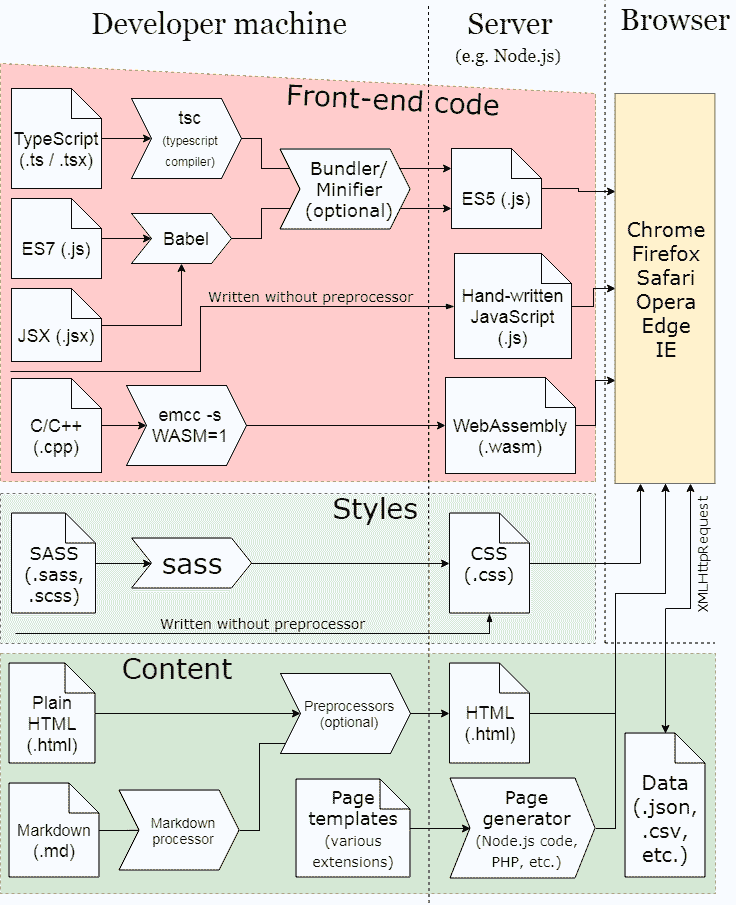
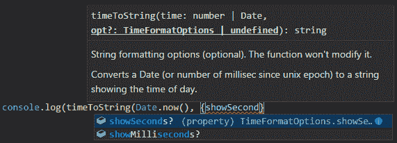
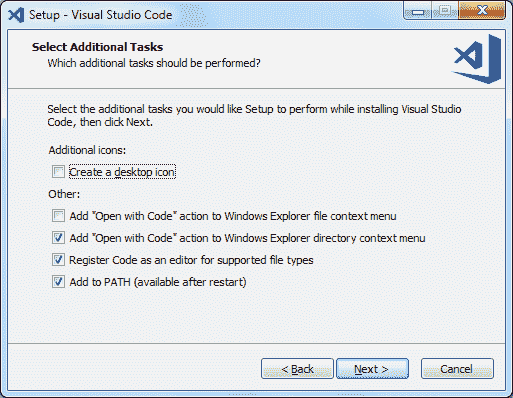
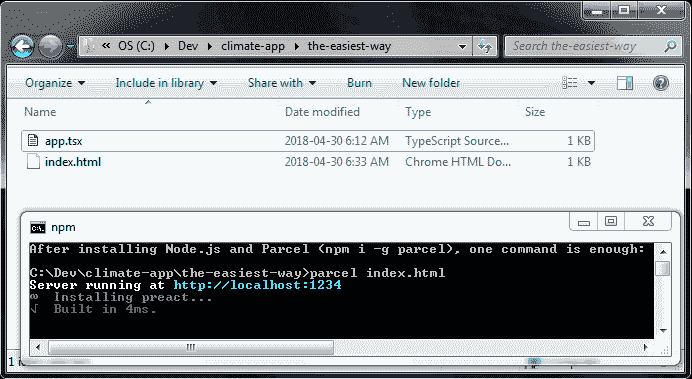
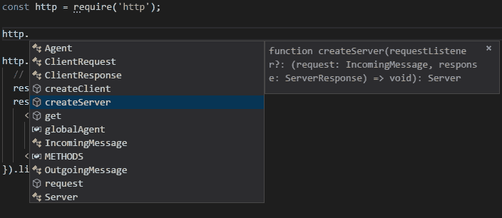
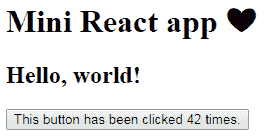
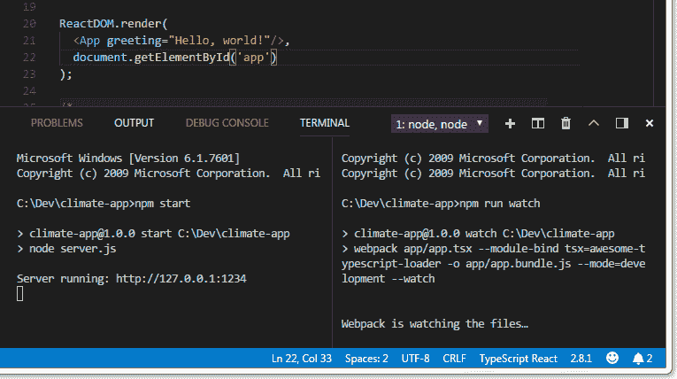

# 如何设置 TypeScript 项目

> 原文：<https://www.freecodecamp.org/news/how-to-set-up-a-typescript-project-67b427114884/>

大卫·皮格拉斯

# 如何设置 TypeScript 项目

#### 初学者使用 React 制作 web 应用程序的全面指南


Photo by [Artem Sapegin](https://unsplash.com/photos/ZMraoOybTLQ?utm_source=unsplash&utm_medium=referral&utm_content=creditCopyText) on [Unsplash](https://unsplash.com/search/photos/project?utm_source=unsplash&utm_medium=referral&utm_content=creditCopyText)

在我多年的开发生涯中，我从未遇到过像 JavaScript 世界这样势不可挡的领域。这是一个令人困惑的复杂世界，在这里，制作一个非常简单的项目似乎需要安装许多工具，编辑几个将所有这些工具连接在一起的文本文件，并运行一堆终端命令。

有一些工具试图隐藏你的复杂性，并取得了不同程度的成功。但是，只要这些工具没有被普遍采用，在我看来，它们就像是你必须在其他一切之上学习的更多东西。

对我来说，最大的烦恼来源是大多数教程假设你已经熟悉生态系统，所以他们懒得解释基础知识。更糟糕的是，许多教程试图向你推一堆额外的工具——像 [Webpack](https://webpack.js.org/) 、 [Bower](https://bower.io/) 、 [NVM](https://github.com/creationix/nvm) 和[Redux](https://redux.js.org/)——却很少解释。

这很讽刺，因为 JavaScript 本身已经安装在世界上几乎每台电脑上，包括手机。与编写包含一些 JavaScript 代码的 HTML 文件相比，为什么以“专业”方式编写应用程序必须如此复杂？

如果你像我一样，有一种**与生俱来的需求**去理解正在发生的事情，并且:

*   如果你不能忍受盲目地将命令复制到终端和文本文件中
*   如果您想在安装之前确定您需要一个工具
*   如果你想知道为什么你的基于 npm 的项目在你写第一行代码之前是 50MB

那欢迎！你来对地方了。

另一方面，如果你想在 5 分钟内开始编程，我知道一个窍门:跳过这里的介绍，开始阅读第 2 节中关于[接近 A](https://medium.com/p/67b427114884#682d) 的内容。或者如果你认为我给你的信息太多，就跳过你不想学的部分。

在本教程中，我将假设你对 HTML、CSS 和 JavaScript 有一些编程经验，但对 T4 的 TypeScript、React 和 Node.js 没有经验。

我将给你一个我所理解的 JavaScript 生态系统的概述。我将解释为什么我认为 TypeScript 和 React(或 [Preact](https://preactjs.com/) )是制作 web 应用程序的最佳选择。我会帮你开始一个项目，没有不必要的额外支出。

在第二部分，我们将讨论如何以及为什么给你的项目添加额外的东西，**如果**你决定要它们的话。

### 目录

[第一部分:JavaScript 生态系统概述](https://medium.com/p/67b427114884#51cb)

[第二部分:实际建立项目](https://medium.com/p/67b427114884#7248)

*   [常用步骤](https://medium.com/p/67b427114884#682d)
*   [方法 A:简单的方法](https://medium.com/p/67b427114884#719b)
*   [其他方法](https://medium.com/p/67b427114884#3e81)
*   [方法 B:最少工具的方法](https://medium.com/p/67b427114884#9220)
*   [方式 C:网络包方式](https://medium.com/p/67b427114884#9b91)
*   [总结](https://medium.com/p/67b427114884#0690)

### 第 1 部分:JavaScript 生态系统概述

对于许多编程语言来说，有一种大家都知道的做事方式。

例如，如果你想做一个 C#应用程序，你安装 [Visual Studio](https://visualstudio.microsoft.com/) ，点击几下鼠标创建一个 Windows 窗体项目，点击绿色的“play”按钮运行你的新程序，然后开始为它编写代码。包管理器( [NuGet](https://www.nuget.org/) )是内置的，调试器只是工作。当然，安装 IDE 可能需要几个小时，而且 [WPF](https://docs.microsoft.com/en-us/dotnet/framework/wpf/getting-started/introduction-to-wpf-in-vs) 就像用头撞砖墙一样有趣，但至少**入门**很容易。(除非你用的不是 Windows，那就完全不一样了，不过我跑题了。)

另一方面，在 JavaScript 中，几乎在开发过程的每一个方面都有许多相互竞争的库和工具。在您编写第一行代码之前，这些工具会变得令人不知所措！当你去谷歌搜索“如何编写 web 应用程序”时，你访问的每个网站似乎都会给出不同的建议。



*Thanks [draw.io](https://draw.io) for the diagramming tool!*

大多数人似乎都同意使用节点包管理器( [NPM](https://www.npmjs.com/) )来下载 JavaScript 库(包括服务器端和浏览器端)。但即使在这里，一些人正在使用[纱](https://yarnpkg.com/en/)，这是 npm 兼容，或可能更 Bower。

NPM 与 Node.js 捆绑在一起，node . js 是一个完全由 JavaScript 代码控制的 web 服务器。NPM 与 Node 紧密集成。例如，`npm start`命令默认运行`node server.js`。

即使你计划使用不同的 web 服务器(或者使用 **no** web 服务器，只是双击一个 HTML 文件)，每个人似乎都认为你已经安装了 Node.js。所以你也可以继续安装 node.js ，这给了你一个副作用`npm`。

Node.js 不仅仅是一个 web 服务器，它还可以运行用 JavaScript 编写的命令行应用程序。从这个意义上说，TypeScript 编译器是一个 Node.js 应用程序！

除了 NPM，你还有几个选择:

#### 你想要哪种风格的 JavaScript？

JavaScript 的正式名称实际上是 ECMAScript，部署最广泛的版本是 ECMAScript 6 或简称 ES6。旧的浏览器，特别是 Internet Explorer，只支持 ES5。

ES6 增加了许多有用和重要的新特性，如模块、let、const、箭头函数(或 lambda 函数)、类和析构赋值。

ES7 增加了一些新功能，最著名的是 async/await。

如果您不需要支持旧的浏览器，并且您的代码不是很大，那么直接在浏览器中运行您的代码是一个很有吸引力的选择，因为您不必在浏览器中打开它之前“编译”您的 JavaScript。

**但是**使用编译步骤有很多原因:

*   如果你需要支持旧的浏览器，你需要一个“transpiler ”,这样你就可以在旧的浏览器中使用 JavaScript 的新特性。transpiler 是一种编译器，其输出代码是一种高级语言，在本例中是 JavaScript。我猜最受欢迎的 transpiler 是 [Babel](https://babeljs.io/) ，其次是 [TypeScript](https://www.typescriptlang.org/) 。
*   如果您想使用流行的 React 框架(但没有 TypeScript)，您可能会编写“JSX”代码 JavaScript 代码中的 XML 片段。浏览器不支持 JSX，因此需要一个预处理器(通常是 Babel)。
*   如果你想“缩小”你的代码，使它使用更少的带宽(或者被混淆)，你需要一个“缩小”的预处理器。[流行的 minifiers](http://typescript-react-primer.loyc.net/minification.html) 包括 UglifyJS、JSMin 和 Closure 编译器。
*   如果您想要类型检查或高质量的代码完成(也称为 IntelliSense)，您会想要使用 TypeScript，它是 JavaScript 的超集(表面上意味着每个 JavaScript 文件也是一个 TypeScript 文件)。TypeScript 同时支持 ES7 特性和 JSX，其输出是 ES5 或 ES6 代码。当 TypeScript 和 JSX 码一起使用时，文件扩展名必须是`.tsx`。有些人正在使用一种不同的语言，在概念上类似于 TypeScript，叫做 Flow。
*   如果你不喜欢 JavaScript，你可以尝试一种完全不同的语言，比如 Elm、ClojureScript 或 Dart。

幸运的是，可以自动编译，这样每当你保存一个文件时，你的代码都会被重新编译。

本教程使用 TypeScript，它是 JavaScript 的超集，具有全面的类型系统。TypeScript 的好处是:

1.  当您犯了与类型相关的错误时，您会得到编译器错误消息(而不是在您的程序行为不当时间接发现错误)。在像 Visual Studio 代码这样的 ide 中，你的错误用红色下划线标出。
2.  可以获得重构特性。例如，在 Visual Studio 代码中，按`**F2**`可以跨多个文件重命名一个函数或变量，而不会影响其他同名的东西。
3.  类型允许 ide 提供代码完成弹出窗口，也称为 IntelliSense，这使得编程更加容易，因为您不必记住您调用的函数的所有名称和预期参数:



Visual Studio Code’s IntelliSense™

**提示**:不安装任何东西玩打字稿，[去它的游乐场](http://www.typescriptlang.org/play/)。

#### 客户端对服务器

您可以在客户端(前端浏览器)、服务器(Node.js 后端)或两者中运行代码。客户不受你的控制。用户可能会使用 Firefox、Chrome、Safari、Opera、Edge，或者在最糟糕的情况下，使用 Internet Explorer。

出于安全原因，请记住用户可以使用浏览器扩展或`**F12**`开发工具来修改浏览器的行为。你甚至不能确定你的代码运行在一个真正的浏览器中。

开发人员过去依赖于 jQuery 库在不同的浏览器中获得一致的行为，但是现在你可以依赖不同的浏览器在大多数情况下以相同的方式运行(除了 Internet Explorer)。

在本教程中，我们将在浏览器中运行所有重要的代码，但我们还将设置一个简单的 Node.js 服务器来为浏览器提供应用程序。许多其他服务器也是可用的，比如 [Apache](https://httpd.apache.org/) 、 [IIS](https://www.iis.net/) ，或者像 [Jekyll](https://jekyllrb.com/) 这样的静态服务器。

但是 Node.js 已经成为一种标准，可能是因为 Node.js 和 NPM 捆绑在一起了。

#### 用户界面框架

HTML 和 CSS 本身非常适合带有图像或简单形式的普通文章。如果这就是你要做的，那么可能根本不需要 JavaScript。CSS 甚至可以做一些曾经需要 JavaScript 的事情，比如[下拉菜单](https://www.cssscript.com/pure-css-mobile-compatible-responsive-dropdown-menu/)，页面[完全重新格式化为小型/移动浏览器或打印](https://developer.mozilla.org/en-US/docs/Web/CSS/Media_Queries/Using_media_queries)，以及[动画](https://developer.mozilla.org/en-US/docs/Web/CSS/CSS_Animations/Using_CSS_animations)。

如果您需要比这更复杂的东西，或者如果您的页面是从原始数据动态生成的，那么您可能希望使用带有可选用户界面库或框架的 JavaScript。稍后我将向您展示如何使用 react 及其小兄弟 Preact，React 已经成为最受欢迎的 UI 框架。

“大”的[热门替代品](https://stateofjs.com/2017/front-end/results)有 [Angular 2](https://angular.io/) 和 [Vue.js](https://vuejs.org/) ，而“小”的有 [D3](https://d3js.org/) 、 [Mithril](https://mithril.js.org/) 和一个叫 jQuery 的老经典。

如果您的 web 服务器运行 JavaScript (Node.js)，您可以在服务器上运行 React 来预生成页面的初始外观。

#### 构建工具

有几个[工具可以用来“构建”和“打包”你的代码](https://stateofjs.com/2017/build-tools/results)——web pack、 [Grunt](https://gruntjs.com/) 、 [Browserify](http://browserify.org/) 、 [Gulp](https://gulpjs.com/) 、[package](https://parceljs.org/)——但是所有这些东西都是可选的。我将向你展示如何用`npm`来凑合，如果你愿意，还可以用包裹或网袋。

#### CSS 风格

在这篇文章中，我们将使用普通的 CSS。如果你无论如何都要有一个编译步骤，你可能想试试 SCSS，一个 CSS 的“改进”衍生物，具有额外的特性。或者您可以使用 SASS，它在概念上与 SCSS 相同，但语法更简洁。

无论哪种方式，你都需要 [Sass 预处理器](https://sass-lang.com/)。和往常一样，在 JavaScript 世界里，有[和一堆替代品](https://stateofjs.com/2017/css/results/)，特别是[和](http://lesscss.org/)。

#### 单元测试

流行的单元测试库有[摩卡](https://mochajs.org/)、[茉莉](https://jasmine.github.io/)和 [Jest](https://jestjs.io/) 。[查看这里了解更多](https://stateofjs.com/2017/testing/results)。NPM 有一个专门的测试命令，`npm test`(是`npm run test`的简称)。

#### 其他图书馆

除了 Redux，[其他](https://stateofjs.com/2017/other-tools/)流行的 JavaScript 库还有 [Lodash](https://lodash.com/) 、 [Ramda](https://ramdajs.com/) 、[下划线](https://underscorejs.org/)、 [GraphQL](https://graphql.org/) 。

最受欢迎的林挺实用程序是 ESLint。

Bootstrap 是一个流行的 CSS 库，但是它需要一个 JavaScript 部分(而且它实际上是 SASS，而不是 CSS)。

当你在 JavaScript 代码中看到`$`时，它通常指的是 jQuery。当你看到`_`时，它通常指的是连字符或下划线。

或许值得一提的是流行的模板库:[翡翠](http://jade-lang.com)、[哈巴狗](https://pugjs.org/)、[小胡子](https://mustache.github.io/)和[车把](https://handlebarsjs.com/)。

#### 非网络应用

这个我就不多说了，但是 TypeScript 和 JavaScript 可以在 web 之外使用。

使用 [Electron](https://electronjs.org/) 你可以编写跨平台的桌面应用程序。有了 [React Native](https://electronjs.org/) ，你可以为拥有“原生”用户界面的 Android/iOS 设备编写 JavaScript 应用。你也可以用 Node.js 编写[命令行应用。](https://scotch.io/tutorials/build-an-interactive-command-line-application-with-nodejs)

#### 模块类型

在很长一段时间里，所有的 JavaScript 代码都运行在一个单一的全局名称空间中。这导致了不相关的代码库之间的冲突，因此发明了各种各样的“模块定义”来**模拟**其他语言所称的包或模块。

Node.js 使用 [CommonJS](https://en.wikipedia.org/wiki/CommonJS) 模块，其中涉及一个名为`require('module-name')`的神奇函数来导入模块，以及一个名为`module.exports`的神奇变量来创建模块。要编写在浏览器和 Node.js 中都能工作的模块，可以使用通用模块定义( [UMD](https://github.com/umdjs/umd) 模块)。可以异步加载的模块使用[和](https://github.com/amdjs/amdjs-api/wiki/AMD)。

ES6 推出了涉及`import`和`export`关键字的模块系统，但是 Node.js 和部分浏览器仍然不支持。这里有一个关于各种模块类型的[初级读本。](https://www.jvandemo.com/a-10-minute-primer-to-javascript-modules-module-formats-module-loaders-and-module-bundlers/)

#### 多填充物和原型

作为一个有经验的开发者，我能想到的只有两个词(除了库和工具的名字)只在 JavaScript 领域使用: **polyfill** 和 **prototype** 。

聚合填充是向后兼容的助手。它们是用 JavaScript 编写的代码片段，允许您在旧浏览器中使用新功能。例如，表达式`"food".startsWith('F')`测试字符串`'food'`是否以 F 开头(根据记录，那是`false`——它以`f`开头，而不是`F`)。)但是`startsWith`是 JavaScript 的一个新特性，是旧版浏览器所没有的。

您可以使用以下代码“多填充它”:

```
String.prototype.startsWith = String.prototype.startsWith ||  function(search, pos) {    return search ===       this.substr(!pos || pos < 0 ? 0 : +pos, search.length);  };
```

这段代码的形式是`X = X || function(...) {...}`，意思是“如果定义了 X，就把 X 设置成它自己(不要改变它)，否则就把 X 设置成这个函数。”这里显示的函数按照`startsWith`应该的方式运行。

这段代码提到了 JavaScript 的另一个独特之处，原型的概念。原型与其他语言中的类大致对应**，所以这段代码实际上是在改变内置`String`数据类型的定义。之后当你写`'string'.startsWith()`时，它将调用这个多填充(如果`String.prototype.startsWith`还没有被定义)。有各种各样的文章教你关于原型和原型继承，像[这篇](https://hackernoon.com/understanding-javascript-prototype-and-inheritance-d55a9a23bde2)。**

**甚至一些高级浏览器功能也有聚合填充。你听说过 [WebAssembly](https://webassembly.org/) 吗，它可以让你在浏览器中运行 C 和 C++代码？它有一个 [JavaScript polyfill](https://github.com/lukewagner/polyfill-prototype-1) ！**

#### **信用**

**我要感谢 JavaScript 调查的[状态和 Javascript 框架的](https://stateofjs.com/)[状态](https://www.npmjs.com/npm/the-state-of-javascript-frameworks-2017-part-2-the-react-ecosystem)提供了上面的大部分信息！对于一些项目，我使用 [npm-stat](https://npm-stat.com/) 来衡量受欢迎程度。另见本[其他新调查](https://ashleynolan.co.uk/blog/frontend-tooling-survey-2018-results)。**

### **第 2 部分:实际设置项目**

**你好。还醒着吗？现在我们将开始 JavaScript 工具生态系统之旅。这一部分与 React 无关(我们将在稍后的中讨论这个问题)，但是它包含了一个简单的 React 组件。**

**这有点像是一次**盛大的**旅行，所以我们将讨论用三种不同的方式编写你的应用程序(之后是[总结](http://typescript-react-primer.loyc.net/tutorial-3.html)):**

*   **A.最简单的方法(带包裹)**
*   **B.最少工具的方法(或自己动手的方法)**
*   **C.网络包方式**

**前六个步骤在所有三种方法中都是一样的，所以让我们开始吧！**

#### **步骤 1:安装 Node.js/npm**

**如果您还没有安装，请转到[安装 Node.js](https://nodejs.org/en/download/) ，这也将安装命令行软件包管理器`npm`。**

**如果你想把你的应用程序部署在其他的网络服务器上，我建议你以后再考虑怎么做。**

#### **步骤 2:安装 Visual Studio 代码或其他编辑器**

**使用 TypeScript 而不是 JavaScript 的一个主要原因是它支持代码完成特性。**

**为了享受这个好处，你需要在一个兼容的编辑器中编辑你的类型脚本`.ts`文件，比如[Visual Studio Code](https://code.visualstudio.com/download)——这是一个免费的多平台编辑器。它也是 JavaScript 应用程序中最流行的文本编辑器。备选方案有[原子](https://atom.io/)和[崇高文本](https://www.sublimetext.com/)。**

**Visual Studio Code (VS Code)是面向文件夹的:你在 VS Code 中打开一个文件夹，那个文件夹会被当作当前的“项目”来处理。在安装过程中(无论如何，在 Windows 上)，它会提供一个复选框来为文件夹(目录)添加一个“用代码打开”动作。我推荐使用该选项作为从任何文件夹启动 VS 代码的简单方法:**

****

**为您的应用程序创建一个空文件夹，然后在 VS 代码中打开该文件夹。注意 VS 代码有一个内置的终端，所以你不需要一个单独的终端窗口。**

#### **步骤 3:设置 package.json**

**`package.json`文件将代表您的项目配置。这包括它的名称、构建命令、项目使用的 npm 模块列表等等。**

**如果您还没有这样做，请为您的应用程序创建一个空文件夹，并在该文件夹中打开一个终端窗口。**

**在终端中，运行`npm init`。**

**`npm init`会问你一些问题，以便产生`package.json`。将字段留空以接受默认建议。**

**我想做一个小的教育应用程序来绘制一些图表，展示气候科学如何解释 20 世纪的温度记录。**

**所以我把我的应用程序叫做`climate-app`:**

```
`C:\Dev\climate-app>npm initThis utility will walk you through creating a package.json file.It only covers the most common items, and tries to guess sensible defaults.[....]`
```

```
`package name: (climate-app)version: (1.0.0)description: Demo to visualize climate dataentry point: (index.js) test command:git repository:keywords:author: David Piepgrasslicense: (ISC) MIT`
```

```
`About to write to C:\Dev\climate-app\package.json:{  "name": "climate-app",  "version": "1.0.0",  "description": "Demo to visualize climate data",  "main": "index.js",  "scripts": {    "test": "echo \"Error: no test specified\" && exit 1"  },  "author": "David Piepgrass",  "license": "MIT"}`
```

```
`Is this ok? (yes)`
```

**注意对`index.js`的引用。奇怪的是，这个文件不需要存在，我们也不会使用它。只有当你通过 npm 分享你的代码时，它才会被使用。**

#### **步骤 4:安装 Typescript**

**VS 代码[据报道](https://code.visualstudio.com/docs/languages/typescript)有 TypeScript“语言支持”而不是 TypeScript **编译器**，所以现在我们需要安装编译器。**

**使用 npm 安装 TypeScript 有两种方法。要么使用**

```
`npm install --global typescript`
```

**或者**

```
`npm install --save-dev typescript`
```

**如果您使用`--global`选项，那么 TypeScript 编译器`tsc`将在同一台机器上的所有项目中可用。它也可以作为终端命令使用，但是它不会被添加到您的`package.json`文件中。因此，如果您与他人共享您的代码，当另一个人获得您的代码并运行`npm install`时，TypeScript 将**而不是**被安装。**

**如果您使用`--save-dev`，TypeScript 将被添加到`package.json`并安装在您项目的`node_modules`文件夹中(当前大小:34.2 MB)，但它将**而不是**作为终端命令直接可用。**

**你仍然可以作为`./node_modules/.bin/tsc`从终端运行它，你仍然可以在`package.json`的`npm` `"scripts"`段内使用`tsc`。**

****有趣的事实**:TypeScript 编译器是多平台的，因为它是用 TypeScript 编写的——并被编译成 JavaScript。**

#### **步骤 5:安装 React 或 Preact**

**要将 React 添加到项目中:**

```
`npm install react react-domnpm install --save-dev @types/react @types/react-dom`
```

****注意:** `--save-dev`将事物标记为“用于开发”，而`--save` (这是默认的，因此是可选的)表示“程序在部署时使用”。**

**`@types`包为 TypeScript 提供类型信息，但是当你的代码运行/部署时，它们不会被使用。**

**如果你忘记了`--save-dev` 或者你用错了包，**你的项目仍然会工作**。只有当您将项目作为 npm 包共享时，这种区别才是重要的。**

**或者，你可以使用 Preact，它的[与 react 的](https://preactjs.com/guide/differences-to-react)几乎相同，但要小 10 倍以上。Preact 内置了 TypeScript 类型定义，因此您只需要一个命令就可以安装它:**

```
`npm install preact`
```

****提示:** `npm i`是`npm install`的快捷方式，`-D`是`--save-dev`的简称。**

****注意:**不要在同一个项目中安装`preact`和`@types/react`，否则`tsc`会发疯，给你大约 150 个错误(参见 [preact issue #639](https://github.com/developit/preact/issues/639) )。如果发生这种情况，用`npm uninstall @types/react @types/react-dom`卸载 React 类型**

#### **步骤 6:编写一些 React 代码**

**用这个小小的 React 程序做一个名为`app.tsx`的文件:**

****注意:**为了让嵌入式 JSX (HTML/XML)工作，文件扩展名必须是`tsx`，而不是`ts`。**

**如果您在让您的代码工作时遇到任何问题，请尝试以下代码——这是最简单的 React 程序:**

```
`import * as ReactDOM from 'react-dom';import * as React from 'react';`
```

```
`ReactDOM.render(React.createElement("h2", null, "Hello, world!"),                document.body);`
```

**我们将在后面讨论代码是如何工作的。现在，让我们集中精力让它运行起来。**

**如果您使用 Preact，将前两行修改如下:**

```
`import * as React from 'preact';import * as ReactDOM from 'preact';`
```

**关于 Preact 的一些注意事项:**

*   **有一个 [preact-compat 库](https://github.com/developit/preact-compat),它允许你使用 preact 而不需要修改你的 react 代码。web pack/browser ify/Babel/Brunch 的用户有使用说明，并且[这一页](https://github.com/parcel-bundler/parcel/pull/850)显示了如何使用 preact-compat 处理包裹。**
*   **有传言说在 Preact 中你应该在文件的顶部写`/** @jsx h */`，这告诉 TypeScript 调用`h()`而不是默认的`React.createElement`。在这种情况下，你**不能**那样做，否则你会在你的浏览器中得到一个`h`未被定义的错误(然而`React.h`被定义)。事实上，Preact 将`createElement`定义为`h`的别名，因为我们的`import`语句将`'preact'`赋给了`React`，`React.createElement`存在并且工作正常。**

#### **可选:运行类型脚本**

**本教程的重点是制作运行 TypeScript 代码的**网页**。如果您想直接从命令提示符运行 TypeScript 文件，最简单的方法是使用`ts-node`:**

```
`npm install --global ts-node`
```

**安装完`ts-node`后，运行`ts-node X.ts`，其中`X.ts`是您想要运行的脚本的名称。在脚本中，您可以调用`console.log("Hello")`向终端写入文本(从用户处读取文本比[更复杂](https://nodejs.org/api/readline.html#apicontent))。在 Linux 系统上，如果您希望能够直接运行`./X.ts`(不提及`ts-node`)，您可以在脚本的顶部添加一个“shebang”:**

```
`#!/usr/bin/env ts-node`
```

****注意:**如果你不需要从终端运行`.ts`文件，那么你就不需要安装`ts-node`。**

### **运行您的项目，方法 A:最简单的方法**

**当我快写完这篇文章时，我发现了这个包裹。老实说，如果我一开始就知道 Parcel，我可能就不会费心去写其他方法了。不要让我开始谈论包裹有多容易！它应该得到一枚奖章！**

**但是它非常大(81.9 MB)，所以您应该将其作为全局文件安装:**

```
`npm install --global parcel-bundler`
```

**事实是我一直在骗你。包裹是 **so** easy，你甚至不需要以上全部六个步骤！您只需要第 1、2 和 6 步(安装节点、安装编辑器并编写一些代码)，因为 Parcel 会自动为您执行第 3、4 和 5 步。**

**所以我们现在要做的就是创建一个引用我们的`app.tsx`文件的`index.html`文件，就像这样:**

**然后，只需在同一个文件夹中打开一个终端并运行命令`parcel index.html`。**

****

**这当然不能直接在浏览器中运行，所以包:**

1.  **自动编译`app.tsx`**
2.  **安装 React 或 Preact(如果尚未安装),因为它会注意到您正在使用它**
3.  **将你的应用程序及其依赖项打包成一个名为`app.dd451710.js`(或者其他有趣的名字)的文件**
4.  **创建一个修改后的`index.html`,引用编译和捆绑的应用程序**
5.  **将这些新文件放在名为`dist`的文件夹中。**

**然后它会为你做其他的事情:**

1.  **它在一个迷你网络服务器上运行你的应用程序，可以在同一台机器的网络浏览器上查看**
2.  **它会观察您的代码(`app.tsx`和`index.html`)的变化，并在您更改它们时重新编译**
3.  **如果这还不够，当你的文件发生变化时，它会向你的网络浏览器发送命令**自动刷新！****
4.  **更好的是，它使用其[热模块替换](https://parceljs.org/hmr.html)特性更新页面，而无需完全重新加载**

**建立一个完成所有这些事情的传统构建可能是一个挑战。本教程只讲述如何在传统的构建中完成#1 和#2，只需要重新编译代码(不是 HTML)。**

**要了解 Parcel 的更多功能，请查看 [Parcel 文档](https://parceljs.org/getting_started.html)。**

**Parcel 的一个限制是它不执行类型检查(您的代码被翻译成 JavaScript，但是没有检测到类型错误)。**

**对于小型项目，这不是一个大问题，因为 Visual Studio 代码会执行自己的类型检查。它给你红色的曲线下划线来指示错误，所有错误都列在“问题”窗格中(按`**Ctrl**` + `**Shift**` + `**M**`来显示)。但是如果你愿意，你可以`npm install parcel-plugin-typescript`为[提供增强的类型脚本支持](https://www.npmjs.com/package/parcel-plugin-typescript#features)，包括类型检查([目前对我无效](https://github.com/fathyb/parcel-plugin-typescript/issues/43))。**

### **其他方法**

**其他方法更广为人知，是 JavaScript 社区的标准实践。我们将创建一个包含以下文件的文件夹:**

*   **`**app/**index.html`**
*   **`**app/**app.tsx`**
*   **`package.json`**
*   **`tsconfig.json`**
*   **`server.js`**
*   **`webpack.config.js` (optional)**

**为了与稍后查看您代码的其他人交流，将您程序的**前端代码**与其**构建配置**和**应用服务器**分开是很有用的。**

**随着时间的推移，一个项目的根文件夹往往会变得堆满额外的文件(例如，如果您使用 git，`README`和`LICENSE`文件，如果您使用[持续集成](https://en.wikipedia.org/wiki/Continuous_integration)，则`appveyor` / `travis`文件)。)所以我们要把我们前端的代码单独放在一个不同的文件夹里。**

**除了我们创建的文件**，TypeScript 会把`app.tsx`编译成`app.js`和`app.js.map`，而`npm`会创建一个名为`node_modules`的文件夹和一个名为`package-lock.json`的文件。我无法想象它为什么叫“锁”，但是[这一页解释了它为什么存在](https://medium.com/@Quigley_Ja/everything-you-wanted-to-know-about-package-lock-json-b81911aa8ab8)。****

**因此，请首先创建一个`app`文件夹，并将您的`app.tsx`放在那里。**

### **运行您的项目，方法 B:最少工具的方式**

**似乎每个人的 JavaScript 项目都使用一打工具和厨房水槽。有没有可能不用任何额外的工具就能做一个小程序？的确是！以下是方法。**

#### **步骤 B1:创建 tsconfig.json**

**在根文件夹中创建一个名为`tsconfig.json`的文本文件，并将以下代码放入其中:**

**该文件将文件夹标记为 TypeScript 项目，并使用`**Ctrl**` + `**Shift**` + `**B**`在 VSCode 中启用构建命令(`tsc: watch`命令很有用—每当您保存代码时，它会自动重新编译您的代码。)**

****愚蠢的事实** : `tsc`允许在`.json`文件中评论，但`npm`不允许。**

**这个文件非常重要，因为如果设置不正确，可能会出错，神秘的错误可能会迎面而来。这里是 tsconfig.json 的[文档，但是编译器选项是](https://www.typescriptlang.org/docs/handbook/tsconfig-json.html)[单独文档](https://www.typescriptlang.org/docs/handbook/compiler-options.html)。).**

#### **步骤 B2:添加构建脚本**

**为了允许`npm`构建您的类型脚本代码，您还必须在`package.json`的`scripts`部分添加条目。修改该部分，使其看起来像这样:**

```
`"scripts": {  "test": "echo \"Error: no tests installed\" && exit 1",  "build": "tsc",  "start": "node server.js"},`
```

**`build`脚本简单地运行`tsc`，它根据`tsconfig.json.`中的选项编译您的代码，以调用您在命令行上编写的`npm run build`脚本。**

**“但是等等！”你可能在想。“打`tsc`真的比打`npm run build`容易多了！”没错，但是定义一个`build`剧本有两个原因:**

1.  **如果你用`--save-dev`而不是`--global`安装了 TypeScript，你不能直接从命令行运行`tsc`，因为它不在`PATH`中。**
2.  **很有可能你的构建过程以后会变得更加复杂。通过创建构建脚本，您可以轻松地在以后的构建过程中添加其他命令。**

****注意:** `npm`会在有人运行`start`脚本时自动运行`prestart`脚本，所以**可以**添加这个附加脚本:**

```
`"prestart": "npm run build",`
```

**每当您用`npm start`或`npm run start`启动服务器时，这会构建您的项目。**

**但是这有两个缺点:**

1.  **`tsc`有点慢**
2.  **如果`tsc`发现类型错误，那么你的服务器不会启动**

**当 TypeScript 检测到类型错误时，这并不能阻止它编写 JavaScript 输出文件，而且您可能会发现，即使有类型错误，运行您的代码有时也是有用的。**

**`npm start`的默认行为是运行`node server.js`，所以包含`"start": "node server.js"`似乎是多余的。然而，如果你的服务器是用 TypeScript 编写的，你将需要这一行，因为在`server.ts`被编译之前`server.js`是不存在的。而如果`server.js`不存在，`npm start`就会给出错误`missing script: start`，除非你把这行包含进去。**

#### **步骤 B3:制作一个简单的服务器**

**为了确保 Node.js 正常工作，创建一个名为`server.js`的文本文件，并将以下代码放入其中:**

```
`const http = require('http');`
```

```
`http.createServer(function (request, response) {  // Send HTTP headers and body with status 200 (meaning success)  response.writeHead(200, {'Content-Type': 'text/html'});  response.end(`    <html><body>      <h1>Hello, world!</h1>      You asked for: ${request.url}    </body&gt;</html>`);}).listen(1234);`
```

**运行`npm start`启动它，访问`http://127.0.0.1:1234/index.html`确保它工作，然后按`**Ctrl**` + `**C**`停止服务器。**

**若要获取 Node.js 的 IntelliSense，您需要使用以下命令为其安装类型信息:**

```
`npm install @types/node --save-dev`
```

**然后在 VS 代码中，键入`http.`以确保它能够工作:**

****

**在幕后，VS 代码为此使用了 TypeScript 引擎。然而，如果你将你的文件重命名为`server.ts`，**智能感知不工作**！Node.js 中的 TypeScript 坏了吗？不完全是。TypeScript 仍然可以编译它，只是不能在`.ts`上下文中搜索`require`。所以在 TypeScript 文件中，你应该使用`import`而不是`require`:**

```
`import * as http from 'http';`
```

****注意**:这与 Node 的`.mjs`文件混淆不清，后者需要`import http from 'http';` ( [细节](https://stackoverflow.com/questions/50661510/why-doesnt-fs-work-when-imported-as-an-es6-module))**

**然后，TypeScript 在其输出中将`import`转换为`require`(因为`tsconfig.json`中的`"module": "umd"`选项)。**

**现在，让我们更改我们的服务器，以便它可以处理我们的`/app`文件夹中的任何文件:**

**你会注意到这段代码有一些有趣的…嵌套。这是因为 Node.js 函数通常是异步的。当你调用`fs`中的函数时，不是**返回**一个结果，而是暂停你的程序直到它们完成，然后**调用**一个你提供的函数，给那个函数发送一个错误(`err`)或者一些信息(`fileInfo`)。**

**例如，不是**返回关于文件的**信息，而是`fs.stat` **发送**信息给回调。**

**这个 web 服务器的一个可疑之处是它忽略了`[request.method](https://developer.mozilla.org/en-US/docs/Web/HTTP/Methods)`，把每个请求都当成了`GET`。但它足够好，可以开始使用。**

#### **步骤 B4(可选):使用快速**

**如果你希望你的服务器端做任何比服务几个文件更复杂的“路由”，你可能应该了解一下最流行的 Node.js 服务器框架: [Express](https://expressjs.com/) 。**

**如果我们使用 Express，我们的服务器代码会短得多。**

**用`npm install express`安装，把下面的代码放到`server.js`里就行了:**

```
`const express = require('express');const app = express();`
```

```
`app.use('/node_modules', express.static('node_modules'));app.use('/', express.static('app'));app.listen(1234, () => console.log(    'Express server running at http://127.0.0.1:1234'));`
```

#### **步骤 B5:制作一个网页来保存你的应用程序**

**最后，在您的`app`文件夹中，创建一个`index.html`文件来加载您的应用程序:**

**这个页面包括反应(`react.development.js`和`react-dom.development.js`)和预测(`preact.dev.js`)，所以我不需要给你每个单独的说明。您可以删除不使用的脚本元素，但是页面仍然可以加载未解析的脚本元素。**

**此时，你应该能够构建你的代码(`npm run build`)，启动你的服务器(`npm start`)并访问`http://127.0.0.1:1234` 来查看你的应用！**

****

**记住，你可以在 VS 代码中自动重新编译你的代码:按`**Ctrl**` + `**Shift**` + `**B**`，选择`tsc: watch`。**

****注意**:在`body`结束时加载`app.js`很重要，否则 React 会说`Error: Target container is not a DOM element`，因为`app.js`会在 app 元素存在之前调用`document.getElementById('app')`。**

**在这一点上，值得注意的是这段代码有点粗糙。尤其是这部分:**

```
`<script>    module = {exports:{}}; exports = {};    window.require = function(name) { return window[name]; };    window['react'] = window['React'];    window['react-dom'] = window['ReactDOM'];<;/script>`
```

**这是干什么用的？简单的回答是，如果你的代码包含`import`，TypeScript **不能**产生在浏览器中“正常工作”的代码，这是解决这个问题的许多可能的方法之一。**

**冗长的回答？首先，记住 JavaScript 生态系统有多个模块系统。现在，您的`tsconfig.json`文件使用`"module": "umd"`选项，因为`"module": "umd"`和`"module": "commonjs"`是唯一可以在 Node.js 和 web 浏览器中使用的模式。**

**我让你创建一个`server.js`(不是`server.ts`)文件，但是通过使用`"module": "umd"`，如果你愿意，你可以用 TypeScript 编写你的服务器代码。**

**UMD 是自然的选择，因为它应该制定一个“通用”的模块定义，但是 TypeScript 并没有真正试图成为通用的——它只是不想在没有帮助的情况下在 web 浏览器中工作。**

**相反，它希望找到 AMD 模块系统或 CommonJS(或 Node.js)模块系统的预定义符号。如果这两个都没有定义，模块将退出，甚至不会记录错误消息。**

**即使我们**可以**使用`"module": "es6"`选项，保持`import`命令在输出文件中不变，它也不会工作，因为 Chrome 不知何故**仍然**不支持 2018 年的`import`。此外，我们的模块的 URL 与我们的`import`语句中的字符串几乎没有共同之处，我已经知道 TypeScript [路径映射别名](https://www.typescriptlang.org/docs/handbook/module-resolution.html#base-url)不能解决问题，因为它们不改变编译器的输出。**

**当然，TypeScript 的 CommonJS 实现需要定义`require`——它用于导入模块。但是它也寻找`exports`和`module.exports`，即使我们的模块不导出任何东西。所以我们的小黑客必须定义这三个。**

**React、ReactDOM 和 Preact 的 UMD 版本分别设置了名为`React`、`ReactDOM`和`preact`的全局变量。但是浏览器中的“全局”变量实际上是一个叫做`window`的特殊对象的成员。在 JavaScript 中，`window.something`和`window['something']`的意思完全一样，只是在后一种形式中可以使用特殊字符，比如破折号。因此，`window['preact']`和/或`window['React']`已经存在。因此，通过定义一个简单返回`window[name]`的`require`函数，它允许导入 React 或 Preact。**

**然而，我们还需要创建小写别名`'react'`和`'react-dom'`，因为这些是我们必须在我们的 TypeScript 代码中使用的名称(这些名称可以被 TypeScript 编译器识别，因为它们是`node_modules`中文件夹的名称)。**

**在我们的 index.html 还有一件有点…不幸的事:**

```
`<script src="node_modules/react/umd/react.development.js"></script><script src="node_modules/react-dom/umd/react-dom.development.js"></script><script src="node_modules/preact/dist/preact.dev.js"></script>`
```

**是什么让这段代码不够理想？**

1.  **在我们的`app.tsx`文件中已经有了`import`语句，所以不幸的是我们需要一个**单独的**命令来加载我们的`index.html`中的模块。**
2.  **我们具体指的是代码的**开发**版本，其中包括注释，比缩小版可读性更好。但是，如果我们向大量受众推出我们的网站，我们会希望切换到缩小版，以便页面加载速度更快。如果我们能做到这一点而不失去开发版本的调试优势，那就太好了。**
3.  **它假设我们可以访问`node_modules`中的文件，这是设置服务器的一种不寻常的方式。**

**这里描述的所有缺点导致我们需要某种额外的工具来帮助我们将代码部署到 web 浏览器中。我们已经讨论过包裹，但最流行的是网络包裹。**

### **运行您的项目，方法 Webpack 方式**

**前端应用程序最流行的做法是将所有模块(React +您的代码+您需要的任何其他内容)打包到一个文件中。这可以和其他一些语言中的“链接”相提并论，比如 C++。这基本上就是 package 和 Webpack 的功能(Gulp 不是——它需要单独安装额外的工具。)**

#### **步骤 C1 和 C2:创建 tsconfig.json 和 server.js**

**如果您跳过了方法 B，请现在执行步骤 B1 和 B4。**

#### **步骤 C3:安装网络包**

**你**可以**这样安装它:**

```
`npm install --save-dev webpack webpack-cli`
```

**不幸的是，Webpack 过大:这两个包有 735 个依赖项，重 50.9 MB(1868 个文件夹中的 13，198 个文件)。出于某种原因，`webpack-cli`需要 Webpack 包，但没有将其标记为依赖项，因此您必须显式安装这两个包。**

**虽然`webpack-cli`表面上“仅仅”是 Webpack 的 API 的命令行接口，但由于某种原因，它太大了(仅 Webpack 就只有 13.6 MB)。**

**由于它的大小，将它作为一个全局变量安装可能更有意义:**

```
`npm install --global webpack webpack-cli` 
```

**当使用`--global`时，请记住，如果你与他人分享你的代码，当他们键入`npm install`时，其他人不会自动获得 Webpack，所以你需要解释如何在你的`README`文件中安装。**

**如果您改变主意，想从`--save-dev`切换到`--global`，只需运行`--global`安装命令，然后使用`npm uninstall webpack webpack-cli`删除本地副本。**

#### **步骤 C4:添加构建脚本**

**为了允许`npm`构建和服务您的项目，在`package.json`的`"scripts"`部分添加条目。**

**您**可以**修改该部分，使其看起来像这样:**

```
`"scripts": {  "test": "echo \"Error: no tests installed\" && exit 1",  "build": "tsc && webpack app/app.js -o app/app.bundle.js --mode=production",  "build:dev": "tsc && webpack app/app.js -o app/app.bundle.js --mode=development",  "start": "node server.js"},`
```

**使用这些脚本，您可以使用`npm run build`构建一个缩小的生产版本，或者使用`npm run build:dev`构建一个带有完整符号和注释的开发版本。然而，这是不方便的，因为当你改变你的代码时，你必须手动重复`npm run build:dev`命令。**

**在方法 B 中，我们可以在 VS 代码中使用`tsc: watch`,但是这次不行，因为我们**也需要**运行 web pack——而`tsc`不知道这一点。**

**我们能设置它在代码改变时自动重建吗？是的，但是我们需要一个 Webpack 插件来完成这个任务。能够完成这项工作的一个插件叫做`awesome-typescript-loader`。像这样安装它:**

```
`npm install awesome-typescript-loader --save-dev`
```

**然后在`package.json`中，将您的`"scripts"`部分更改为如下所示:**

**这使得`webpack`完全负责构建我们的类型脚本代码，因此我们可以使用它的`--watch`选项来监视代码变化。构建和观察代码变化的命令是`npm run watch`。**

#### **步骤 C5:启动服务器和 Webpack**

**您需要两个独立的终端，一个用于您的构建系统(`npm run watch`)，一个用于您的服务器(`npm start`)。如果你的服务器是用 TypeScript 编写的，那么你需要先运行`npm run watch`，否则你先启动哪一个都无所谓。**

**值得注意的是，VS 代码可以跟踪多个终端。您可以创建两个终端并分别运行一个命令，如下所示:**

****

#### **步骤 C6:创建 index.html 并加载它**

**在方法 C 中，您的`index.html`文件比方法 B 简单得多:**

```
`<!DOCTYPE html><html><head>  <title>App</title>  <meta charset="utf-8"/></head><body>  <h1>Mini React app ❤</h1>  <div id="app"></div>  <script src="app.bundle.js"></script></body></html>`
```

**访问`**http://127.0.0.1:1234**` ，页面应该加载。你完了！**

#### **步骤 C7:创建一个 webpack.config.js 文件(可选)**

**我们的 build 命令变得相当长，并且与我们的三种模式非常相似。另外，我们只设置了`tsx`文件扩展名，所以`webpack`还不知道如何编译`ts`文件。**

**使用 Webpack 最流行的方式是使用一个特殊的配置文件，与`package.json`分开。上面的`"build"`脚本变成了下面的`webpack.config.js`文件:**

```
`module.exports = {  entry: __dirname+'/app/app.tsx',  output: {    path: __dirname+'/app',    filename: 'app.bundle.js'  },  module: {    rules: [      { test: /\.(ts|tsx)$/, loader: 'awesome-typescript-loader' }    ]  }};`
```

**创建该文件后，将`package.json`中的`scripts`更改如下:**

**像以前一样，您可以使用`npm run watch`构建并观察变化，或者使用`npm run build`进行缩小的生产构建。**

### **你完了！**

**就是这样！点击这里查看上述所有步骤的[摘要](http://typescript-react-primer.loyc.net/tutorial-3.html)，点击[这里](http://typescript-react-primer.loyc.net/tutorial-4.html)继续学习 TypeScript。有什么问题吗？**