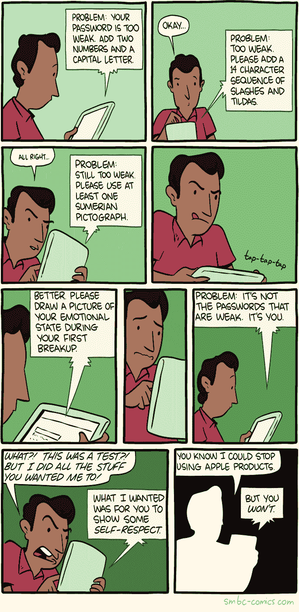

# 如何在 10 分钟内免费建立一个 VPN(以及为什么你迫切需要一个)

> 原文：<https://www.freecodecamp.org/news/how-to-set-up-a-vpn-in-10-minutes-for-free-and-why-you-urgently-need-one-12a6f63e5ddb/>

这里有三个值得你花时间的链接:

1.  如何在 10 分钟内免费建立一个 VPN(以及为什么你迫切需要一个)
2.  10 个 GitHub repos 新开发者提及最多( [3 分钟阅读](http://bit.ly/2nnt4CS))
3.  CSS 盒子模型解释为生活在一个无聊的郊区社区( [4 分钟阅读](http://bit.ly/2oq7zR5)

### 想到这一天:

> “电脑让你比人类历史上任何发明都更快地犯更多的错误——除了手枪和龙舌兰酒。”—米奇·拉特里夫

### 今日趣事:

网络漫画作者[周六早餐麦片](http://bit.ly/2nYcBHU)

### 今日学习小组:

圣克拉拉自由代码营

编码快乐！

–昆西·拉森，自由代码营的老师