# 如何使用 Google Analytics 设置和跟踪 YouTube 频道的表现

> 原文：<https://www.freecodecamp.org/news/how-to-set-up-and-track-youtube-channel-performance-with-google-analytics/>

管理 YouTube 频道是一项繁重的工作。它包括内容试验，这可以使或打破你的搜索引擎优化的有效性，为您的渠道。我们如何跟踪我们渠道的表现，看看什么在起作用？

*   [为什么 SEO 很重要？](#why-is-seo-important)
*   [SEO 对 YouTube 有多重要？](#how-is-seo-important-to-youtube)
*   [什么是谷歌分析？](#and-what-is-google-analytics)
*   如何连接我的频道？
*   我能看到什么？
*   我将看不到什么？
*   我还可以用 YouTube 和 Google Analytics 做些什么？

[https://www.youtube.com/embed/P8wv4ylc_-s?feature=oembed](https://www.youtube.com/embed/P8wv4ylc_-s?feature=oembed)

## 为什么 SEO 很重要？

SEO，或者说搜索引擎优化，是以一种谷歌这样的搜索引擎可以抓取并最终理解你的网站或 YouTube 频道的方式来编写和组织内容的实践。

使用这些信息，谷歌和其他公司用他们的算法做出决定，以确定哪些内容质量更高，更相关，更有可能首先回答你在他们的搜索引擎上寻找的问题。有了这些信息，搜索引擎会对这些内容进行排名，并显示按排名排序的结果。

## SEO 对 YouTube 有多重要？

就像任何其他网站一样，YouTube 会被谷歌和其他搜索引擎抓取。此外，YouTube 有自己的内部搜索，在决定如何显示 YouTube 搜索结果时，也会考虑这些因素。

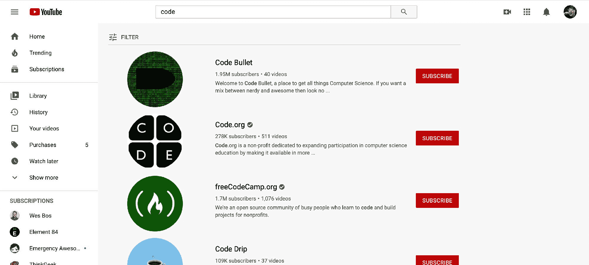

Searching for "code" channels on YouTube

这意味着，取决于你如何创建你的描述，管理你的关键词，或命名你的视频，它可以影响你的视频在结果中的排名。这可能会影响你的视频的浏览量。

这也适用于你的渠道。您有机会通过您的特色内容、您的渠道描述和您的渠道名称来体验有效性。

## 什么是谷歌分析？

谷歌分析是谷歌的一款免费分析工具，可以让你更好地了解你的流量。我之前写过[什么是谷歌分析以及你如何理解它](https://www.freecodecamp.org/news/making-sense-of-google-analytics-and-the-traffic-to-your-website/)，它提供了一个更深入的视角。因此，如果你想在深入研究之前了解更多，我强烈建议你从这里开始。

## 我如何连接我的频道？

### 设置新的跟踪代码

首先，我们需要从谷歌分析跟踪代码。谷歌有一些关于如何做到这一点的最新资源，所以我不打算在这里重复解释:

*   [设置新的属性](https://support.google.com/analytics/answer/1042508)
*   [获取您的跟踪 ID](https://support.google.com/analytics/answer/1008080?hl=en)

虽然有人说你可以使用你的网站的属性，并创建一个过滤视图，我建议从一个单独的属性开始。这样，您就不必担心任何数据交叉或设置复杂的过滤器。

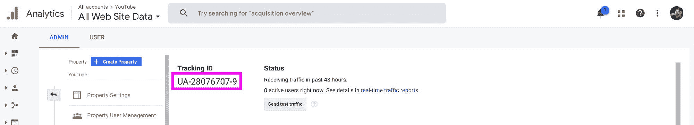

Tracking ID in Google Analytics

您的跟踪 ID 将采用以下格式:`UA-######-#`。一旦你有了，我们就可以开始了。

### 将您的跟踪代码添加到 YouTube

有几个步骤，我们必须通过导航找到我们可以设置我们的谷歌分析帐户。如果你想跳到正确的地方，你可以参观 youtube.com/advanced_settings。

为了走更长的路，这也将帮助你更熟悉你的 YouTube 帐户，首先从你的 **YouTube Studio** 页面前往**设置**部分。

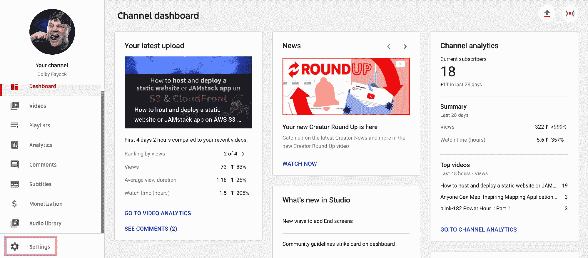

Finding Settings on your YouTube Studio dashboard

选中后，通过访问**频道**、**高级设置**找到**高级频道设置**链接，然后向下滚动到底部。

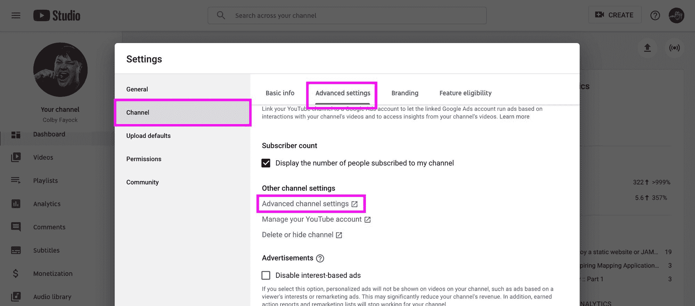

**Advanced channel settings** on YouTube

最后，再次向下滚动到页面底部，找到 **Google Analytics 属性跟踪 ID** 字段，输入您创建的跟踪 ID，然后点击保存。

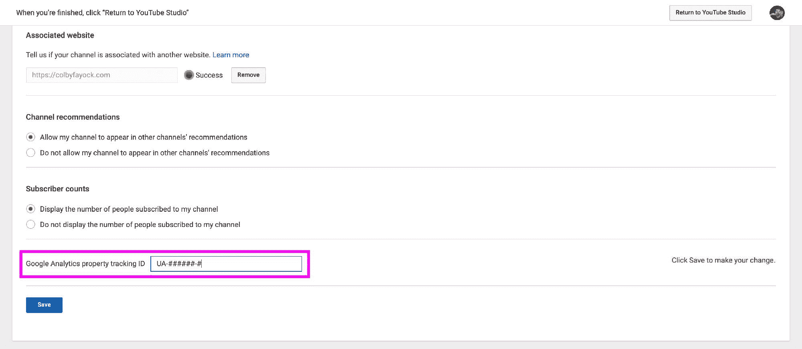

Setting the Google Analytics property tracking ID for your YouTube channel

### 坐下来等待

谷歌分析只会显示你的网站从建立之时到未来的流量。不幸的是，如果你当时没有设置谷歌分析，我们无法查看你的视频第一次传播的那个周末，但至少我们为下一次做好了准备！

Joey and Chandler reclining their chairs

也就是说，现在是时候继续在你的频道上努力工作了，因为当人们访问你的频道时，你有能力跟踪这种努力是如何得到回报的。

### 可选:设置站点搜索

设置 [Google Analytic 的网站搜索](https://support.google.com/analytics/answer/1012264?hl=en)功能，让我们可以轻松区分搜索使用情况，从而更容易了解人们如何搜索我们的频道。

为了启用网站搜索，我们想去我们的谷歌分析属性的**管理**部分，然后导航到**视图设置**。进入后，在底部的**站点搜索**设置下，首先点击按钮开启**站点搜索跟踪**，然后在**查询参数**输入中输入“查询”。

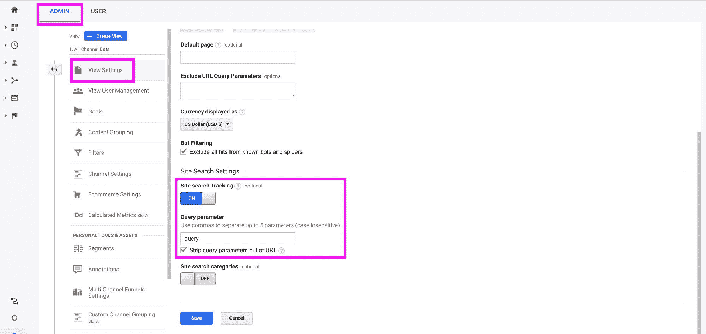

**Site search Tracking** in Google Analytics

可选地，尽管推荐，您可以选择从您的 URL 中去除查询参数。这意味着在你的主内容视图中，你会看到所有的流量都是/search，而不是/search？query=[keyword]，分析起来会比较繁琐。

*注意:在你设置之前，[通常建议你的酒店](https://www.e-nor.com/blog/google-analytics/best-practices-views-google-analytics)有一个以上的视图。我建议至少有两个视图，一个原始数据视图和主视图。您只需将站点搜索功能应用到您的主视图。这将有助于确保您可以随时看到未经过滤的原始数据视图。*

## 我能看到什么？

### 有多少人访问了我的频道？

当我们打开我们的 Google Analytics 属性时，我们立即得到的第一件事就是有多少人访问了我们的网站。

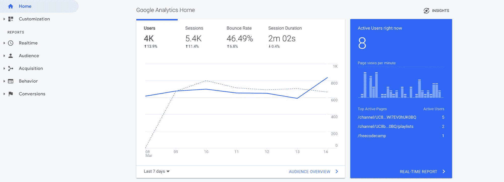

Google Analytics Home

这里的默认值是过去 7 天，但是您可以在面板的左下角更改时间范围。

这还提供了对自前一时期(在本例中是前 7 天)以来人数如何变化的快速洞察。正如我们在这里看到的，本周的人数增加了 13.9%，这对 freeCodeCamp 的 YouTube 频道来说是个好消息，证明了他们所做的一切都是有效的。

### 人们是如何找到我们的频道的？

那么，我们如何判断我们使用的策略(比如 SEO)是否有效呢？通过分析我们的有机搜索流量。

通过访问**采集**、**所有流量**，然后**源/媒体**，导航至**源/媒体**报告，我们可以看到哪些源为我们的 YouTube 频道提供了最多的流量。

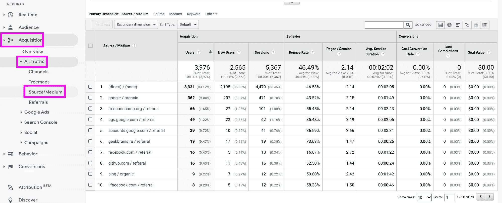

Source/Medium report in Google Analytics

通过点击 **google / organic** ，我们也可以看到这是如何随着时间的推移而变化的。

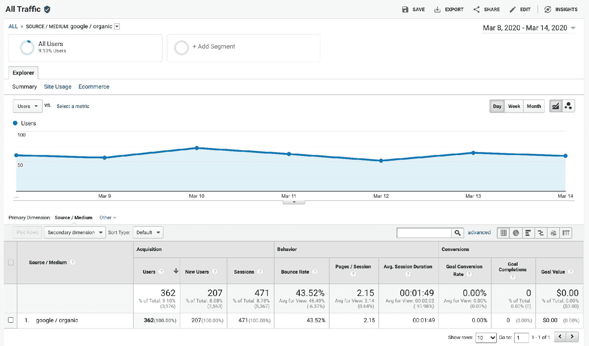

Organic Google traffic report in Google Analytics

虽然分析一个星期并不是最有效的，但是能够告诉你有机流量在几个星期内是如何变化的，将能够告诉你你的策略是否有效。

### 人们来自哪些网站和页面？

通过前往**收购**、**所有流量**，然后**转介**，导航至**转介**报告，我们可以看到 [freeCodeCamp YouTube](https://www.youtube.com/channel/UC8butISFwT-Wl7EV0hUK0BQ) 的大部分转介流量来自[freeCodeCamp.org](https://www.freecodecamp.org/)本身。

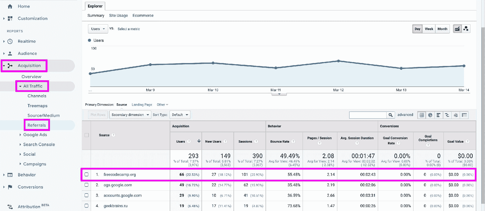

Referral traffic showing freecodecamp.org as highest referrer in Google Analytics

但是说我们想看那些推荐来自什么页面。我们可以通过点击上面视图中的**freecodecamp.org**链接找到答案，我们可以看到哪个页面给频道带来了最多的流量。

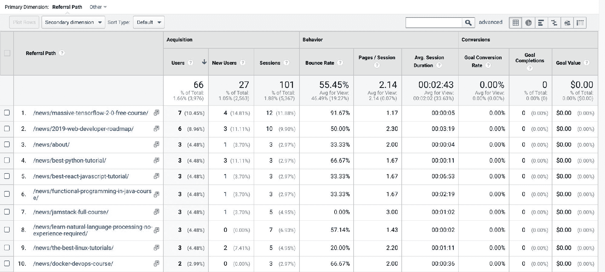

freecodecamp.org referral pages on Google Analytics

### 人们在我的频道上搜索什么？

在你的谷歌分析账户上设置了[网站搜索](https://support.google.com/analytics/answer/1012264?hl=en)后，你将能够更好地了解人们实际上是如何搜索你的网站的。

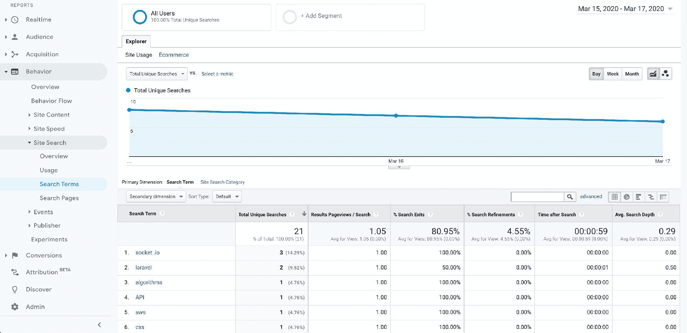

Search Terms report in Google Analytics

在这里，我们可以看到人们最想看到的关键词，这意味着我们可以根据这些关键词定制我们的内容和未来的视频，使我们的渠道更加有效。

### 更多见解

默认情况下，你会从谷歌分析中获得许多其他很酷的见解，比如你的访问者实际上在哪里，他们是通过桌面还是移动设备访问的。

要了解更多关于你能看到什么的信息，请查看我写的关于理解谷歌分析的文章。

## 我看不到什么？

虽然你将通过谷歌分析发现的信息很重要，但它并不包罗万象。有很多点你需要深入 YouTube 自己的分析工具才能看到。

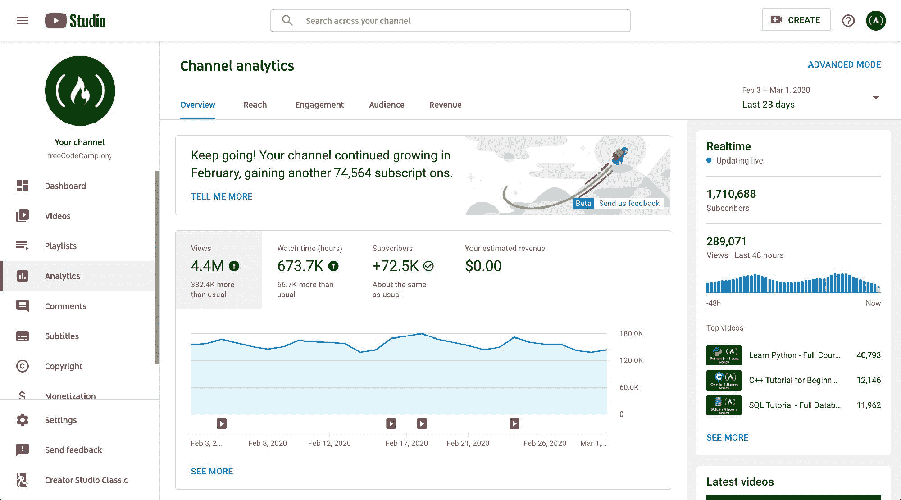

Analytics dashboard in YouTube Studio

### 视频分析

视频状态和动作将不会在谷歌分析中可见，包括播放、暂停和观看时间等内容。

然而，通过使用[YouTube Studio](https://studio.youtube.com/)**Analytics**部分中的**参与度**选项卡，我们可以看到人们观看我们视频的时间以及**观众保持率的图表。**这将帮助我们确定视频内容的表现。

### 订阅者

你将无法洞察你的频道上的访问者是如何订阅的。

好消息是，你可以通过访问 YouTube Studio 页面中的**分析**部分，然后点击顶部的**观众**标签来找到这一点。

### 深入 YouTube Studio Analytics

如果你仔细研究 YouTube Studio Analytics，你会发现很多东西。花时间浏览这两种分析报告解决方案，了解哪些信息对为您的渠道提供有影响力的体验最有用。

## 我还可以用 YouTube 和 Google Analytics 做什么？

### 跟踪从 YouTube 到您网站的链接

如果你在 YouTube 频道之外有一个网站，并在上面设置了 Google Analytics，你可以创建自定义 URL，让你在活动中看到你的 YouTube 流量。这不仅对 YouTube 有用，对任何其他你引导流量到你的网站的来源也有用。

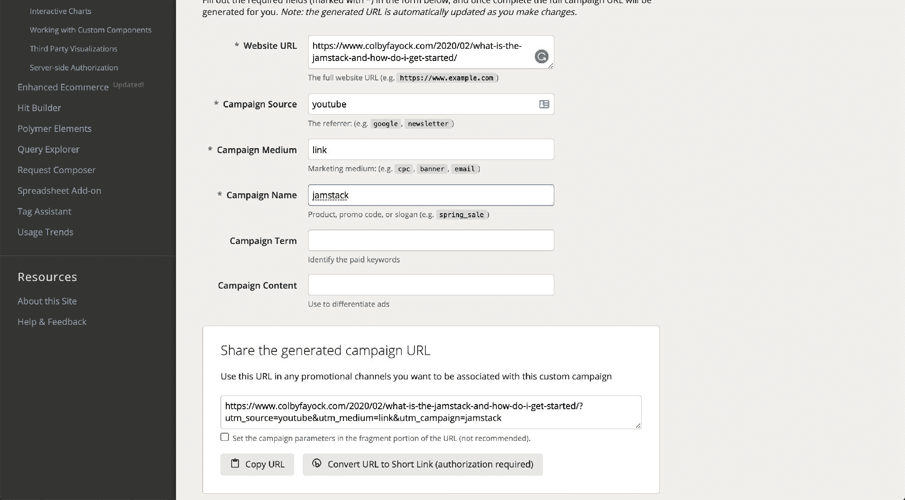

Building campaign URLs [Campaign URL Builder](https://ga-dev-tools.appspot.com/campaign-url-builder/)

Google Analytics 使用链接附带的 URL 参数来提供这一功能。你可以通过谷歌的分析帮助网站了解更多关于设置和你需要做什么的信息。

还应该注意的是，你并不真的需要用 Google Analytics 设置你的 YouTube 频道来使用这个功能。

### 跟踪视频嵌入网站后的观看情况

YouTube 提供了一个 [API](https://developers.google.com/youtube/iframe_api_reference) ，开发者可以用它来编写定制的 JavaScript，并跟踪给定网站上嵌入视频的使用情况。

利用这一点，我们可以根据时间参考或视频动作(如播放和暂停)发送自定义事件，以更好地了解我们网站上的视频是如何被使用的。

需要澄清的是，这仅适用于嵌入在您网站上的视频，并且可能会使用您网站的 Google Analytics 属性来跟踪使用情况，除非您另行配置。

查看 [YouTube iFrame 播放器 API](https://developers.google.com/youtube/iframe_api_reference) 了解更多信息。

### 几乎所有谷歌分析默认提供的东西

无论是更好地了解人们从哪里来，还是他们实际上在哪里，你都可以通过谷歌分析做很多事情。通过连接你的 YouTube 频道，你可以自动获得这些见解。

## 资源越多，你能获得的洞察力就越多

尽管 YouTube Analytics 和 Google Analytics 都有好处，但掌握更多信息最终会帮助你对如何管理频道和内容做出更好的判断。使用这些工具来帮助你成为 YouTube 上不可避免的明星！

*   [？在 Twitter 上关注我](https://twitter.com/colbyfayock)
*   [？️订阅我的 Youtube](https://youtube.com/colbyfayock)
*   [✉️注册我的简讯](https://www.colbyfayock.com/newsletter/)