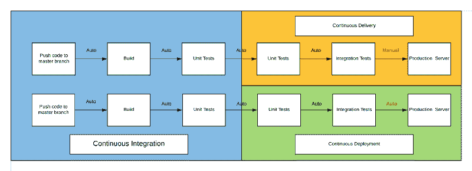
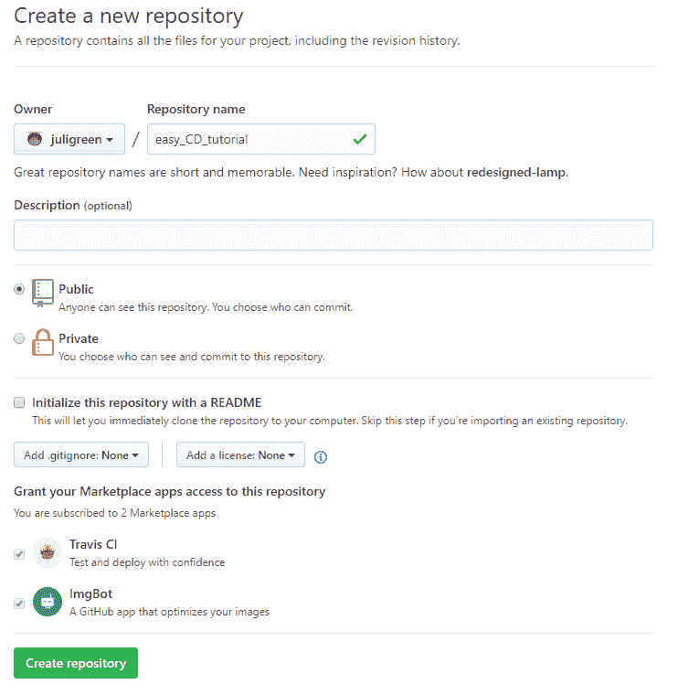
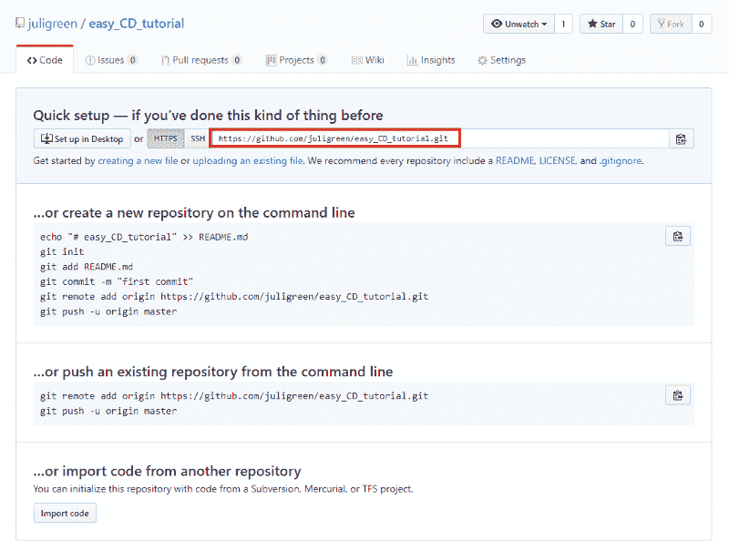
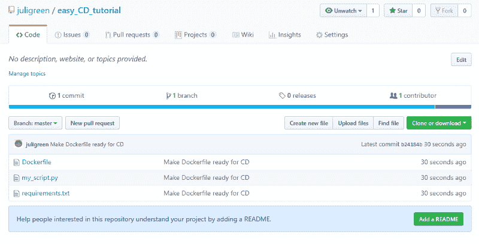
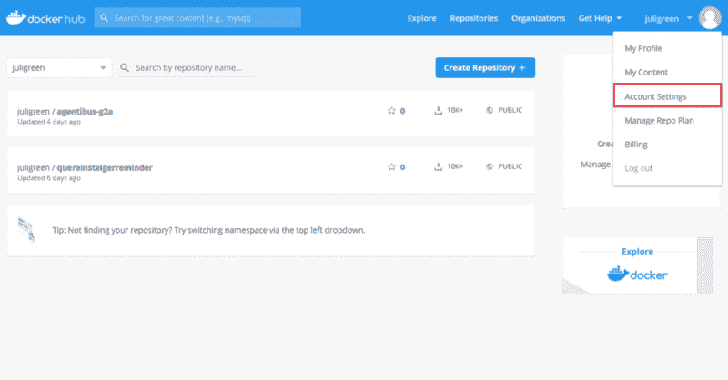
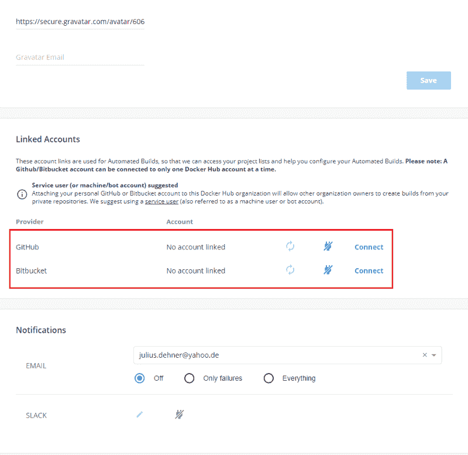
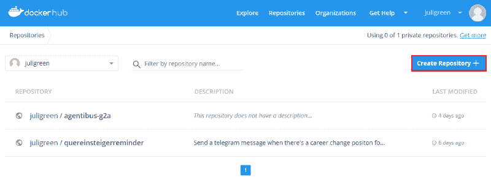
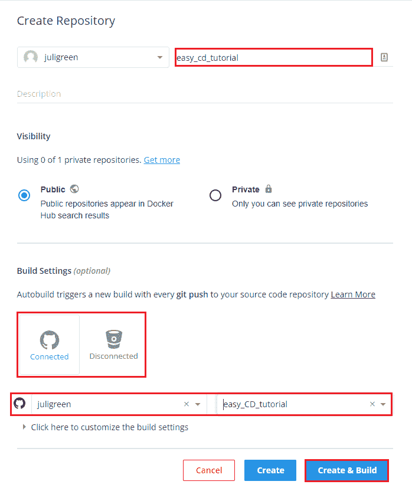

# 如何以最简单的方式在您的家庭项目中设置连续部署

> 原文：<https://www.freecodecamp.org/news/how-to-set-up-continuous-deployment-in-your-home-project-the-easy-way-41b84a467eed/>

由朱利叶斯

# 如何以最简单的方式在您的家庭项目中设置连续部署


Photo by [Sarah Phillips](https://unsplash.com/photos/KNfu_j6KSJI?utm_source=unsplash&utm_medium=referral&utm_content=creditCopyText)

持续部署是一件美好的事情。提交你的项目，看着它被构建和部署，而不需要做任何事情是令人着迷的。

在这篇文章中，我想告诉你如何在你的家庭项目中轻松地做到这一点。

为了澄清这一点，这里有一个流程图，展示了连续交付和连续部署之间的区别。



Continuous Delivery vs. Continuous Deployment

由于大多数时候除了你之外没有人依赖于你的家庭项目，我们将采用持续部署的工作流，因为你希望看到你的改变被立即部署。如果不是这样，您可以稍后更改工作流程。

您将了解以下内容:

*   如何制作 docker 文件
*   如何将你的项目推送到 GitHub
*   在 docker Hub 上自动构建 Docker 映像
*   用[瞭望塔](https://github.com/v2tec/watchtower)自动下载并运行图像

先决条件:

*   一些关于 Docker 和 Docker 文件的知识，不过我会在后面解释一些
*   安装了 git
*   A [坞站枢纽](https://hub.docker.com/)账户
*   运行 Docker 的(Linux)服务器(物理或虚拟)

作为参考，[这个](https://github.com/juligreen/easy_CD_tutorial)是示例 GitHub 库，[这个](https://hub.docker.com/r/juligreen/easy_cd_tutorial)是我将使用的示例 docker hub 库。

因此，本教程只有在你打算用 Docker 运行你的软件时才有用(我推荐 Docker，因为它非常棒)。

#### 为什么要用 Docker？

Docker 使您能够拥有相同的开发和生产环境，消除了 [Heisenbugs](https://en.wikipedia.org/wiki/Heisenbug) 和“它在我的机器上工作”的问题。此外，容器是隔离的，这给了我们安全的好处。
还有更多，但是这两个好处让我总是用 Docker 容器交付我的软件。

#### 设置您的 docker 文件

首先，我们将为项目创建一个 docker 文件。这个特殊的文件通常被称为“Dockerfile ”,没有扩展名，位于项目的顶层目录中。

Dockerfile 以`FROM`语句开始，该语句告诉 Docker 您希望从哪个基础图像开始。您可以将此想象为使用已经绘制了背景的画布，只缺少中心部分(您的程序)。
大多数时候，你想要提取的映像是你的编程语言的基础映像，你可以在前面提到的 [Docker Hub](https://hub.docker.com/) 找到。

接下来，我们用`COPY..`命令将项目文件复制到 docker 容器中。这是做什么的？

它从第一个目录中取出文件(点号指的是文件的当前目录，其中包括您的所有项目文件)并将其放入您的 docker 容器的当前目录中(记住您的 Docker 容器是它自己的 OS)。您的文件现在位于那里的基本目录中，您可能想要更改它。

接下来，我们需要安装依赖项，我将使用`python pip`来完成，但是任何等效的包管理系统都可以，这取决于您选择的语言。这里要学习的关键是如何使用 RUN 在容器中执行命令。

```
From python:3.7COPY . .RUN pip install -r requirements.txt
```

很简单，不是吗？现在我们必须在容器中开始我们的程序。

```
CMD ["python", "./my_script.py"]
```

CMD 语句是唯一的。每个 Dockerfile 文件都必须将它作为最后一行，因为它启动了容器中的主进程。

您已经完成了您的 docker 文件！您现在可以手动构建您的映像和容器，但是我们现在要跳过这一步。

现在，我们将在 GitHub 上创建我们的存储库，但是记住不要勾选“用 README 初始化这个存储库”。



然后，您需要复制远程 URL。



在项目的根目录中打开一个 cmd/shell。

您需要初始化您的 git 存储库，添加您的文件，配置遥控器，提交文件并将您的项目推送到 GitHub。

```
git initgit add *git remote add origin https://github.com/<user>/<repository>.gitgit commit -a -m "Make Dockerfile ready for CD"git push -u origin master
```

现在，你的 GitHub 库应该是这样的:



祝贺你，你已经完成了一半！

下一步是将 GitHub 连接到 Docker Hub。为此，你去帐户设置。



向下滚动并连接您的 git 主机。



立即在 docker hub 上创建您的存储库。



给 repo 起个名字，然后点击 GitHub 图标(或者 Bitbucket，如果你喜欢的话)。现在选择您的组织(通常是您的用户名)和项目名称。如果您想使用您的主映像进行构建，并始终保持最新状态，您现在可以单击“创建和构建”并观看为您构建的映像。否则，您必须编辑构建设置。



最后一步！现在你需要在你的目标机器上安装[瞭望塔](https://github.com/v2tec/watchtower)。
Watchtower 是一个提取你正在运行的 docker 映像并检查更新的程序。如果有任何更新，它会优雅地关闭原始容器，并使用相同的设置从新映像创建一个容器。

最棒的是我们还可以用 Docker 安装瞭望塔！

在您的终端中输入以下内容:

```
docker run -d --name watchtower -v /var/run/docker.sock:/var/run/docker.sock v2tec/watchtower
```

然后你需要为你的项目运行 Docker 容器！

```
docker run -d --name <my-project> <username>/<my-project>
```

“-d”选项使您的程序在后台运行，因此如果您关闭终端，程序不会关闭。

所以总结一下，如果你向你的 GitHub 库推送一个 commit，Docker hub 会自动为你构建一个 Docker 镜像。这个图像然后被瞭望塔提取，并使用所有原始选项运行。

如果你在任何时候需要帮助，不要害怕问，我很乐意帮忙。如果是技术问题， [GitHub 项目](https://github.com/juligreen/easy_CD_tutorial/issues)的问题就太棒了！

#### 但是测试呢？

好问题！您可以同时使用 Travis CI 来运行您的测试。
你可以在这里读到这个[，但是它的要点是，你添加另一个文件到你的存储库中，这个文件包含外部服务器执行单元测试的指令或者任何其他指令。](https://docs.travis-ci.com/user/tutorial/)

> 但是，如果我只想在测试通过的情况下构建我的 docker 映像，该怎么办呢？

这稍微打乱了我们的工作流程。我们现在不能再依赖 docker hub 来构建我们的图像了。取而代之的是，Travis CI 会生成图像，然后将其推送到 Docker Hub 存储库。在这里阅读这个[。](https://docs.travis-ci.com/user/docker/)