# 如何使用 CircleCI 在 30 分钟内设置到 AWS S3 的持续部署

> 原文：<https://www.freecodecamp.org/news/how-to-set-up-continuous-deployment-to-aws-s3-using-circleci-in-under-30-minutes-a8e268284098/>

亚当·瓦特

# **如何在短短 30 分钟内使用 CircleCI 设置到 AWS S3 的持续部署**

连续部署一开始可能看起来很复杂，但是不要被吓倒。在本教程中，我将向您展示如何在不到 30 分钟的时间内使用 CircleCI 为静态网站实现到 AWS S3 的持续部署。

你需要一个 AWS 账户和一个 CircleCI 账户。如果你还没有这些，先在这里为 AWS [和这里](https://aws.amazon.com/free)为 CircleCI】开一个免费账户。AWS 和 CircleCI 都有一个免费层，足以满足您对本教程的需求。

### 获取代码

首先，您将开始在 Github 上派生和克隆以下项目 repo:[S3 continuousdeploy](https://github.com/AWattNY/S3ContinuousDeploy)或者如果您喜欢，您可以使用您自己的 repo 之一来尝试本教程，只要它是一个静态站点。

接下来，您将把该项目添加到您的 CircleCI 帐户中。

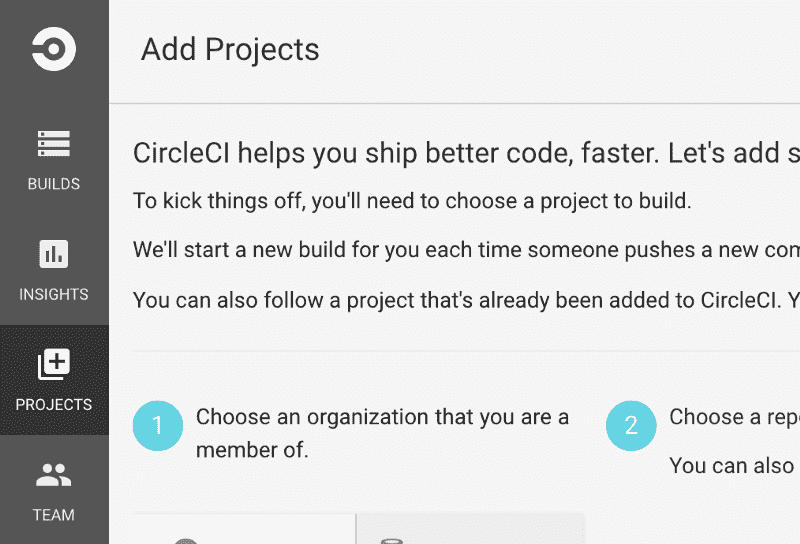

接下来选择您刚刚克隆的 S3ContinuousDeploy repo，并单击 build project。

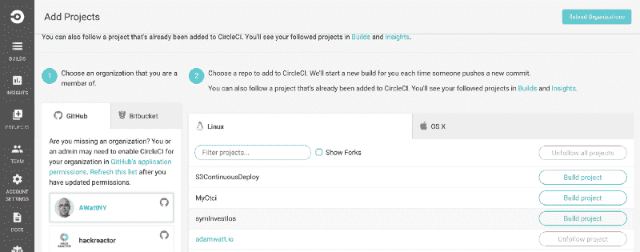

Choose the S3ContinuousDeploy repo and click build project

此时，构建将会运行，但是您将会收到一条错误消息，警告您无法检测到项目的设置。这很正常，因为我们没有 circle.yml 配置文件，这是您接下来要做的。

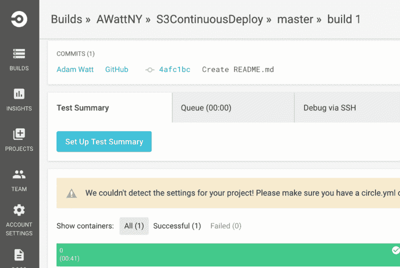

看看 CircleCI 上的文档，你就可以知道 circle.yml 应该是什么样子了。不幸的是，提供的 circle.yml 文件示例不能正常工作，需要做一些调整，所以让我们开始吧。

下面是您将使用的修改后的 circle.yml 文件:

基本上，CircleCI 在 Docker 容器中创建构建，我添加的 dependencies 属性下的 override(第 3 行)指示 CircleCI 安装 AWS 命令行接口(awscli ),该接口将在本例中使用，以帮助管理和简化到 AWS S3 的部署。

因此，请确保添加该文件并将其提交到您的 repo 中。最后，在继续下一步之前，确保您已经提交了这个和其他可能已经提交的内容。

根据 CircleCI 文档，部署命令为:

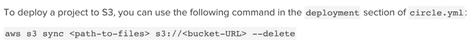

找出文件路径有点棘手，但是通过查看错误日志，我最终找到了正确的路径:home\ubuntu\projectName。所以只需将 projectName 替换为您的项目名称，在我的例子中就是 S3ContinuousDeploy。

另一方面，S3://bucket-URL 不正确，应该是 S3://bucket-Name。现在我们还没有一个桶名，所以让我们给自己找一个桶吧。

### 创建 S3 桶

在这一步中，我们将前往 AWS 控制台，为这个项目创建 S3 存储桶:

In Your Console go to Storage and then to S3

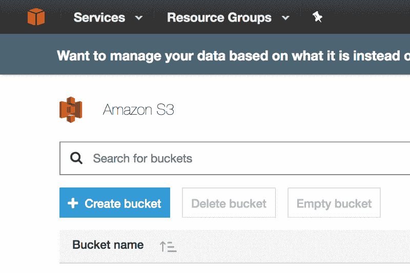

Press Create bucket

输入您希望用于此项目的时段名称以及区域。(最佳实践是使用离您站点的受众最近的区域。)

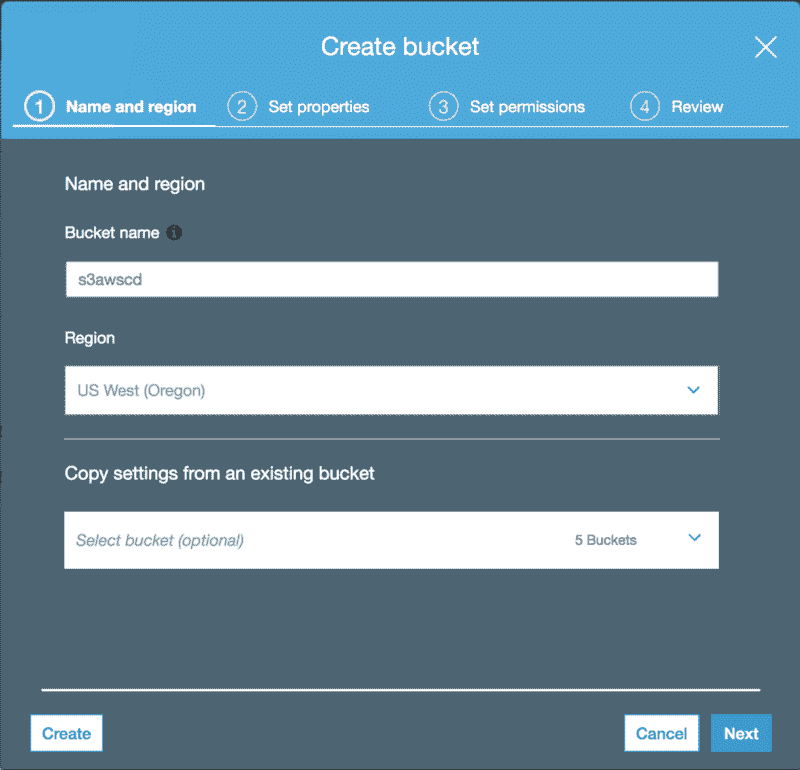

您现在将跳过其他步骤，因此请按“下一步”,然后在查看屏幕上按“创建存储桶”。

此时，如果您返回 CircleCI 并尝试再次运行构建，CircleCI 将返回一个致命错误:无法定位凭证。所以我们为什么不接下来解决这个问题。

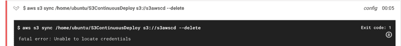

我们需要首先从 AWS 获取凭证，然后将它们提供给 CircleCI，以便允许 AWS cli 访问和管理 S3 存储桶。最佳实践是专门为 CircleCI 创建一个新的身份和访问管理(IAM)用户。

在 AWS 控制台上，转到安全、身份和合规，按 IAM，然后添加用户。

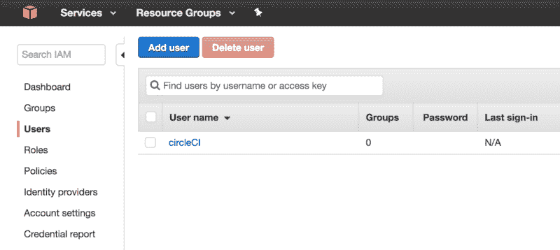

在“添加用户”窗口中，键入 CircleCI 作为用户名，我已经有了一个名为 CircleCI setup 的 IAM 用户，因此出于本教程的目的，为了说明这些步骤，我将使用 CircleCI2。确保检查访问类型的编程访问。

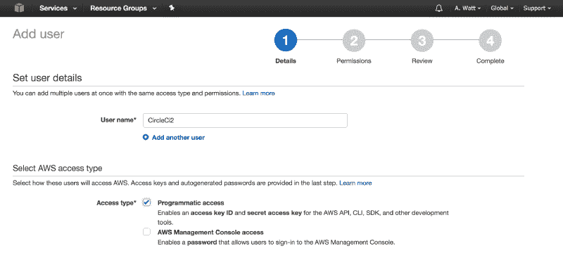

对于“权限”,选择“直接附加现有策略”,并在“策略名称”下选中“管理员访问”,然后单击“创建策略”。这将为您的 IAM 用户提供对您的 AWS S3 时段的完全访问权限。

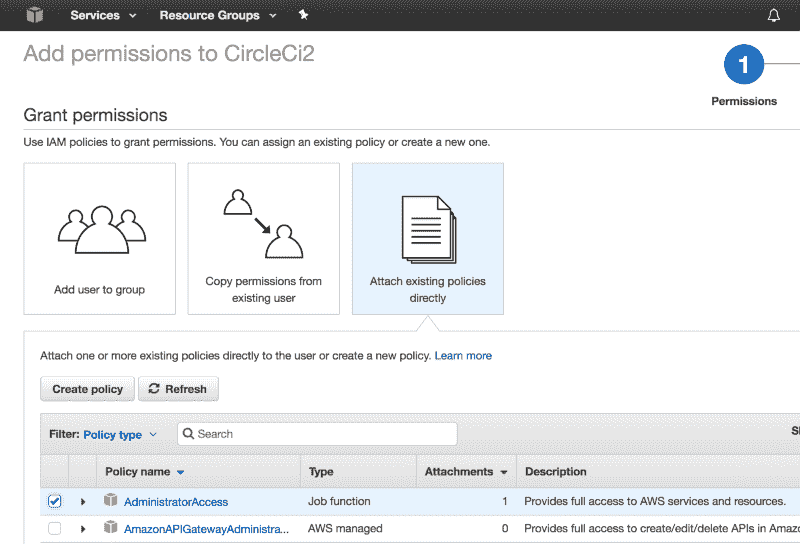

创建 IAM 用户后，请确保保存好访问密钥 ID 和秘密访问密钥，因为我们将在下一步中用到它们。

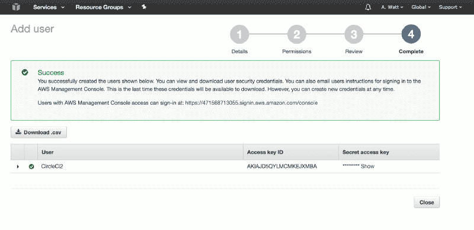

现在回到 CircleCI，点击项目名称旁边的设置按钮，显示项目设置菜单，然后点击 AWS 权限。您可以在这里粘贴上一步中的 ID 和密钥，然后单击“保存 AWS 密钥”

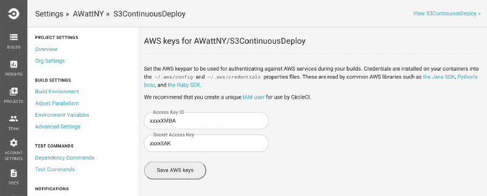

现在，我们的 CircleCI 容器既有 AWS 命令行界面工具，也有访问 AWS S3 存储桶的凭证。以下步骤将向您展示如何向世界展示您的静态站点。

在 AWS 控制台中，转到“Storage ”,然后单击“S3 ”,然后单击我们在本教程前面创建的存储区。

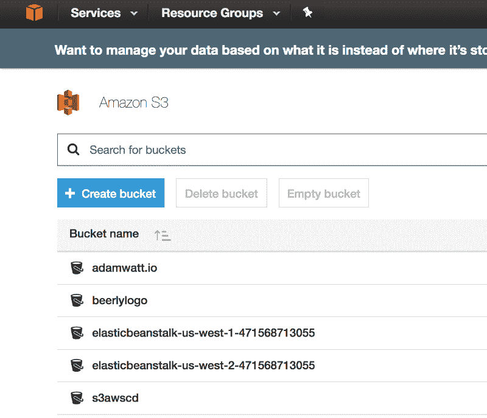

您会注意到来自 repo 的代码已经被成功部署。

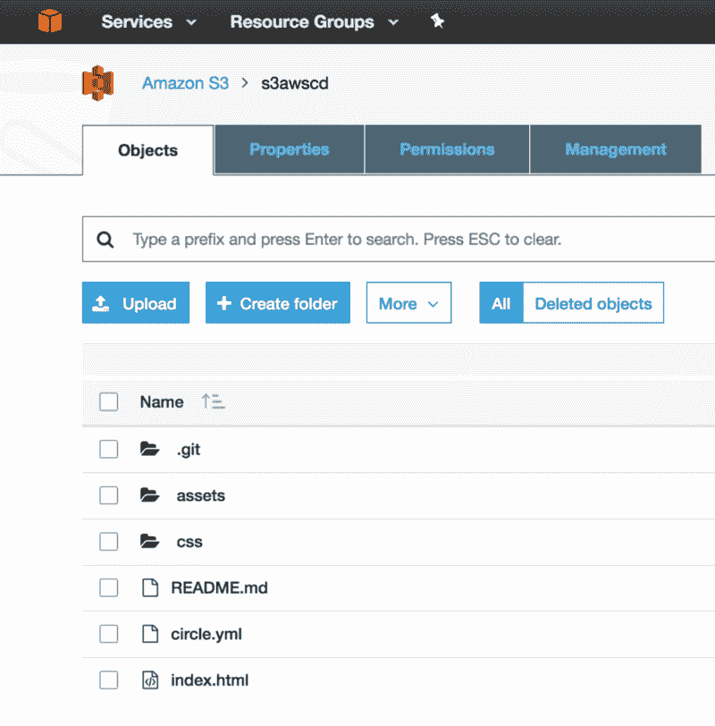

现在，在您可以访问这个静态网站之前，您需要配置您的网站托管 S3 桶。

在同一个屏幕上点击属性，然后在静态网站托管。

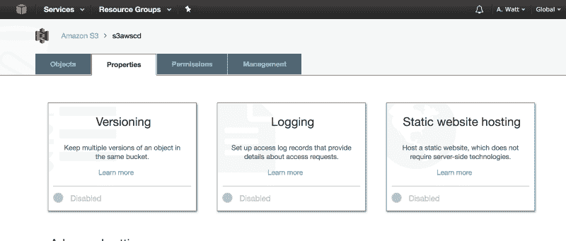

在下面的屏幕中，选择使用此桶来托管网站，并确保您在索引文档中键入 index.html。

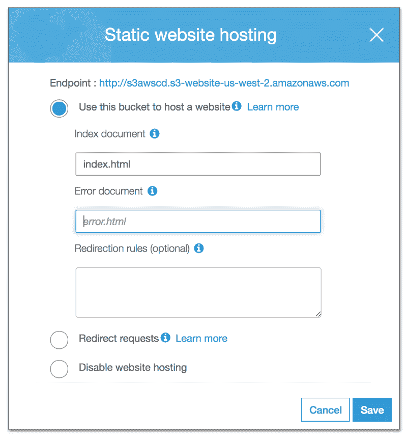

顺便说一下，上面提供的 HTTP 地址是您的访问端点。但是如果你在浏览器中尝试，不幸的是它不能工作，你会得到一个拒绝访问的错误信息。但这很正常，您还有一步要做:建立您的存储桶策略。

该存储桶策略将允许任何人通过浏览器访问 AWS S3 存储桶。

如果您想了解更多信息，您可以在此阅读关于木桶政策和示例的[。](http://docs.aws.amazon.com/AmazonS3/latest/dev/example-bucket-policies.html)

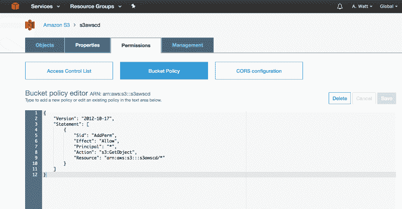

现在您可以复制上面的代码片段并将其粘贴到您的 Bucket 策略编辑器中，瞧！

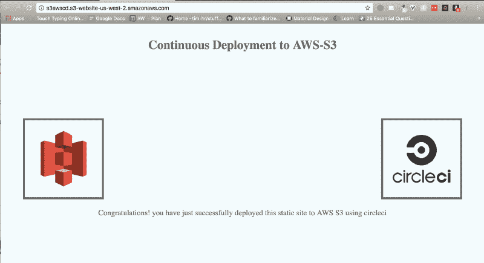

如果你看到上面的屏幕，那么恭喜你！您已经使用 CircleCI 成功设置了到 AWS S3 存储桶的连续部署。

现在，每当您将更改推送到 Github repo 时，CircleCI 会自动将更改部署到您的 AWS S3 存储桶。

您可能已经注意到，即使部署是成功的，CircleCI 也会向您显示红色的 NO TESTS 警告。

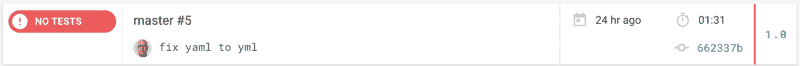

这是正常的，因为在测试驱动开发(TDD)环境中，您将首先编写测试，然后在进入生产之前，您的代码需要通过所有的测试。测试的例子超出了本教程的范围，但是可以说，如果我们编写了测试，CircleCI 只会在所有测试都通过的情况下部署。

使用您自己的域名访问这个静态站点也超出了本教程的范围，但是您可以随意查看这里的[以获得关于如何配置 Amazon Route 53 将互联网流量路由到您的新站点的说明。](http://docs.aws.amazon.com/Route53/latest/DeveloperGuide/setting-up-route-53.html)

我希望在将来的某个时候，做一个涉及持续集成/部署示例的教程，并进行一系列测试。同时，如果你有时间，在这里回答一个关于这个教程的简短调查[，在](https://goo.gl/forms/aJl610F4ltAvMDBv1) [LinkedIn](https://www.linkedin.com/pulse/how-set-up-continuous-deployment-aws-s3-using-circleci-adam-watt) 上点赞或者在评论区发表评论。

感谢阅读！