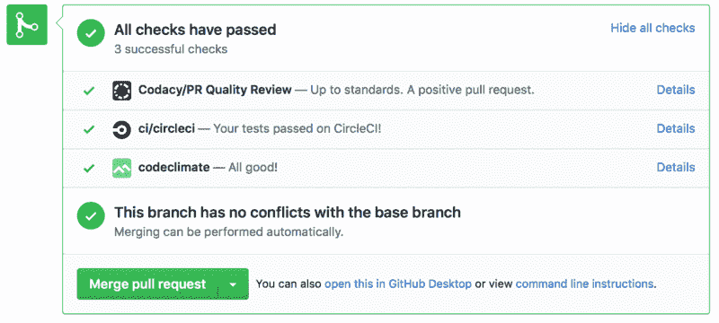
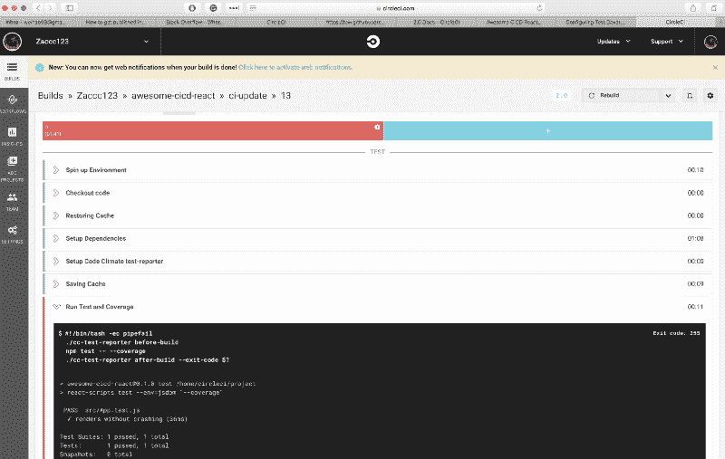
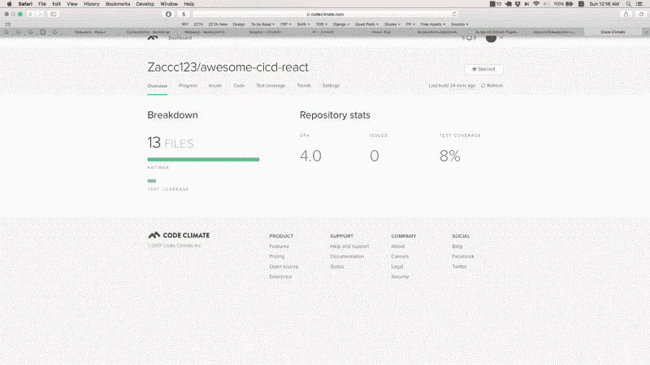
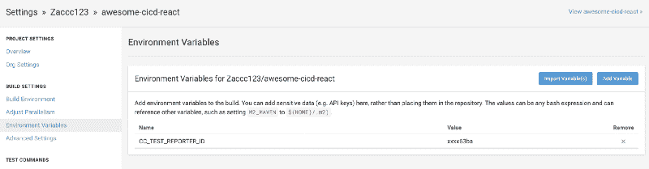
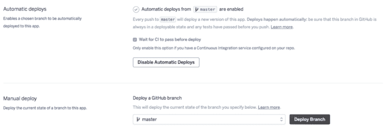

# 如何为您的 React 应用程序设置持续集成和部署

> 原文：<https://www.freecodecamp.org/news/how-to-set-up-continuous-integration-and-deployment-for-your-react-app-d09ae4525250/>

作者 Zac Kwan

# 如何为您的 React 应用程序设置持续集成和部署



建立一个 **React** 开发环境对于新手来说可能是令人困惑和畏惧的。你可能听过开发者谈论不同的软件包，比如**巴贝尔**、**网络包**等等，也是需要的(但这是有争议的)。

随着 React 越来越流行，有一些样板项目旨在帮助开发人员创建一个合适的 React 开发环境。 [**create-react-app**](https://github.com/facebookincubator/create-react-app) 是最流行的入门模板之一。

它旨在允许开发者创建一个零构建配置的 react 应用。

开发者再也不用担心`webpack`应该如何设置，应该用`babel`配置什么才能使用`es6`，或者使用哪个`linter`和`test`包。一切都会从盒子里出来。**是的，就是这么简单！**

对于需要管理底层配置的开发人员来说，它有一个`npm run eject`允许他们修改配置，做他们以前不能做的事情。唯一需要注意的是`eject`一旦运行，就无法逆转。

### React 的开发堆栈

我写了以下指南来帮助开发人员为他们的 React 应用程序构建一个**持续集成和持续部署堆栈。我们将使用 [**CircleCI**](https://circleci.com) ， [**CodeClimate**](https://codeclimate.com) **，**， **Heroku** 。如果你还没有上述任何服务的账户，请过来注册——它们是免费的！**

最后，我们将在 [Github Repo](https://github.com/Zaccc123/awesome-cicd-react) 中有一个 React 应用程序，它将在所有测试通过后自动将`*master*`分支上的任何更改部署到 [**Heroku**](https://heroku.com) 。[这里的](https://awesome-cicd-react.herokuapp.com)是已经部署的 **React** 网站的一个样本。

#### **我们开始吧！**

第一步是按照 [**create-react-app**](https://github.com/facebookincubator/create-react-app) 的指导创建一个新的 React app。执行以下操作:

```
$ npm install -g create-react-app$ create-react-app my-react-app$ cd my-react-app/$ npm start
```

那么浏览器应该会在[自动打开一个页面 http://localhost:3000/](http://localhost:3000/](http://localhost:3000/).) 。如果你看到一个**欢迎反应过来**页面运行，一切都好。

#### **CircleCI 设置**

接下来，我们需要为我们的项目添加一些配置来设置 [**CircleCI**](https://circleci.com) 。在该目录中创建一个`.circleci`文件夹和一个`config.yml`，并添加以下内容:

```
version: 2jobs:  build:    docker:      - image: circleci/node:8    steps:      - checkout      - restore_cache: # special step to restore the dependency cache          key: dependency-cache-{{ checksum "package.json" }}      - run:          name: Setup Dependencies          command: npm install      - run:          name: Setup Code Climate test-reporter          command: |            curl -L https://codeclimate.com/downloads/test-reporter/test-reporter-latest-linux-amd64 > ./cc-test-reporter            chmod +x ./cc-test-reporter      - save_cache: # special step to save the dependency cache          key: dependency-cache-{{ checksum "package.json" }}          paths:            - ./node_modules      - run: # run tests          name: Run Test and Coverage          command: |            ./cc-test-reporter before-build            npm test -- --coverage            ./cc-test-reporter after-build --exit-code $?
```

此设置适用于 [CircleCI 2.0](https://circleci.com/docs/2.0/) 。他们在 2018 年 8 月 31 日日落[圈 1.0](https://circleci.com/docs/1.0/) 。

`build`步骤建立了一个带有 Docker 图像的`node:8`。它要求`v6`或更高的职位才能工作。

在`steps`中，我们首先签出项目，从缓存中恢复(如果有的话)，然后安装依赖项。我们还安装了由 CodeClimate 提供的用于发送覆盖报告的工具`cc-test-reporter`。

然后我们根据 [CodeClimate 文档运行`before-build` 和`after-build` 命令之间的`test`。](https://docs.codeclimate.com/docs/configuring-test-coverage)这通知 CodeClimate 未完成的报告，当完成时，它或者发送报告或者发送失败状态。

#### **设置转到**

在 [**Github**](https://github.com) 中创建一个 repo，并执行以下操作:

```
$ git init$ git remote add origin git@github.com:username/new-repo-here$ git add .$ git commit -m “first commit”$ git push -u origin master
```

这将把我们创建的项目推送到 GitHub 中。

#### **构建并测试项目**

前往 [**CircleCI**](https://circleci.com) ，登录，并构建新创建的项目。在构建结束时，您应该在`Run Test and Coverage`上看到一个失败。



### **设置代码气候**

上述失败是因为我们还没有被授权向 CodeClimate 发布报告。所以，现在，前往 [**CodeClimate**](https://codeclimate.com) ，登录并构建已创建的 GitHub 项目。我们应该在分析结束时得到这个:



codeclimate analyse

为了解决 CircleCI 问题并使用`Test Coverage`反馈，我们将需要`Test Reporter ID`。这可以在`Settings > Test Cover`年龄标签中检索到。复制 t `he Test Reporter` ID，不与任何人共享。

在 [**CircleCI**](https://circleci.com) 中，导航到带有 c `opied Test Repor` ter ID 的`Project > Settings > Environment va` riable an `d add CC_TEST_REPOR` TER_ID。



### **Heroku 部署设置**

为了在 [**Heroku**](https://heroku.com) 上部署 React，我们将使用 [buildpack](https://github.com/mars/create-react-app-buildpack) 。请执行以下操作:

```
$ heroku create REPLACE_APP_NAME_HERE — buildpack https://github.com/mars/create-react-app-buildpack.git$ git push heroku master$ heroku open
```

我们用`git push heroku master`把最新的`master`分支推到了`heroku`。最后会打开一个网页，显示**欢迎反应**页面。

接下来，我们将不得不在 [**Heroku Dashboard**](https://dashboard.heroku.com/apps) 中导航到新创建的应用程序，以设置自动化部署。在仪表板上执行以下操作:

*   转到**部署**选项卡，然后**将**连接到正确的 GitHub repo。
*   **启用**自动展开**检查**T0。



enable automatic deployment

### 我们完成了！

只需几个步骤，我们就可以准备好全自动持续集成和部署套件。现在，随着每个提交被推送到 [**GitHub**](https://github.com) ，它将发送一个触发器到 [**CircleCI**](https://circleci.com) 和 [**CodeClimate**](https://codeclimate.com) 。一旦测试通过，如果它在主分支上，它也将被自动部署到 [**Heroku**](https://heroku.com) **。**

查看样本回购 [**此处**](https://github.com/Zaccc123/awesome-cicd-react) 和已部署网站 [**此处**](https://awesome-cicd-react.herokuapp.com) ！

### 结论

这是我大约一年前的[帖子](https://medium.com/@Zaccc123/https-medium-com-zaccc123-continuous-integration-and-deployment-setup-for-react-app-7b5f4bd76cdd)的更新。CircleCI 的使用已经更新到`2.0`，我们也使用`CodeClimate`更新的`cc-test-reporter`。如果对迁移感兴趣，可以看看[拉取请求](https://github.com/Zaccc123/awesome-cicd-react/pull/3)。

### 感谢阅读！如果你喜欢，请点击？？？

我喜欢阅读和写作关于技术和产品的文章，尤其是与提高开发人员的生产力相关的文章。你可以在我的[推特](https://twitter.com/Zaccc123)或者我的[博客](https://zackwan.app)上向我问好。