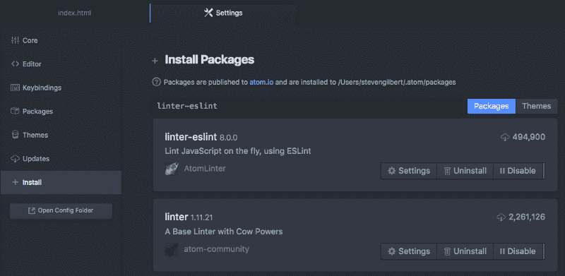
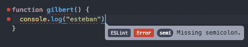

# 如何在 Atom 中设置 ESLint 以便为开源做出贡献

> 原文：<https://www.freecodecamp.org/news/how-to-set-up-eslint-in-atom-to-contribute-to-freecodecamp-3467dee86e2c/>

史蒂文·吉尔伯特

如果你想为像 freeCodeCamp 这样的开源项目做贡献，首先你需要建立林挺。

大多数项目都有自己的 JavaScript 风格标准，这些标准将由林挺工具自动执行，如****。****

**让我们设置 ESLint 在最流行的代码编辑器之一的 Atom 中运行。**

**在我们开始之前，这里有一个快速提示，我做了一些假设:**

*   **你已经遵循了[自由代码营的贡献指南](https://github.com/FreeCodeCamp/FreeCodeCamp/blob/staging/CONTRIBUTING.md#setup-linting)中写着**设置林挺的部分。****
*   **因此，您已经安装了必要的**先决条件**(特别是 Node.js 和 npm)。**
*   **你至少对使用**命令行**和 **git** 有了基本的了解。**
*   **您正在使用 [Atom](https://atom.io/) 作为文本编辑器(尽管这篇文章应该是有用的，即使您不是——您只需要检查您的[文本编辑器的](http://eslint.org/docs/user-guide/integrations)文档以获得关于 ESLint 的说明)**

### **林挺到底是什么？**

> **"**林挺**是运行一个程序来分析代码潜在错误的过程."— [在堆栈溢出时编码](https://stackoverflow.com/questions/8503559/what-is-linting)**

**而 **ESLint** 是一个针对 JavaScript 代码的*林挺工具*。您使用 ESLint 来查找用 JavaScript 编写的有问题的代码(“错误”)。**

**顺便说一下，ESLint 名字中的“ES”来自“ECMAScript”，这是核心 JavaScript 语言的官方名称。**

**想象一下你的祖母告诉你如何生活。她指出你的错误并告诉你去改正。你听奶奶的，因为奶奶知道。**

**这些“错误”可能是*客观的*，这意味着它们是由不符合比如说 JavaScript(或者你是林挺的任何编程语言)语法的代码引起的。通过这种方式，你可以说 linter 正在发现语法错误。**

**我说“客观错误”是因为这些错误是 JavaScript 本身固有的。如果你在变量声明的末尾遗漏了一个分号，根据 JavaScript 的作者，这在客观上是一个错误——即使它不会阻止你的程序运行(见[自动分号插入](https://stackoverflow.com/questions/2846283/what-are-the-rules-for-javascripts-automatic-semicolon-insertion-asi))。**

**或者这些错误可能是*主观的*，这意味着*你已经*(而不是[技术委员会 39](https://www.ecma-international.org/memento/TC39.htm) ，ECMAScript 的标准主体)定义了一套你的代码应该遵循的规则。这些编码规则通常总结在一个 **JavaScript 风格指南**中，这是一个声明某种编码最佳实践的文档。自由代码营和许多其他软件项目都使用风格指南。**

**Airbnb 的 [JavaScript 风格指南](https://github.com/airbnb/javascript)是最受 JavaScript 开发者欢迎的之一，自由代码营的风格指南就是基于它。**

**遵循风格指南的目的是拥有一个“编写标准”,项目开发人员可以遵循该标准来保持代码的整洁、简单和一致。这类似于 [**美联社样本**](https://en.wikipedia.org/wiki/AP_Stylebook) 记者跟随的概念。唯一的区别是 AP Stylebook 是英语语法的风格指南，而 Airbnb 的风格指南是 JavaScript 的。**

**一旦你明确了应该如何为你的软件项目编写代码(也就是说，你选择了一个风格指南或者创建了一个你自己的)，你就准备好为 ESLint 建立你的*林挺规则*。**

**ESLint 的工作方式是你告诉它应该知道什么规则(也就是说，你把你的风格指南规则转换成*林挺规则*)和应该注意什么，这样 ESLint 就可以拍拍你的肩膀，让你知道你写了什么有问题的代码。**

**为了告诉 ESLint 你的林挺规则，你在一个名为`.eslintrc`或`eslintConfig`或`package.json`的[配置文件](http://eslint.org/docs/user-guide/configuring)中配置它们，ESLint 会自动寻找并读取它。随着你的开发，ESLint 会警告你不遵守这些规则的问题代码，这样你就可以在编码时进行修改。就像让奶奶和你一起编程一样。**

**ESLint 的亮点在于其“*被设计成完全可配置的，这意味着你可以关闭所有规则，只运行基本的语法验证，或者混合搭配捆绑的规则和你的定制规则，使 ESLint 完美适合你的项目*换句话说，你可以混合搭配客观和主观规则。**

**谈到 JavaScript 林挺工具，你有[种选择](https://www.sitepoint.com/comparison-javascript-linting-tools/)，但是在本文中我们关注 ESLint，因为自由代码营在其贡献指南中指定了它。它在其他地方也被广泛使用。**

**当谈到 JavaScript 风格指南时，您还有[选项](http://noeticforce.com/best-javascript-style-guide-for-maintainable-code)。Airbnb 是一个很好的熟悉的网站，因为在撰写本文时，它在 GitHub 上拥有超过 [45，000 颗星，并且使用量还在增长。](https://github.com/airbnb/javascript)**

### ****为免费代码营设置林挺****

**安装 ESLint 有两种方式:[全局和本地](https://www.npmjs.com/package/eslint)。我们将集中在本地安装它**，这意味着你的本地工作目录，也就是你的自由代码库克隆库。****

****1:在你的文本编辑器中打开你的自由代码库克隆(假设你已经将自由代码库克隆到你的计算机上)****

****2:在终端中，`cd`(改变目录)到你的自由代码营目录****

****3:在终端中键入`npm install eslint --save-dev`****

****4:在你的 Atom 文本编辑器中，进入**首选项**>**；>Insta**ll>g**t；并在搜索包搜索框中键入 Li**enter-eslint****

********

****注意:您也可以使用`apm`命令从命令行安装 Atom 包。参见[这些说明](https://github.com/AtomLinter/linter-eslint)中的示例。****

****5:安装**棉绒垫**和**棉绒垫**。****

****6:在你的自由代码营目录中，关闭掉任何一个`<filename&`gt；。js 文件，然后重新打开****

****现在，下一次你写 JavaScript 时，你应该会看到 ESLint 在工作！****

********

****注意:我遗漏了一个重要的步骤:**配置 ESLint** ，也就是你定制 ESLint 并告诉它你的林挺规则的部分。我这样做是因为当你克隆自由代码营的库时，它*已经*带有 ESLint 配置文件，例如，参见`eslintrc`和`package.json`。因此，您不需要自己进行任何配置。****

****如果您从事的项目需要配置 ESLint，我会向您推荐以下链接:****

*   ****[配置 ESLint](http://eslint.org/docs/user-guide/configuring) 。****
*   ****[开始使用 ESLint v1.0 版](http://devnull.guru/get-started-with-eslint/)****
*   ****[npm，eslint](https://www.npmjs.com/package/eslint)****
*   ****Airbnb 的[可扩展共享 ESLint 配置](https://github.com/airbnb/javascript/tree/master/packages/eslint-config-airbnb)****

****总结一下:****

1.  ****林挺是检查有问题代码的过程。****
2.  ****ESLint 就是这样一个执行林挺的工具。****
3.  ****ESLint 可以成为一个很好的学习工具，因为它迫使你写出干净、一致的代码，并养成良好的编码习惯。****
4.  ****许多开源项目要求您运行 ESLint。****
5.  ****你应该在你的文本编辑器中设置 ESLint 来为自由代码营做贡献。****
6.  ****如果您没有使用 Atom，请查看您的[文本编辑器的](http://eslint.org/docs/user-guide/integrations)文档，了解如何安装 ESLint。****
7.  ****坚持到底。****

****如果你有问题，你可以发微博给我，地址是 [@gilbertginsberg](https://twitter.com/gilbertginsberg) 或者通过 [GilbertIndex](https://goo.gl/DgxjEj) 找到我。****