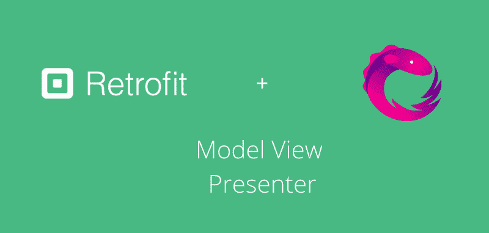
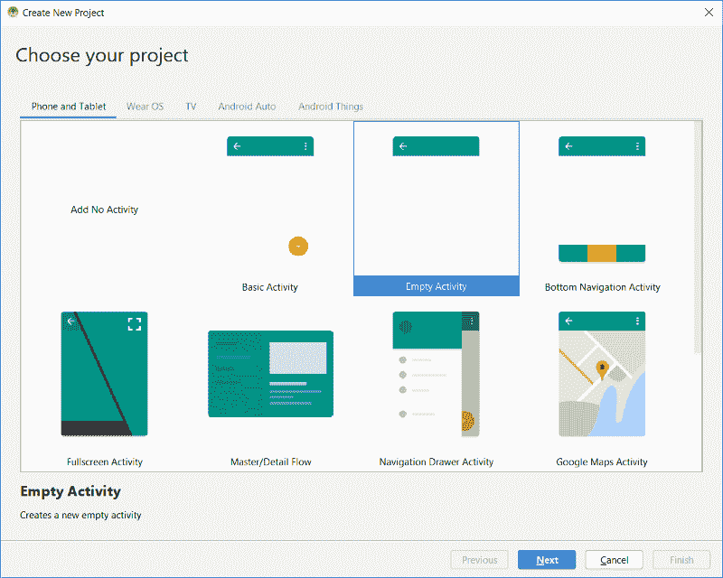

# 如何在您的 Android 应用程序中设置联网

> 原文：<https://www.freecodecamp.org/news/how-to-set-up-networking-in-your-android-app-with-retrofit-rxjava-mvp-108e7153521a/>

作者:阿尤施·贾恩

# 如何在您的 Android 应用程序中设置联网



> 本文原帖[此处](https://ayusch.com/networking-with-retrofit-rxjava-mvp)

在这篇 android 应用程序开发教程中，我将演示如何在 Android 应用程序和 MVP 架构中设置 retrieval 和 RxJava 进行联网。

我们将开发一个非常简单的应用程序，它将在 recyclerview 中显示一些数据。数据将从托管在[https://jsonplaceholder.typicode.com](https://jsonplaceholder.typicode.com)的假 JSON API 中获得。该应用程序将在三列中显示数据，即 ID、标题和正文。

以下是本教程的先决条件:

*   [如何在 Android 中实现 MVP 架构](https://ayusch.com/mvp-architecture-android/)
*   [了解 RxJava 基础知识](https://ayusch.com/understanding-rxjava-basics)

一旦你完成了以上两项，你就准备好继续这篇文章了。我将此分为 4 个阶段:

*   设置项目和建筑布局。
*   设置 MVP 架构。
*   正在为 RecyclerView 的数据和适配器创建模型类。
*   使用 retreate 和 RxJava 设置网络。

所以，让我们开始吧！

> 注:一些[网校](http://microverse.org)如 Udemy 和 Lynda 也有很好的 RxJava 教程

### 阶段 1:设置项目和建筑布局。

#### 创建新项目

在 android studio 中创建新项目。进入文件->新建项目，选择 ****“清空活动”。然后点击**** 完成。



#### **添加回收视图**

若要将 recyclerview 添加到项目中，请打开应用程序级别的 build.gradle 文件，并在底部添加以下依赖项:

```
implementation 'com.android.support:design:28.0.0'
```

> *注意:你也可以直接添加 recyclerview 而不是整个设计库，但是你们大多数人可能已经包含了它，所以我在这个例子中包含了设计库。您也可以只包含 recyclerview。*

现在转到主布局文件，在我的例子中是 activity_main.xml，并在根布局中添加一个 recyclerview:

```
<?xml version="1.0" encoding="utf-8"?>
<LinearLayout xmlns:android="http://schemas.android.com/apk/res/android"
    xmlns:app="http://schemas.android.com/apk/res-auto"
    xmlns:tools="http://schemas.android.com/tools"
    android:layout_width="match_parent"
    android:layout_height="match_parent"
    tools:context=".UserActivity">

    <android.support.v7.widget.RecyclerView
        android:id="@+id/recyclerview"
        android:layout_width="match_parent"
        android:layout_height="match_parent" />

</LinearLayout>
```

#### 正在生成回收查看项目

现在让我们开始构建 RecyclerView 行。在这里，我们只关心我们的 Android 应用程序的架构，以及如何改造，RxJava 和 MVP 架构可以协同工作，所以不要抱怨 UI 的外观:p。你肯定可以继续美化它。

我们将创建一个非常简单的三列布局。第一列显示项目的 ID，第二列显示标题，最后，第三列显示正文/描述。

转到 res->layout，右键单击布局文件夹。新建一个 ****“布局资源文件”。**** 随便你怎么命名，在我这里我就命名为 ****recycler_item。****

要创建三列布局，请添加一个 LinearLayout 作为根。然后添加三个 textviews，分别将它们的宽度设置为 0，权重设置为 1，2，3。这将把屏幕的整个宽度按 1:2:3 的比例分成 3 列。

以下是您的布局外观:

```
<?xml version="1.0" encoding="utf-8"?>
<LinearLayout xmlns:android="http://schemas.android.com/apk/res/android"
    android:layout_width="match_parent"
    android:layout_height="wrap_content"
    android:layout_marginTop="16dp"
    android:orientation="horizontal">

    <TextView
        android:id="@+id/user_id"
        android:layout_width="0dp"
        android:layout_height="wrap_content"
        android:layout_weight="1"
        android:gravity="center"
        android:padding="4dp"
        android:text="id" />

    <TextView
        android:id="@+id/user_title"
        android:layout_width="0dp"
        android:layout_height="wrap_content"
        android:layout_weight="2"
        android:gravity="center"
        android:padding="4dp"
        android:text="Title" />

    <TextView
        android:id="@+id/user_body"
        android:layout_width="0dp"
        android:layout_height="wrap_content"
        android:layout_weight="3"
        android:gravity="center"
        android:padding="4dp"
        android:text="Body" />

</LinearLayout>
```

同样，由于这不是一个设计教程，用户界面可能看起来不太漂亮，所以你可以随意定制？

现在布局都完成了，我们可以按照 MVP 架构来设置我们的 android 应用程序了。还是那句话，如果你不是真的熟悉 MVP，我强烈建议你看看这里:[Android 中的 MVP 架构](https://ayusch.com/mvp-architecture-android/)。

### 阶段 2:建立 MVP 架构

#### 创建合同

许多人喜欢将他们的视图和演示界面保存在不同的文件中，但是根据 Google 建议的准则，我喜欢创建一个名为 **Contract** 的外部接口(包装器),然后将我的视图和演示界面放在其中。

这样做的好处是，您不必为与单个活动相关联的视图和演示者查看不同的文件，所有这些都在一个地方。这就是我喜欢它的方式，但也可以随意探索其他技术。

现在让我们创建一个 UserActivityContract。创建一个名为**“contract”的新包。**在这个包中，创建一个新的 Java 接口 UserActivityContract。

在 **UserActivityContract** 中，添加两个嵌套接口:View 和 Presenter。这是你的合同最后的样子:

```
public interface UserContract {
    interface View {

    }

    interface Presenter {

    }

}
```

现在让我们给这些添加一些方法。让我们先谈谈视图，我们将在视图中做 3 件主要的事情:

*   recyclerview 的初始设置(添加布局管理器)。
*   使用从 API 获得的用户列表从 recyclerview 创建适配器。
*   出现错误时显示一些错误信息。

因此，让我们为其中的每一个添加一个方法:

```
public interface UserContract {
    interface View {
        void init();

        void showError(String message);

        void loadDataInList(List<User> users);
    }

    interface Presenter {

    }

}
```

接下来，我们来说说主讲人。presenter 惟一真正的任务是从 API 获取数据，并将其发送给视图。因此，添加一个方法 **loadUsers()** 我们将在这里进行 API 调用，如果成功，将结果传递给 view，否则将显示一条错误消息。

```
public interface UserContract {
    interface View {
        void init();

        void showError(String message);

        void loadDataInList(List<User> users);
    }

    interface Presenter {

        void start();

        void loadUsers();
    }

}
```

注意，除了 loadUsers()，我们还添加了一个名为 **start()，**的方法，这更像是 presenter 的初始化方法。你可以在这里执行各种初始化任务，比如初始化一些变量，调用一个视图方法来显示一些初始化消息等等。这里我用它来初始化我的 UserActivity.java 类中的 Recyclerview。

#### 创建演示者和实现视图

一旦完成了接口，就该实现它们了。

创建一个名为 UserPresenter 的新类并实现 UserContract。演示者并实现所需的方法。

现在，打开您的 UserActivity.java 类并实现接口 UserContract。查看并实现所有需要的方法。在活动中为演示者添加一个字段，并在 onCreate 中初始化它，如下所示:

```
mPresenter = new UserPresenter(this);
mPresenter.start();
```

这将调用我们的演示者的构造函数，并将视图和演示者绑定在一起。当我们调用 presenter 上的 start 方法时，presenter 反过来调用 init()方法，这将启动我们的初始化过程。

至此，我们完成了项目的**二期**。现在让我们进入**阶段 3** ，创建我们的模型类和一个自定义适配器，将数据绑定到 recyclerview。

### 阶段 3:为 RecyclerView 的数据和适配器创建模型类

#### 创建模型

让我们继续创建我们的模型，它将是我们数据的 POJO 类。如果仔细观察 JSON 响应，它由 4 个字段组成:id、userId、title 和 body。所有这些都在一个 JSON 对象中。和许多这样的 JSON 对象。所以，这是一个非常简单的 POJO 类。

但在此之前，让我们为 GSON 添加一个依赖项，它将用于解析 JSON 响应。将下面一行添加到依赖项中:

```
implementation 'com.squareup.retrofit2:converter-gson:2.4.0'
```

> *注意:这不是真正的 GSON 依赖，这是一个使用 GSON 与 JSON 之间进行序列化的转换器。*

现在，创建一个名为 **model** 的包，并在其中创建一个名为 **User** 的 java 文件。添加四个字段，并用 **@SerializedName** 注释每个字段。现在让我们为字段创建 getters 和 setters。Android Studio 会自动为您完成这项工作，只需按下键盘上的 ALT+INS 并选择 getters 和 setters。

这是您的 POJO 类最终的样子:

```
public class User{

   @SerializedName("id")
   private int id;

   @SerializedName("title")
   private String title;

   @SerializedName("body")
   private String body;

   @SerializedName("userId")
   private int userId;

   public void setId(int id){
      this.id = id;
   }

   public int getId(){
      return id;
   }

   public void setTitle(String title){
      this.title = title;
   }

   public String getTitle(){
      return title;
   }

   public void setBody(String body){
      this.body = body;
   }

   public String getBody(){
      return body;
   }

   public void setUserId(int userId){
      this.userId = userId;
   }

   public int getUserId(){
      return userId;
   }

   @Override
   public String toString(){
      return 
         "User{" + 
         "id = '" + id + '\'' + 
         ",title = '" + title + '\'' + 
         ",body = '" + body + '\'' + 
         ",userId = '" + userId + '\'' + 
         "}";
      }
}
```

> *注意:toString 方法是可选的。我喜欢包含它，因为在打印日志语句时，它会打印格式化的 json。*

### 正在创建 RecyclerView 适配器

现在让我们创建 recyclerview 适配器。创建一个名为 adapter 的包，并在其中创建一个名为**CustomAdapter.java**的新 Java 类。从 RecyclerView 扩展该类。适配器类。它会显示一个错误，只需按 ALT+Enter 并覆盖所有需要的方法。

在**CustomAdapter.java**内部创建一个名为 MyViewHolder 的嵌套类，并从 recycle view . viewmolder 扩展它，然后创建一个构造函数并初始化所有的文本视图，如下所示:

```
public class CustomAdapter extends RecyclerView.Adapter<CustomAdapter.MyViewHolder> {

    public CustomAdapter(List<User> userList) {

    }

    @Override
    public MyViewHolder onCreateViewHolder(ViewGroup parent, int viewType) {

    }

    @Override
    public void onBindViewHolder(MyViewHolder holder, int position) {

    }

    @Override
    public int getItemCount() {
        return userList.size();
    }

    public class MyViewHolder extends RecyclerView.ViewHolder {

        TextView tvId, tvTitle, tvBody;

        public MyViewHolder(View itemView) {
            super(itemView);
            tvId = (TextView) itemView.findViewById(R.id.user_id);
            tvTitle = (TextView) itemView.findViewById(R.id.user_title);
            tvBody = (TextView) itemView.findViewById(R.id.user_body);
        }
    }

}
```

我们将把一个用户列表传递给这个适配器，我们将在**构造函数**中完成这项工作。因此，首先创建一个字段 **List < Us** er >，然后创建一个构造函数，它将 List < User >作为它的参数。现在，将 field 属性设置为在构造函数中获得的属性。

当您重写这些方法时，您会得到 onCreateViewHolder。在该方法中，我们将放大 recyclerview 项的布局，并从中返回一个视图容器。转到 onCreateViewHolder 并添加以下代码:

```
@Override
public MyViewHolder onCreateViewHolder(ViewGroup parent, int viewType) {
    View view = LayoutInflater.from(parent.getContext()).inflate(R.layout.recycler_item, parent, false);
    return new MyViewHolder(view);
}
```

现在，在 **onBindViewHolder** 中，我们将数据绑定到我们的视图。这是最终适配器的样子:

```
public class CustomAdapter extends RecyclerView.Adapter<CustomAdapter.MyViewHolder> {

    List<User> userList = new ArrayList<>();

    public CustomAdapter(List<User> userList) {
        this.userList = userList;
    }

    @Override
    public MyViewHolder onCreateViewHolder(ViewGroup parent, int viewType) {
        View view = LayoutInflater.from(parent.getContext()).inflate(R.layout.recycler_item, parent, false);
        return new MyViewHolder(view);
    }

    @Override
    public void onBindViewHolder(MyViewHolder holder, int position) {
        holder.tvTitle.setText(userList.get(position).getTitle());
        holder.tvId.setText(userList.get(position).getId()+"");
        holder.tvBody.setText(userList.get(position).getBody());
    }

    @Override
    public int getItemCount() {
        return userList.size();
    }

    public class MyViewHolder extends RecyclerView.ViewHolder {
        TextView tvId, tvTitle, tvBody;
        public MyViewHolder(View itemView) {
            super(itemView);
            tvId = (TextView) itemView.findViewById(R.id.user_id);
            tvTitle = (TextView) itemView.findViewById(R.id.user_title);
            tvBody = (TextView) itemView.findViewById(R.id.user_body);
        }
    }

}
```

### 第 4 阶段:用 retreate 和 RxJava 建立网络

这就是我们 android 应用的症结所在。这就是你们来这里的目的，所以让我们开始吧。

我将我们项目中的网络设置分为 4 个部分:

*   创建改装适配器。
*   建立一个 API 服务接口来定义我们的端点。
*   创建一个 NetworkingUtil 类来绑定适配器和服务。
*   创建一个实用程序类来进行 API 调用并将结果返回给演示者。

那么，我们开始吧。

#### 创建改装适配器

创建一个名为“networking”的包，在 networking 内部，创建另一个名为“adapter”的包(这是我喜欢的我的包管理方式，绝不是推荐的做事方式，但它如此适合我+1)。

在该包中，创建一个名为 RetrofitAdapter 的类。在本课程中，我们将定义以下内容:

*   将 JSON 响应解析成 POJO 类的转换器工厂。
*   呼叫适配器工厂。
*   基本 URL。

让我们从在顶部添加一个 **BASE_URL** 开始。将基础 URL 设置为 https://jsonplaceholder.typicode.com 的

现在，创建一个 Gson 的静态实例，并在顶部进行改造。现在，创建如下所示的同步方法，并添加以下代码。我来解释这是怎么回事:

```
public static synchronized Retrofit getInstance() {

    if (retrofit == null) {
        if (gson == null) {
            gson = new GsonBuilder().setLenient().create();
        }

        retrofit = new Retrofit.Builder()
                .baseUrl(BASE_URL)
                .addConverterFactory(GsonConverterFactory.create(gson))
                .addCallAdapterFactory(RxJavaCallAdapterFactory.create())
                .build();

    }

    return retrofit;
}
```

我们正在创建一个翻新的单例实例，如果实例已经创建，我们只需返回它，否则我们创建一个新的。

为了创建一个新的实例，我们使用了改进。Builder()方法。我们将基本 URL 设置为在顶部声明的 URL，将转换器工厂设置为 Gson，它将为我们解析 JSON 响应，并从 RxJava 2 添加一个调用适配器工厂。

> 现在，你可能会问什么是呼叫适配器？因此，一个调用适配器基本上是一个工具，它管理改造的执行和响应处理。当客户端收到来自服务器的响应时，它对用户来说毫无意义，因为它是以字节为单位的。所以调用适配器将这些字节转换成有意义的 java 对象。
> 
> *想了解更多关于呼叫适配器的信息，看看这篇牛逼的文章:[https://futurestud . io/tutorials/retrofit-2-introduction-To-call-adapters](https://futurestud.io/tutorials/retrofit-2-introduction-to-call-adapters)*

由于我们添加了 **RxJavaCallAdapter** 工厂，它将我们的响应包装成 **RxJava** 类型。

这是我们的**RetrofitAdapter.java 级**完成后的样子:

```
public class RetrofitAdapter {

    private static Retrofit retrofit;
    private static Gson gson;
    private static final String BASE_URL = "https://jsonplaceholder.typicode.com";

    public static synchronized Retrofit getInstance() {

        if (retrofit == null) {
            if (gson == null) {
                gson = new GsonBuilder().setLenient().create();
            }

            retrofit = new Retrofit.Builder()
                    .baseUrl(BASE_URL)
                    .addConverterFactory(GsonConverterFactory.create(gson))
                    .addCallAdapterFactory(RxJavaCallAdapterFactory.create())
                    .build();

        }

        return retrofit;
    }

}
```

#### 创建 API 服务

现在，我们将创建一个接口来定义我们的 URL 端点。

在网络包中创建一个名为 API 的包。在 API 内部，创建一个名为 UserService.java 的 Java 接口

在我们非常简短的例子中，我们将只调用一个端点，所以我们只有一个方法。您可以调用许多不同的端点，如登录、注册、注销等

添加一个方法声明 **getUsers()** 并用请求类型(GET 或 POST)对其进行注释，并传递端点。

这就是你的界面最后的样子。注意，我们在最后返回了一个**类型的**可观察值**列表**。我们的 RxJava 调用适配器负责从服务器的响应中创建一个可观察对象。

```
public interface UserService {

    @GET("/posts/")
    Observable<List<User>> getUsers();

}
```

#### 绑定适配器和服务

我们需要将适配器类绑定到服务。为此，在 networking 包中创建一个 utils 包，并创建一个名为 **NetworkingUtils 的新类。**

创建一个静态 userService 实例和一个将返回 UserService 单一实例的方法。

这是你的**网络图符**最后的样子:

```
public class NetworkingUtils {

    private static UserService userService;

    public static UserService getUserApiInstance() {
        if (userService == null)
            userService = RetrofitAdapter.getInstance().create(UserService.class);

        return userService;
    }

}
```

#### 创建实用程序类来进行 API 调用

我在互动器里见过有人这么做。Interactor 只是你的 MVP 架构中的另一层——有些人喜欢包含它，有些人不喜欢。在一些项目中，你会发现数据管理者而不是交互者。这完全取决于你的个人需求/偏好，但是我个人不喜欢使用交互器(就像我不喜欢 JS :P 一样)，所以我在这里创建了一个 **UserTask** 。

但是在创建这个类之前，让我们创建一个自定义回调类，我们可以用它来接收错误和结果。在根包中，创建一个名为 callback 的包，并在这个包中创建一个名为 Callback 的接口。它将包含两个方法，一个用于结果，另一个用于错误。这是它看起来的样子:

```
public abstract class Callback<T> {
    public abstract void returnResult(T t);
    public abstract void returnError(String message);
}
```

在根包中，创建一个名为 **utils** 的包。在这个包中创建一个名为 UserTask 的 java 类。这个类将负责进行 API 调用并将结果返回给 presenter，它将根据我们得到的结果显示结果或错误。

如果你不熟悉 RxJava，我强烈推荐你看一下这里:[了解 RxJava 基础知识](https://ayusch.com/understanding-rxjava-basics/)。

我已经解释了观察和订阅是如何工作的以及他们的角色是什么。一旦你经历过，你就可以走了。

在我们的 **onNext** 方法中，我们将返回结果，在 onError 中，我们将返回错误。

这是 UserTask.java 课堂最后的样子:

```
public class UserTask {

    public static void getUsers(final Callback<List<User>> callback) {
        NetworkingUtils.getUserApiInstance()

                .getUsers()
                .observeOn(AndroidSchedulers.mainThread())
                .subscribeOn(Schedulers.io())
                .subscribe(new Observer<List<User>>() {
                    @Override
                    public void onSubscribe(Disposable d) {

                    }

                    @Override
                    public void onNext(List<User> users) {
                        callback.returnResult(users);
                    }

                    @Override
                    public void onError(Throwable e) {
                        callback.returnError(e.getMessage());
                    }

                    @Override
                    public void onComplete() {

                    }
                });
    }

}
```

### 收尾工作

工作的主要部分已经完成，我们现在剩下的是将结果从 presenter 传递到视图，并为 RecyclerView 设置适配器。

为此，转到**UserPresenter.java**类，在 loadUsers 方法中，调用 **UserTask.getUser()** 并提供一个返回结果或错误的回调。

在 returnResult 方法中，我们将调用 **mView.loadDataInList()** 方法，传递成功获取的用户列表。在 returnError 方法中，我们将调用 **mView.showError()** 方法，如果有错误，该方法将显示错误。至此，我们的演示者类就完成了，下面是最终的样子:

```
public class UserPresenter implements UserContract.Presenter {
    UserContract.View mView;

    UserPresenter(UserContract.View mView) {
        this.mView = mView;
    }

    @Override
    public void loadUsers() {
        UserTask.getUsers(new Callback<List<User>>() {
            @Override
            public void returnResult(List<User> users) {
                mView.loadDataInList(users);
            }

            @Override
            public void returnError(String message) {
                mView.showError(message);
            }
        });
    }

    @Override
    public void start() {
        mView.init();
    }

}
```

在**UserActivity.java**中，在 loadDataInList 方法中，实例化我们的 customAdapter 并将其设置为 recyclerview，在 showError 方法中，只显示一条 toast 消息。这是我们的 UserActivity.java 最后的样子:

```
public class UserActivity extends AppCompatActivity implements UserContract.View {

    private UserContract.Presenter mPresenter;
    private RecyclerView recyclerview;
    CustomAdapter adapter;

    @Override
    protected void onCreate(Bundle savedInstanceState) {
        super.onCreate(savedInstanceState);
        setContentView(R.layout.activity_main);
        mPresenter = new UserPresenter(this);
        mPresenter.start();
    }

    @Override
    public void init() {
        recyclerview = findViewById(R.id.recyclerview);
        RecyclerView.LayoutManager manager = new LinearLayoutManager(this);
        recyclerview.setLayoutManager(manager);
        mPresenter.loadUsers();
    }

    @Override
    public void loadDataInList(List<User> users) {
        adapter = new CustomAdapter(users);
        recyclerview.setAdapter(adapter);
    }

    @Override
    public void showError(String message) {
        Toast.makeText(this,message,Toast.LENGTH_LONG).show();
    }

}
```

### 结论

这就是你如何设置你的 android 应用程序，使之能与 retrieval、RxJava 和 MVP 架构协同工作。如果你有任何建议，请在下面的评论区告诉我，或者发邮件给我，我会尽快回复？


喜欢你读的书吗？别忘了在[](https://www.facebook.com/AndroidVille)****Whatsapp****LinkedIn**上分享这个帖子。**

***你可以在 [LinkedIn](https://www.linkedin.com/in/ayuschjain) 、 [Quora](https://www.quora.com/profile/Ayusch-Jain) 、 [Twitter](https://twitter.com/ayuschjain) 和 [Instagram](https://www.instagram.com/androidville/) 上关注我，在那里我**回答与**移动开发相关的**问题，尤其是 Android 和 Flutter** 。***

*****如果您想了解所有最新文章，请在本页右上角的表格中输入您的电子邮件地址，订阅每周简讯。*****