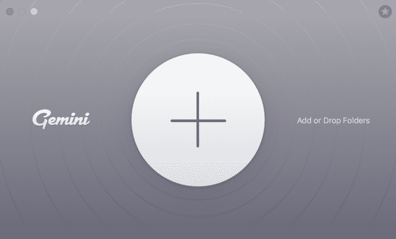
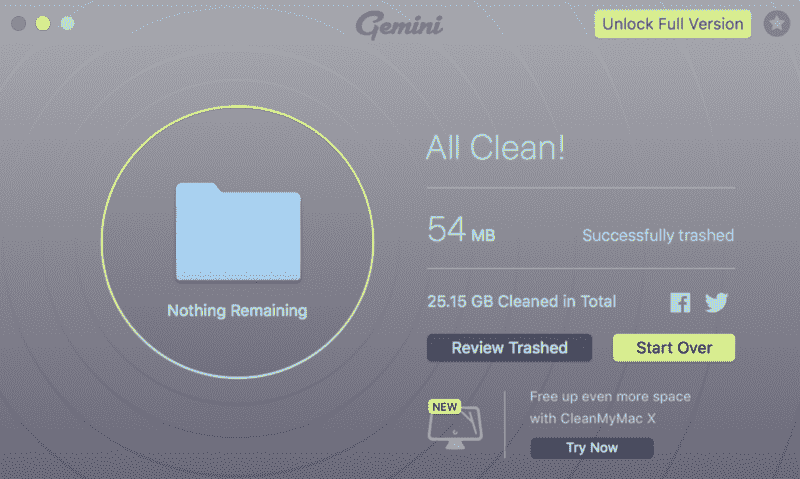
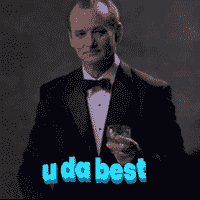
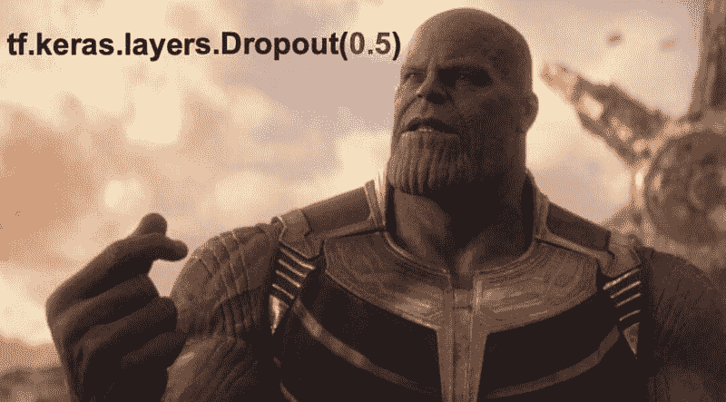
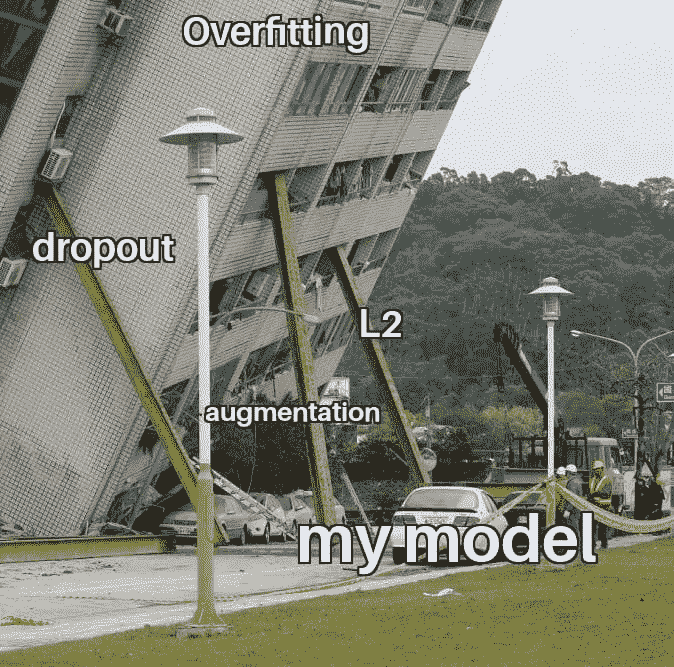
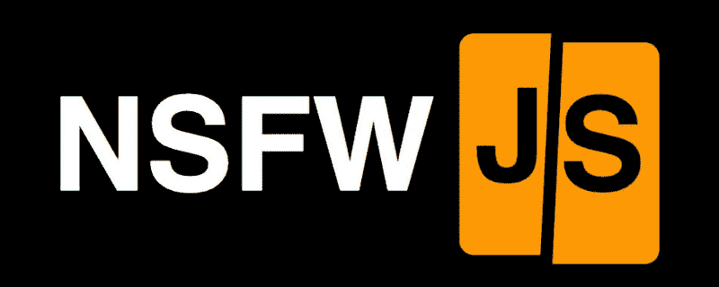
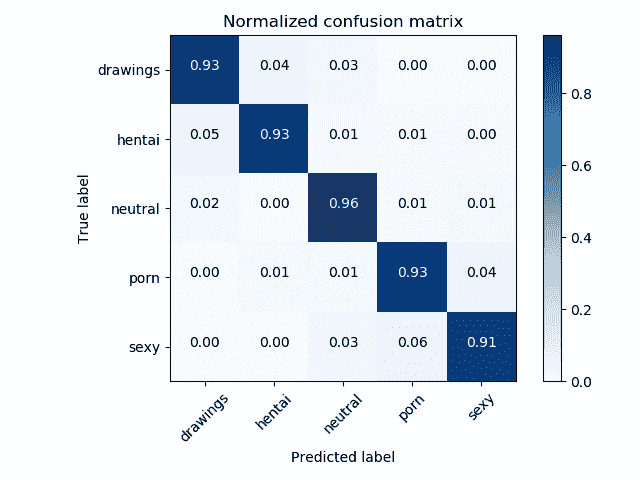
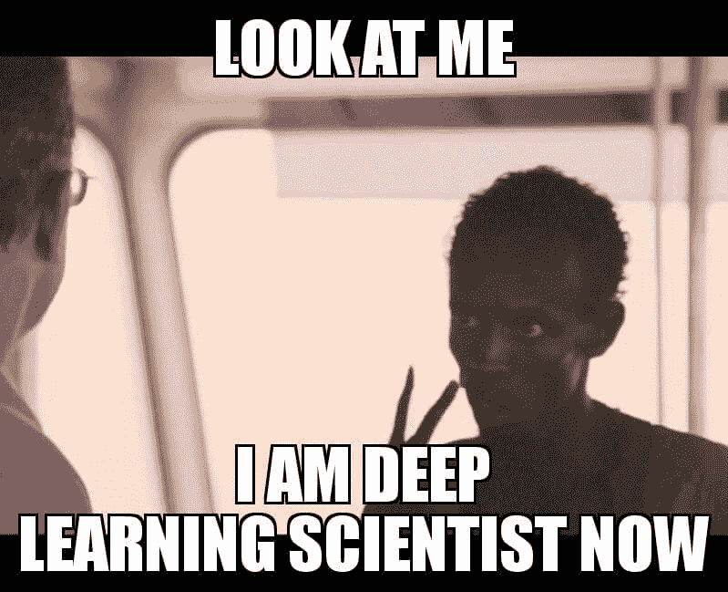
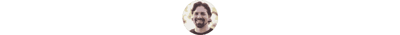

# 如何使用机器学习设置 NSFW 内容检测

> 原文：<https://www.freecodecamp.org/news/how-to-set-up-nsfw-content-detection-with-machine-learning-229a9725829c/>

回想起来，教一台机器识别不良内容并不困难，但第一次确实很难。

这里有一些经验教训，以及我在构建 NSFW 模型时发现的一些技巧和诀窍。

虽然有很多方法可以实现这一点，但这篇文章的目的是提供一个友好的叙述，以便其他人可以理解这个过程是什么样子的。

如果你是 ML 新手，这将启发你训练一个模型。如果你熟悉它，我很想听听你是如何构建这个模型的，并请你分享你的代码。

### 计划是:

1.  获取大量的数据
2.  标记并清理数据
3.  使用 Keras 和迁移学习
4.  完善您的模型

### 获取大量的数据

幸运的是，为 NSFW 数据集发布了一套非常酷的抓取脚本。代码很简单，已经带有标记的数据类别。这意味着只要接受这个数据抓取器的默认设置，我们就可以从数百个子数据中抽取出 5 个类别。

指令非常简单，你可以简单地运行 6 个友好的脚本。注意他们，因为你可能会决定改变一些事情。

如果您想要添加更多的子条目，您应该在运行步骤 1 之前编辑源 URL。

> 例如，如果您要添加一个新的中立示例源，您需要添加到`nsfw_data_scraper/scripts/source_urls/neutral.txt`中的子编辑列表中。

Reddit 是网络上一个很好的内容资源，因为大多数的子编辑都被人为地控制在这个子编辑的目标上。

### 标记并清理数据

我们从 NSFW 数据刮刀得到的数据已经被标记了！但是会有一些错误。尤其是因为 Reddit 并不是完美的策划。

复制也很常见，但是不需要缓慢的人类比较就可以修复。

我首先想运行的是`duplicate-file-finder`,它是最快的精确文件匹配和删除程序。它由 Python 驱动。

[**/Qarj**](https://github.com/Qarj/duplicate-file-finder)
[*查找重复文件。在 GitHub 上创建一个帐户，为 Qarj/重复文件查找器的开发做出贡献。*github.com](https://github.com/Qarj/duplicate-file-finder)

我通常可以用这个命令去掉大部分重复的内容。

```
python dff.py --path train/path --delete
```

现在，这并没有捕捉到“本质上”相同的图像。为此，我提倡使用名为“Gemini 2”的 Macpaw 工具。



虽然这看起来超级简单，但不要忘记挖掘自动复制，并选择所有的副本，直到您的 Gemini 屏幕声明“没有剩余”，如下所示:



可以肯定地说，如果您有一个庞大的数据集，这可能会花费大量的时间。就我个人而言，为了保持合理的运行时间，在对父文件夹运行它之前，我先对每个分类运行它。

### 使用 Keras 和迁移学习

我已经将 Tensorflow、Pytorch 和 raw Python 视为从头构建机器学习模型的方法。但我并不期待发现新的东西，我想有效地做一些已经存在的东西。所以我很务实。

我发现 Keras 是编写简单模型最实用的 API。甚至 Tensorflow 也同意这一点，目前正在努力变得更像 Keras。另外，在只有一个显卡的情况下，我将抓住一个流行的预先存在的模型+重量，并在其上简单地进行一些迁移学习。

经过一番研究，我选择了用 [imagenet](http://image-net.org/about-overview) 加权的[盗梦空间 v3](https://cloud.google.com/tpu/docs/inception-v3-advanced) 。对我来说，这就像去现有的 ML 商店买阿斯顿马丁。我们只需要去掉顶层，这样我们就可以根据自己的需要使用这个模型。

```
conv_base = InceptionV3(    
  weights='imagenet',     
  include_top=False,     
  input_shape=(height, width, num_channels)
)
```



有了模型，我又添加了 3 层。256 个隐藏神经元层，接着是 128 个隐藏神经元层，接着是最后 5 个神经元层。后者是由 softmax 主持的五个最终类别的最终分类。

```
# Add 256
x = Dense(256, activation='relu', kernel_initializer=initializers.he_normal(seed=None), kernel_regularizer=regularizers.l2(.0005))(x)
x = Dropout(0.5)(x)
# Add 128
x = Dense(128,activation='relu', kernel_initializer=initializers.he_normal(seed=None))(x)
x = Dropout(0.25)(x)
# Add 5
predictions = Dense(5,  kernel_initializer="glorot_uniform", activation='softmax')(x)
```

从视觉上看，这段代码变成了这样:


上面的一些可能看起来很奇怪。毕竟不是天天说“glorot_uniform”。但奇怪的话，我的新的隐藏层被正则化，以防止过度拟合。

我正在使用 dropout，它将随机删除神经路径，因此没有一个特征会主导模型。



Too soon?

此外，我还在第一层添加了 L2 正则化。

现在模型完成了，我用一些生成的扰动来增加我的数据集。我旋转、移动、裁剪、剪切、缩放、翻转和频道转换了我的训练图像。这有助于确保图像是通过普通噪声训练的。

所有上述系统都是为了防止模型过度适应训练数据。即使它是一吨的数据，我也想让模型尽可能地适用于新数据。



I gotchu model!

运行了很长时间后，我得到了大约 87%的模型准确率！这是一个非常好的版本！让我们做得更好。

### 完善您的模型

#### 基本微调

一旦新的层被训练好了，你可以在你的初始模型中打开一些更深的层来进行再训练。以下代码解锁层`conv2d_56`之后的所有内容。

```
set_trainable = False
for layer in conv_base.layers:    
    if layer.name == 'conv2d_56':
        set_trainable = True
    if set_trainable:
        layer.trainable = True
    else:
        layer.trainable = False
```

我用这些新解锁的层运行了很长时间的模型，一旦我添加了指数衰减(通过预定的学习速率)，模型在我的测试数据上收敛到 91%的准确性！

对于 30 万张图片，在训练数据中找出错误是不可能的。但是对于一个只有 9%误差的模型，我可以按类别分解误差，然后我可以只看大约 5400 张图片！本质上，我可以使用该模型来帮助我找到错误分类并清理数据集！

从技术上讲，这只能发现假阴性。对假阳性的偏见不做任何事情，但用检测 NSFW 内容的东西，我想象召回比精度更重要。

#### 精炼最重要的部分

即使你有很多测试数据，通常也是从同一口井中提取的。最好的测试是让其他人容易使用和检查你的模型。这在开源和简单的演示中效果最好。我发布了[http://nsfwjs.com](http://nsfwjs.com)来帮助社区识别偏见，社区正是这么做的！



社区很快获得了两个有趣的偏见指标。有趣的是杰弗里·戈德布卢姆一直被错误归类，不太有趣的是这位模特对女性过于敏感。

一旦你开始进入成千上万的图像，一个人(像*莫伊*)很难确定问题可能在哪里。即使我仔细查看了一千张图片以寻找偏见，我也不会从整体上了解数据集的表面。

这就是说出来很重要的原因。对杰夫·高布伦的错误分类是一个有趣的数据点，但是用例子来识别、记录和归档一个标签会做一些强大而有益的事情。我开始着手修正偏见。

有了新的图像、改进的训练和更好的验证，我能够在几周内重新训练该模型，并获得更好的结果。由此产生的模型在野外要精确得多。嗯，除非你像我一样嘲笑杰夫·高布伦的问题。

如果我能制造一个缺陷…我会留下杰夫。但是，唉，我们已经达到了 93%的准确率！



### 概括起来

这可能要花很多时间，但并不难，而且建立模型很有趣。建议你抓取源代码，自己尝试一下！我甚至可能尝试用其他框架来重新训练这个模型，以便进行比较。

> 让我看看你有什么。贡献还是？如果你想看到进展，请开始/观看回购:h[ttps://github . com/gant man/nsfw _ model](https://github.com/GantMan/nsfw_model)



甘特·拉博德是[无限红](http://infinite.red)的首席技术策略师，他是一位出版作家、兼职教授、全球公共演说家和正在接受培训的疯狂科学家。鼓掌/追随/ [发推特](https://twitter.com/GantLaborde)或者在会议上拜访他[。](http://gantlaborde.com/)

#### 有时间吗？再来看看几个:

[**避免做噩梦— NSFW JS**](https://shift.infinite.red/avoid-nightmares-nsfw-js-ab7b176978b1)
[*客户端不雅内容查对灵魂*shift . infinite . red](https://shift.infinite.red/avoid-nightmares-nsfw-js-ab7b176978b1)[**5 关于远程工作的烂事**](https://shift.infinite.red/5-things-that-suck-about-remote-work-506b98dd38f9)
[*远程工作的陷阱+建议解决方案* shift.infinite.red](https://shift.infinite.red/5-things-that-suck-about-remote-work-506b98dd38f9)