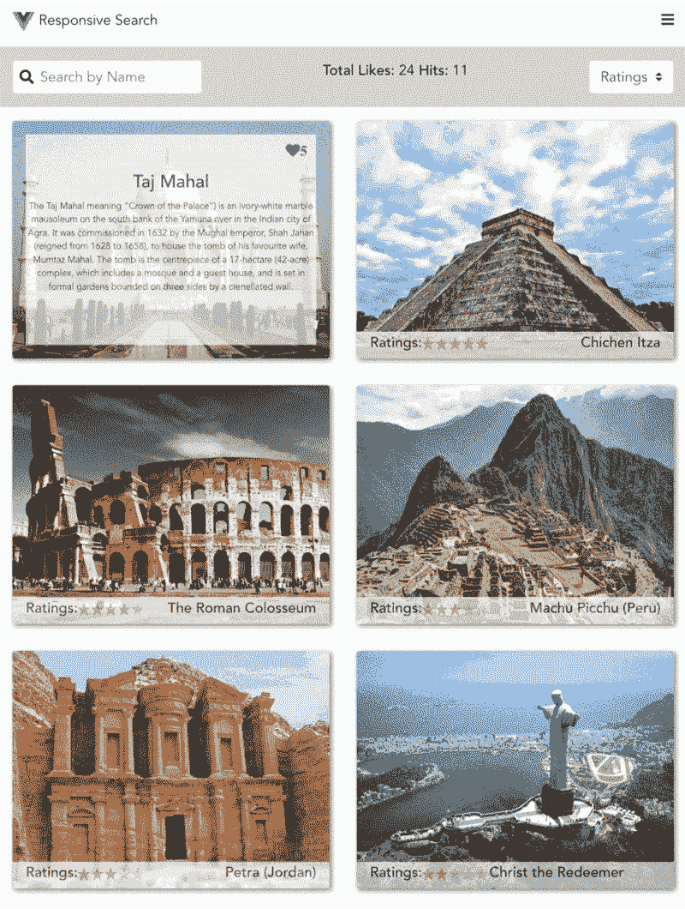
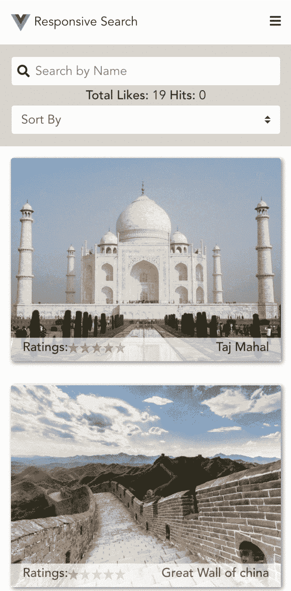

# 如何在 Vue.js 中设置响应式 UI 搜索

> 原文：<https://www.freecodecamp.org/news/how-to-set-up-responsive-ui-search-in-vue-js-bf6007b7fc0f/>

你是否正在考虑用现在流行的现代框架来构建一些很棒的东西，但是不知道如何开始？

如果是的话，那么这篇文章将会帮助你开始并创造一些令人敬畏的东西。

> 我们要建造什么？

我们将建立一个具有以下特征的世界七大奇迹响应客户端搜索:

1.  **文本搜索** & **基于评分和喜欢过滤**。
2.  **平板**和**桌面**每行 2 个，**移动**每行 1 个。
3.  从客户端的外部 API 异步获取数据。
4.  响应视图如下所示:



Left is Dektop / Tablet view and right is the Mobile view

**现场演示**:【https://vue-responsive-search.herokuapp.com 

**源代码**:【https://github.com/honey93/VueSearchExample 

#### **技术架构**

我们将使用以下技术:

1.  [**Vue.js**](https://vuejs.org/) **:** 渐进式 JavaScript 框架
2.  [**BootstrapVue**](https://bootstrap-vue.js.org/)**:**它提供了可用于 Vue.js 2.5+的 Bootstrap V4 组件和网格系统的最全面的实现之一，并带有广泛和自动化的 WAI-ARIA 可访问性标记。
3.  [**Vue Cli 3**](https://cli.vuejs.org/)**:**Vue . js 开发的标准工具

#### **项目结构**

为了开始我们的 Vue 项目，我们需要设置许多东西，如 Vue、引导、Vue 路由器、Vuex 等。

Vue Cli 为我们提供了创建项目所需的大部分配置的命令。

```
npm install -g @vue/cli
vue create project-name
```

对于其余的东西，如 BootstrapVue、vue-star-rating 等，我们可以使用 npm install 命令。

使用 vuecli 创建的默认项目具有以下结构:

```
/Root Folder 

 Public/

 src/

  assets/  /* Static assets like images goes here */
  components/ /* Small part of a view */
  views/  /* View represents a page composed of several components*/
  App.vue /* The main view inside which the routing logic goes */
  main.js  /* App initialisation happens here  */
  router.js /* Router logic is defined here */
  store.js /* Optional state management library Vuex */

 package.json /* It consist of all the dependencies of the project. */
 ......
```

上面的东西是为了向你解释项目架构和初始化它的方法。

我们可以通过克隆 [**库**](https://github.com/honey93/VueSearchExample) 并编写以下命令来开始:

```
npm install 
npm run serve 
```

解释了一些重要组件:

**components/Header.vue**

标题是以单个独立组件的形式创建的，因此可以跨页面重用，避免了代码重复。

```
/* Vue style of writing component: template, script and style*/
<template>
  <div class="pad-15-hor pad-15-ver header">
    <div>
       Responsive Search
    </div>
    <div>
      <i class="fas fa-bars"></i>
    </div>
  </div>
</template>
<script>
export default {
  name: "Header"
};
</script>
<style scoped>
.header {
  display: flex;
  flex-flow: row wrap;
  justify-content: space-between;
}
</style>
```

**组件/Main.vue**

这个组件由搜索/过滤器的整个逻辑和从 API 获取的结果的显示组成。

该组件通过在脚本中导入来使用上面的头。

```
<template>
  <div>
    <Header/>
    <div class="pad-15-hor pad-15-ver search-parent">
      <div class="search-bar">
        <b-form-input
          @input="search_text()"
          v-model="search.text"
          type="text"
          placeholder="Search by Name"
        ></b-form-input>
        <span class="search-icon">
          <i class="fas fa-search"></i>
        </span>
      </div>
      <div>
        <span class="bold">Total Likes:</span>
        {{likes.count}}
        <span class="bold">Hits:</span>
        {{likes.hit}}
      </div>
      <div>
        <b-form-select @input="sort()" v-model="search.filter" :options="options"/>
      </div>
    </div>
<div class="container-fluid">
      <div class="row">
        <div class="col-md-6 pad-15-ver" v-for="wonder in wonders_data" :key="wonder.id">
          <div
            class="card-inner"
            @mouseover="show_hover(true,wonder.id)"
            @mouseout="show_hover(false,0)"
          >
            
<div class="card-bottom pad-15-hor" v-show="!hover_flag || active_id != wonder.id">
              <div class="min-width-160">
                <span class="bold">Ratings:</span>
                <star-rating
                  :rating="wonder.ratings"
                  :show-rating="false"
                  :inline="true"
                  :star-size="15"
                ></star-rating>
              </div>
              <div class="max-width-160">
                <span class="bold">{{wonder.place}}</span>
              </div>
            </div>
<div :class="{'card-hover':1}" v-show="hover_flag && active_id == wonder.id">
              <span
                @click="make_active(wonder.id)"
                :class="{'fas':1, 'fa-heart':1, 'absolute-star':1, 'green':check_active(wonder.id)}"
              >{{wonder.likes}}</span>
              <h5>{{wonder.place}}</h5>
              <p>{{wonder.description}}</p>
            </div>
          </div>
        </div>
      </div>
    </div>
  </div>
</template>
<script>
/* Importing Header to use in this component */ 
import Header from "@/components/Header.vue";
/* Importing axios for async REST calls */
import axios from "axios";
export default {
  name: "Main",
/* mounted gets called when the component gets mounted. AJAX calls are preferred in mounted lifecycle method */
  mounted() {
    this.hover_flag = false;
var inside = this;
axios
      .get("https://www.mocky.io/v2/5c7b98562f0000c013e59f07")
      .then(function(response) {
        //console.log(response);
inside.wonders_data_actual = response.data.data;
response.data.data.map(function(wonder) {
          inside.likes.count += wonder.likes;
        });
inside.wonders_data_actual = inside.wonders_data_actual.map(function(
          wonder
        ) {
          wonder.active_like = false;
          return wonder;
        });
        inside.wonders_data = response.data.data;
      })
      .catch(function(error) {
        // console.log(error);
      });
  },
/* All the data variable declaration are done here:  */
  data() {
    return {
      hover_flag: false,
      wonders_data_actual: [],
      wonders_data: [],
      active_id: 0,
      options: [
        { value: null, text: "Sort By" },
        { value: "a", text: "Ratings" },
        { value: "b", text: "Likes" }
      ],
      search: { filter: null, text: "" },
      likes: { count: 0, hit: 0 }
    };
  },
/* Methods are defined here */
  methods: {
    show_hover(flag, active_id) {
      this.hover_flag = flag;
      this.active_id = active_id;
    },
    sort() {
      //console.log(this.search.filter);
      this.search.filter == "b"
        ? this.wonders_data.sort(function(a, b) {
            return b.likes - a.likes;
          })
        : this.wonders_data.sort(function(a, b) {
            return b.ratings - a.ratings;
          });
    },
    search_text() {
      //console.log(this.search.text);
var inside = this;
this.wonders_data = this.wonders_data_actual.filter(function(wonder) {
        if (
          wonder.place
            .toLowerCase()
            .indexOf(inside.search.text.toLowerCase()) != "-1"
        ) {
          return wonder;
        }
      });
    },
    check_active(id) {
      var flag = false;
      this.wonders_data_actual.map(function(wonder) {
        if (wonder.id == id) {
          flag = wonder.active_like;
        }
      });
      return flag;
    },
    make_active(id) {
      this.likes.hit++;
      this.wonders_data_actual = this.wonders_data_actual.map(function(wonder) {
        if (wonder.id == id) {
          wonder.active_like = !wonder.active_like;
          wonder.active_like ? wonder.likes++ : wonder.likes--;
        }
return wonder;
      });
      var inside = this;
inside.likes.count = 0;
      this.wonders_data_actual.map(function(wonder) {
        inside.likes.count += wonder.likes;
      });
    }
  },
  components: {
    Header
  }
};
</script>
<style scoped> /* Styles are scoped to this component only.*/
/* Style for Desktop/Tablet  */
.search-parent {
  display: flex;
  flex-flow: row wrap;
  justify-content: space-between;
  background-color: lightgray;
}
.card-inner {
  position: relative;
  overflow: hidden;
  box-shadow: 2px 2px 8px grey;
}
.card-img {
  width: 100%;
}
.card-bottom {
  position: absolute;
  bottom: 0;
  left: 0;
  height: 30px;
  width: 100%;
  background-color: white;
  opacity: 0.7;
  display: flex;
  justify-content: space-between;
}
.card-hover {
  position: absolute;
  right: 15px;
  left: 15px;
  top: 15px;
  bottom: 15px;
  background-color: white;
  opacity: 0.7;
  display: flex;
  flex-flow: column wrap;
  justify-content: center;
  align-items: center;
}
.absolute-star {
  position: absolute;
  top: 10px;
  right: 10px;
}
.card-hover p {
  font-size: 10px;
  text-align: center;
}
.bold {
  font-weight: 500;
}
.rating-div {
  width: 200px;
}
.search-bar {
  position: relative;
}
.search-bar input {
  padding-left: 30px;
}
.search-icon {
  position: absolute;
  top: 8px;
  left: 8px;
}
/* For Mobile Device, we will be going with column wrap approach */
@media screen and (max-width: 550px) {
  .search-parent {
    display: flex;
    flex-flow: column wrap;
    justify-content: center;
    align-items: center;
    background-color: lightgray;
  }
.search-parent div {
    width: 100%;
    text-align: center;
  }
}
</style>
```

我希望你能更好地理解如何开始使用 Vue 并创造出一些令人敬畏的东西。

如果你觉得这很有帮助，**拍拍下面的**，把**的星星**送给项目 [**回购**](https://github.com/honey93/VueSearchExample) ，也和你的朋友们分享吧。