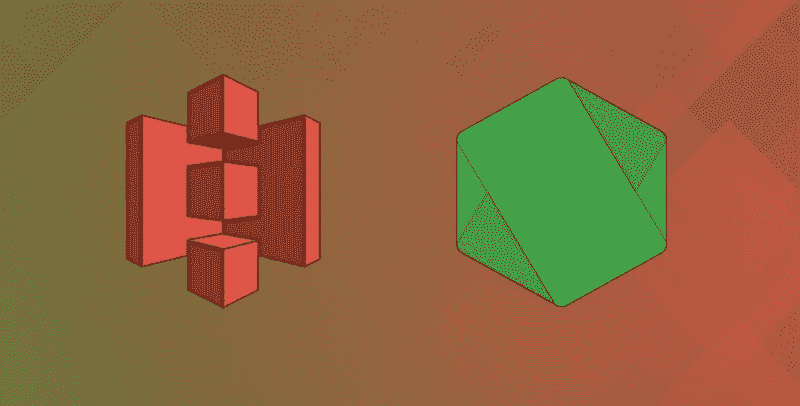
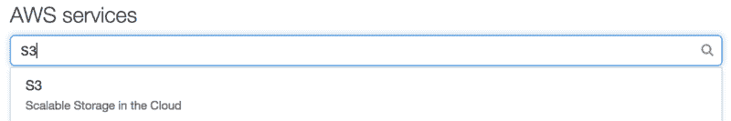
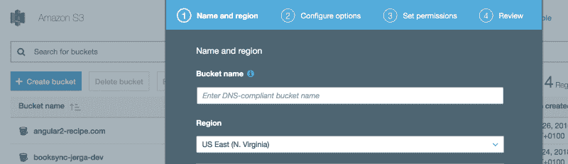
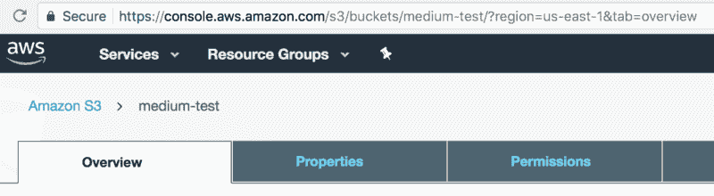
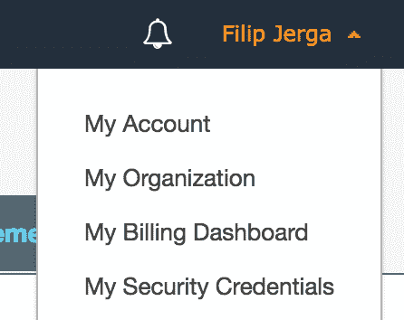
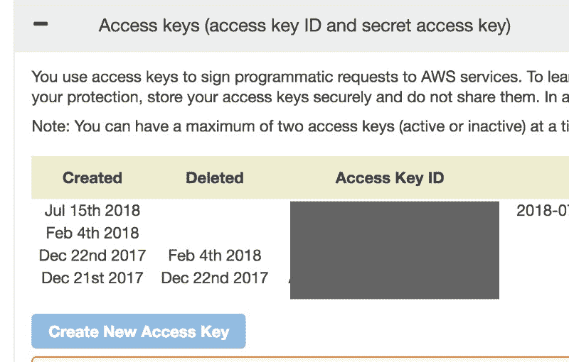
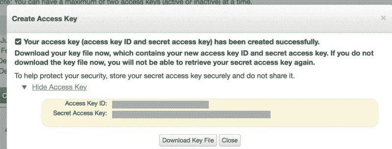
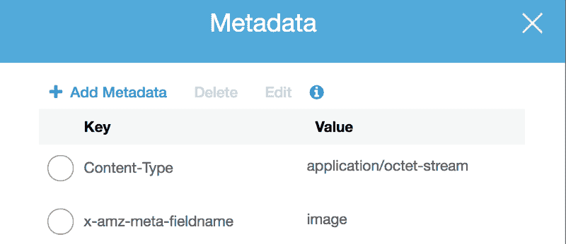
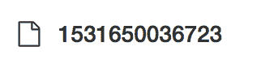
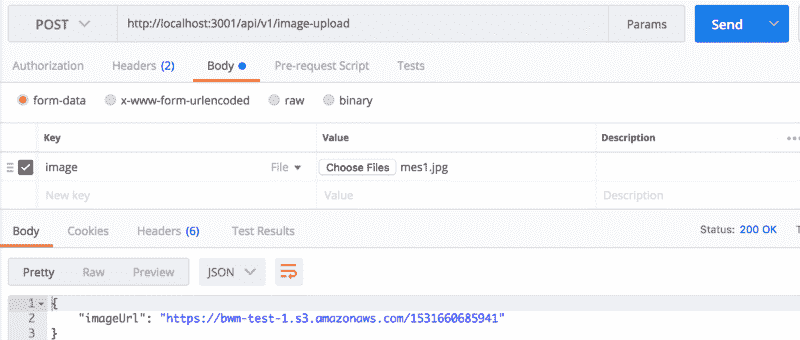

# 如何使用 Node 和 AWS S3 设置简单的图像上传

> 原文：<https://www.freecodecamp.org/news/how-to-set-up-simple-image-upload-with-node-and-aws-s3-84e609248792/>

菲利普·耶尔加

# 如何使用 Node 和 AWS S3 设置简单的图像上传

#### 一步一步的指南，解释如何上传图像或任何文件到亚马逊 S3 服务。



这是教程的第一部分，我们将处理服务器(Node.js)部分的代码。

我还在 YouTube 上准备了一个视频教程。您可以在本文底部的参考资料中找到一个链接。

### 1.我们需要安装什么&一个简短的描述。

**multer:** 处理数据文件的中间件。主要用于上传文件。更多信息: [Npm 链接](https://www.npmjs.com/package/multer)

**multer-s3:** multer 扩展，用于将文件轻松上传到亚马逊 s3 服务。更多信息: [Npm 链接](https://www.npmjs.com/package/multer-s3)

**aws-sdk:** 与 aws(亚马逊网络服务)协同工作的必要包。在我们的情况下，S3 服务。更多信息: [Npm 链接](https://www.npmjs.com/package/aws-sdk)

**转到您的项目，让我们安装软件包:**

```
npm install —-save multer multer-s3 aws-sdk
```

### 2.注册 AWS

首先，让我们在[https://aws.amazon.com](https://aws.amazon.com/)上创建一个账户。亚马逊提供了一个惊人的免费层，你可以使用第一年。登录后，搜索 S3 服务。

简单地说，S3 是一个存储文件的云服务。



Select S3

我们需要**创建一个桶**。你可以把一个桶想象成你的文件的文件夹。选择一个**桶名**和**地区**。由于这是一个简单的设置，我们对其他配置不感兴趣。(默认设置是可以的——如果有不清楚的地方，请在注释中询问)。点击**下一步**，直到进入**查看**并创建您的存储桶。



Bucket creation

**导航到您创建的桶**并检查您的**地址栏**。记住你的**桶名**(对我来说“中试”)和**地区**(对我来说“美东”)。



Check your Url bar.

现在，我们需要得到我们的**安全凭证**。通过您的帐户名导航到“**我的安全凭证**”。然后“**访问键**和**创建新的访问键**。



My security credentials and Access Keys



Create Access Key

不要和任何人分享你的钥匙！将这些密钥临时保存到一些文件或下载密钥文件，因为我们需要密钥以便设置文件上传。

好吧。亚马逊设置完成！

### 3.去你的编码编辑器

**这里我就不解释 Node 或者 Express 的基础知识了。**本教程仅关注文件上传。如果你对整个项目实现感兴趣，可以查看我的 GitHub 资源库或者观看完整教程。(你可以在这篇博文的末尾找到链接)。

1.  使用以下实现创建您的文件上传服务(第一部分):

**重要提示:**切勿将您的秘密凭证直接暴露在文件中！永远不要分享你的秘密凭证！考虑在您的本地环境中设置环境变量，或者在部署项目的情况下，在您的云提供商中设置变量。最好的解决方案是使用**AWS-profiles**:[https://docs . AWS . Amazon . com/SDK-for-JavaScript/v2/developer-guide/loading-node-credentials-shared . html](https://docs.aws.amazon.com/sdk-for-javascript/v2/developer-guide/loading-node-credentials-shared.html)。

**首先，**我们正在导入所有已安装的软件包。**第二个**部分是**配置我们的 AWS** 。我们需要提供我们的**密钥和我之前展示给你的地址栏中的区域**。

在 AWS 配置之后，我们可以创建亚马逊 S3 的一个实例。我们还没有完全完成。现在，让我们看看这个实现的第二部分。

现在，我们可以为 multer 上传设置一个解决方案。我们需要为 multer 对象提供具有以下属性的函数。

1.  s3 :我们之前创建的亚马逊 s3 的实例。
2.  **bucket** :我们的 bucket 的名称(在我的例子中是:“medium-test”)
3.  **acl** :对文件的访问控制(“公共读取”意味着任何人都可以查看文件)，你可以在这里查看所有可用的类型:[亚马逊链接](https://docs.aws.amazon.com/AmazonS3/latest/dev/acl-overview.html#canned-acl)
4.  **metada** :设置上传文件元数据的回调函数。这里，我正在为一个**字段名**设置额外的元数据。你可以在下图中看到这些数据。



Metadata

5. **key:** 回调函数，设置 **key** 属性(您的文件将保存在哪个 key 下的 bucket 中)。在我们的例子中，**我们制作了一个当前时间的时间戳**，并以这个名字保存这个文件。这样，我们的文件名将永远是唯一的，但你可以选择任何你想要的名字。



Uploaded file with a current time name

完成所有设置后，我们将导出**上传**对象，以便在其他文件中使用。

### 4.设置上传图像的路线

我们几乎完成了，但我们应用程序的用户仍然无法访问图片上传。我们需要向他们公开这个功能。让我们创建一个端点来保存文件。

我们正在导出之前创建的上传对象，并从中创建一个新对象。新版本更加具体，增加了一个**单图像上传**的配置。我们正在为它提供一个“**形象**”值。**这个值**非常重要，因为我们将在这个键下把我们的文件发送到服务器。

第二部分是路线本身。将端点发布到“**/图片-上传**”。我们内部称之为 **singleUpload** 。不要忘记**传递 req 和 res，**因为 multer 将从 req 对象获取我们发送到服务器的文件。

我们正在检查错误。如果没有，我们将返回带有文件位置值的 JSON，这只是 Amazon 上文件的一个 **URL。**

就这样！我们现在可以上传文件到亚马逊 S3。很简单，你觉得呢？

### 5.让我们在 Postman 中测试一下。

为了看到我们努力工作的成果，我们需要向服务器发送一个请求，请求中包含我们想要上传的图像。在这一部分，我们将通过邮递员测试它。在教程的下一部分，我们将在 Angular 应用程序中创建一个实现。

如果你没有 **Postman，**你可以简单地下载它作为谷歌 Chrome 扩展。只需搜索“**邮差谷歌 chrome 扩展**”。Postman 是一个初始化、发送和测试服务器请求的应用程序。



Postman

1.  **向我们之前创建的端点发送 post 请求**。在我的例子中，我指定了**/图像上传**的节点路径。
2.  选择**表单数据**的**正文**。
3.  提供一张**图片的**键**。**你会注意到这是我们之前在代码中设置的一个**键**。检查一个文件，并从您的计算机中选择一些文件。
4.  **发送请求**。

您应该用您上传的文件的 URL 取回 JSON。

瞧！就这样，伙计们。这是一个简单的节点文件上传。在下一篇文章中，我将继续 Angular 的前端实现。

如果你喜欢这个教程，可以随时在 Udemy 上查看我的全部课程— **[完整的 Angular，React &节点指南| Airbnb 风格 app](http://bit.ly/2NeWna4) 。**

**视频讲座:** [Youtube 视频](https://www.youtube.com/watch?v=ASuU4km3VHE&t=1047s)

**已完成项目:** [我的 github 库](https://github.com/Jerga99/bwm-ng)

干杯，

菲利普