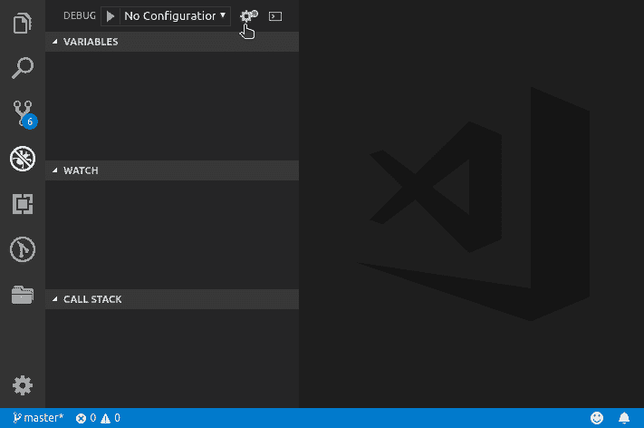
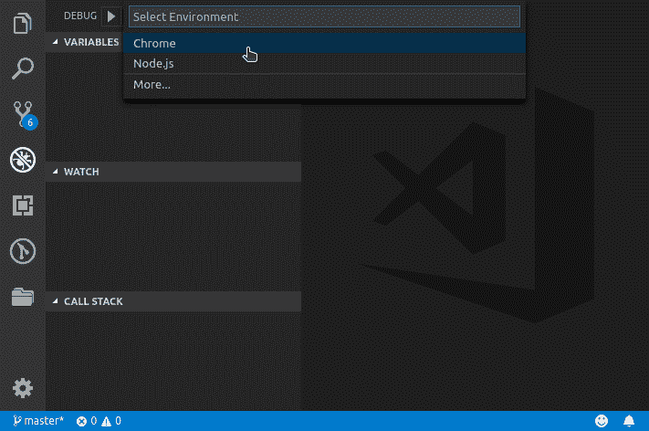

# 如何在 Visual Studio 代码中设置 Chrome 扩展的调试器

> 原文：<https://www.freecodecamp.org/news/how-to-set-up-the-debugger-for-chrome-extension-in-visual-studio-code-c0b3e5937c01/>

维克托·a·雷克纳

使用 Visual Studio 代码调试 web 应用程序会使您更加高效。它帮助您节省大量时间，并保持您的代码更整洁。这是因为你不需要写一堆的`console.log`,你可以一行一行地执行你的代码。但是如果你在这里，你可能知道调试 web 应用程序的好处。所以让我们开始吧…

### 正在设置

你需要做的第一件事是为 Chrome 扩展安装[调试器。安装完成后，您就可以开始工作了。接下来，您需要为 Visual Studio 代码调试器创建一个启动文件。该文件包含调试器对项目的不同配置。](https://marketplace.visualstudio.com/items?itemName=msjsdiag.debugger-for-chrome)

您可以通过转到活动栏中的 debug 部分并单击齿轮图标来创建启动文件。



This gear icon.

一个选项列表会提示你选择“Chrome”这个。



Like this.

完成这些之后，您将拥有一个包含`launch.json`文件的`.vscode`目录。

### 配置

Chrome 调试配置有两种:`launch`和`attach`。您可以在每个配置对象内的`request`选项中进行设置。

#### 发动

启动配置*启动*一个运行指定文件或 URL 的 Chrome 实例。如果您指定了一个 URL，您必须将`webRoot`设置为提供文件的目录。这可以是绝对路径，也可以是使用`${workspaceFolder}`解析器的路径。这是在 Visual Studio 代码工作区中打开的文件夹。

*注意:设置`webRoot`时要小心，它用于将 URL 解析到您计算机上的一个文件。*

您可以看到两个`launch`配置的例子:一个针对本地服务器启动，另一个针对本地文件启动。

如果你有一个 Chrome 实例正在运行，调试器启动的那个将使用一个临时会话。这意味着您将没有您的扩展或打开的标签。如果你想用你的用户和扩展来启动一个 Chrome 实例，你必须先关闭每个正在运行的实例。

注意:当你停止调试器时，这将关闭 Chrome 窗口。

#### 附上

我个人更喜欢使用这个…这个配置将调试器附加到 Chrome 的一个运行实例上。但是为了让这个选项起作用，你需要启动 Chrome 并启用远程调试。启动带有远程调试的 Chrome 实例因操作系统而异。

#### Windows 操作系统

在 Windows 中有两种方法可以通过远程调试来启动 Chrome。最简单的就是右键点击谷歌 Chrome 快捷方式。选择属性选项，并在*目标*字段中添加以下命令。

```
--remote-debugging-port=9222
```

注意:这将在每次点击快捷方式时启动 Chrome 并启用远程调试。

另一种方法是打开命令提示符并执行这个命令，用 Chrome 安装的实际位置替换第`<chrome_pa`个>。

```
<chrome_path>\chrome.exe --remote-debugging-port=9222
```

#### 马科斯

打开终端并执行以下命令:

```
/Applications/Google\ Chrome.app/Contents/MacOS/Google\ Chrome --remote-debugging-port=9222
```

#### Linux 操作系统

启动您的终端并运行以下命令:

```
google-chrome --remote-debugging-port=9222
```

不管是什么操作系统，这都是打开带有标志的 Chrome，在本例中是:`--remote-debugging-port`，并将其设置为`9222`。你可以在这里阅读更多关于这个[的内容。](https://www.chromium.org/developers/how-tos/run-chromium-with-flags)

注意:如果你有其他没有远程调试的 Chrome 实例，确保在启动一个新的之前关闭它们。

这里有一个示例`attach`配置。

*注意:如果您没有设置`"url"`选项，将会出现一个带有您打开的选项卡的列表。*

这个扩展有很多非常有用的选项，您可以使用它们来调整配置以适应您的项目。你可以在这里阅读其中一些[的文档。](https://github.com/Microsoft/vscode-chrome-debug#other-optional-launch-config-fields)

#### 摘要

恭喜你！您已经学习了如何在 Visual Studio 代码中安装和设置 Chrome 调试器。您还了解了如何在启用远程调试的情况下启动 Google Chrome。现在是你探索和扩展你的新知识的时候了…我强烈推荐你看看扩展的[库](https://github.com/Microsoft/vscode-chrome-debug)。

我希望你喜欢这篇文章。你可以在 Twitter 上找到我。？