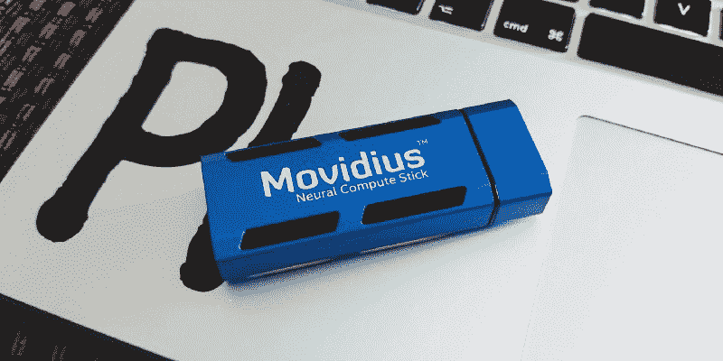
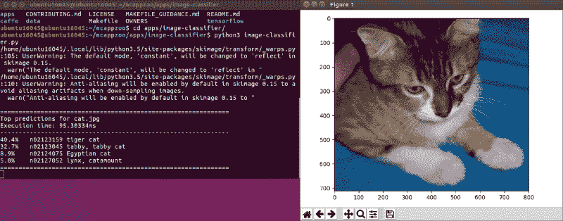

# 如何设置英特尔 Movidius 神经计算棒

> 原文：<https://www.freecodecamp.org/news/how-to-set-up-the-intel-movidius-neural-compute-stick-b9db16d493a7/>

由 rishal 丈夫

# 如何设置英特尔 Movidius 神经计算棒

2017 年，英特尔联系我加入他们的创新者计划。经过几次面试后，我被认定为人工智能领域的英特尔创新者。该倡议的理念是通过提供尖端硬件、演讲机会和平台来促进他们的工作并与更多人接触，从而支持世界各地参与社区的技术专家。

英特尔给了我一个 Movidius 神经计算棒。这是一个比拇指驱动器略大的 USB 棒，专门设计用于训练和主要运行神经网络图，这在运行深度学习网络时特别有用，其中学习是从图像和视频等媒体进行的。我可能会在以后的帖子中讨论深度学习。根据基准测试，Movidius 神经计算棒承诺运行模型的速度比标准笔记本电脑快五倍。

收到设备后，我意识到它目前只能在 Ubuntu 16.04 和 Raspberry Pi 3 上运行。作为一个 macOS 用户，这有点问题，所以我决定运行一个 Ubuntu 虚拟机来开始修补设备。本指南描述了我如何成功地为 Movidius stick 设置了一个可接受的环境，并简要描述了它的功能。

### 设置虚拟机

第一步是启动并运行虚拟机(VM)。虽然有许多不同的虚拟机软件选项，但 Virtual Box 是一个免费提供的软件，易于配置和使用。如果虚拟机打算用作主工作站，Parallels 和 VMWare 等替代产品可能会提供更好的性能。

1.  [下载虚拟盒子](https://www.virtualbox.org/wiki/Downloads)。
2.  使用下载的安装程序安装虚拟盒子。
3.  [下载虚拟盒子扩展包](https://www.virtualbox.org/wiki/Downloads)。
4.  使用下载的安装程序安装 Virtual Box 扩展包。
5.  [下载 Ubuntu 16.04 64 位 ISO 镜像](http://releases.ubuntu.com/16.04/)。
6.  创建新的虚拟机。
7.  将 Ubuntu 16.04 镜像作为光盘加载到新创建的虚拟机上。
8.  启动虚拟机。
9.  按照步骤在虚拟机上安装 Ubuntu。

我的虚拟机规格:

这些是我用过的配置。随意调整你认为合适的内存(RAM)和硬盘分配。请记住，过度分配资源会导致主机操作系统的性能下降。

*   名称:Ubuntu 16.04
*   类型:Linux
*   内存大小:3072 兆字节
*   虚拟硬盘:40 GB

### Ubunutu 16.04 的先决条件

在启动和运行 SDK 和示例之前，需要一些依赖项来确保开发环境已经准备好，并且必要的工具可用。这需要更新 Ubuntu 并确保你有 Python、PIP (PIP 安装包)和 Git 来克隆代码库。

1.  更新 Ubuntu:应该会出现一个弹出窗口来更新 Ubuntu，或者你可以在控制台中使用这个命令:`sudo apt-get upgrade`
2.  要使用控制台，只需点击 Ubuntu 菜单，搜索“控制台”应用程序。
3.  确保使用控制台安装 Python 3:`python3 --version`
4.  如果没有安装 Python 3，使用控制台安装:`sudo apt install python3`
5.  确保使用控制台安装 pip 3:`pip3 --version`
6.  如果没有安装 pip 3，使用控制台安装:`sudo apt install python3-pip`
7.  确保使用控制台安装 Git:`git --version`
8.  如果没有安装 Git，使用控制台安装它:`sudo apt install git-all`

### 确保识别出 Movidius 手杖

接下来，我们开始设置 Movidius 棒。这包括确保虚拟机能够识别 USB 设备。由于虚拟机通过主机操作系统获得对硬件的访问权，所以像 Movidius 这样的设备需要一些配置，在这些设备中，驱动程序通常不是分布式的。

1.  将 Movidius 记忆棒插入 USB 端口。
2.  使用控制台中的`lsusb`命令来确定它是否被虚拟机和 Ubuntu 识别。您应该会在 USB 设备列表中看到 Movidius stick。
3.  如果它没有被识别。关闭虚拟机，并遵循以下说明。
4.  导航到虚拟框中虚拟机的设置。选取端口> USB。
5.  为 USB 2 添加一个新的过滤器，只提供供应商 ID`03e7`
6.  为 USB 3 添加一个新的过滤器，只提供供应商 ID`040e`
7.  启动 Ubuntu 虚拟机。
8.  使用`lsusb`命令列出 USB 设备，现在应该可以识别 Movidius 记忆棒了。在我的情况下，它被插入 USB 3 端口，但它被识别为 USB 2 供应商 ID `03e7`。

### 安装 NCSDK

NCSDK 需要与 Movidius stick 交互。SDK 的目标是为神经计算硬件提供一个接口。这意味着通过使用该 SDK，可以编写机器学习程序来利用专用硬件的优化。

1.  在控制台中克隆 NCSDK(神经计算软件开发工具包)库:`git clone [https://github.com/movidius/ncsdk.git](https://github.com/movidius/ncsdk.git)`
2.  如果您对存储库有问题，请在这里下载 NCSDK。我用的是版本 1:

1 . 12 . 00 . 01:
[https://NCS-forum-uploads . S3 . amazonaws . com/ncsdk/ncsdk-01 _ 12 _ 00 _ 01-full/ncsdk-1 . 12 . 00 . 01 . tar . gz](https://ncs-forum-uploads.s3.amazonaws.com/ncsdk/ncsdk-01_12_00_01-full/ncsdk-1.12.00.01.tar.gz)

2 . 05 . 00 . 02:
[https://NCS-forum-uploads . S3 . amazonaws . com/ncsdk/ncsdk-02 _ 05 _ 00 _ 02-full/ncsdk-2 . 05 . 00 . 02 . tar . gz](https://ncs-forum-uploads.s3.amazonaws.com/ncsdk/ncsdk-02_05_00_02-full/ncsdk-2.05.00.02.tar.gz)

然后执行以下步骤:

1.  导航到控制台中的 NCSDK 目录。
2.  在控制台中构建 SDK:`make install`
3.  构建示例:`make examples`

### 构建并运行示例

最后，我们运行一些例子，看看 Movidius 是如何工作的。神经计算应用程序 Zoo 是一个示例库，展示了如何使用 NC SDK 和 Movidius stick 比典型的 CPU 更有效地训练和处理神经网络图。

我们要看的例子是图像分类。我们不用创建自己的模型，这需要花费无数小时的数据收集、数据处理和训练，我们只需使用 Google net——Google 训练有素的图像分类模型。用于处理模型的图形引擎将是 Caffe。Caffe 是一个广泛使用的机器视觉框架，擅长与图像相关的任务。

1.  在控制台中克隆范例库:`git clone https://github.com/movidius/ncappzoo.git`
2.  导航到克隆的目录:`cd ncappzoo`
3.  构建示例:`make`
4.  如果缺少 sk-image，则安装它:`pip3 install scikit-image`
5.  制作 caffe GoogleImageNet 图形:`cd caffe && make`
6.  导航到图像分类器:`cd apps/image-classifier`
7.  运行示例:`python3 image-classifier.py`
8.  成功！您应该会看到基本图像分类器的结果。

### 勇往直前去征服

虽然 Movidius 神经计算棒目前只支持 Raspbian 和 Ubuntu，但让它在你的平台上运行是有可能的。很快，我们将通过专用硬件解决方案(如 Movidius)在边缘设备(如无人机、家庭自动化摄像机和其他物联网设备)上看到人工智能。探索例子，建立你自己的人工智能，分享你的伟大工作，并帮助塑造未来。

保持联系✌️I'm 活跃在推特上: [@RishalHurbans](http://twitter.com/RishalHurbans)

我可以通过 rishal[at]prolificidea[dot]com 的电子邮件联系

我也在写更多，所以请在 Medium 上关注我。

如果你喜欢这篇文章，请给它一个或五个或五十个掌声。会帮助别人看到。