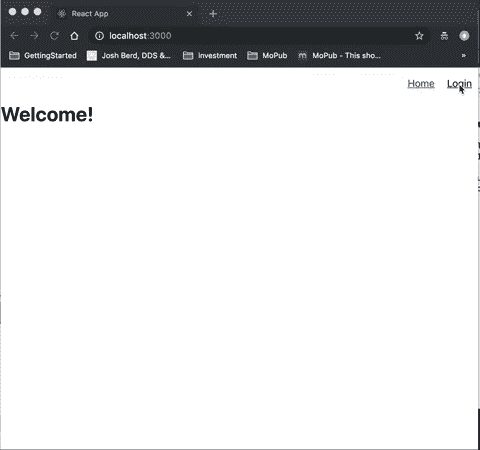
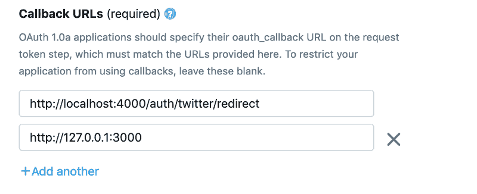
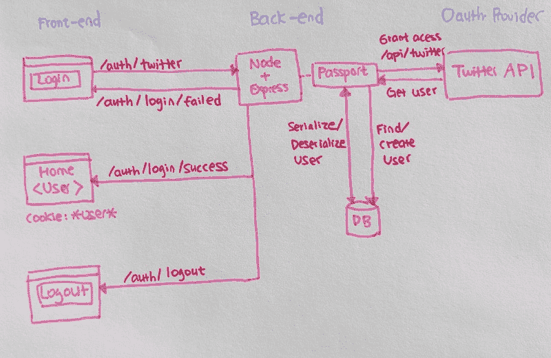
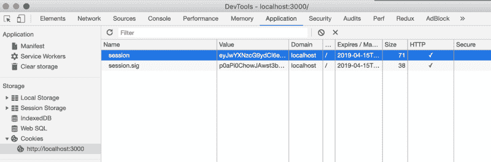
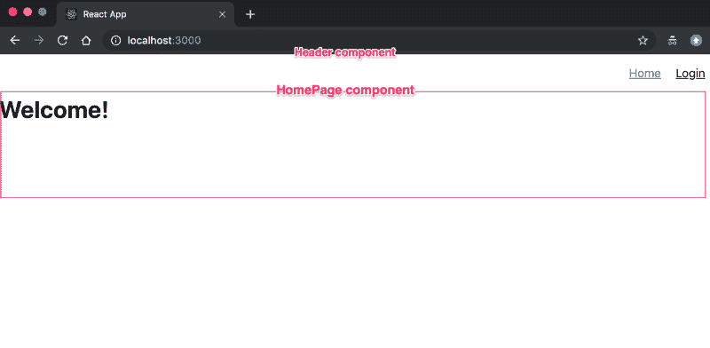

# 如何使用 Passport.js 和 ReactJS 设置 Twitter OAuth

> 原文：<https://www.freecodecamp.org/news/how-to-set-up-twitter-oauth-using-passport-js-and-reactjs-9ffa6f49ef0/>

作者:张

# 如何使用 Passport.js 和 ReactJS 设置 Twitter OAuth

### **入门**

这是一个使用 [Passport API](http://www.passportjs.org/packages/passport-twitter/) 构建 Twitter 认证 web 应用程序的简单认证教程。这是我为了教育目的而做的一个兼职项目。

我将本教程分为两部分。第一部分着重于在后端构建身份验证路由。第二部分着重于使用 React 在前端构建 UI 组件。

#### **技术堆栈**

*   服务器端: [Node.js](https://nodejs.org/en/) ， [Express.js](https://expressjs.com/) ， [Passport Twitter API](http://www.passportjs.org/packages/passport-twitter/) ， [MongoDB](https://www.mongodb.com/) ，
*   客户:[反应者](https://reactjs.org/)

#### 我们要建造什么？

*   用户点击登录按钮，重定向到 Twitter OAuth 认证页面。
*   一旦 OAuth 被 Twitter 成功认证，用户将被重定向回 web 应用程序主页。



Authenticate via passport-twitter

[*【passport . js】*](http://www.passportjs.org/)*为其他 OAuth 服务提供商如谷歌、脸书等提供认证 API。例如，我选择使用 Twitter 作为 OAuth 服务提供商。*

#### **OAuth 是什么？**

开放授权是一种标准，允许您的 web 应用程序访问第三方登录服务，如 Twitter、脸书或 Google，它们返回 OAuth 令牌。OAuth 令牌是一种凭证，应用程序可以使用它来访问外部服务 API。

在这个项目中，我使用`passport-twitter`中间件来处理使用 OAuth 1.0 API 的 Twitter 认证，因为它节省了时间，并在后台处理所有复杂的认证过程。

#### 什么是服务器端点？

**/auth/twitter —** 通过 passport twitter 认证

**/auth/login/success —** 返回带有用户信息的登录成功响应

**/auth/login/failed —** 返回登录失败消息

**/认证/注销—** 注销并重定向到客户端主页

**/auth/twitter/redirect —** 如果登录成功则重定向至主页，如果失败则重定向至 */auth/login/failed*

#### 架构图

这是架构图的概述，我们将更详细地讨论它。


Architecture Diagram

#### 项目结构

为了清晰明了，我将服务器和客户端逻辑分开放在不同的文件夹中。我的**服务器**运行在*本地主机:4000、*上，而**客户端**运行在*本地主机:3000* 上。(随意定义自己的端口。)

```
|-- twitter-auth-project|   |-- server|   |   |-- index.js|   |   |-- package.json|   |-- client|   |   |-- src|   |   |   |-- index.jsx|   |   |   |-- package.json
```

### 履行

#### **第 1 部分:在 Twitter 应用程序站点将你的应用程序注册为 OAuth 提供者**

首先，在 [Twitter 应用管理](https://apps.twitter.com/)注册你的应用。您将获得一个消费者密钥(API 密钥)和消费者密码(API 密码)，您可以在以后的 passport 策略中使用它们。

您还需要配置一个回调 URL。这是 OAuth 成功认证后的回调 URL。

出于本地开发的目的，我将回调 URL 定制为客户端 URL，即 **localhost:3000** 。



[https://developer.twitter.com/en/apps/create](https://developer.twitter.com/en/apps/create)

#### **第 2 部分:为 Twitter 认证设置 Express 服务器**

我选择了 [Express.js](https://expressjs.com/) 在后端设置服务器。 **Express.js** 是 Node.js 的 web 应用框架，旨在构建 API。

```
|-- server|   |-- config|   |   |-- keys.js|   |   |-- passport-setup.js|-- |-- models|   |   |-- user-model.js|   |-- routes|   |   |-- auth-routes.js|   |-- index.js|   |-- package.json
```

`npm install express`安装一个 [express](https://expressjs.com/en/starter/hello-world.html) 服务器。服务器运行在 *http://localhost:4000* 上。

`index.js`是所有服务器端点的入口点。

`/routes/auth-routes.js`包含所有的认证端点。

`/config/keys.js`包含所有 Twitter API 消费者密钥和数据库配置。*可以复制他们，放自己的钥匙。*

#### **第 3 部分:设置认证路由**

在“什么是服务器端点？”部分，我们已经确定了 Twitter API 的身份验证端点。

> **/auth/twitter —** 通过 passport twitter 认证

> **/auth/login/success —** 返回带有用户信息的登录成功响应

> **/auth/login/failed —** 返回登录失败消息

> **/认证/注销—** 注销并重定向到客户端主页

> **/auth/twitter/redirect —** 如果登录成功，则重定向至主页；如果登录失败，则重定向至 */auth/login/failed*

让我们把它们付诸实践。

`/routes/auth-routes.js`

在`index.js`中，导入`routes/auth-routes`，

`npm install cors` —支持跨原点浏览器

#### **第 4 部分:使用 Passport API 设置 Twitter 策略**

[**Passport API**](http://www.passportjs.org/docs/) 是我们用来通过 Twitter OAuth 认证的中间件。Passport API 在后台进行登录验证，因此您不需要处理复杂的逻辑。它也有不同的认证策略(如 GoogleStrategy，FacebookStrategy)。在我的例子中，我选择使用[Twitter 策略](http://www.passportjs.org/docs/twitter/)通过 Twitter 账户登录。

#### **第 5 部分:设置并连接数据库**

当系统通过 PassportAPI 成功地对用户进行身份验证时，它需要将用户存储在数据库中，这样它就可以将用户信息检索到客户端。



architecture diagram

我使用 MongoDB 来存储用户登录信息。

第 5.1 部分—注册 mlab 并遵循此处的说明:[**https://mlab.com/**](https://mlab.com/)

第 5.2 部分—在`keys.js`中添加 MongoDB 凭证

第 5.3 部分—使用 mongoose 建立一个 MongoDB 连接

`npm install mongoose`连接到 MongoDB。

> “Mongoose 提供了一个直接的、基于模式的解决方案来为您的应用程序数据建模。它包括内置的类型转换、验证和查询构建。(【https://mongoosejs.com/】T2)

第 5.4 部分—创建一个用户对象模型，表示数据库记录中的用户配置文件

`/models/user-model.js`

#### **第 6 部分:从数据库中保存和获取用户**

一旦 Passport API 通过 Twitter OAuth 成功认证，我们的服务器就会将用户信息保存到 MongoDB。如果这个用户已经存在，系统只需从数据库中找到当前用户，并将该用户返回给客户端。这些都是使用 mongoose APIs 完成的。

`/config/passport-setup.js`

#### **第 7 部分:使用客户端会话存储 cookie 会话**

用户每次登录网站，浏览器都会记住这个用户信息，这样用户就不需要重新登录了。这个用户是通过 HTTP cookie 被记住的。HTTP cookie 包含关于用户和会话持续时间的加密数据。

如果你登录到任何网页，并打开 DevTools，你可以看到浏览器中已经设置了 cookies。



After a successful login, cookies are set in the browser. Open DevTools, go to Application | Cookies.

序列化和反序列化是需要了解的重要概念。**序列化**是指用户从数据库获取加密信息，并将其作为 cookie 发送回浏览器。**反序列化**是指用户 cookie 从浏览器解密到数据库。

为了支持登录会话，Passport 将在会话之间序列化和反序列化用户实例。

`/config/passport-setup.js`

这是使用 cookie 会话的最后一个`index.js`。

我选择使用`cookie-session`作为中间层来存储客户端的会话数据。

```
$ npm install cookie-session
```

此外，使用`index.js`中的烹饪会话

```
app.use(cookieSession({  name: 'session',  keys: [/* secret keys */],  maxAge: 24 * 60 * 60 * 1000 // session will expire after 24 hours}))
```

`passport.session()`充当中间件来改变 req 对象，并将当前会话 sig(来自客户端 cookie)的加密用户值更改为用户对象。

*可选步骤*:

我定制了 localhost:4000/ root URL，以便在正确登录时显示成功消息，否则显示失败消息。

### **下一步:客户端——使用 React 设置登录页面和注销页面**

我使用 [React](https://reactjs.org/) 和 [React Router](https://github.com/ReactTraining/react-router) 建立链接来构建前端组件。


Login Page and Logout Page

#### **功能**

该页面包含一个带有主页和登录/注销按钮的标题。最初，页面将显示“欢迎”消息和“登录”按钮。一旦用户通过 twitter 认证，它将显示用户名和“注销”按钮。

#### 客户端设置

```
client|-- src|   |-- components|   |   |-- Header.jsx|   |   |-- Homepage.jsx|   |-- App.js|   |-- AppRouter.js|   |-- index.js|   |-- index.css|   |-- serviceWorker.js|-- package.json
```

#### 识别用户界面组件



UI components

*   主页:显示欢迎和用户信息的容器。调用 */auth/login/success* 端点。如果端点成功，用户信息将被存储在*用户*对象中，并且*认证*的状态将被设置为*真*。页面显示一条信息*“您已成功登录”*。如果端点失败，则用户未通过身份验证，并且*页面显示“欢迎”。*
*   Header:它处理导航。当用户通过身份验证后，“登录”将更改为“注销”。*认证过的*状态作为道具从主页流传下来。

#### 履行

HomePage.jsx:显示欢迎和用户信息的容器

Header.jsx 导航组件

最后，在 AppRouter.jsx 和 App.jsx 中设置导航到主页的路径

非常感谢你阅读这篇博文。希望对你有帮助。

整个项目可以在我的 Github 上找到:[https://github.com/leannezhang/twitter-authentication](https://github.com/leannezhang/twitter-authentication)

如果您有任何意见或反馈，请随时在下面评论或联系我。

推特:@ liyangz

#### 阅读材料

*   [护照推特示例](https://github.com/passport/express-4.x-twitter-example)
*   [护照推特](https://github.com/jaredhanson/passport-twitter)
*   [Passport Google API 教程](https://youtu.be/sakQbeRjgwg)