# 如何使用 Google Authenticator 在 ASP.NET 核心中设置双因素认证

> 原文：<https://www.freecodecamp.org/news/how-to-set-up-two-factor-authentication-on-asp-net-core-using-google-authenticator-4b15d0698ec9/>

### 介绍

在本文中，我们将学习如何使用 Google Authenticator 应用程序在 ASP.NET 核心应用程序中执行双因素身份验证。

要使用它，您需要使用 web 应用程序中生成的 QR 码在智能手机上配置 Google Authenticator 应用程序。当您登录到 web 应用程序时，您必须输入应用程序中生成的六位数 pin，以完成双因素身份验证。应用程序中生成的密钥对您的用户 ID 来说是唯一的，并且是基于时间的一次性密码(TOTP)，也就是说，它将在特定时间后过期。

### 先决条件

*   安装。NET Core 2.0.0 以上 SDK 从[这里](https://www.microsoft.com/net/core#windowscmd)。
*   从[这里](https://www.visualstudio.com/downloads/)安装最新版本的 Visual Studio 2017 社区版。

### 源代码

在继续之前，我建议您从 [GitHub](https://github.com/AnkitSharma-007/ASPCore.Two-Factor-Authentication) 获取源代码

### 创建 MVC Web 应用程序

打开 Visual Studio 并选择文件>>新建>>项目。选择项目后，将会打开一个“新项目”对话框。选择。NET Core 内的 Visual C#菜单从左侧面板。然后，选择“ASP。NET Core Web Application”从可用的项目类型。将项目命名为“TwoFactAuth ”,然后按 OK。

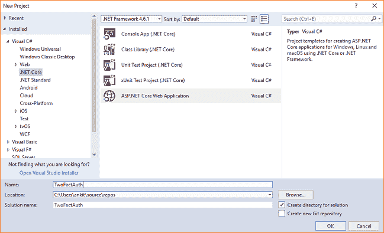

单击 OK 后，将打开一个新对话框，要求您选择项目模板。您可以在模板窗口的左上角看到两个下拉菜单。选择”。NET Core”和“ASP。NET Core 2.0”从这些下拉列表中。然后，选择“Web 应用程序(模型-视图-控制器)”模板。点击“更改认证”按钮。将会打开“更改验证”对话框。选择“个人用户帐户”并单击确定。现在，再次单击确定创建您的 web 应用程序。

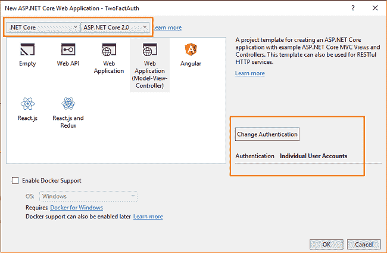

### 添加 QR 码以配置双因素身份验证

我们将使用二维码来配置和同步谷歌认证应用程序与我们的网络应用程序。从[https://davidshimjs.github.io/qrcodejs/](https://davidshimjs.github.io/qrcodejs/)下载 qrcode.js JavaScript 库，并将其放入应用程序的“wwwroot\lib”文件夹中。现在，您的“wwwroot”文件夹将具有以下结构。

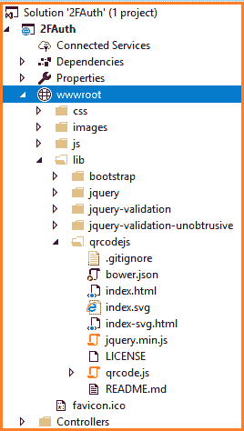

打开“Views \ Manage \ enable authenticator . cshtml”*文件。你会在文件末尾找到*@部分脚本*。把下面的代码放进去。*

```
*`@section Scripts {      @await Html.PartialAsync("_ValidationScriptsPartial")      <script src="~/lib/qrcodejs/qrcode.js"></script>      <script type="text/javascript">          new QRCode(document.getElementById("qrCode"),              {                  text: "@Html.Raw(Model.AuthenticatorUri)",                  width: 200,                  height: 200              });      </script>  }`*
```

*这个“enable authenticator . cshtml”*文件已经有一个 id 为“qrCode”的 div(参见下面的代码片段)。我们使用 **qrcode.js** 库在 div 中生成一个 QR 码。我们还根据宽度和高度定义了二维码的尺寸。**

**所以最后，你的“enable authenticator . cshtml”*文件会是这样的。***

```
***`@model EnableAuthenticatorViewModel  @{      ViewData["Title"] = "Enable authenticator";      ViewData.AddActivePage(ManageNavPages.TwoFactorAuthentication);  }    <h4>@ViewData["Title"]</h4>  <div>      <p>To use an authenticator app go through the following steps:</p>      <ol class="list">          <li>              <p>                  Download a two-factor authenticator app like Microsoft Authenticator for                  <a href="https://go.microsoft.com/fwlink/?Linkid=825071">Windows Phone</a>,                  <a href="https://go.microsoft.com/fwlink/?Linkid=825072">Android</a> and                  <a href="https://go.microsoft.com/fwlink/?Linkid=825073">iOS</a> or                  Google Authenticator for                  <a href="https://play.google.com/store/apps/details?id=com.google.android.apps.authenticator2&hl=en">Android</a> and                  <a href="https://itunes.apple.com/us/app/google-authenticator/id388497605?mt=8">iOS</a>.              </p>          </li>          <li>              <p>Scan the QR Code or enter this key <kbd>@Model.SharedKey</kbd> into your two factor authenticator app. Spaces and casing do not matter.</p>              <div class="alert alert-info">To enable QR code generation please read our <a href="https://go.microsoft.com/fwlink/?Linkid=852423">documentation</a>.</div>              <div id="qrCode"></div>              <div id="qrCodeData" data-url="@Model.AuthenticatorUri"></div>          </li>          <li>              <p>                  Once you have scanned the QR code or input the key above, your two factor authentication app will provide you                  with a unique code. Enter the code in the confirmation box below.              </p>              <div class="row">                  <div class="col-md-6">                      <form method="post">                          <div class="form-group">                              <label asp-for="Code" class="control-label">Verification Code</label>                              <input asp-for="Code" class="form-control" autocomplete="off" />                              <span asp-validation-for="Code" class="text-danger"></span>                          </div>                          <button type="submit" class="btn btn-default">Verify</button>                          <div asp-validation-summary="ModelOnly" class="text-danger"></div>                      </form>                  </div>              </div>          </li>      </ol>  </div>  @section Scripts {      @await Html.PartialAsync("_ValidationScriptsPartial")      <script src="~/lib/qrcodejs/qrcode.js"></script>      <script type="text/javascript">          new QRCode(document.getElementById("qrCode"),              {                  text: "@Html.Raw(Model.AuthenticatorUri)",                  width: 200,                  height: 200              });      </script>  }`***
```

***当我们执行程序时，在这个视图中会生成一个二维码。然后你可以在这个二维码的帮助下使用谷歌认证器设置双因素认证。***

### ***配置双因素身份验证***

***在运行应用程序之前，我们需要将迁移应用到我们的应用程序中。导航到工具>>获取软件包管理器>>软件包管理器控制台。它将打开软件包管理器控制台。输入“更新数据库”命令，然后按回车键。这将使用实体框架代码优先迁移来更新数据库。***

******

***按 F5 启动应用程序，然后单击主页右上角的“注册”。您可以看到一个用户注册页面。填写详细信息，然后单击“注册”按钮，如下图所示。***

***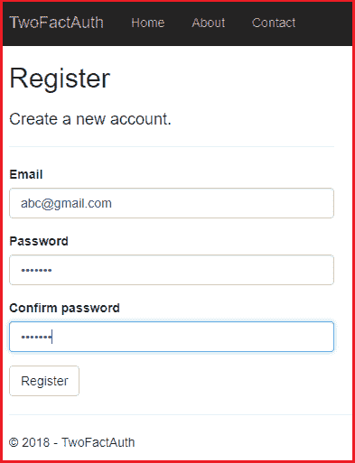***

***注册成功后，您将登录到应用程序并导航到主页。在这里，您可以在页面的右上角看到您注册的电子邮件 id。点击它导航到“管理您的帐户”页面。从左侧菜单中选择“TwoFactorAuthentication”。您将看到一个类似如下所示的页面。***

***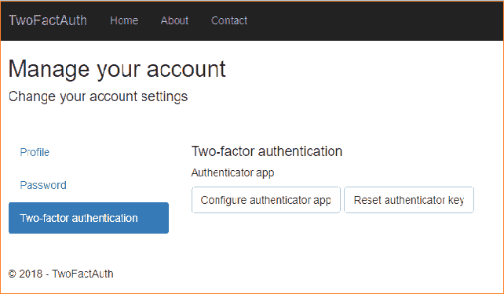***

***点击“配置验证器应用程序”按钮。您可以看到屏幕上生成了一个二维码，它要求输入“验证码”，如下图所示。***

***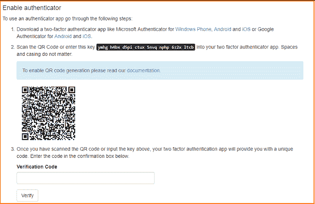***

***你需要在你的智能手机上安装谷歌认证应用。它将允许您扫描此 QR 码，以生成验证码并完成双因素身份验证设置。***

***从安卓的 [Play Store](https://play.google.com/store/apps/details?id=com.google.android.apps.authenticator2&hl=en) 和 iOS 的 [App Store](https://itunes.apple.com/us/app/google-authenticator/id388497605?mt=8) 下载并安装谷歌认证器。我们在这个演示中使用的是 Android 设备。***

***在智能手机上启动应用程序。您可以看到如下图所示的欢迎屏幕。***

***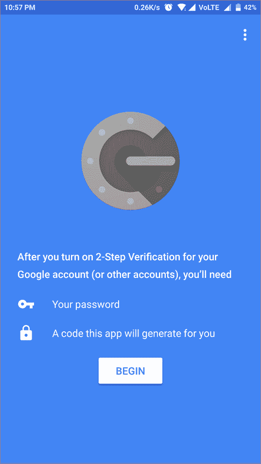***

***点击“开始”。它会要求您通过提供两个选项来添加帐户:***

1.  ***扫描条形码***
2.  ***输入提供的密钥***

***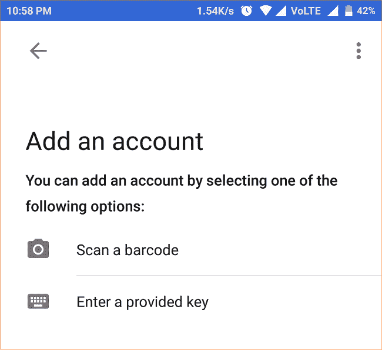***

***点击“扫描条形码”,扫描 web 应用程序生成的二维码。这将向 Google authenticator 添加一个新帐户，并在您的手机屏幕上生成一个六位数的 pin。这是我们的双因素认证码。这是一个 TOTP(基于时间的一次性密码)。你可以观察到它不停地频繁变化(寿命 30 秒)。***

***现在，您可以在应用程序中看到应用程序名称以及您注册的电子邮件 id，如下所示。***

***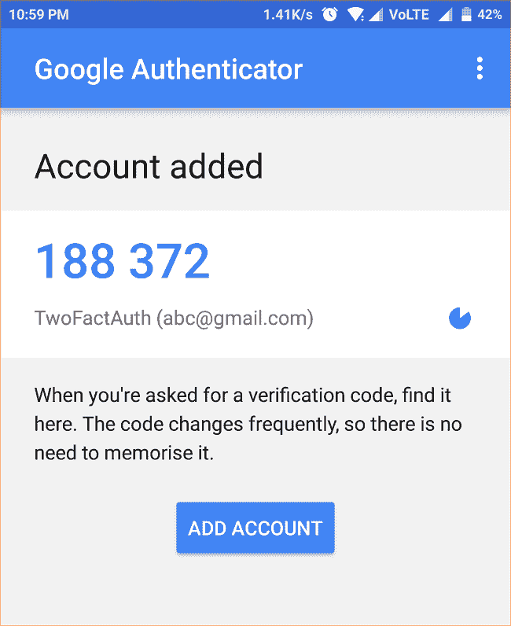***

***将此 pin 码放入验证码文本框，点击验证。成功验证后，您将看到类似于下图所示的屏幕。这将为您的帐户提供恢复代码，万一您被锁定，这将有助于恢复您的帐户。记下这些代码，并将它们保存在安全的地方。***

**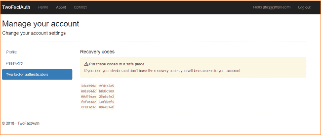**

**因此，双因素身份验证设置完成。让我们检查一下我们的双因素身份认证是否正常工作。**

### **执行演示**

**注销应用程序，然后再次单击登录。输入您注册的电子邮件 id 和密码，然后点击登录。**

**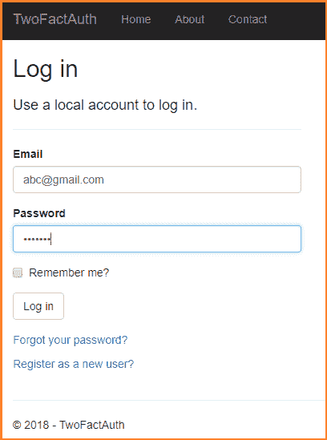**

**现在，您可以看到一个双因素身份认证屏幕，要求输入身份认证码。输入你的谷歌认证应用程序生成的代码，然后点击登录。您将成功登录到应用程序并导航到主页。**

**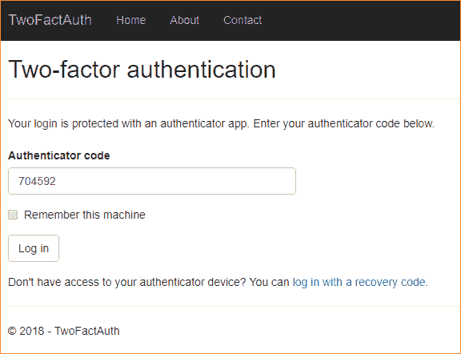**

**如果您选中“记住这台机器”选项，那么它将不会再次在同一台机器上要求验证码。在这种情况下，您可以跳过双因素身份验证。**

### **结论**

**我们已经使用 [qrcode.js](https://davidshimjs.github.io/qrcodejs/) JavaScript 库成功生成了一个 QR 码，并使用它来配置 Google Authenticator 应用程序。该应用程序将生成一个六位数的 TOTP，您需要在登录到 web 应用程序时输入。这在 ASP.NET 核心应用程序中实现了双因素身份验证。**

**你也可以在 [C#角](https://www.c-sharpcorner.com/article/asp-net-core-two-factor-authentication-using-google-authenticator/)找到这篇文章。**

**你可以看看我关于 ASP 的其他文章。网芯[这里](http://ankitsharmablogs.com/category/asp-net-core/)。**

### **请参见**

*   **[使用 ASP.NET 核心 2.0 进行 Cookie 认证](http://ankitsharmablogs.com/cookie-authentication-with-asp-net-core-2-0/)**
*   **[在 ASP.NET 核心 2.0 中使用脸书进行认证](http://ankitsharmablogs.com/authentication-using-facebook-in-asp-net-core-2-0/)**
*   **[在 ASP.NET 核心 2.0 中使用谷歌认证](http://ankitsharmablogs.com/authentication-using-google-asp-net-core-2-0/)**
*   **[在 ASP.NET 核心 2.0 中使用 Twitter 认证](http://ankitsharmablogs.com/authentication-using-twitter-in-asp-net-core-2-0/)**
*   **[在 ASP.NET 核心 2.0 中使用 LinkedIn 进行身份验证](http://ankitsharmablogs.com/authentication-using-linkedin-asp-net-core-2-0/)**

**最初发表于 https://ankitsharmablogs.com/**