# 如何设置自己的乳齿象实例

> 原文：<https://www.freecodecamp.org/news/how-to-set-up-your-own-mastodon-instance/>

乳齿象是一个基于 [ActivityPub](https://www.w3.org/TR/activitypub/) 协议的分散式联合社交媒体平台。它允许您跨多个实例关注朋友并与之互动。

在本文中，您将了解 freeCodeCamp 如何建立我们自己的乳齿象实例——以及您可以如何做。

## 乳齿象是什么？

想象一下，如果 Twitter 有多个不同的网站。在每一个网站上，你都可以创建一个账户(如果你有野心的话，可以在所有的网站上创建一个)。

然后，你可以使用你的帐户在任何其他网站上关注你的任何朋友。您可以将他们的内容重新发布到您的帐户，并在一条时间线上查看您关注的所有帐户的活动。

虽然乳齿象是目前最受欢迎的平台，但也有其他选择，如 [Misskey](https://github.com/misskey-dev/misskey) 、 [Pleroma](https://git.pleroma.social/pleroma/pleroma) 以及它们的各种分支。

这些平台中的一些将能够彼此联合，具有跨平台的能力，而另一些则不能。

## Mastadon 入门

要开始我们为 freeCodeCamp 所遵循的流程，您需要做几件事情:

*   一个数字海洋的账户
*   DNS 提供商(我们使用 [Cloudflare](https://cloudflare.com) )。

首先登录数字海洋，创建一个新的水滴。在图像选项中，选择市场选项卡。然后，搜索乳齿象图像——这将为您处理好一部分设置。

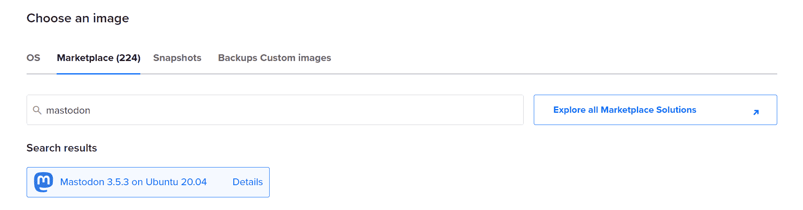

根据你自己的需要配置其余的 droplet 设置——对于大小，我们从 12 美元的选项开始，计划根据需要进行扩展。

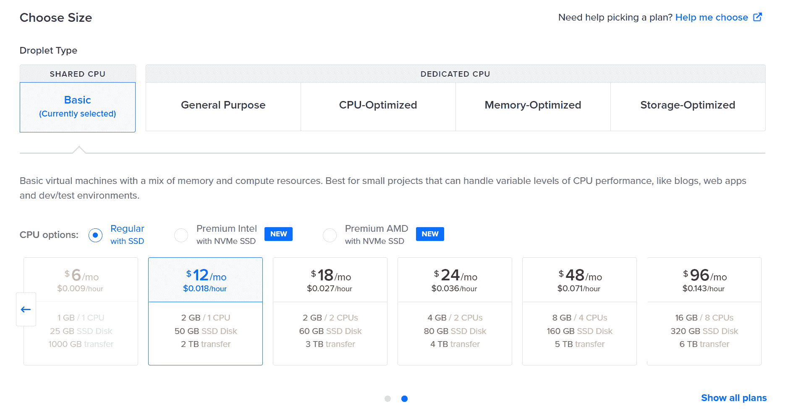

droplet 完成配置后，复制 IP 地址。为你的域或子域设置一个指向你的 droplet 的 A 记录- **在你 SSH 进入 droplet** 之前这样做。

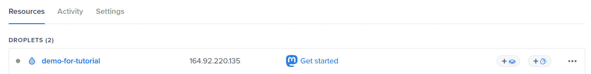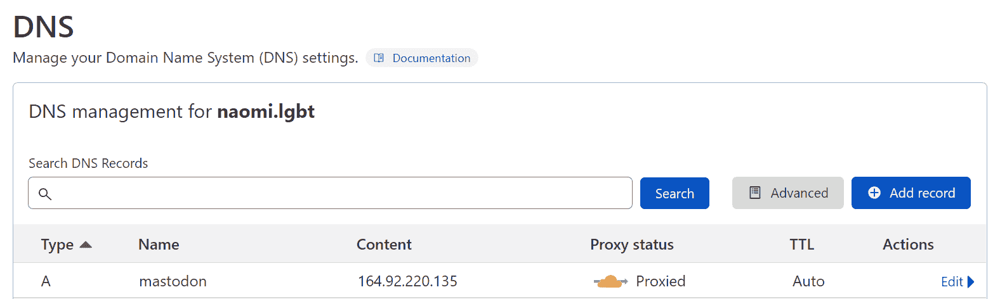

一旦你的 DNS 准备好了，作为`root`用户 SSH 进入 droplet。

## 如何设置你的乳齿象实例

当您第一次使用 SSH 进入服务器时，自动设置工具将会运行。

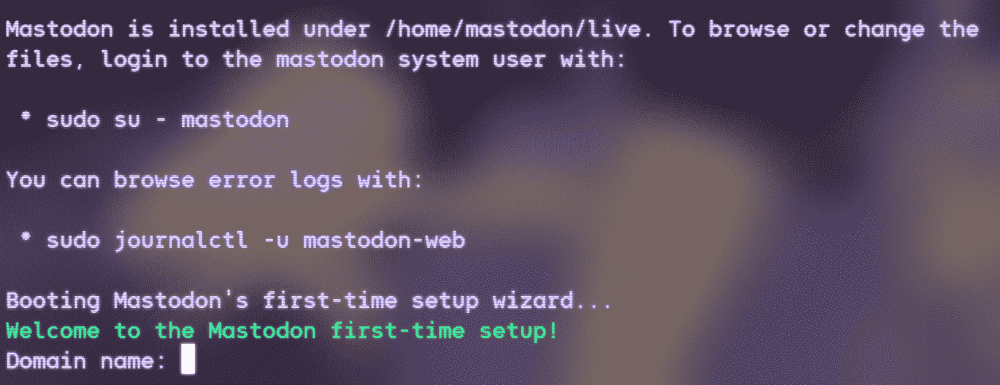

按照提示操作:

*   对于`Domain name`，输入您刚刚设置的新域/子域记录。
*   该工具将询问您是否希望将用户上传的文件存储在云上。如果你这样做，你需要提供一个存储供应商，如亚马逊 S3 的凭据。
*   Mastodon 需要一个 SMTP 服务器来处理电子邮件通知和注册流程。你既可以建立自己的服务，也可以为像 [SendGrid](https://sendgrid.com) 这样的服务提供凭证。
*   SMTP 流将提示您发送测试电子邮件。这是*强烈推荐的*，因为这将确认你的 SMTP 设置是正确的。如果不是，安装向导将提示您重新输入。

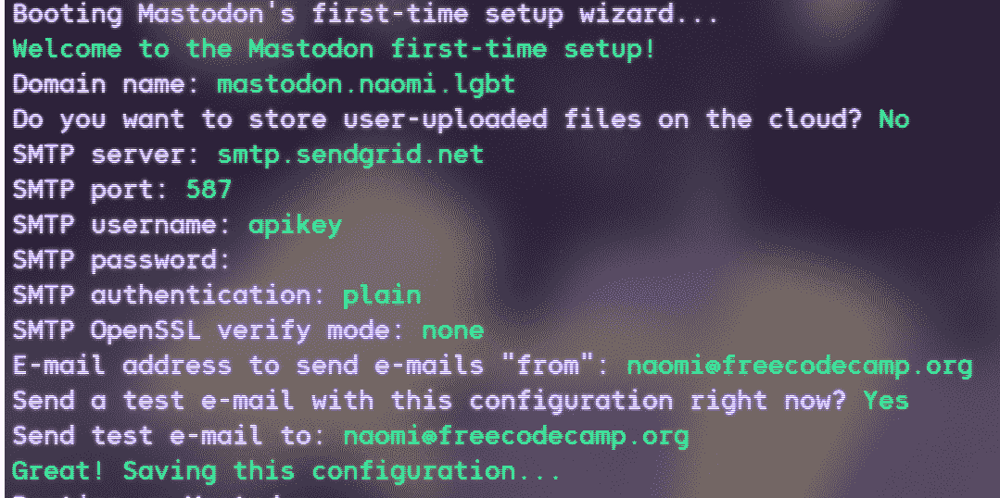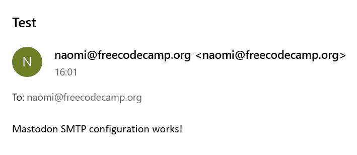

接下来，您将创建一个乳齿象帐户作为管理员。这可以是您的个人帐户，也可以是您团队中的共享帐户。

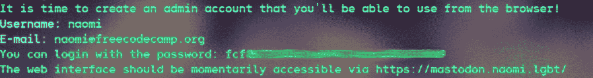

最后，系统会提示您输入您的电子邮件以接收 LetsEncrypt 证书续订通知。

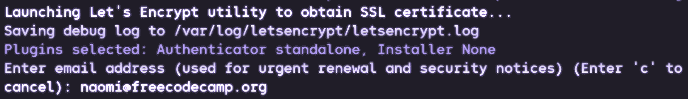

几分钟后，您的实例应该启动并运行。

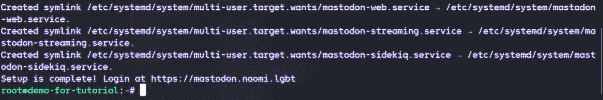

## 如何配置 Mastadon 实例

访问你的新域/子域应该显示乳齿象登陆页面。

使用您之前生成的管理员凭据登录。然后，选择右边工具条上的`Preferences`，接着选择左边的`Administration` - > `Site Settings`。

在这里，您可以配置与您的实例相关的基本信息，并上传您的品牌资产。

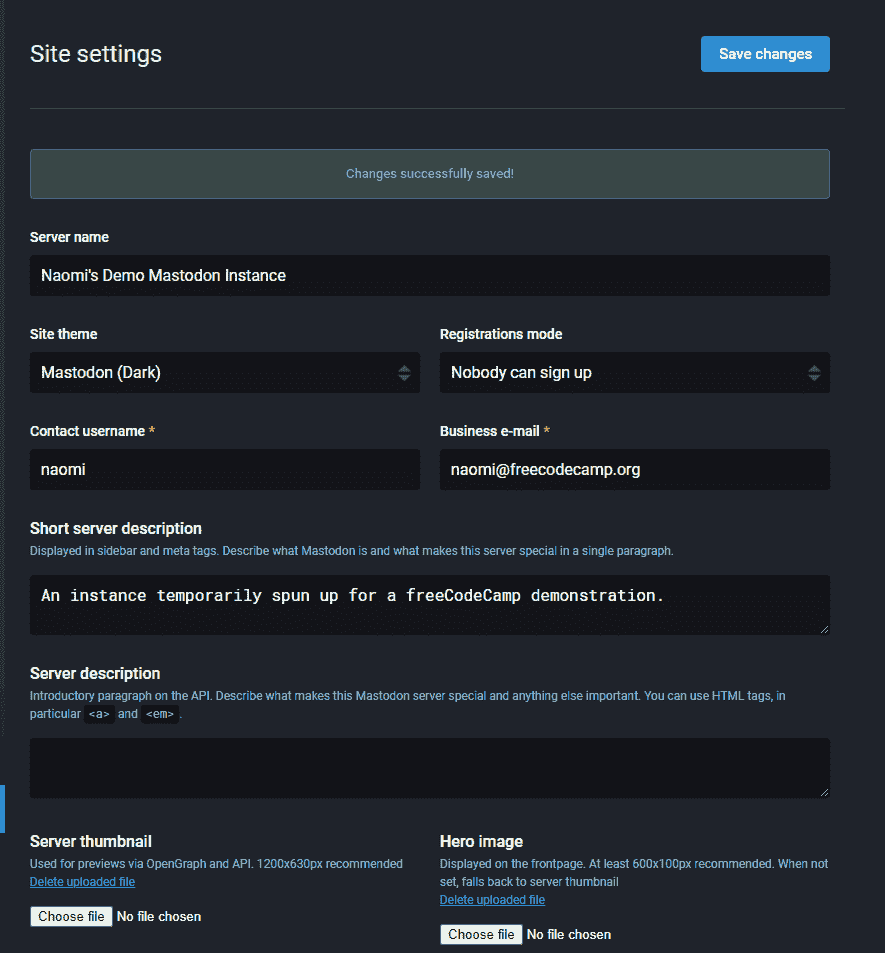

这些将显示在您的实例的`/about`页面上，在用户注册/登录时向他们显示(并在页脚中提供)。

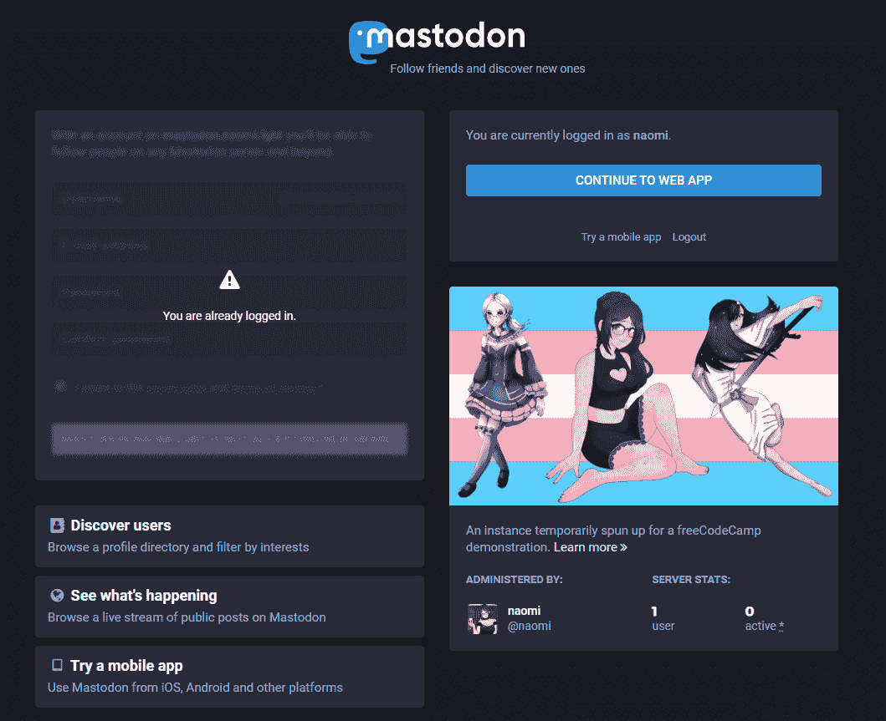

当您准备好开始接受用户注册时，将`Registration mode`设置更改为`Anyone can sign up`或`Approval required for sign up`。

## 如何管理用户

在设置中的`Moderation`->-`Accounts`标签下，可以看到已注册和待注册的用户。

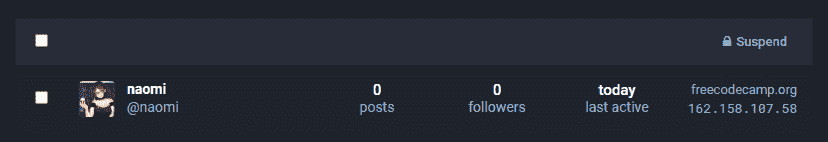

如果您点击用户名，您将进入用户管理视图。

在该屏幕上，您可以管理他们的权限级别(即授予审核或管理员状态)，检查 IP 信息，以及阻止电子邮件域。

您的审核团队还可以在用户帐户上留下私人注释(仅对团队可见)，以帮助保留任何审核问题的历史记录。

## 结论

现在，您的实例已经启动并运行，您可以随意查看设置和交互选项。有关各种选项的更多信息，请查看官方文档。

你可以在我们的私人实例上找到 freeCodeCamp 核心团队和志愿者版主，在这里你可以从你刚刚创建的实例开始关注我们。

享受你的新平台，祝你编码愉快！

*来自乳齿象[品牌更新页面](https://blog.joinmastodon.org/2022/06/mastodon-branding-updates/)的封面图片。*