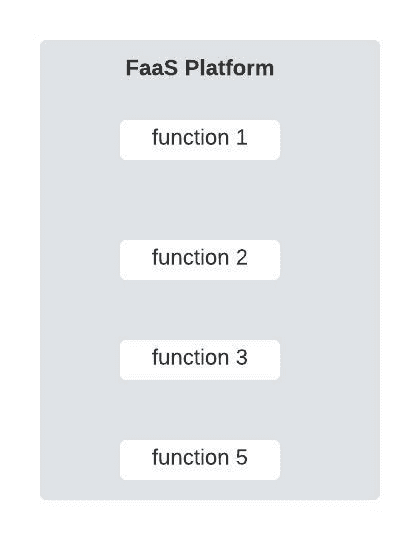
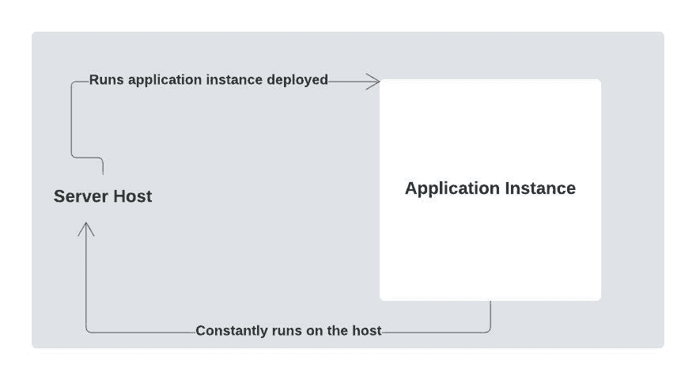
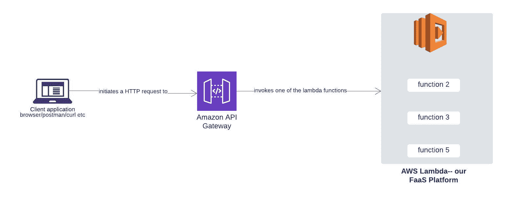
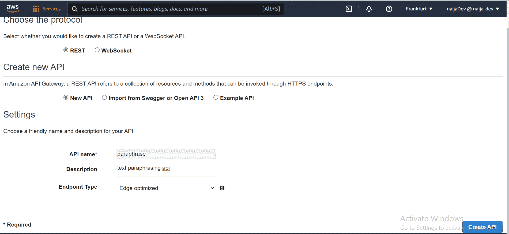
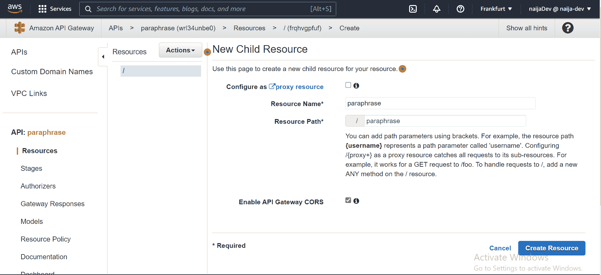
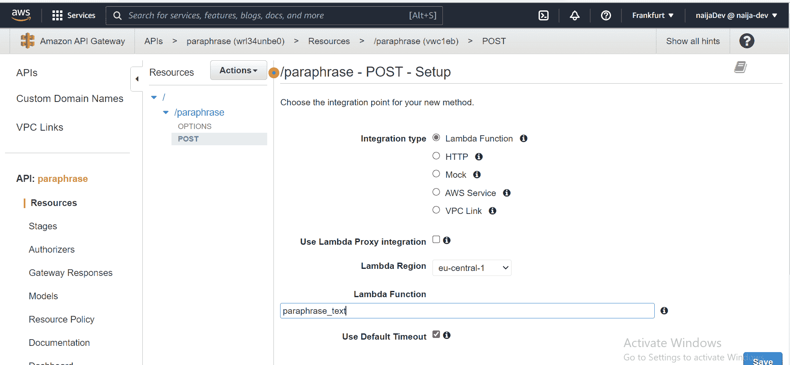
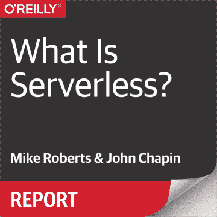

# 如何用 AWS Lambda 和 API 网关设置一个基本的无服务器 REST API

> 原文：<https://www.freecodecamp.org/news/how-to-setup-a-basic-serverless-backend-with-aws-lambda-and-api-gateway/>

作为开发人员，我们总是试图优化从人们如何交流到人们如何购物的一切。目标是让人类变得更有生产力。

本着让人类更有生产力的精神，软件开发领域出现了大量的开发人员生产力工具。

软件基础设施领域尤其如此。创新者正在创建解决方案，使开发人员能够更多地关注编写实际的业务逻辑，而不是世俗的部署问题。

改善开发人员体验和降低成本的需求是无服务器计算的一些核心驱动因素。但是什么是无服务器计算呢？这就是本指南的关键所在。这是一个重要的问题，我们会解决的。

为了帮助您浏览本指南，我将它分为两部分:

*   在第一部分中，我们将从了解什么是无服务器开始。
*   在第二部分中，我们将使用 AWS Lambda 和 API Gateway 建立一个基本的无服务器 REST API。

我们开始吧，好吗？

## 什么是无服务器？

要了解什么是无服务器，首先我们需要了解什么是服务器，以及它们是如何随着时间的推移而发展的。等等，服务器？

是的，当我们构建软件系统时，大多数时候我们是为人们构建的。因此，我们让这些应用程序可以在互联网上找到。

理想情况下，让应用程序可被发现需要将该应用程序上传到一台全天候运行且速度超快的特殊计算机上。这台特殊的计算机被称为服务器。

### 服务器的发展

二十年前，当公司想要将他们开发的软件上传到服务器上时，他们必须购买一台物理计算机，配置这台计算机，然后将他们的应用程序部署到这台计算机上。

如果他们需要上传几个应用程序，他们还必须获得并设置多个服务器。一切都是现场完成的。

但是没过多久，人们就注意到以这种方式接近服务器会带来许多问题。

还有开发人员生产力的问题:开发人员的注意力分散在编写代码和处理为代码服务的基础设施上。这个问题很容易通过让其他人来处理基础设施问题来解决，但这会导致第二个问题:

成本的问题。这些处理基础设施问题的人必须得到报酬，对吗？事实上，仅仅是为看似基本的测试应用程序购买服务器本身就是一件昂贵的事情。

此外，如果我们开始考虑其他因素，如在流量激增时扩展服务器的计算能力，或者只是随着时间的推移更新服务器的操作系统和驱动程序...好吧，你会开始看到保持一个内部服务器是多么令人疲惫。人们渴望更好的东西。有必要。

亚马逊在 2006 年宣布发布亚马逊网络服务(AWS)时就对这种需求做出了回应。众所周知，AWS 扰乱了软件基础设施领域。这是传统服务器的革命性转变。

AWS 消除了组织设置内部服务器的需要。取而代之的是，组织甚至个人只需支付一些费用，就可以通过互联网将他们的应用程序上传到亚马逊的电脑上。这种*服务器即服务*模式宣告了云计算的开始。

## 什么是云计算？

云计算从根本上讲是在别人的电脑上存储文件或执行代码(有时两者都有)，通常是通过网络。

像 AWS、Microsoft Azure、Google Cloud Platform、Heroku 和其他云计算平台的存在是为了减轻人们必须设置和维护自己的服务器的压力。

云计算的独特之处在于，你可以在尼日利亚租一台在美国的电脑。然后，您可以访问您租借的电脑，并通过互联网进行操作。本质上，云供应商为我们提供了上传和运行定制软件的计算环境。

我们从这些提供者那里得到的环境是已经进步的东西，现在以不同的形式存在。

在云计算术语中，我们使用术语**云计算模型**来指代大多数云供应商提供的不同环境。云计算场景中的每个新模型通常都是为了提高开发人员的工作效率，减少基础设施和劳动力成本而创建的。

例如，当 AWS 首次推出时，它有弹性计算云(EC2)服务。EC2 在结构上是一台裸机。支付 EC2 服务费用的人将不得不做大量的配置工作，比如安装操作系统、数据库，并且只要他们拥有这项服务，就要维护这些东西。

虽然 EC2 提供了很大的灵活性(例如，您可以安装任何您想要的操作系统)，但它也需要大量的工作。EC2 和其他云提供商的其他类似服务都属于云计算模式，称为**基础设施即服务(IaaS)。**

无需购买物理机并在内部进行设置，这使得 IaaS 模型比内部服务器模型更具优势。但是，所有者必须配置和维护许多东西的事实使得 IaaS 模型不太容易使用。

IaaS 模型的劳动密集型需求(从开发人员/客户的角度来看)最终也成为了一个关注点。为了解决这个问题，下一个云计算模型**平台即服务(PaaS)**诞生了。

IaaS 的主要问题是必须配置和维护很多东西。例如，操作系统安装、补丁升级、发现等等。

在 PaaS 模型中，所有这些都是抽象的。PaaS 模型中的机器预装了操作系统，机器上的补丁升级和其他工作由供应商负责。

在 PaaS 模型中，开发人员只部署他们的应用程序，云提供商处理一些底层的东西。虽然这种模型更容易使用，但它也意味着灵活性较低。AWS 和 Heroku 的 Elastic Beanstalk 就是这种模式的一些例子。

不可否认，PaaS 模型消除了大部分枯燥的配置和维护任务。但是除了让我们的软件在互联网上可用的任务之外，人们也开始认识到 PaaS 模型的一些局限性。

例如，在 IaaS 和 PaaS 模型中，开发人员必须手动处理服务器计算能力的伸缩。此外，对于 IaaS 和 PaaS 平台，大多数供应商对他们的服务收取固定费用(想想 Heroku)——不是基于使用量。

在根据使用情况收费的情况下，这通常不是很精确。最后，在 IaaS 和 PaaS 模型中，应用程序都是长期存在的(即使没有请求传入，也总是在运行)。这进而导致服务器资源的低效使用。

以上担忧搅动了云的下一次进化。

### 无服务器计算的兴起

就像 IaaS 和 PaaS 一样，无服务器也是一种云计算模式。这是继 PaaS 之后云的最新发展。像 IaaS 和 PaaS，有了无服务器，就不用买物理电脑了。

此外，就像在 PaaS 模型中一样，您不必大量配置和维护服务器。此外，无服务器模型更进一步:它不再需要管理长期存在的应用程序实例，也不再需要根据流量手动增减服务器资源。付费恰恰是基于使用量，安全顾虑也是抽象出来的。

在无服务器模式中，您不再需要担心任何与基础设施相关的事情，因为云提供商会处理所有这些事情。这正是无服务器模式的意义所在:允许开发人员和整个组织专注于他们项目的动态方面，同时将所有基础设施问题留给云提供商。

字面上的*所有的*基础设施问题，从设置和维护服务器到自动将服务器资源从零扩展到零，以及安全问题。事实上，无服务器模式的一个致命特点是，根据用户部署的软件处理的请求数量来精确地向用户收费。

因此，我们现在可以说，无服务器是我们用来指代任何云解决方案的术语，它消除了我们通常需要担心的所有基础架构问题。比如 AWS Lambda，Azure 函数等等。

我们还使用术语“无服务器”来描述设计用于部署到无服务器环境或与之交互的应用程序。嗯，怎么会呢？

### 功能即服务与后端即服务

所有无服务器解决方案都属于以下两类之一:

*   **功能即服务(FaaS)** 和
*   后端即服务(BaaS)。

**巴斯，FaaS—**尼奥，这变得相当复杂了:-(

我知道，但是别担心，你会得到的

如果云产品取代了我们通常自己编码或管理的应用程序的某些组件，它就被认为是一种无服务器的 BaaS。

例如，当您使用 Google 的 Firebase 身份验证服务或 Amazon 的 Cognito 服务来处理项目中的用户身份验证时，您就利用了 **BaaS** 产品。

云产品被认为是一种 **FaaS** ，如果它不需要将我们的应用程序部署为单个实例，然后在主机中作为进程运行，那么它也是无服务器的。相反，我们将应用程序分解成粒度函数(每个函数理想地封装了单个操作的逻辑)。每个功能然后被部署到 **FaaS** 平台。

太抽象了？好的，请看下图:



From Left-to-Right: Deploying an Application to a FaaS platform, Deploying an application to a non-FaaS platform. Source: Author

从上图可以看出，FaaS 平台提供了一种完全不同的应用部署方式。我们以前从未见过这样的情况:没有主机和应用程序进程。因此，我们没有一些持续运行并监听请求的代码。

相反，我们有一些只在被调用时才运行的函数，它们在处理完被调用执行的任务后就会被拆除。

你可能会问，如果这些函数不总是运行并监听请求，那么它们是如何被调用的呢？

所有 FaaS 平台都是事件驱动的。本质上，我们部署的每个功能都映射到某个事件。当该事件发生时，该功能被触发。

概括地说，我们使用术语“无服务器”来描述功能即服务或后端即服务云解决方案，其中:

1.  我们不必为我们部署的应用程序管理长期存在的应用程序实例或主机。
2.  我们不必根据流量手动扩大/缩小计算资源，因为服务器会自动为我们这样做。
3.  定价完全基于使用情况

此外，任何基于大量 BaaS 解决方案构建的应用程序，或旨在部署到 FaaS 平台的应用程序，甚至两者都是，都可以被视为无服务器应用程序。

既然我们已经完全了解了什么是无服务器，那么让我们看看如何用 AWS Lambda 和 AWS API Gateway 来建立一个最小的无服务器 REST API。

## 无服务器示例项目

在这里，我们将使用 AWS lambda 和 API Gateway 建立一个最小的，也许是无趣的无服务器 REST API。

**AWS Lambda，API Gateway—**请问这些东西是什么？

它们是无服务器云解决方案。记得我们说过，所有无服务器云解决方案都属于两个类别之一:BaaS 和 FaaS。AWS Lambda 是一个功能即服务平台，API Gateway 是一个后端即服务解决方案。

你可能会问，API Gateway 如何成为后端即服务平台？

嗯，通常我们自己在应用程序中实现路由。有了 API Gateway，我们就不必这么做了——相反，我们将路由任务交给了 API Gateway。

**AWS Lambda、API Gateway、我们的应用—**所有这些是如何连接的？

联系很简单。AWS Lambda 是我们部署实际应用程序代码的地方。但是因为 AWS Lambda 是一个 FaaS 平台，我们将把我们的应用程序分成粒度函数，每个函数处理一个操作。然后我们将每个功能部署到 AWS Lambda。

哦，好吧，但是 API 网关在哪里呢？

像所有其他 FaaS 平台一样，AWS Lambda 是事件驱动的。这意味着，当你在平台上部署一个功能时，这个功能只在它所绑定的事件发生时才起作用。

事件可以是任何东西，从 HTTP 请求到上传到 s3 的文件。

在我们的例子中，我们将部署一个最小的 REST API 后端。因为我们正在走向无服务器，更确切地说是 FaaS 方式，我们将把 REST 后端分解成独立的功能。每个函数都与一些 HTTP 请求相关联。

实际上，我们将只编写一个函数。

API Gateway 是一种工具，我们将使用它将请求与我们部署的功能联系起来。因此，当特定的请求到来时，该函数被调用。

把 API 网关想象成路由即服务工具:-)。下图描述了上述实体之间的关系。



API Gateway + AWS Lambda. Source: Author

好吧，我明白了。下一步是什么？

### 让我们在 AWS xD 上配置一些东西

这里的主要任务是构建一个最小的释义工具。我们将创建一个 REST 端点，它接受 POST 请求，并将一些文本作为有效负载。然后，我们的端点将返回该文本的释义版本作为响应。

为了实现这一点，我们将编写一个 lambda 函数来实际解释文本块。然后，我们将我们的函数连接到 API 网关，这样每当有 POST 请求时，我们的函数就会被触发。

但是首先，我们需要配置一些东西。按照以下部分中的步骤配置完成本部分任务所需的全部内容。

注意:后续章节中的一些步骤直接改编自 [AWS 的无服务器教程。](https://aws.amazon.com/getting-started/hands-on/build-serverless-web-app-lambda-apigateway-s3-dynamodb-cognito/)

### 步骤 1:创建一个 AWS 帐户

要在 AWS 上创建帐户，请遵循本指南[模块 1 中的步骤。](https://aws.amazon.com/getting-started/guides/setup-environment/)

### 步骤 2:在 AWS 上编写 Lambda 函数

记住，我们需要一个函数来完成实际的文本解释，这就是我们要做的。按照以下步骤创建 lambda 函数:

1.  使用步骤 1 中的凭据登录到您的 AWS 帐户。在搜索字段中，输入“lambda”，然后从显示的服务列表中选择 **Lambda** 。
2.  点击 Lambda 页面上的**创建函数**按钮。
3.  从头开始保持默认的**作者**卡被选中。
4.  在**名称**字段中输入*释义 _ 文本*。
5.  为**运行时**选择 **Python 3.9** 。
6.  保留所有其他默认设置，点击**创建功能**。
7.  向下滚动到**功能代码**部分，用下面的代码替换 **lamda_function.py** 代码编辑器中的现有代码:

```
import http.client

def lambda_handler(event, context):
    # TODO implement
    conn = http.client.HTTPSConnection("paraphrasing-tool1.p.rapidapi.com")

    payload = event['body']
    headers = {
        'content-type': "application/json",
        'x-rapidapi-host': "paraphrasing-tool1.p.rapidapi.com",
        'x-rapidapi-key': "your api key here"
    }

    conn.request("POST", "/api/rewrite", payload, headers)
    res = conn.getresponse()
    data = res.read()

    return {
        'statusCode': 200,
        'body': data
    } 
```

我们使用这个 API 来解释功能。前往该页面，订阅基本计划，并获取 API 密钥(这是免费的)。

### 步骤 3:在 AWS 上测试我们的 Lambda 函数

这里，我们将使用一个样本输入来测试我们的 lambda 函数，看看它是否产生了预期的行为:解释传递给它的任何文本。

要测试刚刚创建的 lambda 函数，请遵循以下步骤:

1.  在您的功能的主编辑屏幕上，从**测试**下拉菜单中选择**配置测试事件**。
2.  保持选择**创建新的测试事件**。
3.  在**事件名称**字段中输入 *TestRequestEvent*
4.  将以下测试事件复制并粘贴到编辑器中:

```
{
  "path": "/paraphrase",
  "httpMethod": "POST",
  "headers": {
    "Accept": "*/*",
    "content-type": "application/json; charset=UTF-8"
  },
  "queryStringParameters": null,
  "pathParameters": null,
  "body": "{\r\"sourceText\": \"The bone of contention right now is how to make plenty money. \"\r\r\n    }"
} 
```

您可以将正文替换为您想要的任何内容。粘贴完上面的代码后，继续下面的步骤:

1.  点击**创建。**
2.  在主功能编辑界面上，点击**测试**，在下拉菜单中选择 *TestRequestEvent* 。
3.  滚动到页面顶部，展开**执行结果**部分的**细节**部分。
4.  验证执行成功，并且函数结果如下所示:

```
Response
{
  "statusCode": 200,
  "body": "{\"newText\":\"The stumbling block right now is how to make big bucks.\"}"
} 
```

如上所述，我们传递给 lambda 函数的原始文本已经被改写。

### 步骤 3:通过 API 网关公开我们的 Lambda 函数。

既然我们已经编写了 lambda 函数，并且它工作了，在这里，我们将通过一个接受 POST 请求的 REST 端点来公开该函数。一旦请求被发送到该端点，我们的 lambda 函数将被调用。

按照以下步骤通过 API 网关公开您的 lambda 函数:

#### 创建 API

1.  在搜索字段中，搜索并选择 **API 网关**
2.  在 API Gateway 页面上，**选择 API 类型**标题下有四个卡片。转到 **REST API** 卡，点击**构建。**
3.  接下来，提供下图所示的所有必需信息，并点击**创建 API。**



For endpoint type, select *Edge optimized*

#### 创建资源和方法

**资源，方法？**在上面的步骤中，我们创建了一个 API。但是 API 通常有端点。端点通常指定路径和它支持的 HTTP 方法。例如 GET /get-user。在这里，我们把路径资源称为方法，把与路径相关联的 HTTP 动词称为方法。因此，资源+方法= REST 端点。

这里，我们将创建一个 REST 端点，它将允许用户传递一个文本块来解释我们的 lambda 函数。请按照以下步骤完成:

*   首先从**操作**下拉菜单中选择**创建资源。**接下来，填写输入字段并勾选下图所示的复选框，然后点击**创建资源。**



You could replace resource name and resource path with anything you see fit. Notice how we've also enable CORS.

*   选中新创建的*/释义*资源，从**动作**下拉菜单中选择**创建方法**。
*   从出现的新下拉菜单中选择*帖子*，然后**点击复选标记**。
*   提供下图所示的所有其他信息，然后点击**保存。**



lambda function is the name of the function we create in one of the previous steps.

#### 部署 API

*   在**动作**下拉列表中，选择**部署 API** 。
*   在**部署阶段**下拉列表中选择**【新阶段】**。
*   为**艺名**输入*制作*或者随便什么*T3。*
*   选择**部署**。
*   注意，调用 URL 是 API 的基本 URL。应该是这样的:[https://wrl34unbe0.execute-api.eu-central-1.amazonaws.com/](https://wrl34unbe0.execute-api.eu-central-1.amazonaws.com/production){艺名}
*   要测试您的端点，您可以使用 postman 或 curl。将端点的路径附加到调用 URL 的末尾，如下所示:[https://wrl34unbe0.execute-api.eu-central-1.amazonaws.com/](https://wrl34unbe0.execute-api.eu-central-1.amazonaws.com/production){ stage name }/paraphrase。当然，请求方法应该是 POST。
*   测试时，也将预期的有效负载添加到请求中，如下所示:

```
{
    "sourceText": "The bone of contention right now is how to make plenty money.   
} 
```

## 包装东西

就这样了。首先我们学习了无服务器这个术语，然后我们继续用 AWS Lambda 和 API Gateway 建立了一个轻量级无服务器 REST API。

然而，无服务器并不意味着完全没有服务器。它本质上是关于拥有一个部署流程，在这个流程中，您不必担心服务器。服务器仍然存在，但是由云提供商负责维护。

如果我们在 BaaS 技术的基础上构建我们应用程序的重要组件，或者每当我们构建我们的应用程序以兼容任何 FaaS 平台时(或者当我们两者都做时)，我们每次都将走向无服务器。

谢谢你读到这一步。想要连接吗？你可以在 [Twitter](https://twitter.com/nyior_clement) 、 [LinkedIn](https://www.linkedin.com/in/nyior/) 或 [GitHub 上找到我。](https://github.com/Nyior)

### 参考

[What Is Serverless?Although the cloud has revolutionized the way we manage applications, many companies still view their systems in terms of servers—even though they no longer work with physical servers. What if … - Selection from What Is Serverless? [Book]Mike Roberts, John ChapinO’Reilly Online Learning](https://learning.oreilly.com/library/view/what-is-serverless/9781491984178/)

封面图片:[hestabit.com](https://www.hestabit.com/blog/serverless-architecture-explained/)