# 如何使用 GitHub 操作和 AWS 设置 CI/CD 管道

> 原文：<https://www.freecodecamp.org/news/how-to-setup-a-ci-cd-pipeline-with-github-actions-and-aws/>

在本文中，我们将学习如何使用 GitHub 操作和 AWS 设置 CI/CD 管道。我将指南分为三个部分来帮助您完成:

首先，我们将介绍一些重要的术语，这样你就不会迷失在一大堆流行词汇中。

其次，我们将设置持续集成，这样我们就可以自动运行构建和测试。

最后，我们将设置连续交付，这样我们就可以自动将代码部署到 AWS。

好吧，那是很多。让我们从深入了解这些术语开始，这样您就能准确理解我们在这里做什么。

## 第一部分:揭开沉重的流行语的神秘面纱

理解这篇文章标题的关键在于理解 CI/CD 管道、GitHub 动作和 AWS 这些术语。

如果您已经很好地理解了这些术语，您可以直接跳到第 2 部分。

### 什么是 CI/CD 管道？

CI/CD 管道仅仅是一种开发实践。它试图回答这个问题:*我们如何更快地将质量特性发布到我们的生产环境中？*换句话说，我们如何在不影响质量的情况下加快特性发布过程？

你可能会问，CI/CD 管道如何帮助我们加速特性发布过程？

下图描述了有或没有 CI/CD 管道的典型特性交付周期。

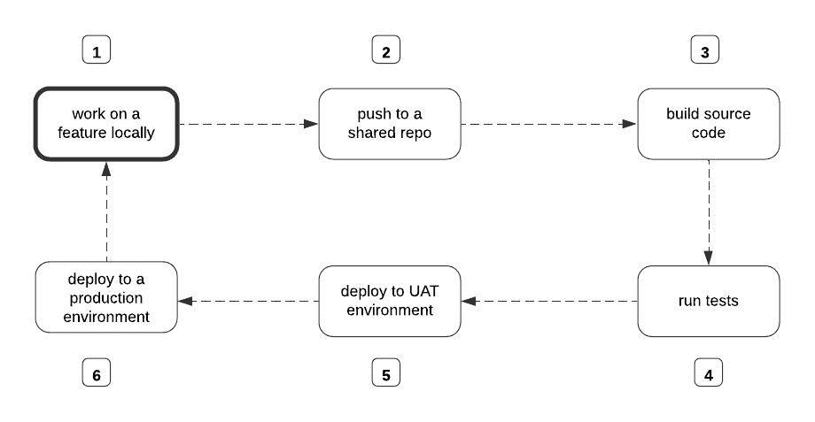

the feature release process. Source: Author

如果没有 CI/CD 管道，上图中的每个步骤都将由开发人员手动执行。本质上，要构建源代码，团队中的某个人必须手动运行命令来启动构建过程。运行测试和部署也是如此。

CI/CD 方法是从手工操作方式的彻底转变。它完全基于这样一个前提:如果我们自动化上图中的步骤 3-6，我们可以合理地加速特性发布过程。****

例如，通过 CI/CD 管道，我们建立了一种机制，它可以自动启动构建过程，运行测试，部署到用户验收测试(UAT)环境，并在团队成员每次将他们的变更推送到共享的 repo 时最终部署到生产环境。

持续集成发生在每次构建过程开始时，并且测试在新的变更上运行。

当一个新集成的变更被自动部署到 UAT 环境，然后从那里被手动部署到生产环境时，连续交付就发生了。

当 UAT 环境中的更新作为正式版本自动部署到生产环境时，就会发生连续部署。

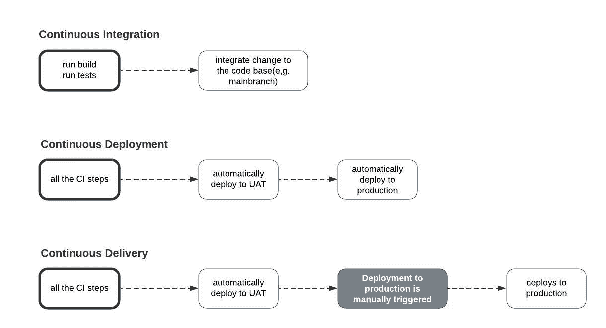

Continuous Integration vs Continuous Deployment vs Continuous Delivery. Source: Author

**注意:**如果从 UAT 环境到生产环境的部署是手动启动的，那么它是一个持续集成/持续交付设置。否则，它就是一个持续集成/持续部署设置。

然而，我们不禁要问，使 CI/CD 管道的不同阶段自动化的实体是什么？

我们可以使用各种工具来自动化 CI/CD 管道中的构建、测试和部署步骤，例如 CI Circle、Travis CI、Jenkins、GitHub Actions 等等。在本文中，我们将关注 GitHub 的动作。

### 什么是 GitHub 动作？

由于没有更好的方法让 GitHub Actions 这个术语变得非常容易理解，我打算把它过于简化。

在 CI/CD 管道中，GitHub Actions 是自动化枯燥工作的实体。可以把它想象成你创建的每个 GitHub 库附带的插件。

插件存在于你的 repo 上，执行你告诉它的任何任务。通常，您可以通过 YAML 配置文件来指定插件应该执行什么任务。无论您在配置文件中添加什么命令，都会用简单的英语翻译成如下内容:

“嘿 GitHub Actions，每次在 X branch 上打开一个 PR，自动构建并测试新的变更。并且每次新的变更被合并到或推送到 X 分支时，将该变更部署到 Y 服务器。”

GitHub Actions 的核心是五个概念:作业、工作流、事件、动作和运行者。

**作业** 是您通过 YAML 配置文件命令 GitHub Actions 执行的任务。工作可以是告诉 GitHub actions 构建你的源代码，运行测试，或者将已经构建好的代码部署到某个远程服务器上。

**工作流程**本质上是包含一个或多个逻辑相关工作的自动化流程。例如，您可以将生成和运行测试作业放入同一个工作流，而将部署作业放入不同的工作流。

还记得吗，我们提到过你通过配置文件告诉 GitHub Actions 执行什么任务，对吗？GitHub Actions 将你放在 repo 中某个文件夹的每个配置文件视为一个工作流*。*我们将在下一部分详细讨论这个文件夹。

因此，要为部署作业创建一个单独的工作流，然后创建一个不同的工作流来合并构建和测试作业，您必须向 repo 添加两个配置文件。但是如果您将所有三个作业合并到一个工作流中，那么您只需要添加一个配置文件。

**事件** 字面上是触发 GitHub 动作执行作业的事件。还记得我们提到过通过配置文件传递要执行的作业吗？在配置文件中，您还必须指定作业应该在什么时候执行。

比如是 on-PR to main？它是 on-push 到 main 吗？它是在-合并到主吗？当某些事件发生时，一个作业只能由 GitHub 动作执行。

好吧，让我快速纠正一下。在执行作业之前，并不总是必须发生某些事件。你也可以安排工作。

例如，在您的配置文件中，您可以安排它在每天凌晨 2 点发生，而不是指定应该触发构建和测试作业执行的事件。事实上，您既可以安排一个作业，也可以为该作业指定一个事件。

**动作** 是可以在配置文件中重用的命令。您可以编写自定义操作或使用现有的操作。

一台 **runner** 是 GitHub Actions 用来执行你交给它的任务的远程计算机。

例如，当基于某个事件触发构建和测试作业时，GitHub Actions 会将您的代码拉至该计算机并执行该作业。

在部署作业的情况下也会发生同样的事情。运行程序触发将构建的代码部署到您指定的某个远程服务器上。在我们的例子中，我们将使用一个叫做 AWS 的服务。

### 什么是 AWS？

AWS 代表亚马逊网络服务。它是亚马逊拥有的一个平台，这个平台允许你访问广泛的云计算服务。

**云计算**——我以为你说的不是大话？大多数时候，企业甚至个人开发者构建应用程序只是为了让其他人可以使用它们。因此，这些应用程序必须在互联网上可用。

理想情况下，让某些目标用户可以访问某个应用程序，需要将该应用程序上传到一台全天候运行且速度超快的特殊计算机上。

想象一下，在你可以让其他互联网用户使用你的应用程序之前，你必须拥有并安装一台这样的计算机。这是完全可行的，但是有很多障碍。

例如，如果您只想测试应用程序，该怎么办？你愿意承受仅仅为了测试而设置硬件基础设施的所有压力？此外，如果您想要上传 1000 个不同的应用程序，或者您的应用程序开始处理 10 亿个并发请求，该怎么办？事情开始变得复杂。

像 AWS 这样的云计算平台的存在就是为了减轻你所有的压力。这些平台已经有许多这种特殊的计算机安装并保存在称为数据中心的建筑物中。

他们允许您通过互联网将您的应用程序上传到他们预先配置好的计算机上，而不必从头开始设置您自己的硬件基础设施。作为回报，你付给他们一定的钱。

事实上，这些平台中的一些有免费计划，允许你测试小的应用程序。除了上传您的应用程序代码，这些平台中的一些还允许您托管您的数据库和存储您的媒体文件，以及其他功能。

最简单的形式是，云计算主要是通过网络在别人的电脑上存储或执行(有时两者都是)某些东西。

所以当我说 AWS 提供了广泛的云服务时，我只是说它为企业和个人提供了一些特殊的计算机，他们可以在那里上传他们的代码，数据库和媒体文件作为服务。

好了，现在我们已经完全理解了标题的不同部分，我们现在将以目标的形式重申它。这些目标将决定本文剩下的两部分将包含什么。

**目标 1:** 如何使用 GitHub Actions 在 push 或 PR 上自动构建和运行单元测试到主分支。

**目标 2:** 如何通过 GitHub Actions 在 push 上自动部署到 AWS 或者在 PR 上自动部署到主分支。

## 第 2 部分:持续集成——如何自动运行构建和测试

在这一节中，我们将看到如何配置 GitHub 操作来自动运行对 repo 主分支的 push 或 pull 请求的构建和测试。

### 先决条件

*   一个 Django 项目在本地设置，至少有一个视图返回一些已定义的响应。
*   为您定义的视图编写的测试用例。

我已经创建了一个演示 Django 项目，您可以从这个[资源库](https://github.com/Nyior/django-github-actions-aws)中获取:

`git clone [https://github.com/Nyior/django-github-actions-aws](https://github.com/Nyior/django-github-actions-aws)`

下载代码后，创建一个 virtualenv 并通过 pip 安装需求:

`pip install -r requirements.txt`

**注意:**该项目已经有了所有的文件，我们将继续增加。也许你仍然可以下载并试着理解文件的内容。这个项目当然没什么意思。它只是为了演示而创建的。

现在您已经在本地设置了 Django 项目，让我们来配置 GitHub 动作。

### 如何配置 GitHub 动作

好了，我们有了项目设置。我们还为我们定义的视图编写了一个测试用例，但最重要的是，我们已经将闪亮的变化推送到 GitHub。

目标是让 GitHub 在每次我们在 main/master 上推送或打开 pull 请求时触发一个构建并运行我们的测试。我们只是将更改推送到 main，但是 GitHub 动作并没有触发构建或者运行我们的测试。

为什么不呢？因为我们还没有定义工作流。请记住，工作流是我们指定希望 GitHub 操作执行的作业的地方。

事实上，Nyior，你怎么知道没有构建被触发，也没有工作流被定义？每个 GitHub repo 都有一个`Action`标签。如果您导航到该选项卡，您将知道一个 repo 是否定义了工作流。

**如何？**见下图。

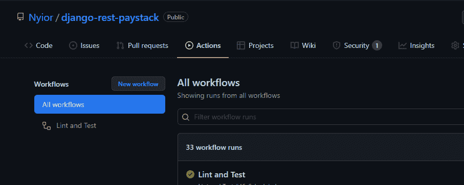

A GitHub Repo With a Workflow Defined on it

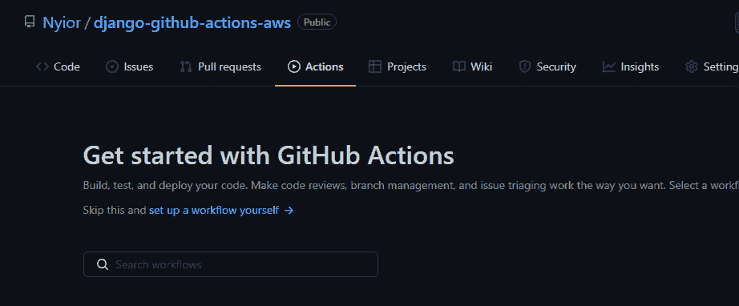

A GitHub Repo With No Workflow Defined on it

第一个映像中的第一个 repo 定义了一个名为“Lint and Test”的工作流。第二张图中的第二个回购没有工作流程，这就是为什么您看不到标题为“所有工作流程”的列表，这与第一个回购的情况不同。

哦，好吧，现在我明白了。那么，我如何定义我的回购工作流呢？

*   在项目目录的根目录下创建一个名为`.github`的文件夹。
*   在`.github`目录下创建一个名为`workflows`的文件夹:这是你创建所有 YAML 文件的地方。
*   让我们创建第一个包含构建和测试工作的工作流。我们通过创建一个扩展名为`.yml`的文件来做到这一点。让我们把这个文件命名为`build_and_test.yml`
*   在刚刚创建的`yaml`文件中添加以下内容:

```
name: Build and Test

on:
  push:
    branches: [main]
  pull_request:
    branches: [main]

jobs:
  test:
    runs-on: ubuntu-latest

    steps:
    - name: Checkout code
      uses: actions/checkout@v2
    - name: Set up Python Environment
      uses: actions/setup-python@v2
      with:
        python-version: '3.x'
    - name: Install Dependencies
      run: |
        python -m pip install --upgrade pip
        pip install -r requirements.txt

    - name: Run Tests
      run: |
        python manage.py test 
```

让我们理解上面文件中的每一行。

*   这是我们工作流程的名称。当您导航到“操作”选项卡时，您定义的每个工作流都将通过您在列表中指定的名称来标识。
*   在这里，您可以指定触发工作流执行的事件。在我们的配置文件中，我们给它传递了两个事件。我们将主分支指定为目标分支。
*   请记住，工作流只是工作的集合。
*   这是我们在此工作流程中定义的作业名称。你可以给它起任何名字。请注意，这是唯一的作业，而构建作业不在那里。这是 Python 代码，所以不需要任何构建步骤。这就是我们没有定义构建作业的原因。
*   GitHub 提供 Ubuntu Linux、Microsoft Windows 和 macOS 运行程序来运行您的工作流程。您可以在这里指定想要使用的流道类型。在我们的例子中，我们使用的是 Ubuntu Linux runner。
*   一个任务由一系列的`steps`组成，这些任务通常在同一个运行器上顺序执行。在我们上面的文件中，每一步都用连字符标记。`name`代表步骤的名称。每一步可能是正在执行的 shell 脚本，也可能是一个`action`。如果一个步骤正在执行一个`action`，那么用`uses`来定义它；如果它正在执行一个 shell 脚本，那么用`run`来定义它。

现在您已经通过在指定的文件夹中添加配置文件定义了一个`workflow`，您可以提交您的更改并将其推送到您的远程 repo。

如果您导航到远程 repo 的`Actions`选项卡，您应该会看到一个名为 Build and Test(我们给它起的名字)的工作流列在那里。

## 第 3 部分:持续交付——如何将我们的代码自动部署到 AWS

在这一节中，我们将看到如何让 GitHub Actions 根据主分支的 push 或 pull 请求自动将代码部署到 AWS。AWS 提供广泛的服务。在本教程中，我们将使用名为 Elastic Beanstalk 的计算服务。

### 计算服务？弹性豆茎？来吧

别担心，放松，你会得到它的。还记得我们提到过云计算就是通过互联网在别人的电脑上存储和执行某些东西吗？

是的。例如，我们可以存储和执行源代码，也可以只存储媒体文件。亚马逊知道这一点，因此他们的云基础设施包含了过多的服务类别。每个服务类别都允许我们从我们能做的某些事情中做*某些事情。*

例如，有一个服务类别允许上传和执行支持我们的应用程序的源代码(**计算服务)。**有一个服务类别允许我们保存我们的媒体文件(**存储服务)。**然后是允许我们管理数据库的服务类别(**数据库服务)**。

每个服务类别由一个或多个服务组成。一个类别中的每个服务只是为我们提供了一种不同的方法来解决它所属的类别所要解决的问题。

例如，计算类别中的每个服务都为我们提供了不同的方法来在云上部署和执行我们的应用程序代码——一个问题，不同的方法。 **Elastic Beanstalk** 是计算类的服务之一。其他的有，但不限于，EC2 和 Lambda。

**亚马逊 S3** 是存储类的服务之一。而**亚马逊 RDS** 是数据库类的服务之一。

希望你现在明白我所说的“我们将使用一种叫做弹性豆茎的计算服务”的意思在所有的计算服务中，为什么选择弹性豆茎？嗯，因为它是最容易合作的。

### 也就是说，让我们配置 Stuff <3

为了简洁起见，我们将使用连续交付设置。此外，我们将只有一个单一部署环境作为我们的 UAT 环境。

为了帮助您正确理解大图，总之，这是我们的部署设置将如何工作:在对 main 的 push 或 pull 请求中，GitHub Actions 将测试并上传我们的源代码到亚马逊 S3。代码然后从亚马逊 S3 被拉到我们的弹性 Beanstalk 环境中。想象一下这样的流程:

`GitHub -> Amazon S3 -> Elastic Beanstalk`

你可能会问，为什么我们不直接推出弹性豆茎？

使用我们当前的设置，我们可以将代码直接上传到 Elastic Beanstalk 实例的另一种方法是使用[AWS Elastic Beanstalk CLI](https://pypi.org/project/awsebcli/)(EB CLI)。

使用 EB CLI 需要运行一些 shell 命令，然后需要我们用一些输入来响应。

现在，如果我们从本地机器部署到 Elastic Beanstalk，当我们运行 EB CLI 命令时，我们将在那里输入所需的响应。但是根据我们目前的设置，这些命令将在 GitHub 运行程序上执行。我们不会在那里提供所需的响应。对于我们的用例来说，EB CLI 不是最简单的部署工具。

使用我们选择的方法，我们将运行一个 shell 命令将我们的代码上传到 S3，然后运行另一个命令将上传的代码拉至我们的 Elastic Beanstalk 实例。这些命令在运行时不需要我们提交一些响应。拥有 Amazon s3 步骤是最简单的方法。

要实现我们的方法并将我们的代码部署到 Elastic Beanstalk，请遵循以下步骤:

#### 步骤 1:设置 AWS 帐户

创建一个 IAM。为了简单起见，在添加权限时，只需为用户添加“管理员访问权限”(尽管这有一些安全隐患)。为此，请遵循本指南[模块 1 和模块 2 中的步骤。](https://aws.amazon.com/getting-started/guides/setup-environment/)

最后，请确保获取并保留您的 AWS 秘密和访问密钥。我们将在后面的章节中用到它们。

现在我们已经正确地设置了 AWS 帐户，是时候设置我们的弹性 Beanstalk 环境了。

#### 步骤 2:设置您的弹性 Beanstalk 环境

一旦登录到您的 AWS 帐户，采取以下步骤来设置您的弹性 Beanstalk 环境。

首先，在搜索栏中搜索“弹性豆茎”，如下图所示。然后点击弹性豆茎服务。

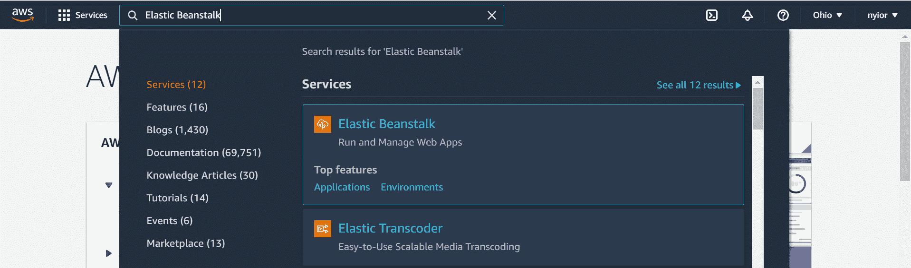

searching for elastic beanstalk.

一旦您在上一步中点击了 Elastic Beanstalk 服务，您将被带到下图所示的页面。在该页面上，单击“创建新环境”提示符。确保在下一步中选择“Web 服务器环境”。

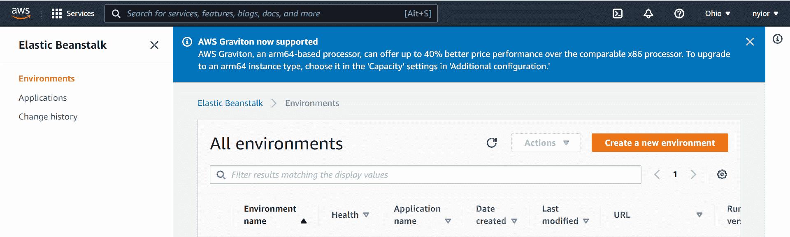

creating an environment

在上一页选择“Web 服务器环境”后，您将被带到下图所示的页面。

在该页面上，提交一个应用程序名称、一个环境名称，并选择一个平台。对于本教程，我们将使用 Python 平台。

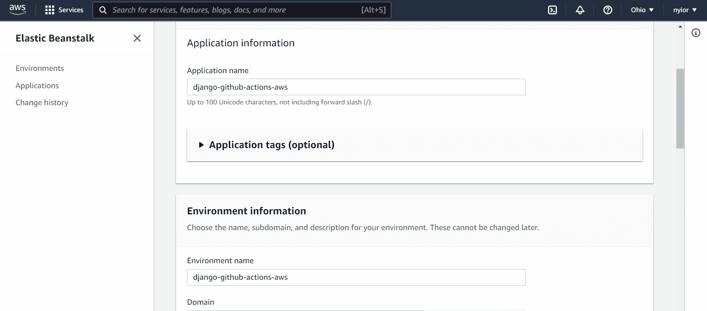

an application and an environment names

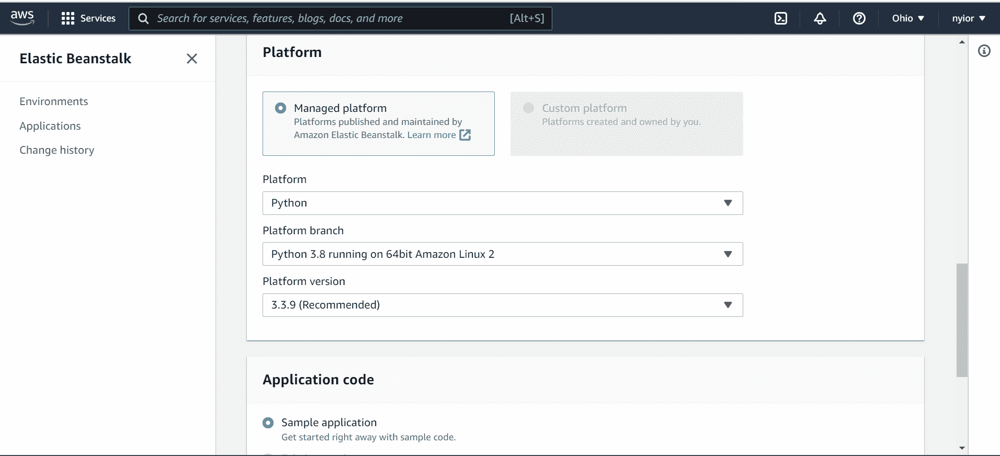

selecting a platform

一旦您提交了在上一步中填写的表单，过一会儿您的应用程序及其相关环境就创建好了。您应该会看到您提交的姓名显示在左侧栏上。

获取应用程序名和环境名。我们将在随后的步骤中需要它们。

既然我们已经完全设置好了我们的弹性 Beanstalk 环境，那么是时候配置 GitHub 动作来触发自动部署到 AWS，对 main 进行 push 或 pull 请求。

#### 步骤 3:为 Elastic Beanstalk 配置您的项目

默认情况下，Elastic Beanstalk 在我们的项目中查找名为`application.py`的文件。它使用该文件来运行我们的应用程序，但是我们的项目中没有该文件。是吗？我们需要告诉 Elastic Beanstalk 使用项目中的`wsgi.py`文件来运行我们的应用程序。为此，请采取以下步骤:

在项目目录中创建一个名为`.ebextensions`的文件夹。在该文件夹中创建一个配置文件。你可以给它起任何你想要的名字。我给我的取名`eb.config`。将以下内容添加到您的配置文件中:

```
option_settings:
  aws:elasticbeanstalk:container:python:
    WSGIPath: django_github_actions_aws.wsgi:application
```

replace django_github_actions_aws with your project name.

完成上述步骤后，您的项目目录现在应该类似于下图所示:

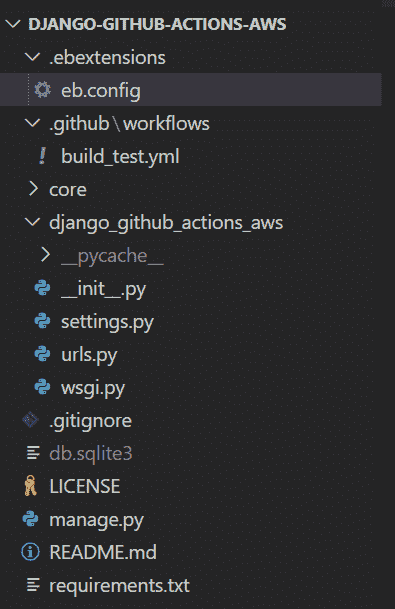

demo project structure

在这一部分你需要做的最后一件事是转到你的`settings.py`文件，将`ALLOWED_HOSTS`设置更新为`all`:

`ALLOWED_HOSTS = ['*']`

请注意，使用通配符有很大的安全缺陷。我们在这里只是用它来做演示。

既然我们已经完成了为 Elastic Beanstalk 配置项目，那么是时候更新我们的工作流文件了。

#### 步骤 4:更新您的工作流文件

完成这一步我们需要五个重要的信息:应用程序名、环境名、访问密钥 id、秘密访问密钥和服务器区域(登录后，您可以从导航栏的最右边获取区域)。

因为访问密钥 id 和秘密访问密钥是敏感数据，所以我们将它们隐藏在存储库中的某个地方，并在我们的工作流文件中访问它们。

要做到这一点，前往你的回购设置标签，然后点击如下图所示的秘密。在那里，您可以将您的秘密创建为键值对。

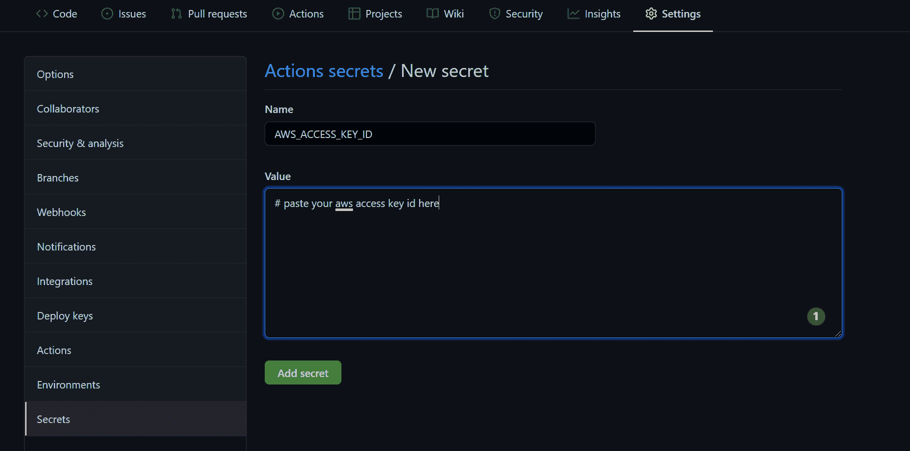

embedding secret data in your repo

接下来，将部署作业添加到现有工作流文件的末尾:

```
deploy:
    needs: [test]
    runs-on: ubuntu-latest

    steps:
    - name: Checkout source code
      uses: actions/checkout@v2

    - name: Generate deployment package
      run: zip -r deploy.zip . -x '*.git*'

    - name: Deploy to EB
      uses: einaregilsson/beanstalk-deploy@v20
      with:

      	// Remember the secrets we embedded? this is how we access them
        aws_access_key: ${{ secrets.AWS_ACCESS_KEY_ID }}
        aws_secret_key: ${{ secrets.AWS_SECRET_ACCESS_KEY }}

        // Replace the values here with your names you submitted in one of 
        // The previous sections
        application_name: django-github-actions-aws
        environment_name: django-github-actions-aws

        // The version number could be anything. You can find a dynamic way 
        // Of doing this.
        version_label: 12348
        region: "us-east-2"
        deployment_package: deploy.zip
```

deployment job

`needs`简单地告诉 GitHub Actions 只在`test`任务以通过状态完成后才开始执行`deployment`任务。

步骤`Deploy to EB`使用现有的动作`einaregilsson/beanstalk-deploy@v20`。还记得我们说过`actions`是一些可重用的应用程序，它为我们处理一些经常重复的任务吗？`einaregilsson/beanstalk-deploy@v20`就是那些动作之一。

为了强调上述内容，请记住我们的部署应该经过以下步骤:`GitHub -> Amazon S3 -> Elastic Beanstalk`。

然而，在整个教程中，我们没有设置任何 Amazon s3。此外，在我们的工作流文件中，我们既没有上传到 s3 存储桶，也没有从 s3 存储桶提取到我们的弹性 Beanstalk 环境。

通常情况下，我们应该做所有这些，但我们在这里没有——因为在引擎盖下，`einaregilsson/beanstalk-deploy@v20`动作为我们做了所有的重活。你也可以创建自己的`action`来处理一些重复性的任务，并通过 [GitHub 市场提供给其他开发者。](https://github.com/marketplace?type=actions)

既然您已经在本地更新了工作流文件，那么您可以将此更改提交并推送到您的远程设备。您的作业将运行，您的代码将部署到您创建的弹性 Beanstalk 实例中。仅此而已。**大功告成> > >**

## 包扎

哇！这真是漫长的一天，不是吗？总之，我解释了术语 GitHub 动作、CI/CD 管道和 AWS 的含义。此外，我们还看到了如何配置 GitHub 动作来自动将代码部署到 AWS 上的弹性 Beanstalk 实例中。

如果你喜欢这份工作，并想了解我将发布的最新文章，让我们在 [Twitter](https://twitter.com/nyior_clement) 、 [Linkedin](https://www.linkedin.com/in/nyior/) 或 [GitHub 上联系。](https://github.com/Nyior)我在发布之后，会立即通过这些渠道分享我的作品。

### 学分:

封面图片:[www.freepik.com](https://www.freepik.com/)

[Understanding the CI/CD Pipeline: What It Is, Why It Matters - PlutoraThe most successful software companies have a Continuous Integration / Continuous Delivery (CI/CD) pipeline. Learn what that is and why your team needs it.Plutora](https://www.plutora.com/blog/understanding-ci-cd-pipeline)[GitHub Actions Documentation - GitHub DocsAutomate, customize, and execute your software development workflows right in your repository with GitHub Actions. You can discover, create, and share actions to perform any job you’d like, including CI/CD, and combine actions in a completely customized workflow.GitHub Docs](https://docs.github.com/en/actions)[Deploying a Django application to Elastic Beanstalk - AWS Elastic BeanstalkCreate, configure and deploy a Django application to AWS Elastic Beanstalk with the EB CLI.AWS Elastic Beanstalk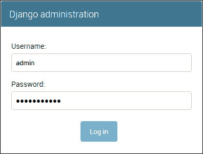](https://docs.aws.amazon.com/elasticbeanstalk/latest/dg/create-deploy-python-django.html)[GitHub - einaregilsson/beanstalk-deploy: GitHub action (and command line script) to deploy apps to Elastic BeanstalkGitHub action (and command line script) to deploy apps to Elastic Beanstalk - GitHub - einaregilsson/beanstalk-deploy: GitHub action (and command line script) to deploy apps to Elastic BeanstalkeinaregilssonGitHub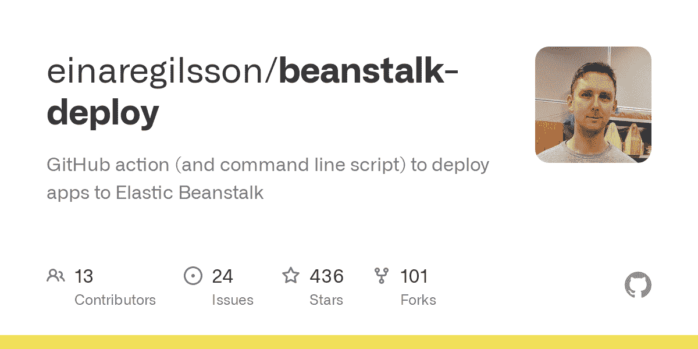](https://github.com/einaregilsson/beanstalk-deploy)