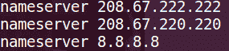
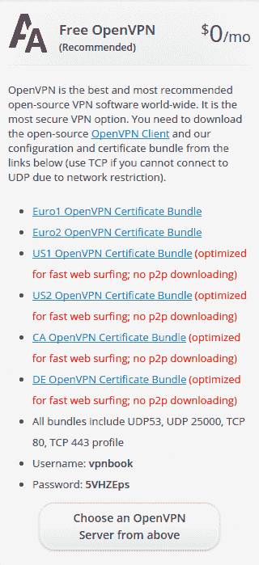
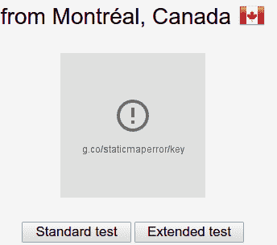
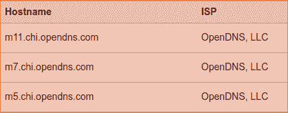

# 如何在 5 分钟内在 Linux 上免费设置 VPN

> 原文：<https://www.freecodecamp.org/news/how-to-setup-a-vpn-for-free-or-paid-on-linux-62e1a93d04f3/>

由 CodeDraken

# 如何在 5 分钟内在 Linux 上免费设置 VPN


在这个短暂而又姗姗来迟的教程中，我们将建立一个虚拟专用网(VPN)来帮助保护您的在线匿名。我不会过多讨论什么是 VPN 或者这些设置是什么。我们要建立一个。让我们开门见山吧。

**Windows 版本:**

[**如何在 5 分钟内在 Windows 上免费设置一个 VPN**](https://medium.com/@codedraken/how-to-setup-a-vpn-on-windows-for-free-in-5-minutes-1210bce9a46d)
[*在本教程中，我们将设置一个 VPN 并覆盖我们的 DNS 以保护我们的隐私。*medium.com](https://medium.com/@codedraken/how-to-setup-a-vpn-on-windows-for-free-in-5-minutes-1210bce9a46d)

#### 更新:

这适用于 **Ubuntu < =16** 。xx 和大多数其他发行版。如果你在 Ubuntu 18+上，那么 s [看到这个更新的 st](https://medium.com/@codedraken/ah-youre-on-ubuntu-18-f256cf8a1d9f) eps 的帖子。

如果你有任何问题，在[ipleak.net](https://ipleak.net/)上运行一个测试，找出到底是什么泄露了信息，然后[查看这个回复](https://medium.com/@codedraken/hello-i-apologize-for-the-late-reply-77ad8ad1a11f)和其中链接的那个。如果它不能帮助解决你的问题，那么就发表一个尽可能多信息的评论。

你需要:

*   装有 Linux 操作系统的计算机。我用的是 Ubuntu。如果你不在基于 Debian 的发行版上，命令可能会有所不同。
*   管理员/Sudo 权限
*   基本的计算机技能
*   什么是 VPN 的基本知识

记下你所做的一切改变，并做好备份以防出错。另外，声明一下，我和这里链接的任何网站都没有关系。遵循本教程，风险自担，因为你可能会弄乱一些设置。

### 第 1 部分:更改您的 DNS

您的域名服务器(DNS)可能会泄露您的一些信息，因此我们希望改变这种情况。首先使用诸如 [DNS 泄漏测试](https://www.dnsleaktest.com)之类的工具来查看哪些信息是可见的。那就把它藏起来。

1.  我们将使用 OpenDNS。前往他们的网站，获取他们的两个域名服务器 IP 地址，这些地址可以在他们的[设置指南页面](https://www.opendns.com/setupguide)上找到

*   208.67.222.222
*   208.67.220.220

2.Edit: /etc/dhcp/dhclient.conf

在您的终端中键入或复制/粘贴以下命令。Nano 是终端中的文本编辑器。如果文件在你的机器上的其他地方，谷歌或寻找它。

```
sudo nano /etc/dhcp/dhclient.conf
```

查找“预先考虑域名服务器”这一行。如果在行首用#符号将其注释掉，则通过移除#来取消注释。现在修改这一行，使其使用来自 OpenDNS 的 IP 地址，并添加一个像我下面这样的 8.8.8.8。此时，您的互联网可能会暂时停止工作！

```
prepend domain-name-servers 208.67.222.222, 208.67.220.220, 8.8.8.8;
```

这一行意味着它将使用第一个地址，如果第一个地址失败，则使用第二个地址，如果前两个地址都失败，则使用 8.8.8.8 地址。这通常不会发生。我们添加 8.8.8.8 是因为默认情况下它使用 3 个地址。如果我们不添加第三个，并且前两个都失败了，那么你的真实地址就会被使用。现在保存并退出，如下所示:

按 CTRL + O
按 ENTER
按 CTRL + X

这将保存并关闭文件。现在我们需要用下一个命令重启网络管理器。

```
sudo service network-manager restart
```

你现在应该检查它是否工作。输入下面的命令，看看名称服务器是否出现。在上面链接的网站上做一个 DNS 泄漏测试。

```
cat /etc/resolv.conf
```



**潜在问题**

> **我做了这些步骤，但是 cat 命令只显示名称服务器 127.0.1.1**
> 感谢[迪特马尔](https://medium.com/@dlichota?source=post_header_lockup)和[分析交易](https://medium.com/@analyzetrades?source=post_header_lockup)对于这个问题/解决方案
> *尝试注释/删除 **dns=dnsmasq** 来自**/etc/network manager/network manager . conf***

### 第 2 部分:设置 VPN

**修复网络浏览器中的 DNS 漏洞:**

1.  在火狐浏览器的地址栏中输入 about:config，然后按回车键。
2.  在配置页面上搜索:media.peerconnection.enabled
3.  双击它，将其更改为 false。
4.  重启火狐。

不知道其他浏览器是怎么做到的。

**获得免费 VPN**

1.  谷歌一个免费的 VPN，并确保它是好的。我将在剩下的步骤中使用 [VPNBook](http://www.vpnbook.com/freevpn) 。
2.  在 VPNBook 上，你只需下载你想要的 VPN 的配置文件。复制用户名和密码。密码会定期更改，因此您需要稍后重新获取。选择配置文件时，您位于何处并不重要。你可以在美国，下载 Euro one，看起来像是来自欧洲。



3.解压缩下载的 zip 文件后，再次打开您的终端。切换到解压缩的目录，或者右键单击并选取“在终端中打开”我们现在只差几步了。

4.安装 OpenVPN 以使用配置。

```
sudo apt-get install openvpn
```

5.关闭你的浏览器和任何连接到互联网的东西。要使用 OpenVPN，请输入下面的命令来运行您想要的配置。一旦显示“初始化完成”，您就一切就绪了。你应该保持终端开放。如果失败，尝试不同的 VPN，或阅读错误并尝试找出它。

```
sudo openvpn vpnbook-ca1-tcp443.ovpn
```

6.最后，通过做另一个 DNS 泄漏测试来测试它是否工作。



祝贺你，如果你做到了这一步，它的工作！这里有一个额外的简单 bash 脚本，您可以运行它。你只需要在需要的时候修改密码。

**痛击剧本 1**
*演职员表[阿德南·拉希奇](https://medium.com/@adnanrahic?source=post_header_lockup)*

```
#!/bin/bash
```

```
cd /path/to/VPNBook.com-OpenVPN-Euro1username="vpnbook"password="he2qv5h"read -sp "Enter Sudo Password: " sudopassword
```

```
/usr/bin/expect << EOF
```

```
spawn sudo openvpn vpnbook-euro1-tcp443.ovpnexpect "password for $USER: "send "$sudopassword\r"expect "Enter Auth Username: "send "$username\r"expect "Enter Auth Password: "send "$password\r"expect "$ "
```

```
EOF
```

> 这将启动 VPN，无需手动输入用户名和密码。VPN 也将在后台保持运行。如果需要的话，这里有一个杀死它的脚本。

```
#!/bin/bashsudo pkill vpn
```

**Bash 脚本 2**

```
#!/bin/bashecho "user: vpnbook"echo "pass: 5VHZEps"sudo openvpn vpnbook-ca1-tcp443.ovpn
```

只需将其放入一个新文件，右键单击>属性>权限，并允许执行文件作为一个程序。此示例使用加拿大 tcp 443 配置。

### 进一步阅读

这里是昆西·拉森写的几篇关于 VPN、互联网隐私和安全的精彩文章。

[**如何在 10 分钟内免费建立一个 VPN(以及为什么你迫切需要一个)**](https://medium.freecodecamp.com/how-to-set-up-a-vpn-in-5-minutes-for-free-and-why-you-urgently-need-one-d5cdba361907)
[*“一台电脑让你比任何其他发明更快地犯更多的错误，除了手枪……*medium.freecodecamp.com](https://medium.freecodecamp.com/how-to-set-up-a-vpn-in-5-minutes-for-free-and-why-you-urgently-need-one-d5cdba361907)[**如何在不到一个小时的时间里加密你的整个人生**](https://medium.freecodecamp.org/tor-signal-and-beyond-a-law-abiding-citizens-guide-to-privacy-1a593f2104c3)
[*“只有偏执狂才能生存。”—medium.freecodecamp.org 的安迪·格罗夫*](https://medium.freecodecamp.org/tor-signal-and-beyond-a-law-abiding-citizens-guide-to-privacy-1a593f2104c3)

如果你对道德黑客和安全感兴趣，YouTube 上有一个免费的 15 小时课程。