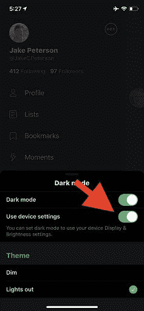

# 如何将你的应用设置为 iOS 13 黑暗模式

> 原文：<https://www.freecodecamp.org/news/how-to-setup-an-app-for-dark-mode-on-ios-13-untitled/>

苹果公司于 9 月 19 日在全球范围内推出了期待已久的 iOS 13 更新，涵盖了过去 4 年内推出的所有 iPhone(回到 iPhone 6s)。

> 这次更新最大的特点之一就是全系统的 iOS 13 黑暗模式。预计这将有助于缓解由智能手机显示屏发出的白光引起的眼睛疲劳。

虽然这一功能对使用苹果设备的最终消费者来说是一件乐事，但对于 iOS 开发者来说，准备一款适用于 iOS 13 黑暗模式的应用是一项任务。

## 如何将你的 App 设置为 iOS 13 黑暗模式？

为了帮助开发者解决这个问题，这里有一些有用的信息和步骤，展示了他们如何为现有的 iOS 应用程序准备 [iOS 13](https://www.apple.com/ae/ios/ios-13/) 黑暗模式。

*   iOS 13 黑暗模式尽管是全系统规模，但实现起来并不太难。
*   在现有应用上启用 iOS 13 黑暗模式也很简单，这主要归功于最新的 iOS 13 SDK。

当使用最新版本为 iOS 13 黑暗模式构建应用程序时，操作系统将自动更新其他系统控件中的开关、按钮和表格视图。不过请注意，图像和文本颜色不会自动适应黑暗模式。

然而，看到像黑暗模式这样的系统范围的变化如此容易实现，仍然令人惊讶。在节省下来的时间里，你可以用 iOS 13 黑暗模式完成更小的代码更改和更多的工作。

## 如何为 iOS 13 黑暗模式适配颜色

首先，我们从改变系统颜色 iOS 13 黑暗模式开始:

现在 UIColor 中增加了新的系统颜色，其中一个是标签颜色。使用这些新颜色有助于支持 iOS 13 中的黑暗模式和其他高对比度模式。

```
label.color = UIColor.secondaryLabel
```

一般来说，你应该为 iOS 13 黑暗模式使用系统颜色，它会自动适应界面的变化，以保持跨应用程序的一致性。但是，开发人员也可以选择使用自定义颜色实现深色模式。

> iOS 11 引入的资源目录颜色通过添加自定义颜色集的深色版本，使支持深色模式变得更加容易。

您只需从目录中选择一种首选颜色，然后从属性检查器中将外观更改为任何颜色，深色。

就是这样！现在，您已经为您的移动应用程序准备好了自定义的 iOS 13 黑暗模式。

## iOS 13 黑暗模式故障排除

假设你的应用没有遵循 iOS 13 黑暗模式。你会怎么做？这里有一些简单的步骤来解决这个问题。

### 第一步

你需要知道应用程序是否更新。

如果应用程序不支持 iOS 13 黑暗模式或不支持它，只需通过 Apple Store 更新应用程序。

### 第二步

检查您的 iOS 应用程序的黑暗模式是否已启用。

如果没有，进入设置-显示和亮度-检查“暗”是否启用。

### 第三步

如果你的应用程序已经完全更新，但不支持 iOS 13 黑暗模式，请检查应用程序内的设置。*见图:*



如果你想在设置 iOS 13 黑暗模式方面获得更多帮助，可以从[专门的开发团队](https://www.valuecoders.com/dedicated-development-teams)那里获得。这就是我要帮助你的方式。

还可以阅读 iOS 上的[移动应用开发技巧。希望这些信息对你有所帮助。](https://www.valuecoders.com/blog/technology-and-apps/11-tips-successful-mobile-app-development-businesses-android-ios/)

让我们看看你下一步要做什么。

## 为 iOS 13 黑暗模式调整图像

大多数图像在 iOS 13 黑暗模式下看起来都很棒，有时它们会以真正突出细节的方式弹出。然而，你可能还是会发现一些图片看起来有点不适合黑暗模式。

> 好消息是，你可以用调整文本的方式来调整黑暗模式下的图像。

所有你需要做的是选择目录中的图像，如前所述，并在属性检查器中更改属性为任何，黑暗。现在添加图像的黑色外观，我们就完成了。

## 以编程方式检测 iOS 13 黑暗模式的变化

开发者可能会面临这样的情况，他们需要以编程方式实现 iOS 13 黑暗模式中的外观变化。事情是这样的:

```
override func traitCollectionDidChange(_ previousTraitCollection: UITraitCollection?) 
{
    super.traitCollectionDidChange(previousTraitCollection)

    let userInterfaceStyle = traitCollection.userInterfaceStyle // Either .unspecified, .light, or .dark
    // Update your user interface based on the appearance
}
```

> 重写 traitCollectionDidChange 有助于检测外观变化。

> 然后我们只需要打开 trait collection . user interface style。

**您还可以验证现有外观是否使用了您刚刚实现的新方法:**

```
override func traitCollectionDidChange(_ previousTraitCollection: UITraitCollection?) {
    super.traitCollectionDidChange(previousTraitCollection)

    let hasUserInterfaceStyleChanged = previousTraitCollection.hasDifferentColorAppearance(comparedTo: traitCollection) // Bool
    // Update your user interface based on the appearance
}
```

## 覆盖用户界面样式

### 完整应用程序

系统会自动选择任何链接到 iOS 13.0 或更高版本 SDK 的应用程序的明暗外观。

如果您需要额外的时间来处理应用程序的黑暗模式支持，或者希望保持应用程序的单一风格，您可以通过在应用程序的 Info.plist 文件中包含 UIUserInterfaceStyle 键(值为亮或暗)来选择退出。

设置此键会导致系统忽略用户的偏好设置，并始终将特定外观应用于您的应用程序。

> **注意:**强烈建议支持 iOS 13 黑暗模式。当您致力于改进应用程序的黑暗模式支持时，请使用 UI UserInterfaceStyle 键暂时退出。

### 特定屏幕

在 iOS 13 中，您现在可以在特定视图或视图控制器上覆盖用户界面样式。例如，您可能希望只有某个视图控制器处于 iOS 13 黑暗模式，而应用程序的其余部分处于光明模式。

要覆盖用户界面样式，只需在顶视图或视图控制器中覆盖该变量，它将向下传播到子视图:

```
// Inside a UIViewController
override func viewDidLoad() 
{
    super.viewDidLoad()

    // Always adopt a dark interface style.    
    overrideUserInterfaceStyle = .dark
}
```

### 结束语

感谢您阅读文章！在这里，我们探讨了如何为 iOS 13 黑暗模式设置应用程序。

iOS 13 黑暗模式带来了一种独特的无压力的智能手机使用方式。也许我们会看到一个未来，黑暗模式用白色背景取代默认模式。

通过遵循这些编码指南和技巧，你可以轻松地在 iOS 13 上设置你的应用程序为黑暗模式。

**如果你需要一些专家的帮助，请随时与 [iOS 开发者](https://www.valuecoders.com/hire-developers/hire-ios-developers)联系关于 iOS 13 黑暗模式的相关问题。**

**F **在推特上关注**更多**更新:****