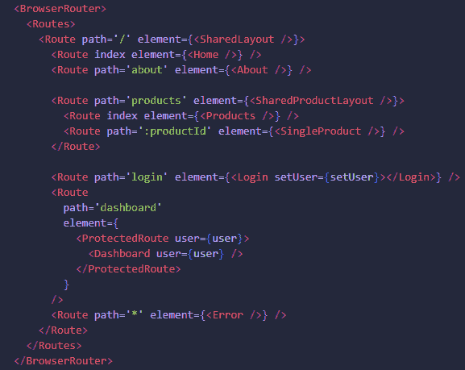
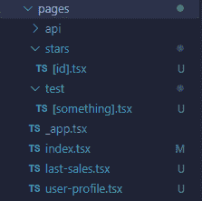
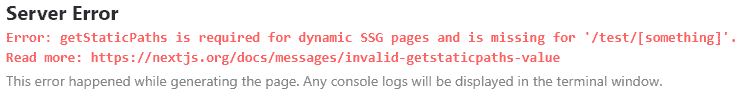
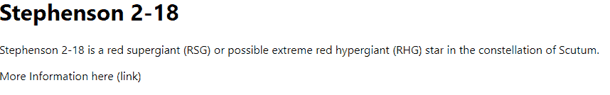

# Next.js 中的路由–如何在 Next 中设置带有预渲染的动态路由

> 原文：<https://www.freecodecamp.org/news/how-to-setup-dynamic-routing-in-nextjs/>

在本教程中，您将了解如何在 Next.js 中设置动态路由。您还将了解预渲染及其重要性。

## 🔐以下是我们的承保范围:

*   你会了解到`getStaticPaths()`，Next.js 的核心原则之一。
*   你将提高你的一般 Next.js 知识和信心。
*   您将获得一个可快速复制的示例，用于自己的 Next.js 学习目的。

## **📝**先决条件

*   您应该熟悉什么是 Next.js，以及为什么应该考虑使用它。
*   你应该对 React 和/或 Next.js 中的 [**路由**](https://nextjs.org/docs/routing/introduction) 和 [**动态路由**](https://nextjs.org/docs/routing/dynamic-routes) 是什么意思有所了解
*   对于这个例子，我使用 TypeScript。但你没必要熟悉 TypeScript。我将解决使用 JavaScript 时会被忽略的代码。此外，当你看到关于任何文件的`.tsx`时，如果你使用的是 JavaScript，你可以用`.js`来替换它。

## **🎯**目标

本快速指南旨在帮助您管理获取数据，这些数据可用于 Next.js 中动态路线内的预渲染目的。我们将讨论一些理论以及一个实际示例。

当我们关注所需代码的实际逻辑时，我不会做任何 CSS 样式。当你使用我们在本教程中讨论的技术时，你可以在你自己的项目的前端尽情发挥创造力。

## 🔎Next.js 中路由的工作方式

React 本身对任何路由意图都使用基于代码的方法，而 Next.js 对路由的概念使用文件系统。

因此，您可能熟悉 React 中基于代码的路由，它可能看起来类似于:



Example for code-based React Routing

例如，使用这种基于代码的方法，您可以通过`/about`从`/`的主路径导航到`about`页面。

在这个带有`:productId`路径的 React 示例中，您还可以找到一种动态路由方法。

不过，有了 Next.js，我们不再使用这种基于代码的路由。相反，这个 React 框架利用了基于文件的路由。这意味着您可以直接通过页面文件设置您的路线。

考虑以下包含子文件夹和文件的`pages`文件夹:



Example for file-based Next.js Routing 

`index.tsx`文件相当于上面 React 路由示例中的`/`路径。所以你可以通过`/user-profile`访问`user-profile.tsx`文件中的内容——就是这样！

另一方面，如果您想要访问一些嵌套的内容，您可以使用`/stars/[id]`以便在相应的页面文件中找到内容。

也许你注意到了，我用方括号表示`[id].tsx`和`[something].tsx`。这是在 Next.js 中设置动态路由所必需的。

从技术上来说，你可以为`[id]`插入任何你想要的输入，页面将会为这个特定的路径加载。

请记住，如果这个动态路由需要一个有效的`[id]`输入(可能是某种现有的产品 id，我们希望获取相应的数据)，那么可能会有一个错误。

## 使用动态路由在 Next.js 中获取✂️数据

假设您将这种动态路由方法应用于一个商店页面，在该页面中您列出了一堆不同的商品。每个项目都有一个链接，提供关于该特定项目的更多信息。

在这个 Link 元素中，您可以用一个有效的参数(例如，相应的产品 id)将用户引导到一个动态路由。对于这种情况，动态路由是最好的方法。

### ❗How 工作吗？

使用这个函数，您可以在构建时预先呈现页面。例如，这对于搜索引擎优化(SEO)是有用的，并且可以总体上产生更好的用户体验。

例如，应该预先呈现的数据通常可以在一些数据库中找到。像使用`getStaticProps()`一样，您可以在这个函数中直接编写任何服务器端代码来获取数据(而不是通过后端的 API 路由来完成任何所需的服务器端操作)。

关于`getStaticProps()`还有更多要说的。如果你对所有这些东西都很陌生，我强烈推荐查看关于这个主题的官方 Next.js 文档。

### ❓的目的是什么`getStaticPaths()`？

虽然`getStaticProps()`本身似乎已经为我们的页面做了所有需要做的工作，但是当我们在动态路由页面上单独使用这个函数时，我们会遇到一个错误。错误消息实际上会指出`getStaticPaths()`丢失的具体事实。



Screenshot of server error. SSG stands for Static-Site Generation

`getStaticProps()`利用静态站点生成概念。因此 Next.js 将在构建时预先呈现相应的页面。然而，在动态路径的情况下，Next.js 本身并不知道要预渲染哪些路径。相反，你必须介入并提供帮助——这就是`getStaticPaths()`派上用场的地方。

因此，使用`getStaticPaths`,您可以指定动态路由的哪些路径应该预先渲染和/或未知路径应该如何处理。

### 📋快速旁注

如果你使用的是`getServerSideProps()`，它的使用原因和`getStaticProps()`类似，你会注意到`getStaticPaths()`实际上并不需要。这是为什么呢？

`getServerSideProps()`不使用静态生成原理。Next.js 没有构建页面，而是在每次请求时用返回的数据预先呈现页面。这被称为服务器端渲染。

我们不必在使用`getServerSideProps()`时告诉 Next.js 哪些路径必须静态预渲染，因为这个函数本来就没有这个东西。

如果你想了解更多关于这个函数的内容，我可以再次推荐官方的 Next.js 文档用于服务器端渲染。然而，这超出了本快速指南的范围，我不需要`getServerSideProps()`来完成下面的任何步骤。

## 🔧如何设置我们的项目

对于这个例子，我们将重现一个小的动态路由案例。为此，我在`pages`文件夹中准备了一个子文件夹`test`。Next.js 会自动创建`pages`文件夹

在`test`文件夹中，我插入了`[something].tsx`文件(如果您使用的是 JavaScript 而不是 TypeScript，请插入`[something].js`)。

在我们的 Next.js 应用程序的根级别还有一个带有`some-backend-data.json`文件的`backendData`文件夹(因此不在`pages`文件夹中)。这个文件将为我们提供动态插入的数据。

### 🔨后端`JSON`数据的设置

对于这个例子，我正在创建一些虚拟数据，它们将被嵌入到`backendData`文件夹中的`some-backend-data.json`中。通过这种方式，我们可以重现这样一种情况:您可以访问后端的某种数据，而您希望在前端使用这些数据。

下面是`some-backend-data.json`文件的样子:

```
{
    "stars": [
        { 
            "id": "St2-18", 
            "name": "Stephenson 2-18", 
            "description": "Stephenson 2-18 is a red supergiant (RSG) or possible extreme red hypergiant (RHG) star in the constellation of Scutum.", 
            "link": "https://en.wikipedia.org/wiki/Stephenson_2-18" 
        },
        { 
            "id": "UY-SC", 
            "name": "UY Scuti", 
            "description": "UY Scuti is an extreme red hypergiant or red supergiant star in the constellation Scutum.", 
            "link": "https://en.wikipedia.org/wiki/UY_Scuti"
        },
        { 
            "id": "RSGC1", 
            "name": "RSGC1-F01", 
            "description": "RSGC1-F01 is a red supergiant located in the RSGC1 open cluster in the constellation of Scutum.", 
            "link": "https://en.wikipedia.org/wiki/RSGC1-F01"
        }
    ]
}
```

Data in **/backendData/some-backend-data.json**

在这个文件中你会发现一些`JSON`格式的数据。还有`"stars"`，它只是一个有三个对象的数组。所有三个对象都有相同的格式，包括一个`id`、一个`name`、一个`description`和一个指向外部网页的`link`。

正如你现在可能已经发现的，这些实际上是我们宇宙中的一些真正的恒星。

在现实世界中，您可能会与数据库建立某种连接，但是您从该数据库接收的实际数据在技术上可以像本例中那样进行格式化。因此，这对于我们的示例设置来说已经足够了。

### 🔑导入和接口

下一步，我们可以开始实际创建 Next.js `[something].tsx`动态路线。让我们从这个例子所需的导入开始:

```
import { GetStaticProps, GetStaticPaths  } from 'next';
import { useRouter } from 'next/router';
import path from 'path';
import fs from 'fs/promises';

interface starInterface {
    id: string
    name: string
    description: string
    link: string
}
```

Imports & TypeScript interface in **/pages/test/[something].tsx**

请记住，我在这里使用的是 TypeScript。如果你使用 JavaScript，那当然也没问题。只要记住你不需要`interface starInterface`或者`import { GetStaticProps, GetStaticPaths } from 'next'`。

### 💎如何创建数据提取函数

下一步，我会准备一个名为`getData()`的`async`函数，对`getStaticProps()`和`getStaticPaths()`函数有帮助。这看起来非常令人困惑，尤其是如果您从未接触过后端 JavaScript 代码，例如，您在任何 Node.js 应用程序中都可能会遇到这种情况。

再忍耐我几秒钟。你不必详细理解下面的代码。我们只需要知道`getData()`函数的结果是什么。

```
async function getData() {
    const filePath = path.join(process.cwd(), 'backendData', 'some-backend-data.json');
    const fileData = await fs.readFile(filePath);
    const data = JSON.parse(jsonData.toString());

    return data;
  }
```

getData() function in **/pages/test/[something].tsx**

如您所见，有三个变量:`filePath`、`fileData`和`data`。使用`filePath`,我们只需关注放置了`JSON`数据的文件。所以我们的目标是当前工作目录(cwd)，然后是`backendData`文件夹，然后是`JSON`文件。

通过`fileData`,我们试图读取该文件并提取存储在其中的实际`JSON`数据。

我们需要`data`来转换这个`fileData`，这样我们就可以在接下来的步骤中使用它。

总而言之，`getData()`基本上只提供给我们来自`some-backend-data.json`文件的数据，所以我们可以在`getStaticProps()`和`getStaticPaths()`中使用它。没有更多的。

### 🔨`getStaticProps()`的设置

在我们实现了`getData()`(这在我们试图获取虚拟后端数据时会很方便)之后，接下来我们将创建`getStaticProps()`函数。

这里，我们将使用`getStaticProps()`为我们的动态路线中的路径启用特定提取数据的预渲染。

在我们直接进入下面的代码示例之前，快速思考一下我们实际上想要完成什么。

用户应该被定向到这个特定的动态路由，它由 URL 中的唯一标识符来指示。我的意思是，我们希望`/test/St2-18`和`test/UY-SC`指向同一个动态页面。

然而，用户将在那里看到的数据应该是彼此不同的，因为我们想要分别获取`St2-18`和`UY-SC`的数据。

我们有一个`getData()`功能，可以帮助我们获取后端数据。但是我们仍然必须知道我们想要从我们的虚拟后端提取哪些确切的数据。

对于这一步，我们可以从 URL 中提取特定的标识符，例如`St2-18`，并将其与我们提取的`getData()`结果数据相结合。

从那里，我们可以搜索包含我们想要在后端的`getData()`结果中显示的数据的特定对象。

现在，让我们回到我们的代码示例来看看这个过程的运行情况。

参见下面我们实现`getStaticProps()`的代码部分:

```
export const getStaticProps: GetStaticProps = async (context) => {
    const itemID = context.params?.something;
    const data = await getData();
    const foundItem = data.stars.find((item: starInterface) => itemID === item.id);

    if (!foundItem) {
      return {
        props: { hasError: true },
      }
  }

  return {
    props: {
      specificStarData: foundItem
    }
  }
}
```

getStaticProps() function in in **/pages/test/[something].tsx**

对于 JavaScript，您可以省略`GetStaticProps`作为`getStaticProps()`的类型。

`getStaticProps()`可以为我们提供一个`context`参数，通过它我们可以得出一些有帮助的方法。现在，重要的是理解通过`context`我们能够访问`params`，然后到达我们特定路径的当前标识符，其中`something`是占位符。

记住这个文件实际上叫做`[something].tsx`，这就是为什么我们在这个上下文中访问`something`。

通过这种方法，我们成功地从我们的 URL 中提取了我们需要的信息，以便在我们的后端数据阵列中搜索特定的对象。然后我们将这些信息保存在`itemID`变量中。

假设用户向`/test/St2-18`伸出手，那么`itemID`将保存`St2-18`的值。

因为我们有方便的`getData()`函数，所以我们可以通过这个函数获取后端数据并保存到`data`。

既然我们现在有了`itemID`和`data`，我们可以将这两个变量组合起来，创建`foundItem`。这将返回包含作为`id`的`itemID`的对象。

使用`if`语句，我们检查`foundItem`是否确实存在。或者换句话说，我们检查我们的后端数据是否包含通过我们的`itemID`提取的相应`id`的数据。

如果找不到数据，我们返回这个布尔值`hasError`，值为`true`。这有助于我们在前端管理此类案例。

如果有数据，那么我们返回我们的`foundItem`到前端。请记住，您在这个`props`对象中返回的所有内容实际上都将暴露给前端。所以不要返回任何凭证(例如，个人 API 密钥)。

### 🔨`getStaticPaths()`的设置

在我们进入动态页面的前端部分之前，我们仍然需要实现`getStaticPaths()`函数:

```
 export const getStaticPaths: GetStaticPaths = async () => {
    const data = await getData();
    const pathsWithParams = data.stars.map((star: starInterface) => ({ params: { something: star.id }}))

    return {
        paths: pathsWithParams,
        fallback: true
    }
  }
```

getStaticPaths() function in in **/pages/test/[something].tsx**

对于 JavaScript，您可以省略`GetStaticPaths`作为`getStaticPaths()`的类型。你也可以删除 JavaScript 的`starInterface`。

在`getStaticPaths()`函数中，我们想要告诉 Next.js 哪些路径应该被预渲染。

对于这一步，我们使用`getData()`访问我们的后端数据，正如您在`getStaticProps()`中看到的。

`getStaticPaths()`要求退货单内`paths`的具体形式。你实际上有两个选择:

*   第一个是我在这个例子中使用的方法:`paths: [{ params: { something: star.id } }]`。它应该是一个数组，包含您希望 Next.js 预呈现的每个路径的对象。
*   第二种选择是使用这样的路径字符串:`paths: ['/test/St2-18', '...', '...']`。

这两种技术实现了相同的行为，所以只需选择您喜欢的一种。

### 什么是`fallback`属性？

理解这一点很重要，你不需要包含每一个应该预先渲染的路径。当您有很多情况要考虑，并且不希望所有内容都被预先渲染时，这尤其有用。

为了处理这种情况，`fallback`属性特别有用

你可以在[官方 Next.js 文档](https://nextjs.org/docs/api-reference/data-fetching/get-static-paths#fallback-false)中阅读更多关于`fallback`的详细信息。

用我自己的话来说，我会这样解释:

*   `fallback`设置为`false`会自动导致一个 404 错误页面，只要用户试图通过路径属性访问一个不被`getStaticPaths()`识别的路径。
*   `fallback`设置为`true`不会在用户试图访问`getStaticPaths()`中不存在的路径时自动导致 404 错误页面。
    这样，我们仍然可以接触到前端，并能够通过显示某种加载序列来处理那里的情况。
    当特定的路径参数没有有效的项目数据时，如果没有任何要提取的数据，您也可以在前端显示一个错误。
*   `fallback`设置为`'blocking'`不会在用户试图访问`getStaticPaths()`中不存在的路径时自动导致 404 错误页面。
    类似于`fallback`设置为`true`，但现在我们基本上省略了任何手动加载过程。取而代之的是，浏览器只需要多花一点时间来获取数据，然后显示准备好的页面。
    当你不想表现出“正在加载...”时，这很有帮助例如，让用户在页面成功加载之前多等一会儿。如果找不到任何数据，那么我们仍然有机会在前端创建一个手动错误。

由于我们有这么小的数据集，我们只是给出了到`getStaticPaths()`的每一个可能的路径。所以技术上我们不需要太关注`fallback`属性。

尽管如此，我还是将`fallback`设置为`true`,向您展示如何处理这样的手动错误以及可能出现的加载序列。

### 📐如何配置前端

在最后一步，我们将配置我们的实际页面。这里的任何内容都将是用户将看到的前端内容:

```
function projectPage(props: { specificStarData: starInterface, 
hasError: boolean }) {
  const router = useRouter();

  if (props.hasError) {
    return <h1>Error - please try another parameter</h1>
  }

  if (router.isFallback) {
      return <h1>Loading...</h1>
  }

  return (
    <div>
      <h1>{props.specificStarData.name}</h1>
      <p>{props.specificStarData.description}</p>
      <a href={props.specificStarData.link}>More Information here (link)</a>
    </div>
  )
}

export default projectPage;
```

projectPage() function in **/pages/test/[something].tsx**

对于 JavaScript，您不必在函数的参数中同时提到`starInterface`和`boolean`。

在上面的代码中，你可以找到我们的`specificStarData`和`hasError`，它们都保存一些值。除此之外，我们利用`useRouter()`钩子来接触`isFallback`，这有助于我们处理任何`fallback`案件。

请记住，如果您无法为预加载提供每个动态路径，则可以将`getStaticPaths()`的`fallback`设置为`true`或`'blocking'`。在这些情况下，它将防止您的页面崩溃。

相反，当用户访问这个特定的动态路线时，它会在运行中加载一段时间，然后提供相应的信息。

对于这个潜在的加载序列，我们使用`router.isFallback`来为用户返回带有某种加载指示的 JSX。

如果因为用户试图访问一个找不到数据的动态路径而实际上存在一个错误，`hasError`介入，表明存在一个实际的错误。

假设用户实际到达了可以获取数据的动态路径，将返回实际的预期 JSX 输出。

在所有配置步骤之后(使用`fallback: true`，我们接收到了`/test/St2-18`路径的输出:



Result for **/test/St2-18**

如果我们尝试输入一个无效的参数，它首先尝试加载，然后返回我们的手动设置错误消息:


Result for **/test/this-will-produce-an-error**

### 🎲如何测试`fallback`属性

差不多就是这样了！结果是一个动态路由，它使用`getStaticProps()`和`getStaticPaths()`来预渲染从我们的虚拟后端获取的数据。

当您第一次使用`getStaticPaths()`时，我建议尝试不同的`fallback`值(`true`、`false`、`'blocking'`)，以了解您的应用程序的行为到底是如何变化的。

因为我们在例子中使用了`fallback: true`，所以我们也能够从三条路径中插入一条可能的路径，而不会导致应用程序崩溃。

因此，假设我们将`getStaticPaths()`中的`paths`属性更改为`paths: ['/test/St2-18']`。虽然我们之前插入了所有的路径，但是我们现在只使用了一个路径和我之前提到的 string 方法，而不是`{ params: { something: star.id }}`格式。

例如，使用这种配置，您仍然可以访问`/test/UY-SC`，但是您会注意到`Loading...`消息出现了一小段时间，因为我们在使用`router.isFallback`的 if 语句中准备了这种情况。数据加载后，会成功显示在屏幕上。

当使用`fallback: 'blocking'`和`paths: ['/test/St2-18']`时，你会发现你看不到任何`Loading...`。相反，在改变浏览器的内容之前，浏览器只需要多花一点时间来加载数据。

你喜欢哪种方式由你决定。

## 结论

虽然这个例子展示了`getStaticProps()`和`getStaticPaths()`的基本部分，但是关于这些 Next.js 函数还有更多内容需要阅读。

尽管如此，在很多情况下，你在这里读到的所有内容已经足够让你自己开始使用`getStaticProps()`和`getStaticPaths()`了。

## **📃**资源&学习资料

*   [**数据取数**](https://nextjs.org/docs/basic-features/data-fetching/overview) 的官方 Next.js 文档。
*   为了更全面地了解 Next.js，我强烈建议查看 Maximilian Schwarzüller 为 Next.js 开设的 [udemy 课程。这门课至少对我帮助很大。](https://www.udemy.com/course/nextjs-react-the-complete-guide/)