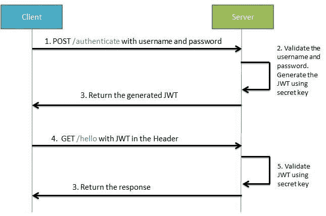
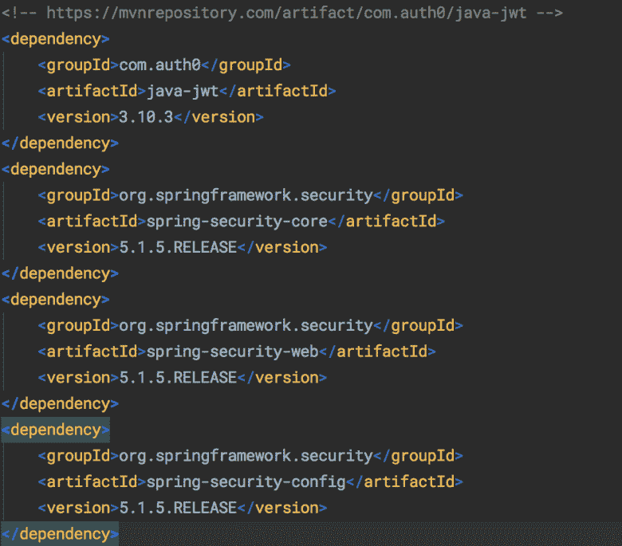
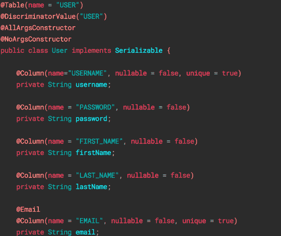

# 如何设置 Java Spring Boot JWT 授权和认证

> 原文：<https://www.freecodecamp.org/news/how-to-setup-jwt-authorization-and-authentication-in-spring/>

在过去的一个月里，我有机会为一个副业项目实现 JWT 认证。我以前曾和 JWT 一起在 Ruby on Rails 上工作过，但这是我第一次在 Spring 上工作。

在这篇文章中，我将尝试解释我在项目中所学到和应用的东西，以分享我的经验，并希望能帮助一些人。

我们将从快速浏览 JWT 背后的理论及其工作原理开始。然后我们将看看如何在 Spring Boot 应用程序中实现它。

## JWT 基础知识

JWT，或 JSON Web Tokens ( [RFC 7519](https://tools.ietf.org/html/rfc7519) )，是一个主要用于保护 REST APIs 的标准。尽管这是一项相对较新的技术，但它正在迅速普及。

在 JWT 认证过程中，前端(客户端)首先发送一些凭证来认证自己(在我们的例子中是用户名和密码，因为我们正在处理一个 web 应用程序)。

服务器(在我们的例子中是 Spring 应用程序)然后检查这些凭证，如果它们有效，它就生成一个 JWT 并返回它。

在这一步之后，客户端必须以“不记名令牌”的形式在请求的**授权**报头中提供该令牌。后端将检查这个令牌的有效性，并授权或拒绝请求。令牌还可以存储用户角色，并根据给定的权限对请求进行授权。



## 履行

现在让我们看看如何在一个真实的 Spring 应用程序中实现 JWT 登录和保存机制。

### 属国

您可以在下面看到我们的示例代码使用的 Maven 依赖项列表。注意，像 Spring Boot 和 Hibernate 这样的核心依赖项没有包含在这个截图中。



### 保存用户

我们将首先创建控制器来安全地保存用户，并根据用户名和密码对他们进行身份验证。

我们有一个名为 User 的模型实体。它是一个简单的实体类，映射到用户表。根据您的应用程序，您可以使用您需要的任何属性。



我们还有一个简单的 **UserRepository** 类来保存用户。我们需要覆盖**findbysusername**方法，因为我们将在认证中使用它。

```
public interface UserRepository extends JpaRepository<User, String>{ 
    User findByUsername(String username); 
}
```

我们不应该在数据库中存储明文密码，因为许多用户倾向于对多个站点使用同一个密码。

有许多不同的哈希算法，但最常用的是 **BCrypt** ，这是一种推荐的安全哈希方法。你可以查看[这篇](https://security.blogoverflow.com/2013/09/about-secure-password-hashing/#:~:text=Passwords%20should%20be%20hashed%20with,providing%20most%20security%20is%20bcrypt.)文章，了解更多关于这个话题的信息。

为了散列密码，我们将在 **@SpringBootApplication** 中定义一个 **BCrypt** bean，并将主类注释如下:

```
@Bean public BCryptPasswordEncoder bCryptPasswordEncoder() {
    return new BCryptPasswordEncoder(); 
}
```

当我们需要散列密码时，我们将调用这个 bean 上的方法。

我们还需要一个 UserController 来保存用户。我们创建控制器，用 **@RestController，**对其进行注释，并定义相应的映射。

在我们的应用程序中，我们基于从前端传递的 DTO 对象保存用户。还可以在 **@RequestBody** 中传递一个用户对象。

在传递 DTO 对象之后，我们使用之前创建的 **BCrypt** bean 加密密码字段。您也可以在控制器中这样做，但是更好的做法是将这个逻辑放在服务类中。

```
@Transactional(rollbackFor = Exception.class) 
public String saveDto(UserDto userDto) { 
    userDto.setPassword(bCryptPasswordEncoder
           .encode(userDto.getPassword())); 
    return save(new User(userDto)).getId(); 
}
```

### 认证过滤器

我们需要身份验证来确保用户确实是他们所声称的那个人。我们将使用经典的用户名/密码对来实现这一点。

以下是实现身份验证的步骤:

1.  创建扩展了**usernamepasswordtauthenticationfilter**的认证过滤器
2.  创建一个扩展**WebSecurityConfigurerAdapter**的安全配置类，并应用过滤器

这是我们的认证过滤器的代码——正如你可能知道的，过滤器是 Spring 安全的支柱。