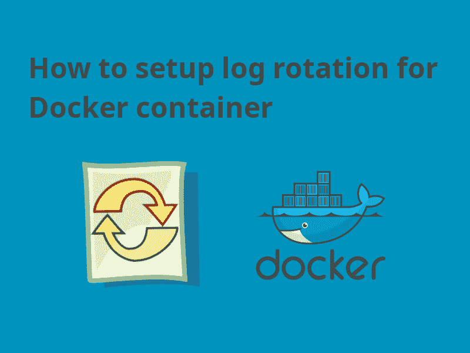
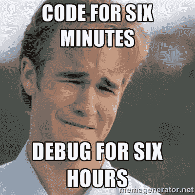
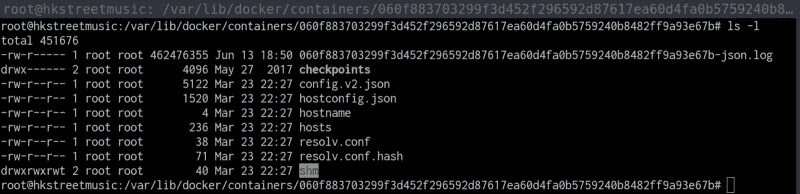
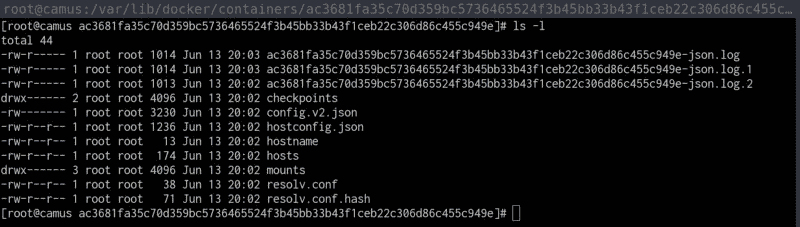

# 如何为 Docker 容器设置日志循环

> 原文：<https://www.freecodecamp.org/news/how-to-setup-log-rotation-for-a-docker-container-a508093912b2/>

作者:应洁媛

# 如何为 Docker 容器设置日志循环

#### 我们都需要木头！

有时候和码头工人一起工作让我觉得我在和一个黑匣子一起工作。尤其是当我玩来自社区的 Docker 图像时，它并没有按照我预期的方式运行。在许多情况下，调试时读取日志会占用很大一部分时间。

这篇文章是关于为 Docker 容器设置日志循环的。

### 默认日志记录驱动程序

我们可以为容器配置不同的日志驱动程序。默认情况下，容器的 **stdout** 和 **stderr** 被写入位于 */var/lib/docker/containers/【容器标识】/【容器标识】-json.log* 的 JSON 文件中。如果您不去管它，它会占用大量的磁盘空间，如下所示。

A large log file in json format

#### 手动清除日志

如果这个 JSON 日志文件占用了大量磁盘空间，我们可以使用下面的命令清除它。

我们可以设置一个 cronjob 来定期清除这些 JSON 日志文件。但是从长远来看，设置日志轮换会更好。

### 设置日志循环

#### 配置默认日志记录驱动程序

这可以通过在 */etc/docker/daemon.json* 中添加以下值来实现。如果该文件不存在，请创建它。

json-file 日志驱动有更多的选项，我们甚至可以换成其他日志驱动，比如 *syslog* 。更多信息请参考 [Docker 文档——配置日志驱动](https://docs.docker.com/config/containers/logging/configure/)。

执行以下命令来重新加载更新后的 *daemon.json* 。重新启动后，新配置将应用于所有新创建的容器。

#### 为容器配置日志记录驱动程序

如果不想全局应用，也可以在容器级别进行配置。

**对接器运行命令**

我们可以在 *docker run* 命令中指定日志驱动程序和选项。例如:

**使用 docker-compose**

还可以使用 docker-compose 配置日志驱动程序和选项。例如:

验证设置是否正常工作。

The logs are broken down into 1k files

### 摘要

尽管默认设置工作正常，但您永远不知道容器日志何时会占用所有磁盘空间。这可以通过上面讨论的几个步骤来避免。除此之外，日志是一项重要的资产。它们不仅在出现问题时有用，而且还包含许多隐藏的价值。所以永远不要让原木离开。

如果你正在寻找一个**日志管理 SAAS 解决方案**，考虑使用[水手长](https://boatswain.io/)。我们将帮助您管理所有日志并监控您的 [Docker](https://www.docker.com/) 服务器。？

Insufficient facts always invite danger

—最初发布在[水手长博客](https://blog.boatswain.io/post/docker-container-log-rotation/)上。