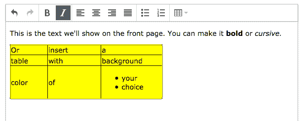
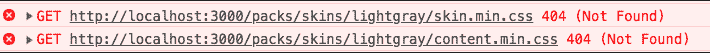
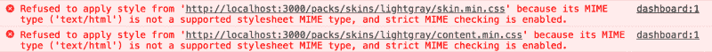

# 如何使用 Webpack 在 Rails 应用程序中设置 TinyMCE

> 原文：<https://www.freecodecamp.org/news/how-to-setup-tinymce-in-your-rails-app-using-webpack-edf030915332/>

乔安娜·高登

# 如何使用 Webpack 在 Rails 应用程序中设置 TinyMCE


在 Rails 中使用 Webpack 处理资产的流行程度正在稳步上升。开始真的很简单。如果你正在启动一个新的应用，你只需运行 `rails new my_app --webpack`，Rails 会处理剩下的事情。

多亏了 webpacker gem ，将 Webpack 添加到您现有的应用程序中也变得相当简单。您将 gem 添加到您的 Gemfile 中，进行捆绑，最后安装 webpacker:

```
gem 'webpacker', '~> 3.5'bundlebundle exec rails webpacker:install
```

这真是太好了。现在，您需要做的就是将 JavaScript 包和导入其中的 CSS 链接到您的`application.html.haml`的头部:

```
<%= javascript_pack_tag 'application' %> <!-- js from app/javascript/packs/application.js -->
```

```
<%= stylesheet_pack_tag 'application' %> <!-- CSS imported via Wbpack -->
```

一旦完成了这些，您就可以编写现代 JavaScript 代码并利用所有优秀的库了。

### tinyMCE 是什么？

TinyMCE 是云中的富文本编辑器。简单来说，就是像 Word 一样可以实现到你的 app 里。

我正在做的项目使用它让管理员编辑首页的内容。多亏了 TinyMCE，不需要为此目的构建单独的管理界面。但是编辑器的用法可以灵活得多。例如，想想 Wordpress 或 Evernote 的内置工具能让你做什么。



Example use of TinyMCE. The power is in the user’s hands now.

### 通过 CDN 使用

我们最初是通过 CDN 实现编辑器的(例如将脚本链接到我们的`application.html.haml`的头部),如下所示:

```
!!!%html  %head    %meta ... <!-- some meta content -->    %title ... <!-- MyApp -->    = csrf_meta_tags
```

```
 %script{src: 'https://cloud.tinymce.com/stable/tinymce.min.js?apiKey=gexncjni90zx3qf0m5rr7kl8l40wd5yuly2xjza0g3kwrljt'}    = stylesheet_link_tag 'application', media: 'all'    = javascript_include_tag 'application'  %body    <!-- the usual body stuff -->
```

这需要在`app/assets/javascript/tinyMce.js`中添加一个带有我们定制功能的文件。注意，我们也在使用 jQuery。

```
$( document ).on('turbolinks:load', function() {
```

```
 tinyMCE.init({         selector: 'textarea.tinymce',             // some other settings, like height, language,         // order of buttons on your toolbar etc.             plugins: [            'table', 'lists' // whatever plugins you want to add        ]    });});
```

除此之外，我们必须包含一个[翻译文件](https://www.tiny.cloud/download/language-packages/)(如果你在应用程序中使用英语，这是不必要的)。为了在生产中正确显示一切，你还需要获得一个免费的[微型云 API 密匙](https://apps.tiny.cloud/signup/)。

### Webpack 和 tinyMCE

几个月来一切都很好，但是我们决定是时候向 Webpack 过渡了。

Webpack 应该能让你的生活更轻松，再加上 yarn，让你专注于重要的事情。假设您想使用包 A。碰巧的是，包 A 依赖于包 B 和包 c，而包 B 依赖于包 D、包 E 和包 f。与其花费数小时来找出依赖项并逐个安装它们，不如说`yarn add package-A`，让它为您解决问题。而这*几乎就是*的情况。

这种转变对 tinyMCE 来说比它应该有的要痛苦得多。这也是我决定写这篇文章的原因。我希望它能节省一些时间和挫折。

**如果你之前通过 CDN** 实现了 tinyMCE，你可能想去掉一些东西，重新开始。从`application.html.haml`中移除脚本链接。然后注释掉`tinyMce.js`文件的内容(以及语言文件，如果您正在使用的话)。我还决定摆脱 jQuery 依赖(在我们的例子中，这意味着从 Gemfile 中移除`gem 'jquery-rails'`，在`app/assets/javascripts/application.js`中移除`//= require jquery`，并用`//= require rails-ujs`替换`//= require jquery_ujs`)。

注意:如果您的项目中有更多依赖于 jQuery 的外部库(例如 Bootstrap 或 Select2)，请谨慎操作。最终你的目标可能是把它们都转移到 Webpack 上，但是项目越大，任务越复杂，所以记住这一点。没有什么能阻止您将传统实现与 Webpack 并行。在这种情况下，我仍然建议在 tinyMCE 实现时将其注释掉。

所有这些步骤将确保我们从现在开始要实现的东西能够工作，并且旧的实现不会作为后备。

#### **第一步。如果你想通过 webpack 使用 jQuery**

通过 Webpack 添加 jQuery 就像运行`yarn add jquery`并向`config/webpack/environment.js`添加以下代码一样简单:

```
const { environment } = require('@rails/webpacker')const webpack = require('webpack')environment.plugins.prepend('Provide',  new webpack.ProvidePlugin({    $: 'jquery',    jQuery: 'jquery'  }))module.exports = environment
```

#### **第二步。获取 tinyMCE 包**

这也非常简单:运行`yarn add tinymce`。

然后创建一个新文件，我们将在其中放置我们的函数。我以`app/javascript/vendor/tinyMce.js`结尾，内容如下:

```
import tinymce from 'tinymce/tinymce';import 'tinymce/themes/modern/theme';import 'tinymce/plugins/table';import 'tinymce/plugins/lists';
```

```
function tinyMce() {    tinymce.init({        selector: 'textarea.tinymce',
```

```
 // some other settings, like height, language,         // order of buttons on your toolbar etc.
```

```
 plugins: [            'table', 'lists'        ]    });}
```

```
// if you're using a language file, you can place its content here
```

```
export { tinyMce };
```

#### **第三步。`application.js`将一切导入到**

我们可以像这样导入函数:

`import { tinyMce } from "../vendor/tinyMce";`

然后称之为:

```
document.addEventListener(“turbolinks:load”, function () {    tinyMce(); });
```

如您所见，我们还用 ES6 替换了 jQuery 代码。

#### **第四步。让 tinyMCE 皮肤工作**

如果您运行您的`webpack-dev-server`和`rails s`，您可能会惊讶地发现您的文本编辑器不在那里。在控制台中查看一下，您会看到以下错误:



这是因为 tinyMCE 没有皮肤就无法工作，通过 Webpack 将它拉进来需要它的显式导入。我们可以通过将这一行包含在我们的`tinyMce.js`文件中来做到这一点，就在其他 import 语句之后。该路径相对于`node_modules`文件夹:

```
import ‘tinymce/skins/lightgray/skin.min.css’;
```

此时，你应该让你的编辑器工作了。

但是……如果您查看控制台，您可能会失望地发现您仍然得到两个错误:



不要绝望！有一个简单的解决方法。只需将`skin: false`添加到您的`function tinyMce()`配置中，它应该会完成这个任务。这将阻止默认文件的加载。

恭喜你。你刚刚让你的 tinyMCE 运转起来了！