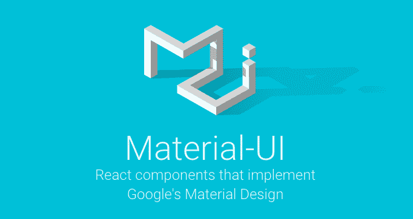
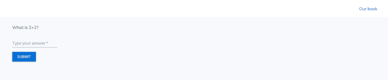
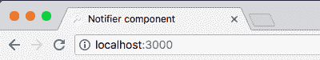
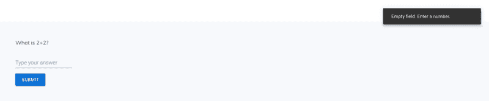
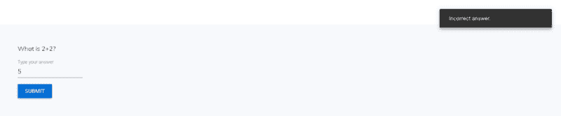
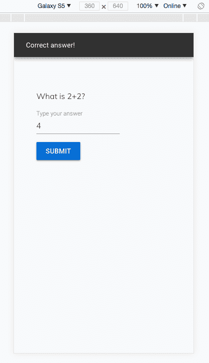
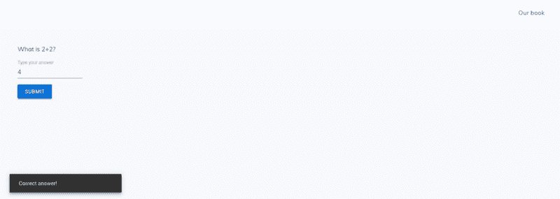
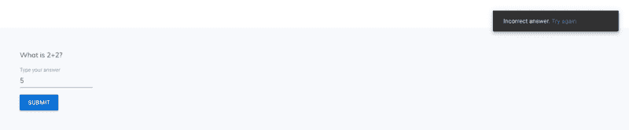

# 如何在 React web 应用中使用 Material-UI 显示应用内消息

> 原文：<https://www.freecodecamp.org/news/how-to-show-informational-messages-using-material-ui-in-a-react-web-app-5b108178608/>

作者:凯莉·波尔克

# 如何在 React web 应用中使用 Material-UI 显示应用内消息



[Image source](https://www.material-ui.com/#/)

在某些情况下，您的 web 应用程序需要显示一条信息性消息来告诉用户某个事件是否成功。例如，用户点击按钮并成功完成某个操作后的“成功”消息。

在本教程中，我将向您展示如何使用 React 和 Material-UI 为信息性的应用内消息创建一个简单的组件。我们称之为`Notifier`组件。

以下是本教程的主要部分:

*   入门指南
*   通知程序组件
*   将通告程序组件导入索引页面
*   测试

如果你觉得这篇文章很有用，可以考虑看看我们的 [Github repo](https://github.com/builderbook/builderbook) 并看看我们的[书](https://builderbook.org/book)，在那里我们详细讨论了这个和许多其他主题。

### **入门**

对于本教程，我已经为您创建了一个简单的 web 应用程序。我们将使用位于 [builderbook repo](https://github.com/builderbook/builderbook) 的 [tutorials/4-start](https://github.com/builderbook/builderbook/tree/master/tutorials/4-start) 文件夹中的代码。

如果你没有时间在本地运行这个应用，我在这里部署了这个示例应用[。](https://notifier.builderbook.org)

要在本地运行应用程序:

*   使用以下命令将 builderbook repo 克隆到您的本地计算机:

```
git clone git@github.com:builderbook/builderbook.git
```

*   在`4-start`文件夹中，运行`yarn`或`npm install`，安装`package.json`中列出的所有软件包。
*   运行`yarn dev`启动应用程序。

#### 索引页

在你的浏览器上，进入 [http://localhost:3000](http://localhost:3000) 。这是我们的`Index`页面，里面有`/`路线。js 为位于`/pages`文件夹中的页面提供自动路径。每个页面文件的名称成为该页面的路径。

我们的`Index`页面是一个简单的页面组件，它呈现一个表单、一个输入和一个按钮(下面有更多解释)。



下面是我们在`pages/index.js`的`Index`页面的代码:

一些注意事项:

*   我们可以将这个页面定义为无状态功能组件，因为它没有状态、生命周期挂钩或引用([阅读更多](https://www.jstwister.com/post/react-stateless-functional-components-best-practices/)关于何时使用无状态功能组件与 React ES6 类)。您将看到这个 Eslint 警告:`Component should be written as a pure function`。但是，我们在本教程中编写的 **final** `Index`页面会有 ref。因此，我们使用[扩展](https://developer.mozilla.org/en-US/docs/Web/JavaScript/Reference/Classes/extends)编写了这个**初始** `Index`页面作为 [ES6 类](https://developer.mozilla.org/en-US/docs/Web/JavaScript/Reference/Classes)的子页面。
*   为了定制页面的`<He` ad >元素，我们从 Next.js 导入了 [Head](https://github.com/zeit/next.js/#populating-head) 。I `nside` < Head >，we a`dded a` page `<t`title>和< meta >描述用于搜索引擎机器人的正确索引(good fo`r SEO).`<title>内的文本显示在您的浏览器选项卡上:



*   我们使用了 Material-UI 的 [TextField](https://material-ui-next.com/api/text-field/#textfield) 和 [Button](https://material-ui-next.com/demos/buttons/#buttons) 组件，渲染成`<inp`ut>t；按钮>分别是 HTML 元素。
*   我们用一个高阶组件包装了我们的页面。我们的应用程序使用 Next.js，并且`withLayout`确保服务器端渲染在我们的 React-Next 应用程序中为 Material-UI 正常工作。`withLayout`还将我们的`Header`组件(位于`components/Header.js`)添加到`withLayout`包装的每个页面中。服务器端渲染对于 Material-UI 或 React 来说并不是必需的，但它是 Next.js 的一个主要特性，我们在另一个教程中讨论了 React 应用程序中的[服务器端与客户端渲染](https://hackernoon.com/server-side-vs-client-side-rendering-in-react-apps-443efd6f2e87)。

我们已经完成了对初始`Index`页面的描述。现在让我们讨论一下`Notifier`组件，我们稍后将把它导入到`Index`页面中，以便向我们的 web 应用程序用户显示信息性消息。

### 通知程序组件

让我们从定义`Notifier`组件开始。我们将`Notifier`定义为一个`React.Component`，而不是一个无状态函数，因为`Notifier`将有状态、一个生命周期方法和一些事件处理函数。

对于我们的信息性消息，我们将使用 Material-UI 的 [Snackbar](https://material-ui-next.com/demos/snackbars/#snackbars) 。在官方的 Material-UI 网站上查看[使用 Snackbar 的例子](https://material-ui-next.com/demos/snackbars/#snackbars)。

下面是我们的`Notifier`组件的概要:

在`4-start`的`/components`文件夹下创建一个`Notifier.js`文件。将上面的高级大纲添加到这个文件中。下面，我们将用代码替换带编号的注释。

1.我们将使用 Material-UI 的 Snackbar 的`open`和`message`道具来表示我们`Notifier`的状态。查看 snack bar 的[完整道具列表。](https://material-ui-next.com/api/snackbar/#props)

最初，我们的`Notifier`应该处于关闭状态，用一个空字符串作为消息。我们将`Notifier`的初始状态定义为:

2.现在让我们写一个更新通知组件状态的函数。该函数会将`open`属性的值更改为`true`，并将`message`属性的值设置为非空字符串。我们称这个函数为`openSnackbar()`。

在我们可以执行`openSnackbar()`之前，我们的`Notifier`组件需要安装在 DOM 中。因此，我们将`openSnackbar()`函数放入一个`componentDidMount`生命周期方法中，该方法在`Notifier`组件装入 DOM 后立即执行。

为了在我们的应用程序中的任何地方访问`openSnackbar()`函数**，我们必须将它的值设置为`Notifier`组件外部可用的另一个函数。因此，我们把`let openSnackbarFn`写在`class Notifier extends React.Component`上面。**

**将这些碎片放在一起:**

**现在让我们定义一下`openSnackbar()`函数。这个函数将更新我们的`Notifier`状态的`open`和`message`属性。一旦状态被更新，`Notifier`组件将被重新呈现以显示一条消息(`open:true`显示 Snackbar，`message:message`设置消息)。**

**在`this.setState`里面，我们可以把`message`写成`message:message`。相反，我们使用 ES6 [速记语法](https://eslint.org/docs/rules/object-shorthand)(由 Eslint 执行)使代码更加简洁。**

**3.当用户在 Snackbar 区域之外单击时，Snackbar 应该会关闭。Snackbar 属性`onClose`负责此行为。让我们编写一个名为`handleSnackbarClose()`的函数，将`open`设置为`false`，将`message`设置为一个空字符串。**

**4.最后，让我们为我们的`Notifier`组件编写代码，用所有必要的道具来呈现 Snackbar 组件。**

**除了上面描述的`message`、`onClose`和`open`道具，我们将向 Snackbar 组件添加以下道具:**

*   **`anchorOrigin`:指定 Snackbar 的位置**
*   **`autoHideDuration`:以毫秒为单位指定 Snackbar 持续时间**
*   **`SnackbarContentProps`:将 Snackbar 绑定到包含`message`的 DOM 中的一个元素；在我们的例子中，元素的 id 是`snackbar-message-id`，Snackbar 将显示这个元素的文本。**

**下面是我们的`Notifier`组件的`render()`方法:**

**在`<sp` an >元素中，我们可以有 wr `itten message={this.state.me` ssage}，但是我们却有`wrote dangerouslySetInnerHTML={{ __html: this.state.mess` age }}。这允许我们将 HTML 代码添加到点心`bar’s m` essage prop 中。例如，你可能想显示一个到 T4 用户的超链接。Rea d 关于在 React 中使用 dangerouslySetInnerHTML 的更多信息。**

**将步骤 1-4 的代码放在一起后，这是我们最后的`Notifier`组件:**

**重要提示:请注意，除了`Notifier`组件，我们还导出了`openSnackbar()`函数。我们将把**`openSnackbar()`和`Notifier`都导入到我们的`Index`页面中。****

### ****将通告程序组件导入索引页面****

****让我们回到我们的`Index`页面，在这里我们将导入我们的`Notifier`组件和`openSnackbar()`函数。****

****在没有触发`openSnackbar()`函数的情况下，我们的`Notifier`组件将一直停留在初始关闭状态，并以一个空字符串作为消息。在用户点击我们的`Index`页面上的按钮提交表单后，我们需要执行`openSnackbar()`。让我们定义一个`showNotifier()`函数来做这件事。****

#### ****showNotifier 函数****

****我们将在`<fo` rm >元素内部调用`showNotifier()`。当用户在表单上输入一个数字并点击“提交”按钮时，我们将 `make showNoti` fier()执行。****

****这是当前的`<fo` rm > o `n our`索引页:****

****让我们做两处修改:****

****1.为了在提交表单时调用`showNotifier()`，我们使用 JavaScript 的 [onsubmit 事件](https://www.w3schools.com/jsref/event_onsubmit.asp):****

****2.用户将在`TextField`中输入一个数字。为了让我们的`showNotifier()`函数访问`TextField`的值，我们将 React 的 [ref 属性](https://reactjs.org/docs/refs-and-the-dom.html#adding-a-ref-to-a-dom-element)添加到`TextField`。****

****有两种方法可以得到`TextField`的值:用`this.state`和用`ref`。我们选择了`ref`，因为`this.state`更简洁。这里是关于用`this.state`写作的[解释](https://stackoverflow.com/questions/36683770/react-how-to-get-the-value-of-an-input-field?utm_medium=organic&utm_source=google_rich_qa&utm_campaign=google_rich_qa)，这里是关于在 React 中使用`ref`的[更多信息](https://reactjs.org/docs/refs-and-the-dom.html#callback-refs)。****

****现在让我们定义一下`showNotifier()`函数。以下是`showNotifier()`的概要:****

****下面，我们将为上面的三个注释分别编写代码。****

1.  ****我们将`answer`定义为:****

****这行代码表示，如果`answerInput`存在(意味着`<inp` ut >元素被添加到 DOM 中)， `THEN` 答案等于 val `ue of answe` rInput，它被访问为 `with answerInput`value****

****如果`answerInput`不存在，那么括号中的整个条件为假，并且`answer`等于`null`。****

****2.如果用户没有在我们的表单上输入答案，而是点击“提交”按钮，我们将显示以下消息:`Empty field. Enter a number.`****

****3.如果用户输入 4 并点击“提交”按钮，那么我们的`openSnackbar()`函数将运行并显示这条消息:`Correct answer!`。否则，它会显示`Incorrect answer.`****

****我们使用`parseInt(answer, 10)`来解析`answer`，它是一个字符串，并返回一个整数。参数`10`指定整数是十进制格式。****

****让我们把上面步骤 1-3 的代码放在一起，组成我们的`showNotifier`函数。我们将代码放在第`class Index extends React.Component`行的正下方:****

****你会注意到我们添加了一行`event.preventDefault();`。这将阻止我们的`<fo` rm >元素使用它的默认行为[或者发送表单数据到](https://developer.mozilla.org/en-US/docs/Learn/HTML/Forms/Sending_and_retrieving_form_data)服务器。****

****现在我们有了最后一个`Index`页面的所有代码:****

### ****测试****

****让我们测试一下我们的`Notifier`是否像预期的那样工作。用`yarn dev`在本地运行 app，导航到 [http://localhost:3000](http://localhost:3000) 。如果你没有运行这个应用，去我部署的那个:【https://notifier.builderbook.org[。](https://notifier.builderbook.org)****

****首先，单击“提交”,无需在文本字段中添加任何内容。****

********

****接下来，添加数字 4 并点击“提交”。****

********

****现在添加任何其他号码并点击“提交”。****

********

****请记住，我们编写了代码来在用户点击离开 Snackbar 时关闭它(我们编写了一个`handleSnackbarClose()`函数，并将其传递给 Snackbar 的`onClose` prop)。看到 Snackbar 后，单击屏幕上 Snackbar 旁边的任意位置。小吃店应该立即关闭。****

****Material-UI 的一个很好的特性是移动优化。我们不必为我们的信息性消息编写额外的代码，以便在移动设备上看起来更好。去 Chrome 的 DevTools 看看，把视图从桌面改为移动。我们的信息出现在屏幕上方:****

********

****呜哇！您已成功向 React web 应用添加了一条应用内信息！您的最终代码应该与我们的 [builderbook repo](https://github.com/builderbook/builderbook) 的[教程/4-end](https://github.com/builderbook/builderbook/tree/master/tutorials/4-end) 文件夹中的代码相匹配。****

#### ****自定义通知程序组件****

****现在你已经有了一个工作的`Notifier`组件，让我们看看如何通过改变 Material-UI 的 SnackBar 组件来修改 UX。这是你可以使用的道具的[完整列表](https://material-ui-next.com/api/snackbar/#props)。****

****首先，让我们改变 Snackbar 的持续时间。在你的`Notifier`组件内部，找到`autoHideDuration`道具。将其值从`3000`更改为`1000`并进行比较。你会看到在`1000`，小吃店关门更快。****

****其次，让我们改变 Snackbar 的位置。找到`anchorOrigin`道具，将其值从`top`和`right`分别改为`bottom`和`left`。现在检查 Snackbar 出现的位置:****

********

****最后，让我们让 Snackbar `message`包含一个超链接。回想一下，我们在 Snackbar 的`message`属性中添加了`dangerouslySetInnerHTML={{ __html: this.state.message }}`，这样我们就可以在其中编写 HTML 了。****

****像这样更改我们的`Correct answer!`和`Incorrect answer.`消息的代码:****

****现在，用户将看到下面的消息。注意`<`中文本的深蓝色超链接；一个>标签。****

****************

****如果你正在学习如何用 JavaScript 构建 web 应用程序，请查看我们的 [Github repo](https://github.com/builderbook/builderbook) 和我们的[书](https://builderbook.org/book)，在那里我们详细讨论了这个和许多其他主题。****

****要获得关于我们教程的电子邮件更新，请在此订阅。****