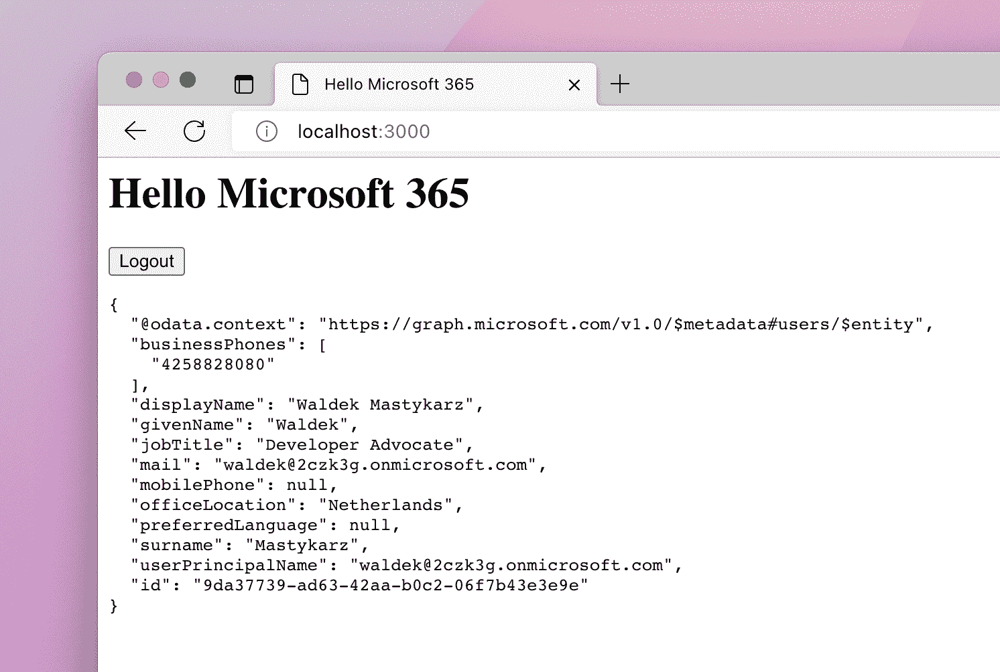
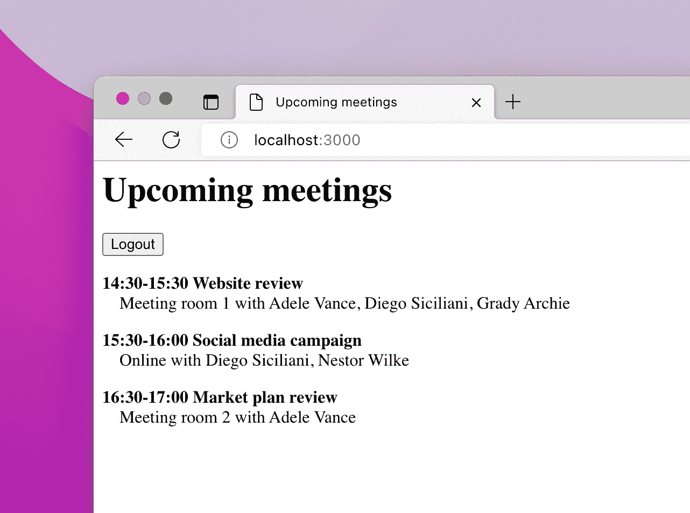
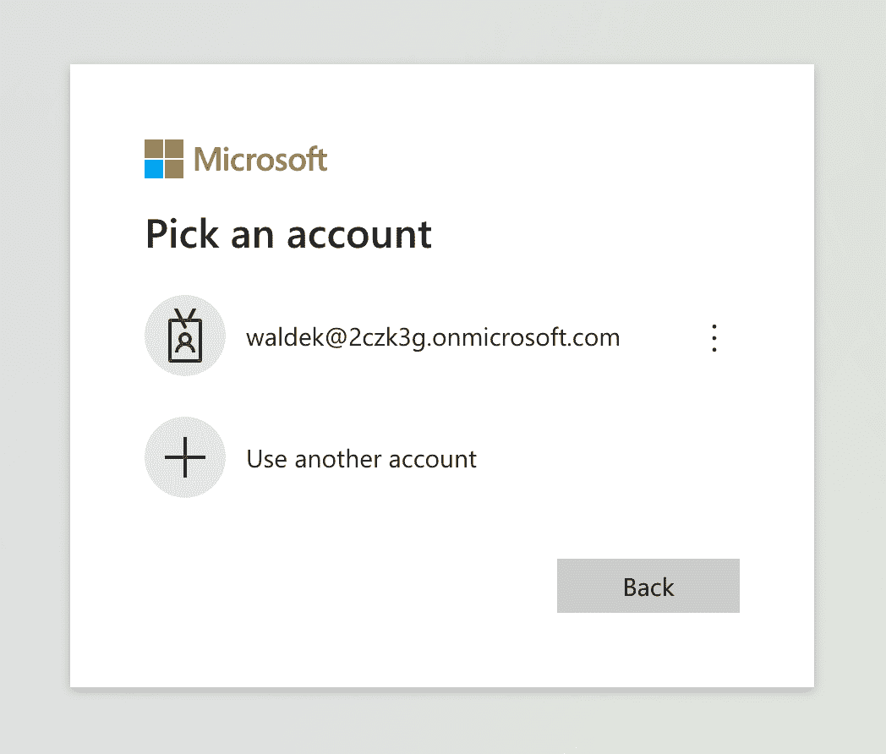
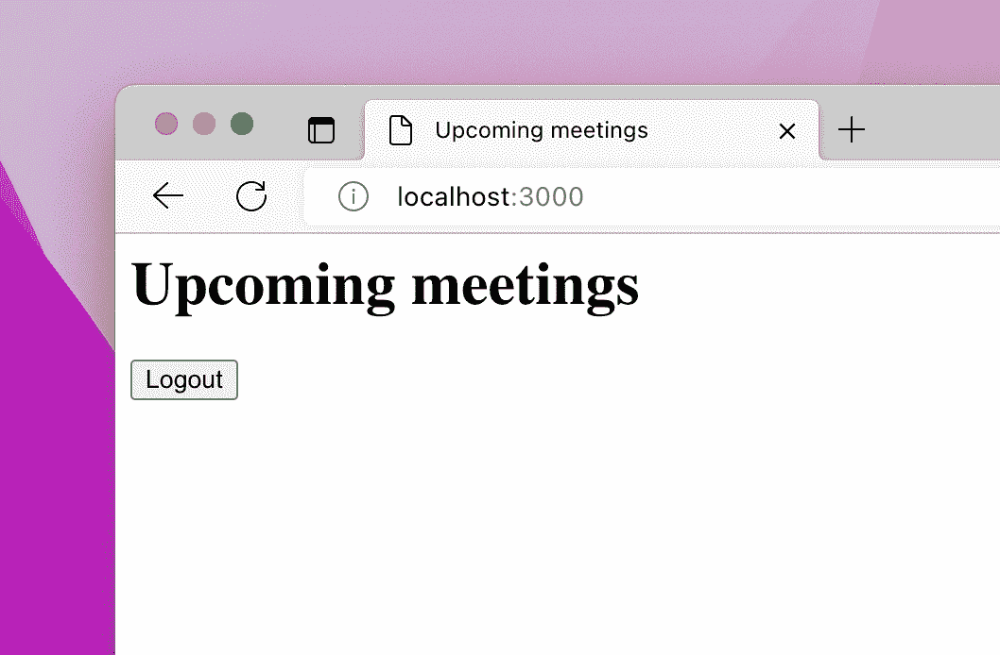
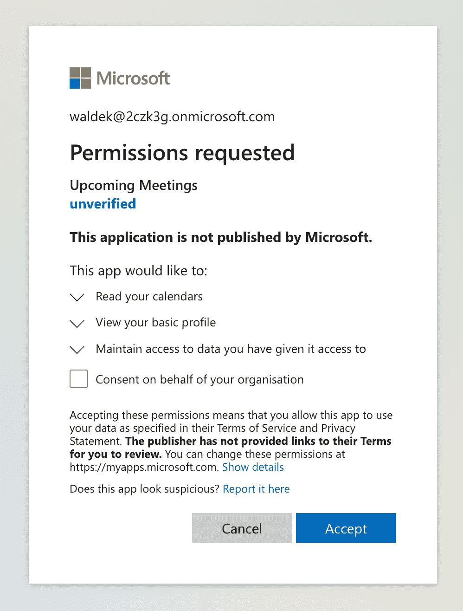
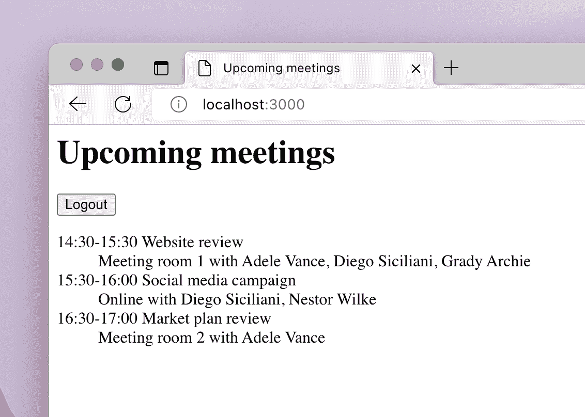

# 如何为 Microsoft 365 用户显示即将召开的会议

> 原文：<https://www.freecodecamp.org/news/how-to-show-upcoming-meetings-for-a-microsoft-365-user/>

如果你是一名网络开发人员，并且在一家使用微软 365 的公司工作，你可能会用它来管理你的会议。

在本教程中，您将学习如何在 10 分钟内构建一个简单的个人助理，向 Microsoft 365 用户显示他们当天剩下的会议。

## 如何为微软 365 构建应用

[之前](https://www.freecodecamp.org/news/build-microsoft-365-application-in-10-minutes/)我向您展示了如何利用您现有的 web 开发技能来挖掘存储在 Microsoft 365 上的数据和见解，并为您的组织构建应用程序。

只需 10 分钟，您就可以构建一个简单的应用程序，向您显示使用 Microsoft 365 帐户登录您的应用程序的用户的个人资料。



Simple Microsoft 365 application showing the profile of the current user

这一次，我想向您展示如何在短短 10 分钟内构建一个简单的个人助理，为当前登录的用户显示即将到来的会议。



Custom app for Microsoft 365 showing list of upcoming meetings

## 你需要什么

*   [Node.js LTS](https://nodejs.org/) (写这篇文章的时候，是 16.18.0)
*   一个微软 365 开发者租户。你可以从[微软 365 开发者计划](https://developer.microsoft.com/microsoft-365/dev-program)免费获得一个，它将让你访问构建应用所需的所有微软 365 APIs，以及一些开始使用的演示数据
*   你的 10 分钟时间

## 如何在微软云上注册您的应用

为您的应用程序创建一个文件夹，用于存储所有应用程序文件。打开终端，将工作目录切换到该文件夹。

在终端中，运行以下命令:

```
npx -p @pnp/cli-microsoft365 -- m365 login --authType browser
```

在您的 web 浏览器中，使用您新创建的 Microsoft 365 开发人员帐户登录:



Sign into your Microsoft 365 developer account

接下来，回到终端，运行以下命令:

```
appId=$(npx -p @pnp/cli-microsoft365 -- m365 aad app add --name "Upcoming Meetings" --multitenant --redirectUris "http://localhost,http://localhost/index.html" --platform spa  --query "appId" -o text)
```

通过这两个命令，您已经使用了 Microsoft 365 的[CLI](https://aka.ms/cli-m365)登录到 Microsoft 365，并在 Microsoft Cloud 上注册了您的新应用程序。

每个与 Microsoft 365 集成的应用程序都必须注册，并提供应用程序的名称和类型(平台)等信息。对于单页应用程序，您还需要指定应用程序的 URL，用于确保用户登录到正确的应用程序。

接下来，将新创建的应用程序的 ID 写入您将在应用程序中引用的文件。在终端中，运行:

```
echo "const appId = '$appId';" > env.js
```

## 如何创建您的应用程序

在代码编辑器中打开应用程序文件夹。创建一个名为`index.html`的新文件，并粘贴以下代码:

```
<html>
<head>
  <title>Upcoming meetings</title>
  <!-- TODO #1: add libraries -->
</head>
<body>
  <h1>Upcoming meetings</h1>
  <div id="auth"></div>
  <div id="upcomingMeetings"></div>
  <script>
    // TODO #2: add app code
  </script>
</body>
</html>
```

这段代码是一个简单的 HTML 页面，有两个占位符:一个用于构建应用程序的库，另一个用于应用程序的代码。它还包含一个用于显示登录/注销按钮的`div`和另一个用于显示今天即将召开的会议列表的`div`。

## 如何添加库

用以下代码替换`TODO #1`注释:

```
 <script src="https://alcdn.msauth.net/browser/2.28.3/js/msal-browser.min.js"></script>
  <script src="https://cdn.jsdelivr.net/npm/@microsoft/microsoft-graph-client/lib/graph-js-sdk.js"></script>
  <script
    src="https://cdn.jsdelivr.net/npm/@microsoft/microsoft-graph-client/lib/graph-client-msalBrowserAuthProvider.js"></script>
  <script src="./env.js"></script>
```

要构建此应用程序，您将使用几个库:

*   [MSAL.js](https://learn.microsoft.com/azure/active-directory/develop/msal-overview?WT.mc_id=m365-79476-wmastyka) 帮助您处理使用 Microsoft 365 帐户登录的用户
*   [Microsoft Graph JavaScript SDK](https://learn.microsoft.com/graph/sdks/sdk-installation#install-the-microsoft-graph-javascript-sdk)简化了调用 Microsoft Graph——访问 Microsoft 365 数据和见解的 API
*   将 MSAL.js 与 Microsoft Graph JS SDK 集成在一起的 MSAL 浏览器授权提供商
*   之前创建的带有您的应用 ID 的`env.js`文件

使用这些库将帮助您更快地构建应用程序，并且您不必担心如何让用户登录、获取访问令牌或正确处理 API 错误的细节。

## **如何让用户使用他们的 Microsoft 365 帐户登录**

用以下代码替换`TODO #2`注释:

```
 (() => {
      // TODO #3: create MSAL client

      // TODO #5: handle login/logout

      // TODO #6: create Microsoft Graph client

      // TODO #7: get upcoming meetings from Microsoft 365 user's calendar

      function render() {
        // TODO #4: render UI
      }

      render();
    })();
```

这段代码是一个立即调用的函数表达式(IIFE ),它封装了应用程序的代码，并在应用程序加载时运行。它还包含几个占位符，用于您将在接下来的步骤中编写的代码。

用以下代码替换`TODO #3`注释:

```
 const scopes = ['Calendars.Read'];
      const msalConfig = {
        auth: {
          clientId: appId
        }
      };
      const msalClient = new msal.PublicClientApplication(msalConfig);
```

在这个片段中，您将为 MSAL.js 库创建一个新的配置对象，其中包含对您之前创建的应用程序 ID 的引用。您还可以定义一个权限列表(也称为范围)，您的应用程序必须请求该列表才能访问当前登录用户日历中的信息。

接下来，将这个对象传递给`PublicClientApplication`构造函数，以创建 MSAL 客户端的新实例。您将使用此帐户让用户使用他们的 Microsoft 365 帐户登录您的应用程序。

现在，应用程序显示一个空白页面。让我们通过用下面的代码替换`TODO #4`注释来改变这一点:

```
 msalClient
          .handleRedirectPromise()
          .then(response => {
            const accounts = msalClient.getAllAccounts();

            if (accounts.length === 0) {
              document.querySelector('#auth').innerHTML = '<button>Login</button>';
              document.querySelector('#auth button').addEventListener('click', login);
              document.querySelector('#upcomingMeetings').innerHTML = '';
            }
            else {
              document.querySelector('#auth').innerHTML = '<button>Logout</button>';
              document.querySelector('#auth button').addEventListener('click', logout);
              // TODO #8: load upcoming meetings
            }
          });
```

当用户使用其 Microsoft 365 帐户登录时，您会将他们重定向到 Microsoft 365 登录页面。他们登录后，会被重定向回你的应用。

`handleRedirectPromise`函数将处理微软 365 发送给你的应用程序的信息。当用户来到你的应用程序前还没有登录时，`handleRedirectPromise`功能将通过一个`null`响应来解决。

处理重定向后，您使用 MSAL 检查是否有任何用户登录到您的应用程序。如果没有(`accounts.length === 0`)，则显示登录按钮。如果有用户登录，您将显示注销按钮。稍后，您将添加代码来显示用户日历中即将到来的会议。

登录和注销按钮都缺少它们的点击处理程序，所以让我们通过用下面的代码替换`TODO #5`来添加它们:

```
 function login(e) {
        e.preventDefault();
        msalClient.loginRedirect({
          scopes
        });
      }

      function logout(e) {
        e.preventDefault();
        msalClient.logoutRedirect();
      }
```

在这两种情况下，您都使用 MSAL 通过将用户重定向到 Microsoft 365 登录/注销页面来登录和注销用户。在登录功能中，您还传递相同的权限集，以便用户在登录应用程序并加载其数据时，仅会被提示一次批准相同的权限集。

在此阶段，您的应用程序应该允许您使用 Microsoft 365 帐户登录和注销。要验证一切正常，请保存您的更改，并在终端中运行:

```
npx lite-server
```

在您的网络浏览器中，导航至`http://localhost:3000`并登录您的应用。您应该会看到以下屏幕:



After signing in to your app

当您单击“登录”按钮时，会要求您使用 Microsoft 365 帐户登录。然后，当你点击注销按钮时，你将从微软 365 和应用程序中注销。

构建应用程序的第一部分到此结束，您可以开始使用 Microsoft Graph 从 Microsoft 365 检索数据了。

## 如何从 Microsoft 365 显示即将召开的会议

既然您的应用程序支持使用 Microsoft 365 帐户登录和注销，下一步就是添加代码，以便从登录用户的日历中检索有关即将召开的会议的信息。

### 如何获得 Microsoft Graph 客户端

用以下代码替换`TODO #6`注释:

```
 function getGraphClient(account) {
        const authProvider = new MSGraphAuthCodeMSALBrowserAuthProvider.AuthCodeMSALBrowserAuthenticationProvider(msalClient, {
          account,
          scopes,
          interactionType: msal.InteractionType.Redirect,
        });

        return MicrosoftGraph.Client.initWithMiddleware({ authProvider });
      }
```

此函数将用于登录应用程序的 Microsoft 365 帐户作为参数。它使用它来创建一个 Microsoft Graph 客户端，您将使用该客户端来调用 Microsoft Graph APIs 并从 Microsoft 365 获取数据。

还要注意，您传递的是之前定义的 API 权限(作用域)列表。这将让`graphClient`获得 Microsoft Graph API 的访问令牌，以访问日历信息。

### 如何加载关于即将召开的会议的信息

接下来，让我们用下面的代码替换`TODO #7`注释:

```
 function getTimeString(dateFromGraph) {
        const date = new Date(dateFromGraph + 'Z');
        const minutes = date.getMinutes();
        return `${date.getHours()}:${minutes < 10 ? '0' : ''}${minutes}`;
      }

      function loadUpcomingMeetings(graphClient) {
        // configure Microsoft Graph query to retrieve upcoming meetings for today
        const now = new Date();
        const midnight = new Date();
        midnight.setDate(midnight.getDate() + 1);
        midnight.setHours(0);
        midnight.setMinutes(0);
        midnight.setSeconds(0);
        midnight.setMilliseconds(0);

        graphClient
          .api(`/me/calendarview?startdatetime=${now.toISOString()}&enddatetime=${midnight.toISOString()}&$orderby=start/dateTime`)
          .get()
          .then(res => {
            if (res.value.length === 0) {
              document.querySelector('#upcomingMeetings').innerHTML = 'No more meetings for today';
            }
            else {
              const meetingsHtml = res.value.map(meeting => {
                return `<dt>
                  ${getTimeString(meeting.start.dateTime)}-${getTimeString(meeting.end.dateTime)} ${meeting.subject}
                </dt>
                <dd>
                  ${meeting.location.displayName} with ${meeting.attendees.map(attendee => attendee.emailAddress.name).join(', ')}
                </dd>`;
              });
              document.querySelector('#upcomingMeetings').innerHTML = `<dl>${meetingsHtml.join('')}</dl>`;
            }
          });
      }
```

`loadUpcomingMeetings`函数将 Microsoft Graph JavaScript SDK 返回的 Microsoft Graph 客户端实例作为参数，并使用它来调用 Microsoft Graph API。

### 如何调用微软图形 API

为了获得今天即将召开的会议的列表，您调用了`/me/calendarview` Microsoft Graph API。此端点将开始和结束日期和时间作为参数，并返回日历视图。

使用此端点，您可以将用户日历中可能出现的定期会议包括在内。要检索今天即将召开的会议，您需要将当前时间作为开始日期/时间，将即将到来的午夜作为结束日期/时间。

### 如何处理 Microsoft Graph API 响应

调用 API 后，您将获得一个数组，其中包含代表当前用户即将召开的会议的对象。每个会议都包含会议主题、开始和结束时间、地点和与会者等信息。

如果返回的数组为空，则意味着没有即将召开的会议。如果它包含一个或多个项目，您可以使用`map`函数将会议项目转换成带有`dt`和`dd`的 HTML 字符串，以可读的格式显示会议的主题、开始和结束时间、会议的地点以及与会者。

### 如何格式化事件的开始和结束时间

要格式化日期，您可以使用`getTimeString`功能。它将 Microsoft Graph 返回的日期作为参数。

这里要记住的重要一点是，默认情况下，Microsoft Graph API 返回 UTC 时区的时间和日期。因为时区信息是单独存储的，所以在解析日期之前，您需要向日期字符串添加`Z` UTC 时区分母。

最后一部分是在用户登录应用程序后，将所有功能结合在一起并调用这两个功能。用以下代码替换`TODO #8`注释:

```
 const graphClient = getGraphClient(accounts[0]);
              loadUpcomingMeetings(graphClient);
```

就是这样！当您保存更改并返回浏览器时，您会看到它在后台自动刷新，系统会提示您授权应用程序访问您的日历信息。



Setting permissions on the app

授予您访问权限后，通过单击 ****接受**** 按钮，您将看到页面上显示的关于您即将召开的会议的信息。



Information about upcoming meetings retrieved from the Microsoft 365 calendar

## 摘要

在本文中，您学习了如何使用 Microsoft Graph SDK 连接到 Microsoft Graph API，并从当前用户的日历中检索关于即将召开的会议的信息。

这只是你可以在微软 365 上实现的众多场景和[类型应用](https://learn.microsoft.com/graph/overview)中的一个。有关存储在微软 365 上的数据类型和见解的更多信息，请查看[微软图形 API 文档](https://learn.microsoft.com/graph/api/overview)。