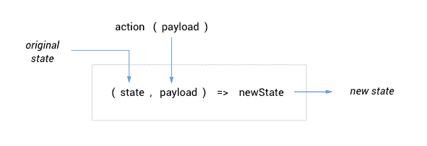
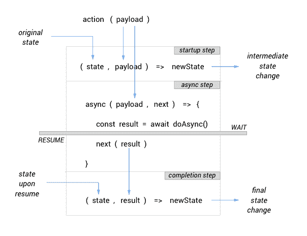

# 如何简化 React 应用程序中的状态——扭转还原

> 原文：<https://www.freecodecamp.org/news/how-to-simplify-state-in-your-react-app-redux-with-a-twist-41b0e5b12dcb/>

由 Arnel 在 1 月

# 如何简化 React 应用程序中的状态——扭转还原


Photo by [Truman Adrian Lobato De Faria](https://unsplash.com/photos/QIbyuC1W0hU?utm_source=unsplash&utm_medium=referral&utm_content=creditCopyText) on [Unsplash](https://unsplash.com/search/photos/twist?utm_source=unsplash&utm_medium=referral&utm_content=creditCopyText)

#### 新的，更容易的语法和语义的好老 Redux

“简单”和“重叠”这两个词很少出现在同一个句子中。然而，React 社区的许多人已经接受 Redux 作为实现应用程序状态的最佳解决方案之一。

现在，即使您没有编写一行 Redux 样板代码，也可以使用 Redux。你甚至不需要知道或学习 Redux。只要你确信 Redux 是你的应用程序的状态需求的首选，你就会想要阅读这个。

在本文中，我们将讨论这些主题:

*   管理简单的应用程序状态更改
*   使用异步操作(例如数据提取)
*   代码分割和延迟加载的应用程序状态

### 反应堆库

我最初编写 Reactor 库是为了最大限度地减少使用 React 的个人项目中所需的样板文件。它的一个特点是超级简单的应用程序状态管理，我将在这里与你分享。

从那以后，我决定向所有希望简化 React/Redux 代码的人开放这个库。放心用吧；它既是你的也是我的。

要安装:

```
npm install @reactorlib/core
```

### 3 个关键点

要使用 Reactor 库编写我们的应用程序状态管理，我们需要了解 3 个关键事项:

*   存储:这是保存整个应用程序状态的唯一地方。
*   **实体:**这些是应用程序状态的片段，每一个都代表一个特定的关注领域或功能。
*   **动作:**我们的组件可以调用这些函数来触发应用程序状态的一些变化。这些也存放在商店里。

### 步骤 1:创建实体

当我们定义一个实体时，我们考虑该实体将如何对某些*动作*做出反应。我们称之为它的*反应*。每个反应都包括实体内部发生的状态变化(记住，每个实体只是我们应用程序状态的一部分)。

Reactor Library 提供了一个名为`createEntity`的函数，我们将用它来定义我们的实体。它接受两个参数，实体的反应，以及它的初始状态:

```
createEntity(reactions: Object, initialState: any)
```

让我们先把比较容易的部分解决掉。`initialState`应该通过给它分配一个默认值来定义我们实体的数据结构。

`reactions`参数是动作名称与相应反应的映射。**注意，映射并不意味着定义实际的动作功能。**

最简单的反应是这样的:

```
action: (state, payload) => newState
```

其中`action`对应于动作的名称，而`payload`(可选)是实体希望您传递给动作的任何单个参数。这实际上意味着，当`action(payload)`被调用时，实体应用某种逻辑将其状态从`state`变为`newState`。



下面是实体定义的一个简单示例:

```
const initialState = { value: 0 };
```

```
const counter = createEntity(  {    increment: (state, by) => (      { ...state, value: state.value + by }    ),    reset: state => ({ ...state, value: 0 })  },  initialState);
```

**重要:**在定义实体的反应时，请记住不改变组件状态的 React 黄金法则也适用于应用程序状态。所以如果你的实体的状态是对象或数组类型，一定要确保返回一个新的对象或数组。

到目前为止很简单，对吗？让我们继续…

### 第二步:设置商店

我说“*商店”是因为在我们整个应用程序中只能有**一家**商店。为了使这个存储对我们所有的组件可用，我们需要将它注入到一个顶级组件中，通常是`<A` pp >。*

*Reactor Library 包括`withStore` HOC，它创建存储，将实体放入其中，并将其目标组件指定为存储的提供者/所有者。*

```
*`withStore(entities: Object) (Component)`*
```

*这里的`entities`参数是实体名称与使用`createEntity()`创建的实际实体对象的映射。这种映射很重要，因为我们使用这里分配的名称从存储中访问实体。*

*让我们从前面的例子中取出`counter`实体，创建我们的商店，然后将实体放入其中:*

```
*`import counter from './store/counter';`*
```

```
*`const _App = () => (  <Router>    <Shell />  </Router>);`*
```

```
*`const App = withStore({ counter })(_App);`*
```

*就这么简单，真的。我们的商店现在都准备好了。*

### *步骤 3:从商店导入道具*

*现在剩下的最后一步是让组件可以访问应用程序状态。有两个简单的规则:*

*   *组件能够通过从商店导入*实体*来*读取*应用程序状态。*
*   *他们还可以通过从商店导入*动作*来*改变*应用状态。*

*我们使用 Reactor 库的`getPropsFromStore` HOC 来完成其中一项或两项，并将它们作为道具注入到我们的组件中。*

```
*`getPropsFromStore(  entities?: Array<string>,   actions?: Array<string>) (Component)`*
```

*这里，`entities`是实体名称列表，`actions`是动作名称列表。*

*导入的实体作为*状态道具注入。*这意味着无论这些实体中的任何一个发生变化，组件都会重新呈现。*

*导入的动作作为函数属性被注入，我们可以在组件内部直接调用它们。*

*你可能想知道，我们在哪里定义这些动作函数？我们不知道。商店根据我们用`createEntity`创建实体时映射到*反应*的所有动作名称为我们创建这些。*

*继续我们前面的例子，我们从商店导入`counter`实体，如下所示:*

```
*`const _ClickCount = ({ counter, increment, reset }) => (  <>    You have clicked {counter.value} times.    <button onClick={() => increment(1)}>Click Me</button>    <button onClick={reset}>Reset Counter</button>  </>);`*
```

```
*`const ClickCount = getPropsFromStore(  ['counter'],   ['increment', 'reset'])(_ClickCount);`*
```

***就是这样！**通过 3 个简单的步骤，我们已经将组件连接到应用程序状态。*

### *使用异步操作*

*一个*异步动作*本质上是一个需要某种非阻塞、异步操作的动作，比如获取数据、定时器、计算密集型任务或者任何其他不能立即完成其执行的事情。*

*对于简单形式的反应，新状态的计算在*立即*完成。但是当处理异步操作时，实体需要执行异步操作，并在计算状态变化之前等待它完成。为此，我们需要一种不同形式的反应，它被恰当地称为*异步反应*。*

#### *定义异步反应*

*反应器库的`createEntity`使我们能够容易地定义异步反应，*以声明方式*，如下所示:*

```
*`action: [  (state, payload) => newState,  async (payload, next) => {     const result = await doSomethingAsync();    next(result);   },  (state, result) => newState]`*
```

*这是一个由异步反应的 **3 个步骤**组成的数组:*

1.  **启动步骤*，可进行任何准备状态更改，例如设置“加载”或“等待”标志。*
2.  *实体执行异步操作的*异步步骤*。它等待异步操作完成，然后调用下一步。*
3.  **完成步骤*，通常基于前面异步步骤的结果进行最终状态改变。*

*此图说明了数据如何在异步反应的 3 个步骤中流动:*

**

*第一步(启动)实际上是*可选的*，因为有时候你并不真的需要准备状态的改变。*

#### *用法示例*

*下面是一个完整的实体的例子，包括简单反应和异步反应。如果数据流和状态变化仍然有些不清楚，您可以随时回到上图。*

```
*`const initialState = { auth: null, waiting: false };`*
```

```
*`const session = createEntity(  {    login: [      state => ({ ...state, waiting: true }),      async ({ username, password }, next) => {        const response = await login(username, password);        next(response);      },      (state, { auth }) => ({ ...state, auth, waiting: false }),    ],    logout: state => ({ ...state, auth: null }),  },  initialState);`*
```

*一旦您习惯了这种 3 步格式，您将能够快速地创建实体，因为您只需要关注状态改变逻辑和数据流，而不用担心编写任何复杂的样板代码。*

***就是这样！那种方式不是太简单了吗？***

### *延迟加载应用程序状态*

*如果您进行代码拆分，您还会想要对您的应用程序状态进行代码拆分。一个惰性加载的模块可以拥有自己的*特性库*，其中包含特定于特性的实体。*

*由于应用程序中只能有一个商店，Reactor Library 提供了一种简单的方法来动态地将延迟加载的功能商店合并到主商店中。这是使用`withFeatureStore` HOC，它具有以下签名:*

```
*`withFeatureStore(entities: Object) (Component)`*
```

*您可能会注意到，这与我们之前讨论的`withStore` HOC 具有完全相同的格式。它指定了与您的功能模块一起被延迟加载的`entities`，以让 Reactor Library 知道一旦功能模块被加载，这些实体将被动态合并到存储中。*

#### *用法示例*

*让我们以一个延迟加载的定时器特性为例，它有一个`TimerPage`组件作为入口点，还有一个`timer`实体来管理它的状态。*

```
*`import timer from './store/timer';`*
```

```
*`const _TimerPage = () => (  <Countdown />);`*
```

```
*`const TimerPage = withFeatureStore({ timer })(_TimerPage);`*
```

***就是这样！**又来了，又快又容易。*

### *进一步的信息*

*要了解更多关于我们在本文中使用的 Reactor 库的信息，可以在[https://github.com/arnelenero/reactorlib](https://github.com/arnelenero/reactorlib)找到它的官方文档。*

*感谢阅读。*