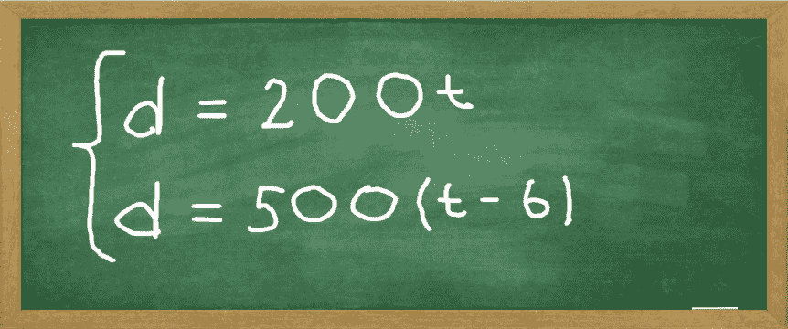
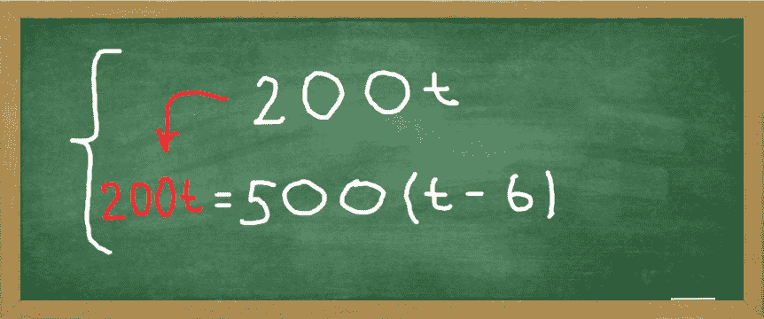
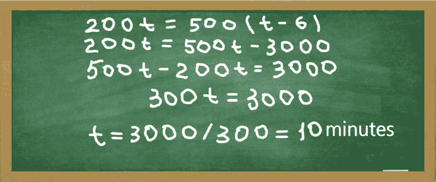
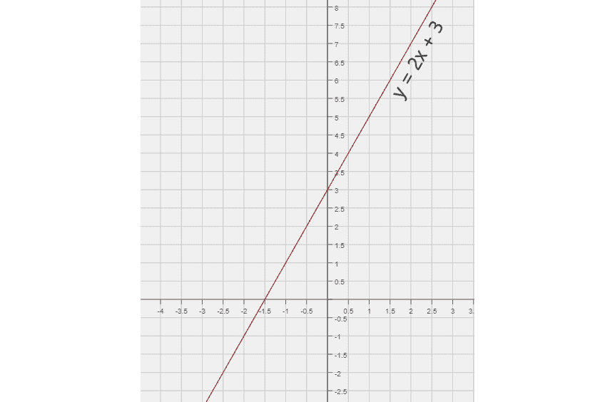
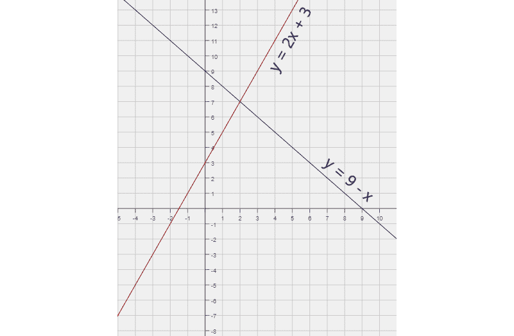
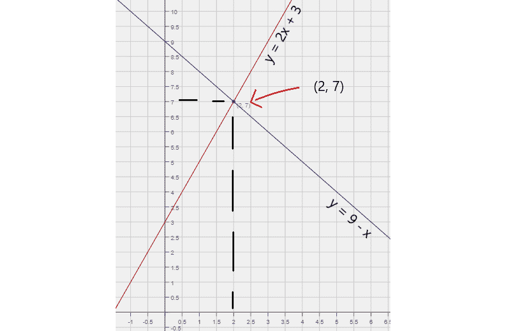
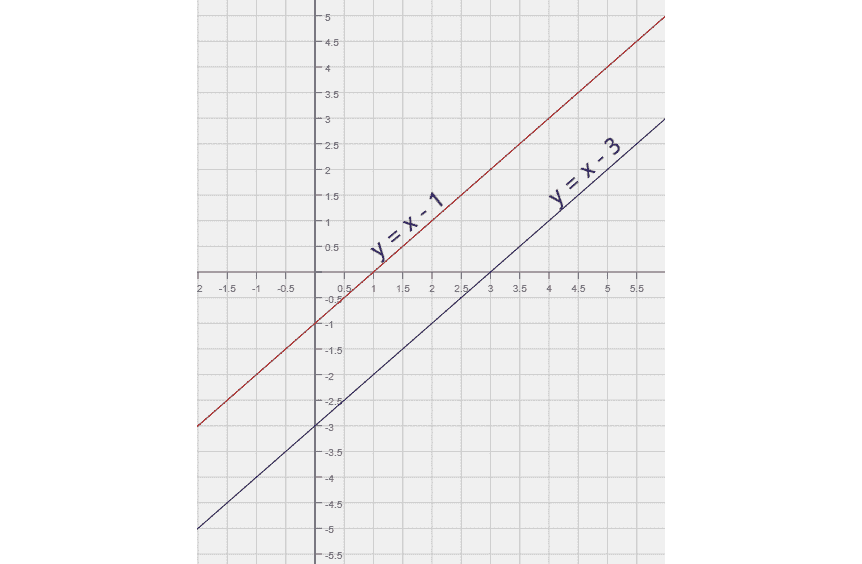
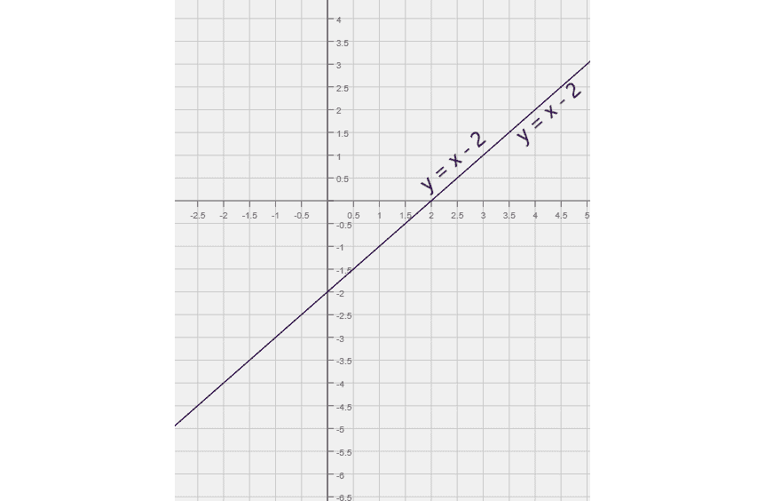

# 如何解线性方程组

> 原文：<https://www.freecodecamp.org/news/how-to-solve-a-system-of-linear-equations/>

线性方程是绘制直线的方程。线性方程组是指两个或更多的线性方程组合在一起。

为了简化说明，我们将考虑两个方程组。顾名思义，有两个未知变量。它们通常用字母 **x** 和 **y** 来表示。如果方程式描述了一些过程，字母可以根据它们所扮演的角色来选择。比如 **d** 可以代表距离， **t** 可以代表时间。

在这篇文章中，我们将学习如何使用两种有趣的方法来解线性方程组。但是在我们开始之前，让我们通过一个现实生活中的例子来看看我们如何结束一个特定的系统。

## 驱动一个系统

一个男孩骑上自行车，开始去上学。他每分钟骑 200 码。

几分钟后，他的母亲意识到儿子忘了带午餐。她骑上自己的自行车，开始跟着那个男孩。她每分钟骑 **500** 码(她是奥运选手和金牌得主)。

我们想知道母亲需要多长时间才能追上男孩，以及她需要骑多远才能追上。

因为男孩每分钟跑 200 码，所以在 **t** 分钟内，他将跑 **200** 乘以 **t** 码，或 **200t** 码。

他的妈妈 6 分钟后开始骑自行车，所以她骑了 **(t - 6)** 分钟。因为她每分钟跑 500 码，所以在(t - 6)分钟内，她跑了 **500** 乘以 **(t - 6)** 码，或者说 **500(t - 6)** 码。

当她追上他时，他们已经走了同样的距离。现在我们假设距离是 **d** 。

对于男孩，我们有 d = 200t(T1)，对于他的母亲，我们有 d = 500(t-6)T3(T2)。我们现在有了两个方程组。

A system of two equations d=200t and d=500(t - 6)

通常加一个花括号来表示方程构成一个系统。

现在让我们看看如何解决这个系统。

## 替换求解

我们将考虑的第一种方法使用**替换**。

这里我们有两个未知数， **d** 和 **t** 。这个想法是通过用另一个变量来表达，从而去掉一个变量。

上面的等式告诉我们 **d = 200t** ，那么让我们为下面等式中的 **d** 代入 **200t** 。结果，我们得到了一个只有变量 **t** 的方程。

An equation with a single variable 200t = 500(t - 6)

首先我们展开右边:500(t-6)= 500t-500 * 6 =**500t-3000**。

然后，我们通过将未知成员移到一侧，将已知成员移到另一侧来简化。结果是: **500t - 200t = 3000** 。

Solving of equation 300t = 3000 results in t = 10

求解 **t** 得到 **t = 10** ，或者因为我们用分钟来测量时间， **t = 10 分钟**。换句话说，母亲将在 10 分钟内赶上她的儿子。

我们问题的第二部分是找出她要骑多远才能赶上他。

要回答这个问题，我们需要找到 **d** 。在任一等式中代入 t = 10 将给出答案。

为了简单起见，我们用最上面的等式， **d = 200t = 200 * 10 = 2000** 。因为我们用码来度量距离， **d = 2000 码**。

让我们测试一下你目前为止的理解情况，试着自己解决下一个系统:

{

### y = 2x

### y = 3(x - 1)

选择 1 个答案

* * *

* * *

* * *

* * *

* * *

在上面的系统中，未知变量是 **x** 和 **y** 。

从上面的等式我们知道 **y = 2x** 。将它代入下面的等式，我们得到 **2(2x) = 3(x + 1)** 。

一旦我们扩展和简化，我们得到 **4x = 3x + 3** 。或者 **x = 3** 。因此， **y = 2 * 3 = 6** 。

## 用图形求解

我们将考虑的第二种方法是使用**绘图**、**和**，我们通过绘图找到方程组的解。

就拿这个系统来说: **y = 2x + 3** 和 **y = 9 - x** 。

每个方程的图形将是一条线。 **y = 2x + 3** 的第一个看起来是这样的:

A graph of y = 2x + 3

接下来，我们可以为 **y = 9 - x** 绘制一条线:

Graphs of y = 2x + 3 and y = 9 - x

这两条线**与**恰好相交于一点。这一点是两个方程的唯一解:

Graphs of y = 2x + 3 and y = 9 - x intersect at (2, 7) point

有序对 **(2，7)** 给出了我们交点的坐标。这一对就是系统的解。代入 **x = 2** 和 **y = 7** 会让我们验证这一点。

如果这两个图是平行的，并且根本不相交，那会怎么样呢？例如:

Graphs of y = x - 1 and y = x - 3

当方程的图形不相交时，这意味着我们的系统无解。试图通过替换来解决将证明这一点。

**x - 1** **= x - 3** 的结果会是 **0 = -2** ，也就是**总是** **假**。

但是如果两个图是相同的，并且直接在另一个的上面呢？

Graphs of y = x - 2 and y = x - 2

在这种情况下，有无限多的交点。这意味着我们的系统有无限多的解决方案。用替换法将会证明。

**x - 2 = x - 2** 的结果是 **0 = 0** ，也就是**永远为真**。

## 多练习

试着用替换法和作图法来解决下列系统。这些方法相辅相成，有助于巩固你的知识。

{

### y = 2

### 3y - 2x = 4

选择 1 个答案

* * *

* * *

* * *

* * *

* * *

选择一个特定的变量用于替换应该会使找到一个解决方案更容易。

尝试用顶部等式中的另外两个成员表示 **x** ，然后将结果代入底部等式。这样你就可以避免处理分数。

{

### x + 5y = 7

### 3x - 2y = 4

选择 1 个答案

* * *

* * *

* * *

* * *

* * *

让我们再做一个挑战:

{

### -6x - 8y = 4

### y = -x - 1

选择 1 个答案

* * *

* * *

* * *

* * *

* * *

既然你已经对代换和绘图有了足够的了解，那就出去解更多的线性方程吧。