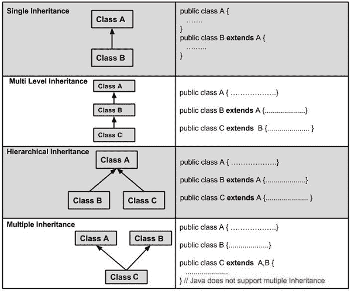
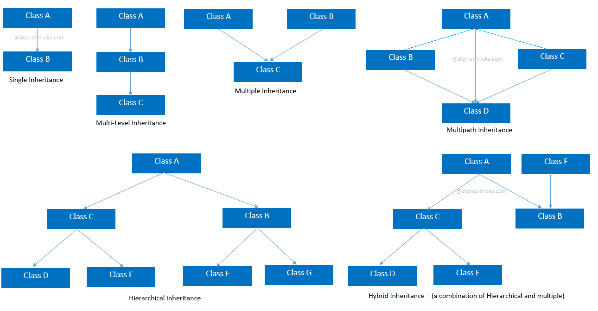

# 如何解决 Java 中的多重继承问题

> 原文：<https://www.freecodecamp.org/news/how-to-solve-multiple-inheritance-in-java/>

Java 是当今最流行的面向对象编程语言之一。

因为它是独立于平台的，所以您会在每种类型的设备和每种操作系统上找到 Java 应用程序。而且因为 [Java 相对容易学](https://www.freecodecamp.org/news/get-started-coding-with-java/)，所以它是许多程序员最先学会的语言之一。

您应该熟悉的 Java 的一个重要特性是类继承。继承允许程序员通过促进类重用来优化代码。当您可以重用已经测试和调试过的代码时，软件开发生命周期变得更短，成本更低。

虽然理论上是一个简单的概念，编码继承关系需要注意细节。对于多重继承尤其如此，在多重继承中，单个子类从多个父类继承属性。

Java 拒绝多重继承关系，因为它们会产生歧义，但是如果你知道怎么做，有几种方法可以达到同样的效果。

在本文中，我们将考虑多重继承的问题，并讨论 Java 中可供选择的编码选项。

## 继承术语

有时候，要成为一名成功的程序员，你必须学会解决问题，以便找到常见错误或问题的解决方法。这是安全和智能编码的必要部分。

一个这样的问题是处理 Java 中的多重继承(或者说，缺乏多重继承)。

[Image Source](https://www.tutorialspoint.com/java/java_inheritance.htm)

要完全理解 Java 中的继承，您需要熟悉基本的[面向对象编程](https://www.freecodecamp.org/news/java-object-oriented-programming-system-principles-oops-concepts-for-beginners/) (OOP)继承术语。

*   **类:**类是面向对象编程语言中的基本模板结构。类定义了一组对象的公共属性。
*   **父类:**父类也称为基类或超类，是向子类提供功能的可扩展类。这就是重用性发挥作用的地方。当创建子类时，父类定义和函数被重用。
*   子类:更一般地称为子类，子类从另一个类继承特性。子类是扩展类或派生类。
*   **继承:**父类和子类的关系。

## OOP 继承类型

如今有许多流行的面向对象编程语言在使用，包括 [Java、C++](https://stackoverflow.blog/2021/02/22/choosing-java-instead-of-c-for-low-latency-systems/) 、JavaScript、Python、PHP、Ruby 和 Perl。虽然继承是这些 OOP 语言中的一个常见概念，但并不是所有的继承类型都存在于每种语言中。

了解一般的继承类型和您使用的特定语言中的继承限制是至关重要的。你对继承了解得越多，你将成为一个更有效率的软件开发者。

Java 支持的继承类型包括:

*   **单级继承:**当子类从单个父类派生特性时。
*   **多级继承:**这是单级继承的分层形式。在多级继承中，子类也可以作为其他子类的父类。每一级之间的关系是线性的——没有分支像多重继承那样向上延伸。最终的子类具有来自它上面每一层的特性。
*   **层次继承:**多重继承的对立面。在层次继承中，一个父类有多个子类。所以它不是上面有分枝，而是下面有分枝。
*   **混合遗传:**顾名思义，混合遗传是其他遗传类型的组合。

除了上面的继承类型，还有 Java 不支持的其他类型。

*   **多重继承:**在多重继承中，一个子类有多个父类。虽然 Java 和 [JavaScript](https://www.freecodecamp.org/news/functional-programming-in-javascript-for-beginners/) 不支持多重继承，但 C++等 OOP 语言支持。
*   **多路径继承:**多重、多层次、分层继承的混合，在多路径继承中，子类从父类和父类的几个子类中派生其特性和功能。因为多路径继承依赖于多重继承，所以 Java 不支持它的使用。

## 为什么 Java 不支持多重继承

多重继承的主要问题是它有可能在子类中产生歧义。在 1995 年的一份概述白皮书中，Java 首席设计师詹姆斯·高斯林指出，多重继承的问题是创建 Java 的动机之一。

多重继承固有的困难在钻石问题中表现得最为明显。在[钻石问题](https://www.freecodecamp.org/news/multiple-inheritance-in-c-and-the-diamond-problem-7c12a9ddbbec/)中，父类 A 有两个截然不同的子类 B 和 C；即子类 B 和 C 扩展了类 a。

[Image Source](https://www.dotnettricks.com/learn/oops/understanding-inheritance-and-different-types-of-inheritance)

现在我们创建一个新的子类 D，它扩展了类 B 和类 C。注意，我们有多重继承(D 扩展了 B 和 C)、层次继承(B 和 C 扩展了 A)和多级继承(D 扩展了 A、B 和 C)。

在菱形问题中，子类 B 和 C 从父类 a 继承了一个方法。B 和 C 都重写了继承的方法。但是 B 和 C 中的新方法相互冲突。

终极子类 D 从它的多个父类 B 和 c 继承了两个独立且冲突的方法，不清楚 D 类应该使用哪个方法，所以有歧义。其他 OOP 编程语言实现了各种方法来解决多重继承的模糊性。

## 如何解决 Java 中的多重继承问题

多重继承有问题并不意味着它没有用。在许多情况下，您可能希望一个类具有其他几个类的特性。

想想当你成为一名非常成功的软件开发者时，你将会买的特斯拉跑车。它将吸取跑车类和电动车类的特点。

或者您可能正在使用私人浏览器阅读这篇文章，它具有在线数据隐私解决方案类和通用 internet 浏览器类的功能。

但是你不能在 Java 中扩展多个类。那么 Java 是如何处理多重继承问题的呢？

它使用的结构叫做接口。接口是[抽象类型，指定类要实现的行为](https://www.freecodecamp.org/news/java-interfaces-explained-with-examples/)。因为它们是抽象的，所以接口不包含它们行为的详细指令。相反，这些类提供了接口行为的具体实现。

接口有几个定义特征:

*   与类不同，您不实例化接口。相反，类实现接口
*   接口只包含公共常量定义和方法头
*   接口只能扩展其他接口，而不能扩展类
*   接口可以扩展多个接口，类可以实现多个接口

现在，我们可以通过接口有效地绕过菱形问题。回想一下，只有接口才能扩展其他接口，任何需要多个继承特征的类都必须实现多个接口，我们可以重新定义菱形问题类。

以前的类 A、B 和 C 现在变成了接口 A、B 和 C。接口 B 和 C 仍然扩展了接口 A，但是在这些接口中没有具体的功能，只有定义的行为。类 D 仍然是一个类，它负责接口 B 和 c 中行为的具体实现。

注意这里的一个关键区别:类 D 不是扩展接口 B 和 c，而是实现它们。所以你实际上没有多重继承。相反，你只是重新定义了这个问题。

## 结论

理解继承对于任何有效的编码人员都是必要的。对于 Java 程序员来说，同样重要的是了解继承的局限性以及 Java 内置的解决多重继承传统问题的方法。

学习如何把接口放在适当的位置来重现 Java 中多重继承的效果将会增加你的效率和可雇佣性。