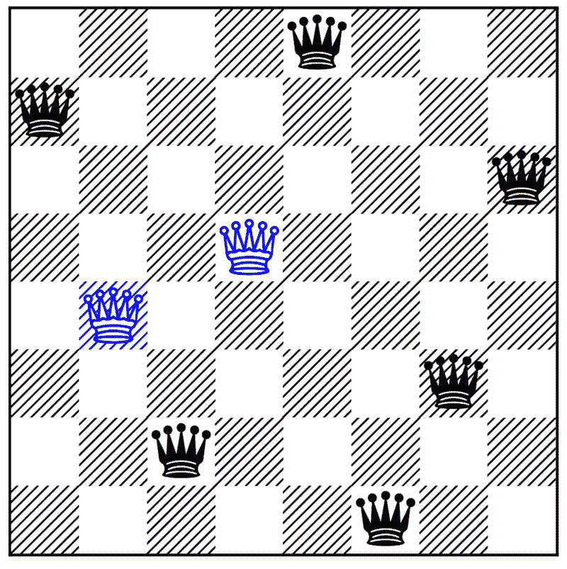
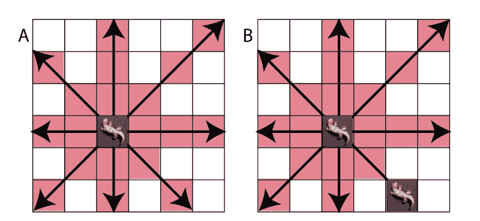
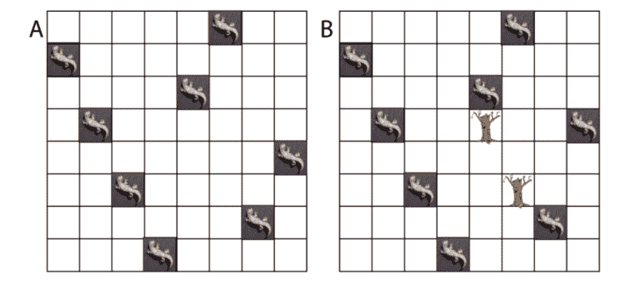
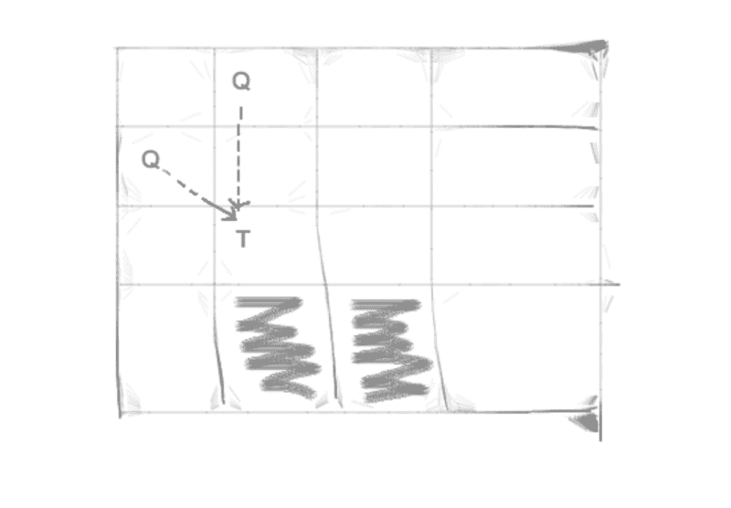

# 如何解决小蜥蜴问题——一个有趣的 N 皇后问题

> 原文：<https://www.freecodecamp.org/news/how-to-solve-the-baby-lizards-problem-a-fun-variant-on-the-n-queens-problem-a6980f5e72a/>

作者:Sachin Malhotra

# 如何解决小蜥蜴问题——一个有趣的 N 皇后问题



[http://www.csplib.org/Problems/prob079/assets/nqc1850sol2.png](http://www.csplib.org/Problems/prob079/assets/nqc1850sol2.png)

这个问题陈述是我在南加州大学硕士课程的一部分作业。我在解决这个问题的过程中获得了很多乐趣，我决定与社区分享我的学习成果。

先说问题陈述。

### 问题是

你是爬行动物馆的管理员。你的一只稀有蜥蜴刚刚生了几只小蜥蜴。你的工作是找到一个地方把每只小蜥蜴放进育儿室。然而，有一个问题:小蜥蜴有很长的舌头。

一只小蜥蜴可以伸出舌头，在你来得及救它之前吃掉任何一只小蜥蜴。因此，你要确保在育儿室里没有小蜥蜴能吃掉另一只小蜥蜴(打嗝)。

对于每只小蜥蜴，你可以把它们放在格子上的一个点上。从那里，他们可以向上、向下、向左、向右和对角地吐舌头。它们的舌头很长，可以从任何位置伸到育儿室的边缘。

图 1 显示了一只小蜥蜴是如何吃掉另一只的。



Figure 1 (A) the baby lizard can attack any other lizard in a red square. Thus it can be seen that a baby lizard can eat another lizard to its top, bottom, left right or diagonal. (B) In this example setup, both lizards can eat each other. Your algorithm will try to avoid this.

除了小蜥蜴，你的苗圃里可能还种了一些树。你的蜥蜴不能把它们的舌头穿过树，你也不能把一只蜥蜴和一棵树移到同一个地方。

因此，如果一棵树挡在路上，它会阻止任何蜥蜴吃掉另一只蜥蜴。此外，树会阻止你移动蜥蜴到那个位置。

图 2 显示了蜥蜴的一些不同的有效排列:



Figure 2 Both nurseries have valid arrangements of baby lizards such that they cannot eat one
another. (A) with no trees, no lizard is in a position to eat another lizard. (B) Two trees are
introduced such that the lizard in the last column cannot eat the lizard in the second or fourth
column.

给定一个树的排列，我们需要输出一个新的蜥蜴排列，这样就没有小蜥蜴能吃掉另一个。你不能移动任何一棵树。

你可以在这里找到这个[的完整代码。](https://github.com/edorado93/Save-The-Lizards)

### 与 N 皇后相似

这个问题和经典的 [N 皇后问题](https://en.wikipedia.org/wiki/Eight_queens_puzzle)非常相似。让我们回顾一下 N 皇后问题中的一些约束。

*   每行和每列只能有一个皇后。
*   每个对角线和反对角线只能有一个皇后。
*   考虑到以上两个限制，我们不能放置超过行数或列数的皇后。

现在，我们添加了一个小小的转折，说我们在苗圃的特定位置有树(读棋盘)，树两边的女王(蜥蜴)不能互相攻击。这改变了很多事情。

*   现在，我们可以每行每列有多只蜥蜴。
*   同样，我们可以在一条对角线或反对角线上有多只蜥蜴。
*   我们可以放置比行数或列数更多的蜥蜴。

虽然这个问题看起来非常类似于在 N*N 棋盘上放置 N 个皇后的标准难题，但解决方案和复杂性却完全不同。

没有一个 N-Queens 的优化版本直接适合这个问题，因为许多优化依赖于一个简单的事实，即 N-Queens 问题的解决方案可以表示为列下标的排列，简单地说，因为我们每行、每列、对角线和反对角线只有一只蜥蜴。我们打破了这个假设，优化就失败了。

所以在这篇文章中，我们将讨论一个高度优化的基于回溯的解决方案。

### 回溯++语言

这个问题的回溯解的工作方式与标准 N 皇后问题的回溯解相似。

这个问题的解决方案是基于下面的想法。

给定一个单元格`[i, j]`，我们可以放一只蜥蜴，也可以不放。我们的任何一个选择都可以导致一个解决方案。所以我们两个都尝试。

这个算法中最大的不变量是我们总是从左向右移动。

假设在位置[3，4]有一棵树。只有当我们在递归中穿过单元格[3，4]并向前移动时，它的掩蔽效应(如果有的话)才会可见。在那之前没有。

在我们开始处理这个问题的实际伪代码之前，我想解释一下这个算法的其他部分。这将使伪代码的理解更加简单。

### 安全检查和 O(1)难题

如果你看过我之前的文章讨论了 N 皇后难题的不同算法解决方案，你可能会明白这个问题到底是什么。

在将安全检查函数从 O(N)转换为 O(1)之后，我们在一个 14 * 14 的棋盘上获得了几乎 5X 速度的提高，其中我们必须放置 14 个皇后。因此，花时间找出一种算法来告诉我们在给定的单元格[i，j]上放置皇后是否安全是值得的。

作为参考，让我们看看在正常的 N 皇后中我们是如何做到的。

我们利用一些额外的数据结构来告诉我们一个皇后是否在 O(1)时间内被放置在某个对角的、反对角的、行或列中，并且使用这些我们可以告诉在给定的单元[i，j]上放置一个皇后是否安全。

然而，如果你仔细阅读了问题陈述，我们现在可以在棋盘上的某些位置有树，如果在当前单元格和攻击者蜥蜴之间有一棵树(它可以在一行、一列或两条对角线中的任何一条上)，那么将蜥蜴放在当前单元格上实际上是安全的。这是因为树掩盖了攻击，使细胞对新的蜥蜴安全。

这改变了很多事情？。

让我们从实现所需的数据结构开始。

### 使用的数据结构

让我们一个一个地检查它们。

*   这只是一个字典，告诉我们给定的单元格[i，j]是否包含一棵树。这是在我们的求解器开始时填充的。
*   四个数据结构行、列、对角线和反对角线分别用来简单地告诉我们在各自的`r, c, r — c, r + c` 中是否有蜥蜴。然而对于这个问题，它们表示整数值而不是布尔值。
    这四个数据结构存储 1 或-1，这取决于我们是在当前单元格[i，j]放置一只蜥蜴，还是在给定单元格[i，j]遇到一棵树。
    因此，递归从一个单元格前进到另一个单元格，可能会在给定的单元格[i，j]遇到一棵树，也可能会遇到一个空单元格，在这种情况下，我们必须调用`is_cell_safe`函数来验证我们是否可以放置一只蜥蜴。
    我稍后将介绍这四个数据结构中的值是如何更新的，这四个数据结构是`rows` ***、*** `columns` ***、*** `diagonals`和*`anti-diagonals`*。**
*   **这是一本字典，简单地存储了我们放在给定列中的蜥蜴的数量。这被用作用于减小搜索空间大小的修剪试探法的一部分。**
*   **`next_position_same_column` —这告诉我们，对于每一个[i，j]来说，在同一列中，下一个我们可以尝试放置新蜥蜴的位置是什么。在正常的 N 皇后问题中，我们只能在一列中放置一个皇后，但在这种情况下，我们可以有多个皇后(蜥蜴)。
    因此，在单元格[i，j]中放置一只蜥蜴后，我们需要同一列中第一棵树的位置，并说它是[k，j]。在该列中放置蜥蜴的下一个可用位置是[k+1，j]。该数组用作优化的一部分。**
*   **最后，`is_there_a_tree_ahead` 是一个字典，它告诉我们在这一列(也包括这一列)之后的棋盘的某个地方是否有一棵树。这也作为初始预处理的一部分被填充一次。这也是上文描述`is_there_queen_in_this_column`时提到的修剪试探法的一部分。**

### **预处理功能**

**在我们的算法开始执行之前，首先调用预处理函数，它所做的只是填充上面讨论的一些数据结构。**

*   **`trees_populator` 功能相当简单明了。它填充了字典`tree_locations` 和`is_there_a_tree_ahead` ***。*****
*   **函数`find_next_largest` 将每一列视为由 0 和 2 组成，其中 0 表示空单元格，2 表示树。对于每个单元格，它找出下一个最大的元素，或者换句话说，该列中离该位置最近的树。我们为棋盘上的每一列调用`find_next_largest` 函数。**

**为了更好地理解该算法，请参考[本概述](http://www.geeksforgeeks.org/next-greater-element/)。**

### **`is_cell_safe`功能**

**在任何字典`row`、`column`、`diagonal`、`anti-diagonal`、**、**中的正值意味着有一只蜥蜴可能会攻击我们试图放置在【行，列】的另一只蜥蜴。**

**这个函数看起来非常类似于我们用于正常 N 皇后的函数。重要的部分是我们如何更新这些数据结构中的值。**

### **标记已访问、取消标记已访问和散列效用**

**函数`hash_util`是一个通用函数，用于更新所有四个数据结构(即`rows`、`columns`、`diagonals`和`anti-diagonals`)的值。**

**当我们标记一只蜥蜴或一棵树时，或者当我们取消标记它们中的任何一个时，这个函数被称为 both。标记和解标记只是在递归调用之前进行处理，并在递归调用结束后撤销我们处理的任何内容。**

**记住这个问题中讨论的不变量:我们从左向右移动。一旦我们在递归过程中在某个位置(I，j)遇到了一棵树，它将为所有单元[i+1，j]和所有列 k > j 保护蜥蜴免受彼此伤害。**

**`result`变量在这里非常重要。例如，我们在[3，0]处遇到一棵树，在[1，0]处遇到一只蜥蜴。现在继续，这棵树掩盖了[1，0]处蜥蜴的影响——至少对于本专栏来说是这样——我们需要在某处考虑这种影响。**

**所以，在这种情况下:**

*   **`is_marking` = `True`，**
*   **`is_tree` = `True`，**
*   **`dictionary` = `column`，**
*   **`dictionary[col]` > 0(每当我们在列中放置一只蜥蜴时，我们存储 1)。这是因为我们已经在列 0(1，0 处)中放置了一只蜥蜴，并且在我们的示例中，之前没有发现会隐藏蜥蜴对单元格[3，0]的影响的树。**
*   **(对树来说是-1，对蜥蜴来说是 1)**

**所以现在，`dictionary[col]` = -1，我们返回 1 作为结果，这意味着在给定的(行，列)中遇到一棵树实际上有一些掩蔽效应。我们需要记录这种屏蔽效果，因为这将在递归后的撤消时使用。**

**现在考虑构成算法主要部分的另外两个函数。**

#### **马克参观了**

**我们在两种情况下调用这个函数。一个是当我们遇到一棵树的时候，一个是当我们想要放置一只蜥蜴的时候。因此，相应地，我们使用了一个布尔变量来告诉我们为什么这个函数被调用。**

**在树的情况下，我们将值设置为-1，否则为+1。然后，我们更新四个数据结构。他们四个人的逻辑是一样的。只是每个都有不同的键。**

**记住，`row — col`用来唯一标识一条对角线，`row + col`用来唯一标识一条反对角线。**

**还要注意，我们在`did_tree_affect` 字典中存储了四个数据结构的四重返回值。这让我们知道在该位置(行，列)遇到树是否有任何影响，即掩蔽。该数据在撤消操作期间使用。**

#### **取消访问标记**

**我们知道，在四个字典中的任何一个字典中，正值都意味着给定的单元对于放置蜥蜴来说是不安全的。**

**对于**蜥蜴**来说，撤销操作非常简单。如果我们为一只蜥蜴调用`unmark_visited`函数，这意味着在我们把一只蜥蜴放在那里之前，这个单元格是足够安全的，所以我们只是在所有四个字典中放一个值-1。(记住，行、列、对角线或反对角线中的一个正值会破坏该单元格的`is_cell_safe`函数)**

**如果为一棵树调用函数`unmark_visited`，我们从`did_tree_affect`中检索给定[row，col]的值，并使用这些值来恢复字典。这里的意思是，假设我们在给定的[row，col]遇到一棵树，它掩盖了蜥蜴对对角线和向前移动的列的影响。见下图:**

**

The two highlighted cells are masked by the Tree. However, there is no masking effect generated by the Tree for the row and the anti-diagonal.** 

**当我们必须在递归中恢复看到树时，我们基本上必须恢复它的掩蔽效应。这就是字典的用途。**

**现在我们已经准备好了所有的字典，我们终于可以看看实际的 DFS 函数，它完成了寻找解决方案的所有繁重工作。**

### **回溯求解器**

**代码看起来很复杂，如果我开始详细解释，帖子会变得非常长。我或许可以在评论区澄清疑惑。现在，我将写一个详细版本的伪代码来完成。**

```
**`1\. Start at the cell (0, 0)`**
```

```
**`2\. For a given cell (i, j)     a. If all the lizards have been placed, print the solution and return True.`**
```

```
**`b. Check if the current cell has a tree.          b1\. Call mark_visited function to update the 4 dictionaries with possible masking effects due to this tree.`**
```

```
**`c. If the current cell isn't a tree and a lizard can be placed         c1\. Call mark visited for [i, j] as a lizard.         c2\. Add [i, j] to the solution set.          c3\. Increment column j as containing one more lizard.         c4\. Find the next row number to recurse on in the column j. If there is such a row number say r, then recurse on [r, j]. Else recurse on [0, j+1]         c5\. Unmark the current cell. Call function unmark_visited for [i, j]         c6\. Decrement column j as it contains one less lizard now.`**
```

```
**`d. We may want to have a branch in our recursive solution where we did not place a lizard at [i, j] and simply moved forward. OR, we couldn't place a lizard at [i, j] and we now have to move forward.          d1\. if [i + 1] < n, recurse on [i+1, j]         d2\. else [PRUNING HEURISTIC]              d2.1 check if                    * we did not place any lizard in the current col.                   * there is no tree in the current col and ahead.                    * number of lizards left to be placed are more than the number of columns left.                    * If yes to all 3, then BACKTRACK.              d2.2 Else, recurse on [0, j+1]`**
```

```
**`e. If the current cell was in-fact a tree, then call unmark_visited to undo its effects.`**
```

**这是我能为基于 DFS 的求解器想到的最恰当的伪代码。这正是函数`dfs` 的结构。**

**按照这种逻辑，我能够解决的最大的测试案例是在 1000 * 1000 的板上放置 97，000 只蜥蜴。运行大约需要 2 秒钟。**

**

[http://bit.ly/2j6x5KQ](http://bit.ly/2j6x5KQ)** 

**现在我告诉你，这听起来可能是一个巨大的壮举，但实际上不是。这对于算法来说很简单。你们的问题是找出这背后的原因？。请在评论区告诉我！**

**此外，如果你想出一些其他更简单的方法来解决这个问题，我也很乐意讨论。请在评论区告诉我。**

**希望你喜欢这篇文章，并且和我一样喜欢解决这个问题。如果你喜欢这个帖子，尽可能地传播爱(❤)。干杯！**