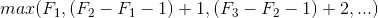
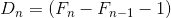
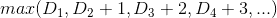
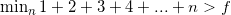
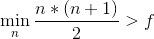
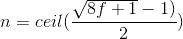
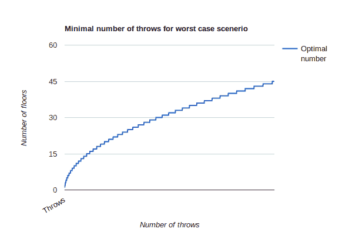

# 如何解决谷歌招聘人员关于从大楼里扔鸡蛋的困惑

> 原文：<https://www.freecodecamp.org/news/how-to-solve-the-google-recruiters-puzzle-about-throwing-eggs-from-a-building-de6e7ef1755d/>

作者:马尔钦·莫斯卡拉

# 如何解决谷歌招聘人员关于从大楼里扔鸡蛋的困惑


为工作面试编程有很多很大的困惑。我最喜欢的一个也是谷歌招聘人员最喜欢的一个:

> 你在一栋 100 层的大楼里工作，你得到两个一模一样的鸡蛋。你需要算出一个鸡蛋可以掉到最高的楼层而不被打破。找到一个在最坏情况下最小化投掷次数的算法。

我们可以做一些假设:

*   如果一个鸡蛋从某个楼层掉下来时没有打破，那么它从任何更低的楼层掉下来时都不会打破。
*   跌落后存活下来的鸡蛋可以再次使用。
*   打破的鸡蛋必须扔掉。
*   跌落对所有鸡蛋的影响是一样的。
*   如果一个鸡蛋掉下来会碎，那么如果它从更高的楼层掉下来也会碎。

大多数人会编写一些算法来解决这个难题(我们也会这样做)，但实际上有一个简单的解决方案。

#### 最简单的答案

获得最小楼层的最简单方法是从一楼扔一个鸡蛋，然后从二楼扔，依此类推。这样，当鸡蛋最终被打破时，我们就会知道这是地板。这是一个可靠的算法，但在最坏的情况下，它需要投掷 100 次。

重要的是要注意，当你只有一个鸡蛋时，这是唯一可靠的算法。所以你需要在打破第一个鸡蛋的时候就开始使用这个算法。

#### 直觉回答

这样，我们的第一个鸡蛋应该被用来尽可能有效地将 100 层的范围分割成更小的范围。因此，一个直观和流行的答案是从 1/n 层楼扔出第一个鸡蛋来检查。例如 1/3。那么算法将如下所示:

*   从 33 楼扔鸡蛋。如果它坏了，我们就用第二个鸡蛋检查前 32 层。
*   不然我们把蛋从 33+(67 * 1/3)= 55 楼扔出去。如果它坏了，我们就用第二个鸡蛋检查 34 到 55 层。
*   …

1/3 的最坏情况是 max(33，24，…) = 33。这样，我们可能会找到一个完美的 n，使用一些动态编程来优化投掷次数。这是一个体现编程思想的有价值的解决方案，但不是最优的解决方案。

#### 完美溶液

为了理解完美的解决方案，我们需要理解用于计算最坏情况下投掷次数的均衡:



其中 F(n)是我们扔第一个鸡蛋的下一层楼

如果我们引入以下变量:



那么平衡如下:



最优解是当这个 max 函数的所有[自变量](https://blog.kotlin-academy.com/programmer-dictionary-parameter-vs-argument-type-parameter-vs-type-argument-b965d2cc6929)相等时。我们如何实现它？从最后看，最后一个 D(n)将是 1，因为我们最终将到达只有第一个蛋的单个楼层的点。因此 D(n-1)应该等于 2，因为它比第一个鸡蛋少扔一次。

然后我们看到第一个鸡蛋应该最终从第 99 层扔出，之前是从 99–2 = 97，之前是从 97–3 = 94，90，85，79，72，64，55，45，34，22 和第 9 层。**这是一个最优解！**这样，在最坏的情况下，我们需要 14 次投掷(最小的差异是 13 次，但我们必须在 9 楼额外投掷一次)。

找到答案的简单等式如下:



其中`f`是楼层数。这可以简化为:



这等于:



#### 支票

好，所以我们有一个解，我们可以不用任何帮助来计算它。是时候检验一下是否正确了。我们将为此编写一个简单的 Kotlin 程序。首先，让我们来表达如何计算一些决定的投掷次数。当有 2 层或更少的楼层时，我们需要和剩下的楼层一样多的投掷。否则，我们应该使用已经提出的平衡:

```
fun maxThrows(floorsLeft: Int, nextFloor: Int): Int =  if (floorsLeft <= 2) floorsLeft  else maxOf(nextFloor, bestMaxThrows(floorsLeft - nextFloor) + 1)
```

我们在这里使用了`bestMaxThrows`函数。这是一个假设的函数，假设下一个决策是完美的，它返回一些投掷。我们可以这样定义它:

```
fun bestMaxThrows(floorsLeft: Int): Int =  maxThrows(floorsLeft, bestNextStep(floorsLeft))
```

同样，我们刚刚将下一层优化的责任委托给了`*bestNextStep*` 职能部门。这个函数为我们提供了最佳的下一步。我们可以简单的定义一下——当还剩 2 层或者更少的时候，那么我们就从一层扔一个鸡蛋。否则，我们需要检查所有选项并找到最佳选项。下面是实现过程:

```
val bestNextStep(floorsLeft: Int): Int =   if (floorsLeft <= 2) 1  else (1..floorsLeft)        .toList()        .minBy { maxThrows(floorsLeft, it) }!!
```

注意，这个函数使用了`*maxThrows*`函数，所以我们处理递归。这不是问题，因为当`bestNextStep`调用`maxThrows`时，它总是用比`floorsLeft`小的值调用它(因为`nextFloor`总是大于 0)。在我们使用它之前，我们将添加缓冲以加速计算:

```
val bestNextStep: (Int) -> Int = memorise { floorsLeft ->  if (floorsLeft <= 2) 1  else (1..floorsLeft)        .toList()        .minBy { maxThrows(floorsLeft, it) }!!}fun maxThrows(floorsLeft: Int, nextFloor: Int): Int =  if (floorsLeft <= 2) floorsLeft  else maxOf(nextFloor, bestMaxThrows(floorsLeft - nextFloor) + 1)val bestMaxThrows: (Int) -> Int = memorise { floorsLeft ->  maxThrows(floorsLeft, bestNextStep(floorsLeft))}fun <V, T> memorise(f: (V) -&gt; T): (V) -> T {    val map = mutableMapOf<V, T&gt;()    return { map.getOrPut(it) { f(it) } }}
```

首先，我们可以检查它是否返回与我们计算的结果相同的结果:

```
fun main(args: Array<String>) {    print(bestMaxThrows(100)) // Prints: 14}
```

答案是好的:)让我们看看接下来的步骤:

```
fun main(args: Array<String>) {    var floor = 0    while (floor < 100) {        val floorsLeft = 100 - floor        val nextStep = bestNextStep(floorsLeft)        floor += nextStep        print("$floor, ")    }}
```

结果:

9, 22, 34, 45, 55, 64, 72, 79, 85, 90, 94, 97, 99, 100,

我们是怎么计算的！不错的:D

### 更大的画面

现在我们有了一个很好的算法，可以用来解决很多类似的问题。例如，我们可以稍微改变它来计算最有可能的情况下的投掷次数。我们还可以检查这个最小投掷次数如何根据建筑物的高度而不同。这是一张回答这个问题的图表:



### 结论

你现在为谷歌面试做了更好的准备，但更重要的是，你现在为一般的算法思维做了更好的准备。这个算法提供了一个很好的功能方法。类似的方法可以用于我们日常工作中的许多不同问题。

我希望你喜欢它。**鼓掌**表示感谢，并帮助他人找到这篇文章。更多有趣的材料在[我的推特](https://twitter.com/marcinmoskala)上。参考我用 [@marcinmoskala](https://twitter.com/marcinmoskala) 。如果你对科特林感兴趣，请查看[科特林学院](https://blog.kotlin-academy.com/)和[科特林学院门户网站](http://portal.kotlin-academy.com/)获取科特林难题和高级材料。