# 如何在 Python 中递归排序列表

> 原文：<https://www.freecodecamp.org/news/how-to-sort-recursively-in-python/>

当您想要在 Python 中对列表或数组进行排序时，有许多排序算法可以使用。

有些使用循环概念，如插入排序、冒泡排序和选择排序。另一方面，你也可以在递归的帮助下使用合并排序对同一个列表或数组进行排序。

在本文中，您将了解合并排序算法是如何工作的。您还将了解递归如何在合并排序中发挥重要作用。

## 递归如何工作

作为先决条件，我们将首先理解递归是如何工作的，因为它是合并排序算法的基础。

首先，你应该知道一个递归函数是一个调用它自己直到它达到它想要的结果的函数。

现在，除非您设置一些条件来停止这个过程，否则它将永远继续下去——或者直到您的 JS 代码抛出一个错误。这就是所谓的基本情况，当它的条件满足时，它会阻止函数调用自己。

现在你已经知道了递归的基础，让我们深入一点，理解它是如何工作的:

一般来说，递归的工作基于一个叫做主要数学归纳法(PMI)的概念。简而言之，PMI 是一种用于从一组基本的已证明语句中证明某些语句的技术。

通常，这个过程有三个步骤。

让我们用 PMI 证明 n 自然数的公式是`P(n)= n*(n+1)/2`:

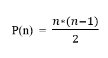

To prove that P(n) is true

第一步:第一步也被称为**基础案例**。在此步骤中，您将指定经过验证的语句。普遍地，我们知道前 1 个自然数的和是`1`。让我们把它看作等式的左边(LHS)。

当我们在公式中应用`n = 1`时，我们得到`p(1) = 1*(1+1)/2 => 1`作为右侧(RHS)。

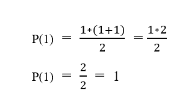

Applying 1 in formula

这意味着 LHS = RHS。这一步确认它是一个有效的基础案例。

第二步:这一步被称为**归纳假设**。在这一步，我们简单假设这个公式对于某个整数`k`成立，其中`1 < k < n`。所以，我们在公式中代入 k，我们得到`p(k) = k*(k+1)/2`:


Induction Hypothesis step for some Integer value k

第三步:这一步被称为**诱导步骤**。在这一点上，我们必须证明这对于整数`k+1`是有效的。

当我们在公式中代入`k + 1`并将其视为 LHS 时，我们得到如下结果:

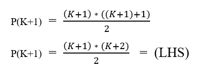

LHS Statement for P(k+1)

对于 RHS，我们知道自然数`k+1`整数之和等于自然数`k`整数和第`k+1`整数之和。我们可以这样写:

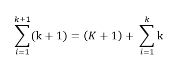

Sum of k+1 integers is equal to (k+1)th integer and sum of k Integers

上面的等式可以改写成这样:

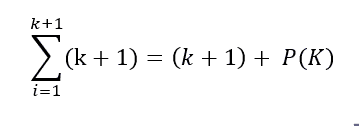

sum of k natural integers is rewritten as p(k) from step-2

至此，我们从第二步(归纳假设)知道了 p(k)的值。当我们替换 p(k)的值时，我们得到这个:

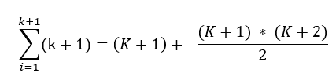

Substitute p(k) from step-2

我们可以采用公分母并简化等式，我们得到:

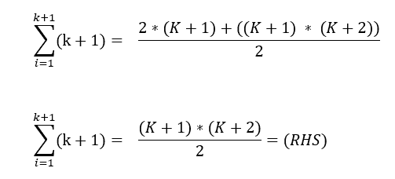

Simplifying the equation

通过比较 LHS 和 RHS，我们得到了相同的结果，并且我们已经证明了这个公式对整数有效。

同样，当我们用`n`代替`k+1`时，我们得到的最终结果是:

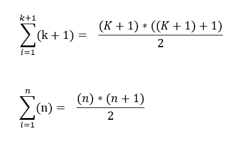

Substituting k+1 with n

我们已经证明了 n 个自然数的公式是 n*(n+1)/2。

当我们观察 PMI 中的所有步骤时，我们在步骤 2 做了一个简单的假设，因此，我们在步骤 3 证明了这个陈述。

递归是这样工作的:我们在函数的开始为一个问题初始化一个基本情况，我们假设这个函数对同一个问题的小值有效。然后作为最后一步，我们证明这对于现有的问题是可行的。

## 合并排序算法的工作原理

合并排序算法的工作原理是将一个未排序的列表分成两半。然后对这两个部分分别调用合并排序。

因为我们知道递归是基于主要的数学归纳法(PMI)工作的，所以我们假设较小的列表通过对这两个较小的列表调用合并排序来排序。

> **注意:**在较小的列表中调用递归之前，更重要的是定义函数的基本情况，因为它充当递归调用的停止点。

这里，合并排序的基本情况是列表长度为 1。在这种情况下(如果长度为 1，这意味着列表中只有一个条目)，列表已经排序，所以我们只需按原样返回列表。

为了更清楚，让我们举一个例子，在未排序的列表上实现合并排序。

```
my_list = [3,8,2,7,1,4,5] 
```

unsorted list

在上面的代码中，您可以看到变量`my_list`包含一个未排序的列表。

现在，由于 my_list 的长度不是 1，所以不能假设它是排序的。因此，我们在前半段`list1 = [3,8,2]`调用合并排序，在后半段`list2 = [7,1,4,5]`也调用合并排序。

我们假设`list1`和`list2`按照归纳步骤排序。现在，列表看起来像`list1 = [2,3,8]`和`list2 = [1,4,5,7]`。现在，我们要做的就是使用双指针技术将这两个排序列表合并成一个。

为了组合和排序两个更小的排序列表，我们使用 2 个指针，指向每个列表的开始。

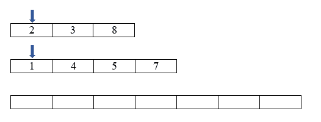

Pointers at start index of list and empty list to append the new list while comparing

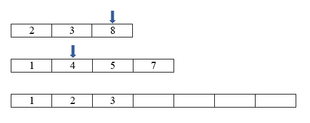

Intermediate step in comparing pointer value process

我们在比较指针指向的每个地方的值，无论哪个更小，我们都在最终的列表中添加下一个值。然后我们将指针指向下一个索引。

在循环完这个过程后，当我们到达第一个最终索引时(在我们加入的两个循环之一中)，我们停止循环。然后，我们将另一个列表中的所有值(如果有的话)追加到最终列表中。

使用这种技术，我们可以合并和排序两个小的预先排序的列表。

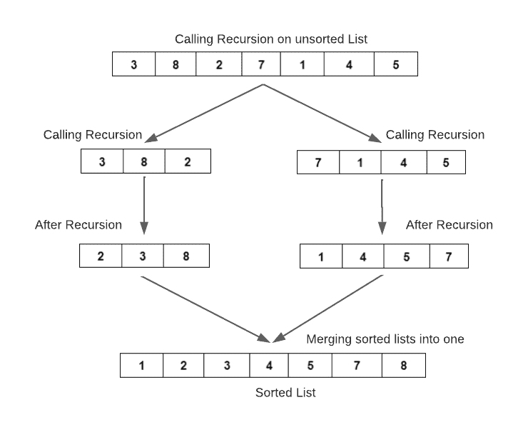

Working Flow of Merge Sort

当我们使用递归时，我们假设当我们为一个较小的问题调用同一个函数时，它是有效的。这个假设来自于 PMI 中的归纳假设步骤。

因此，当我们声明问题的基本情况时，我们同样假设函数将返回较小问题的正确答案。我们要做的就是证明这也适用于更大的问题。

在这个算法中，我们声明基本情况是，对于长度为 1 的列表，列表被排序。在归纳假设步骤中，我们假设算法对一半的列表有效。在第三步中，我们只是合并了已排序的列表，并证明这将在更大的列表上工作。

## 合并排序算法的 Python 代码

```
def merge_sort(my_list):

	# Base Case
    if len(my_list) <= 1:
        return my_list

    list_1 = my_list[0:len(my_list) // 2]
    list_2 = my_list[len(my_list) // 2:]

   	# Induction Step
    ans_1 = merge_sort(list_1)
    ans_2 = merge_sort(list_2)

    # Sorting and merging two sorted list
    sort_list = sort_two_list(ans_1, ans_2)
    return sort_list

# Separate Function to sort and merge 2 sorted lists
def sort_two_list(list_1, list_2):
    final_list = []
    i = 0
    j = 0
    while i < len(list_1) and j < len(list_2):
        if list_1[i] <= list_2[j]:
            final_list.append(list_1[i])
            i += 1
            continue
        final_list.append(list_2[j])
        j += 1

    while i < len(list_1):
        final_list.append(list_1[i])
        i = i + 1

    while j < len(list_2):
        final_list.append(list_2[j])
        j = j + 1

    return final_list

my_list = [3, 8, 2, 7, 1, 4, 5]
ans = merge_sort(my_list)
print(ans)
# prints [1, 2, 3, 4, 5, 7, 8]
```

Implementation of Merge Sort Algorithm in Python

正如您在上面的代码中看到的，我实现了两个独立的函数，用于排序和合并两个排序后的列表。这导致了更好的可读性和更容易的代码审查。

合并排序的主要缺点是它使用更多的空间。这是因为，在每次递归调用时，都会创建一个新的列表，并在该新列表上调用递归。因此，最坏情况场景的空间复杂度是`O(n)`，时间复杂度是`O(n log n)`。

## 结论

从时间复杂度的角度来看，合并排序在递归排序列表时非常快。这对于计算列表中的倒置非常有用，并且比其他排序算法更广泛地用于外部排序应用。

快乐编程...