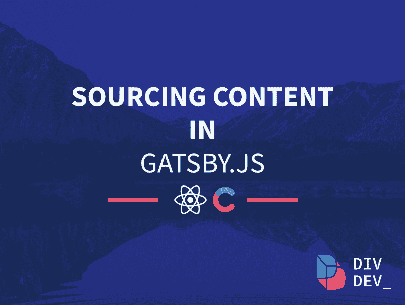
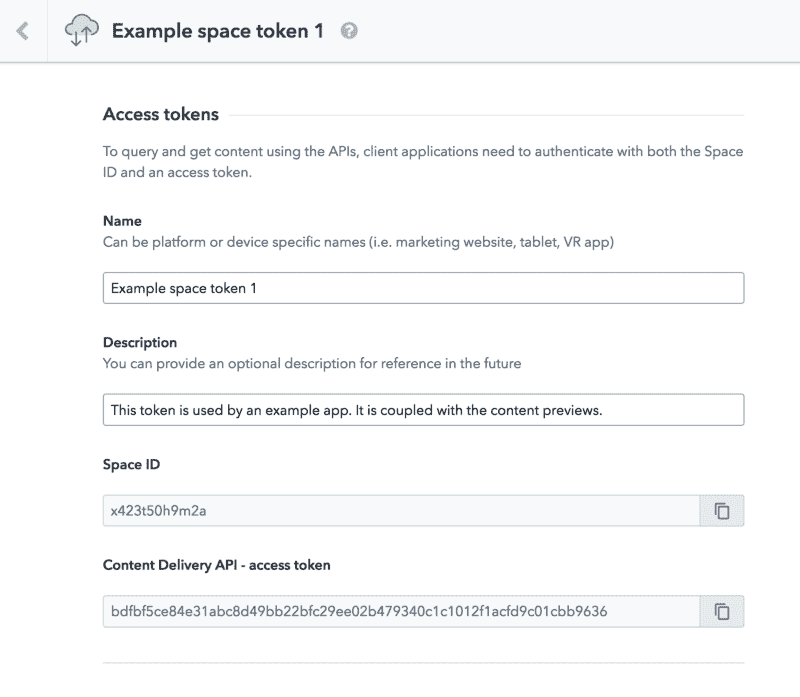
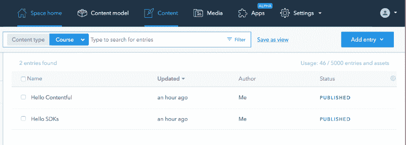
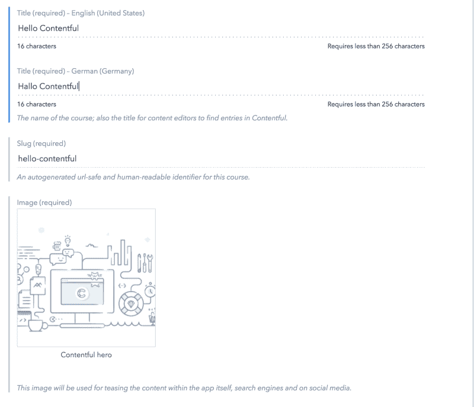

# 如何使用 Gatsby.js 获取内容

> 原文：<https://www.freecodecamp.org/news/how-to-source-content-with-gatsby-js-c220dde97e7/>

作者:迪米特里·伊瓦什丘克

# 如何使用 Gatsby.js 获取内容

banner by [Artur Didenko (peacebot)](https://www.freecodecamp.org/news/how-to-source-content-with-gatsby-js-c220dde97e7/undefined)

js 是一个强大的静态站点生成器(具有动态功能),可以用来构建高性能的网站。它拥有非常丰富的插件功能，非常适合你接下来的*个人博客*、*产品落地*、*作品集页面*或者*小型电商 app* 。

### 采购内容

很明显，当你建立你的网站时，除了业务逻辑、性能、安全性和风格，你还关心呈现给最终用户的实际内容。

情况可能相当简单:假设您有一个产品页面，其中包含需要由营销团队编辑的部分，而营销团队不想在代码编辑器中编辑那些花哨的 h1 的 T1 和 T2 的 T3。

另一个场景可能是有很多帖子的个人博客页面，每个帖子都有自己的标题、内容和大量您可能想要显示的其他信息。

感谢社区和 Gatsby 维护者编写的大量插件，我们很幸运地从广泛的选项中进行选择，以在页面上显示我们的内容。

### 从带有`gatsby-source-filesystem`和`gatsby-markdown-remark`的项目文件夹中采购

获取我们的内容的最简单的方法之一是直接从我们的项目文件夹中获取。我们可以抓取像图片这样的资产，以及更复杂的内容类型，比如用 markdown 编写的博客文章。

> 场景 1:从资产文件夹中访问图像，并在页面上显示它们

首先我们需要安装`gatsby-source-filesystem`并在`gatsby-config.js`中设置它。

`npm install gatsby-source-filesystem`

在`gatsby-config.js`中:

通过上面的几行，我们告诉 Gatsby 我们希望允许 GraphQL 查询位于指定的`path`的项目的`assets`文件夹的所有内容。

现在插件已经准备好了，我们实际上可以用下面的 graphQL 查询来查询我们的 assets 文件夹(`sourceInstanceName`是一个过滤参数，对应于上面配置中的`name`):

注意，为了能够在`component`内部而不是`page`内部使用该查询返回的图像，我们需要使用`Gatsby`中可用的`StaticQuery`。

`StaticQuery`接受`query`属性，在那里我们可以使用上面的 GraphQL 查询，以及`render`属性，它呈现我们提供给它的任何内容，它可以访问`data`，T3 只不过是我们查询的文件的包装器。

如果您正在查询相同的图像，但想在您的`pages`中使用它们，您可以直接从`props.data`访问它

> 场景 2:访问一个特定的图像并将其显示在页面上

为了通过名称访问一个特定的图像，我们必须稍微修改一下我们的 GraphQL 查询。否则，我们可以通过在组件中使用`StaticQuery`和在页面中使用`props.data`,以上面第一个场景中描述的方式使用它。

让我们指定文件的绝对路径，并使用正则表达式来挑选所需的图像。

> 场景 3:访问用 markdown 写的博客文章及其封面

由于 Gatsby 经常被用作博客模板，它提供了一种非常方便的方式来处理用`markdown`编写的博客帖子。要访问 markdown 帖子，我们首先需要稍微调整一下我们的配置，以便 Gatsby 知道我们的`markdown`文件在哪里。

我们使用`gatsby-source-filesystem`来实现这一点:

为了能够以一种非常方便的方式处理`markdown`文件，我们还需要设置`gatsby-transformer-remark`插件。请注意我们如何在`gatsby-transformer-remark`中添加其他插件，如`gatsby-remark-images`或`gatsby-remark-prismjs`。这些都在这里，所以我们能够直接将图像嵌入到我们的`markdown`中，并分别用`prismjs`突出显示代码块。

完成以上所有设置后，我们现在可以用`query`查询我们的减价帖子(我们可以方便地使用`sort`按时间顺序获取我们的博客帖子，并过滤以确保我们只查询那些位于我们项目的`blog`文件夹中的减价帖子):

我们已经知道，我们现在可以通过`this.props.data.allMarkdownRemark.edges`在任何`page`访问我们的`markdown`博客帖子，通过它们绘制地图，并显示插件为我们生成的所有必要数据。

例如，我们可以访问`frontmatter`，它只不过是我们包含在`markdown`中的类似 JSON 的结构。

这里有一个简单的例子:

我们已经包括了标题和日期，但是您可以随意添加您希望从查询中访问的任何其他参数(比如数组形式的标记):

### 无头 CMSs

有时候，在代码编辑器中更改所有的内容类型(比如图像或博客文章)并不方便。此外，您的最终用户可能不知道如何浏览代码，可能需要更简单的解决方案。

> 场景 4:从 CMS 访问复杂的内容模型，并在页面上显示内容

这就是无头 CMS 发挥作用的地方。想象一个场景，你用 Gatsby 做了一个静态的产品页面，传给负责页面上文案和图片的市场部。您用代码构建了它——它们与用户友好的 UI 交互，使更改任何内容变得容易。厉害！

让我们探索一下如何用 Gatsby.js 来做这件事！

#### 从 Contentful 采购

为了能够从 Contentful 获得一些东西，你需要一个在 https://www.contentful.com/的账户。注册后，你会得到一个简单的例子项目，我们将用于学习目的。

现在让我们从安装`gatsby-source-contentful`开始，并将其添加到我们的配置中。

`npm install --save gatsby-source-contentful`

在`gatsby-config.js`中，我们需要添加插件并提供我们的`spaceId`和`accessToken`，它们都可以在我们的项目仪表板的设置- > API 键中找到:

Contentful dashboard

请注意，将您的`accessToken`直接暴露给配置文件并不是一个好主意，这样 GitHub 上的每个人都可以看到它。出于训练的目的，我将把它包含在本教程的代码中，但是尝试使用环境变量来保护您的键，正如上面的例子中所看到的。如果你是第一次看到术语`environment variable`不要担心，你可以从[这篇文章](https://dev.to/deammer/loading-environment-variables-in-js-apps-1p7p)中领会这个概念。

在我们继续下一步之前，我想告诉你我们如何解决一个小冲突，这个冲突来自于这样一个事实:一些有内容的文件被 Gatsby 当成了`markdown`。

我们的`gatsby-node.js`负责以编程方式从 blog 文件夹中的 markdown 帖子创建页面。默认情况下，它使用`allMarkdownRemark`查询，这也会导致我们不需要的内容丰富的降价。让我们调整我们的查询，只获取位于我们的项目文件夹中的那些文件:

在`gatsby-node.js`中，我们添加了`filter`并将其设置为`/blog/`:

现在我们准备从 Contentful 获取我们的内容。在一个名为`contentful.js`的新页面中，我们首先要查询 Contentful 为我们创建的资产。当时，我们有一个特别有趣的内容类型叫做`Course`，它包含了我们需要训练的所有必要项目。

Content type — Course

使用 GraphQL 查询内容丰富的资产非常简单，我们需要做的就是运行`allContentfulCourse`查询来获取所有类型为`Course`的条目。

你可能已经猜到我们可以用`allContentfulYourCustomType`查询`yourCustomType`的内容。请注意我们是如何根据语言过滤课程的，否则我们会得到 Contentful 中指定的每种语言的每门课程的副本。这种情况下非常特殊，因为每门课程都有翻译:

在 Contentful 上浏览我们的内容，我们可以看到每个课程都有一个标题、持续时间、简短描述和图片。我们已经将它们包含在查询中，现在可以通过`this.props.data`在我们的组件中访问它们。

Content model of Course

### 概述

在这个小教程中，您已经学习了在 *Gatsby 中获取不同内容类型的几种方法。*您还了解了如何将它们组合到一个项目中，通过精确指定我们希望从哪个来源查询什么来避免可能的采购冲突。

感谢阅读！我希望你能像我喜欢写这篇文章一样喜欢读这篇文章！如果你有任何问题或想提出讨论，请不要犹豫，通过推特[T2 联系我。如果你按下那个`follow`按钮，这样你就不会错过我以后发布的任何帖子，我会很高兴的？](https://twitter.com/DivDev_)

一如既往，你可以在 github 上找到本教程的代码

*最初发布于[div dev . io](http://divdev.io)*