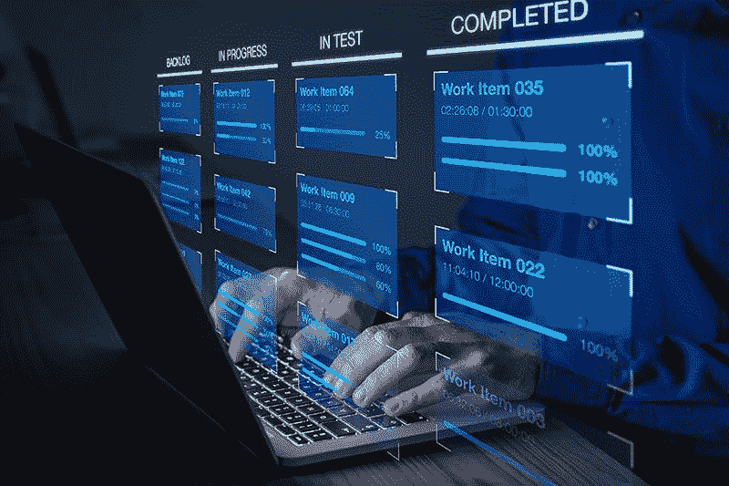

# 如何加速您的软件开发管道

> 原文：<https://www.freecodecamp.org/news/how-to-speed-up-your-software-development-pipeline/>

如果你曾经管理过软件开发管道——或者有这样的计划——有一件事你需要优先考虑:速度。

无论你正在开发什么类型的软件，你总是会面临加速团队交付的压力。

一些压力可能来自项目涉众，他们缺乏对软件开发如何工作的理解。有时是因为你的管理团队或客户担心竞争对手会抢先一步。

然而，不管是什么原因，你都需要知道一些策略来加快你的团队的节奏，而不损害[代码质量或安全性](https://www.freecodecamp.org/news/how-to-write-secure-source-code-for-proprietary-software/)。

这样做并没有你想象的那么困难。你所需要做的就是把正确的程序放在适当的位置，并用正确的技术支持它们。为了有所帮助，这里有五个技巧，旨在帮助软件开发团队尽可能快速有效地工作。

通过实现所有这些，保持快速的交付速度而不牺牲任何东西是可能的。让我们开始吧。

## 1.创建一个详细的路线图，并坚持下去

也许开发经理为保持工作在团队的工作管道中顺畅流动所能做的最重要的事情就是在工作开始前花时间为每个项目创建一个详细的开发路线图。

有效的路线图描述了完成项目所需的所有主要步骤，并从一开始就将工作的主要部分分配给特定的团队成员。

这是许多软件开发经理匆匆走过的一步——认为花在计划而不是编码上的每一分钟都是浪费。

然而，这与事实相去甚远。通过提前做出关于开发过程的重大决策，团队将不会在以后打破常规。此外，构建路线图的过程通常会发现一些障碍，这些障碍会使工作中途嘎然而止。

如果你想让一个软件项目高速向前发展，在开始工作之前最好先清理好道路。

## 2.设置在制品限制

*Image source: NicoElNino / Adobe Stock*

如今，大多数软件开发管道符合[看板或 Scrum](https://www.freecodecamp.org/news/being-agile-kanban-vs-scrum/) 项目管理方法。即使是那些不倾向于包含某种形式的看板风格的板来跟踪不同完成阶段的项目任务的公司。

这些在制品(WIP)项目有助于管理人员保持对团队进度和处理更多工作的能力的可见性。

问题是，“范围蔓延”经常发生，开发团队的 WIP 列表很容易在匆忙中失控。当这种情况发生时，团队成员会尝试多任务处理，在不同的 WIP 项目之间跳来跳去，试图清理积压的工作。当他们这样做的时候，团队的步伐通常会慢得像爬行一样，并且错误开始悄悄进入代码。

问题是，尽管许多程序员的想法相反，[人类不能很好地进行多任务处理](https://health.clevelandclinic.org/science-clear-multitasking-doesnt-work/)。在这种情况下，解决方案是阻止他们尝试。

对工作流程中每个阶段允许的在制品数量设置硬性限制是一个很好的方法。这样做可以保证团队成员不会贪多嚼不烂，并在更短的时间内完成更多的任务。

## 3.集中化和自动化机密管理

一个快速工作的软件团队可以生产出优秀的应用程序，但这通常是以牺牲安全性为代价的。对于使用分布在多个不同系统上的一系列服务器、服务和容器的团队来说尤其如此。

在这些情况下，大多数开发团队会指定一个人来管理对所有必要系统和数据的访问。然而，这就产生了一个瓶颈，因为所有的访问请求都必须通过那个人，而开发人员在收到必要的凭证之前总是不能前进。

该问题的解决方案是集中和自动化访问供应和访问撤销，并且尽可能最大程度地自动化它。

有各种开源工具可以帮助实现这一点，也有各种基于云的秘密管理解决方案。

最著名的例子之一是开源解决方案 [HashiCorp Vault](https://www.hashicorp.com/products/vault) 。然而，这并不是最容易启动和运行的解决方案。对于一些开发团队来说，系统本身的安装和配置非常困难，足以阻止他们使用它。

同样值得注意的是，使用 Google 或 AWS 作为开发平台的开发者可以利用各自的秘密管理工具。它们是专门构建来与在这些平台上进行的项目开发相集成的。这意味着它们通常很容易集成到工作流中，没有太多麻烦。

或者，对于在多云环境中工作的开发团队来说，像 [Akeyless](https://www.akeyless.io/) 这样的解决方案通常是一个很好的选择。因为它是基于 API 的，所以它集成了开发人员所依赖的大多数类型的安全系统。而且，由于它是在零信任范式下运行的，它不要求开发人员将他们项目的安全性委托给任何第三方。

一旦一个项目开始运行，平台就会处理剩下的事情。这让开发人员专注于他们的工作，所有的秘密都留在代码之外，因为 Akeyless 自动化了秘密的生成和注入。这让开发人员可以更少地担心安全性，更多地关注如何完成工作。

## 4.不要抄近路来绕过代码问题

任何从事过复杂软件项目的开发人员都会告诉你，在整个开发过程中总会出现代码问题，而没有任何明显的解决方案。

在许多情况下，开发团队求助于快速和肮脏的修复来解决这样的问题，以便他们可以快速前进。这就是你的项目如何能在短时间内积累起堆积如山的技术债务，并且从长远来看，它会回来困扰项目。

如果总体开发速度是你的目标，最好花时间在问题出现时找到真正的解决方案。即使您需要周期性地停止开发来这样做，从长远来看，这样做可以节省更多的时间。这是因为偷工减料的真正后果可能直到开发过程的后期才变得明显，那时可能几乎不可能修复。

最好提前在开发路线图中为代码重构和其他内务处理步骤留出时间，以避免一开始就陷入那种境地。

## 5.留出不可侵犯的深度工作时间

根据最近的一项调查，普通的软件工程师每周只能挤出大约 10 小时的所谓深度工作时间。

主要原因是，大多数开发人员不得不应对[雪崩式的中断](https://daedtech.com/programmers-teach-non-geeks-the-true-cost-of-interruptions/)，这些中断打破了他们的编码节奏，耗尽了他们的时间和注意力。从突然的代码审查请求到不请自来的客户反馈，会迫使开发人员放弃他们正在做的事情并将他们的注意力转移到其他地方的事情永无止境。

一个精明的开发经理可以通过让团队成员将特定的时间段作为不可侵犯的深度工作时间来帮助解决这种情况。这意味着让团队成员锁定并运行任何必要的干扰来防止他们的中断。

对于远程团队来说，这就像允许团队在工作期间断开聊天应用程序和电子邮件一样简单。

办公室团队必须更加努力才能做到这一点。在办公室环境中，将由开发经理拦截任何和所有传入的请求，否则这些请求会到达团队并扰乱他们。这可能需要向更高级别的经理甚至客户表明态度。

关键是要清楚地说明*为什么*不允许被打断，并将其与有意义的生产率指标联系起来。任何能传达信息的事情都是至关重要的，让团队去做他们的工作。

或者，如果这些都不起作用，那么授权一个轮流在家工作的政策，让团队成员离开办公室去完成有意义的工作，也是值得的。

## 外卖

这里详细介绍的五个技巧对于消除常见的软件开发绊脚石和其他程序性的时间浪费(它们会减慢任务的完成)有着神奇的效果。总之，它们应该使开发团队能够在软件项目上快速而稳定地取得进展，同时最大限度地减少意外的减速。

当然，现实表明没有完美的路线图，期待意外总是意料之中的事。但是通过解决影响每个软件开发项目的瓶颈和减速，你和你的团队将充分利用他们的时间，并保持其他开发人员羡慕的速度。

*通过 snowning 12/Adobe Stock 授权的特征图像*