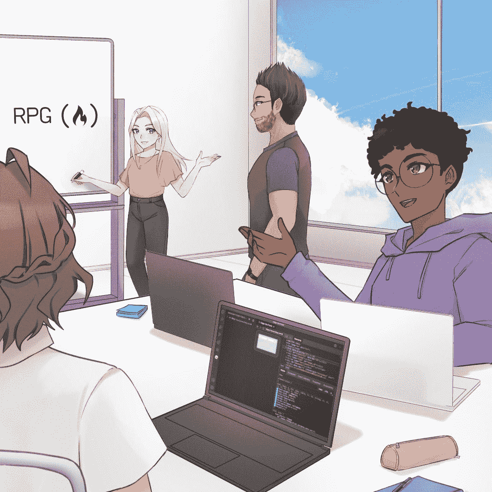
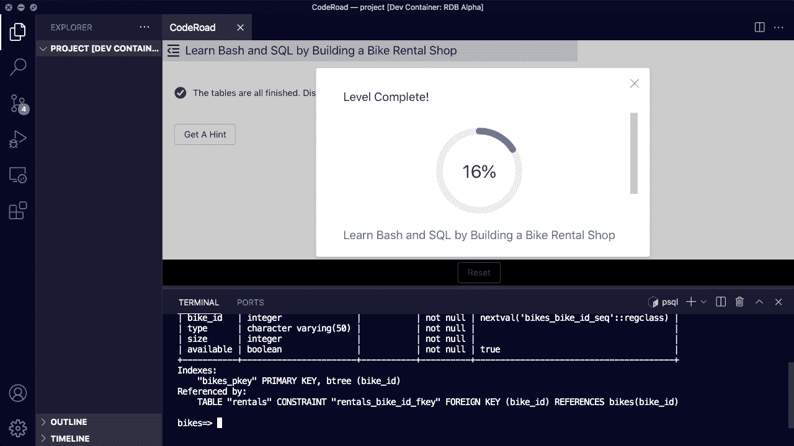
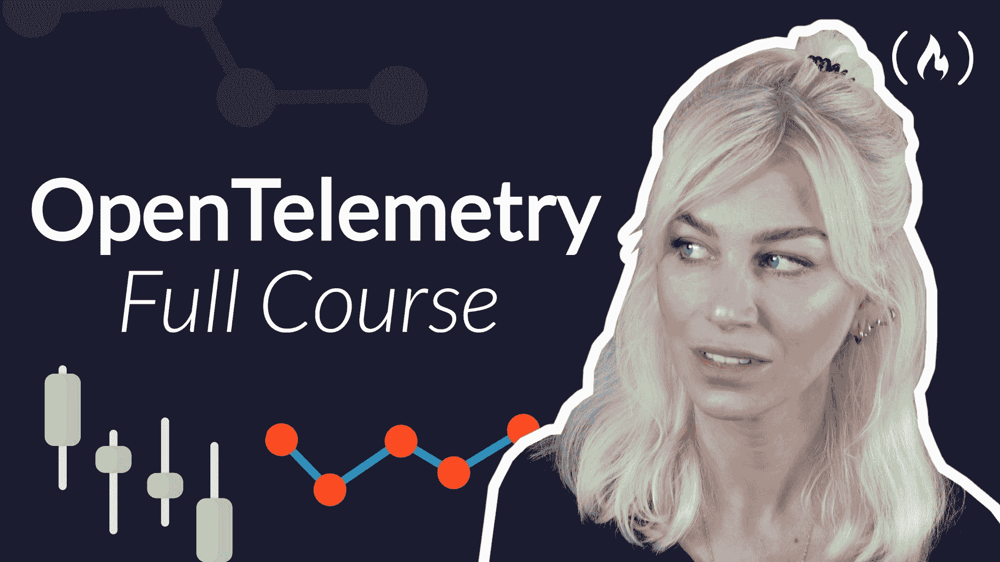

# 如何赞助免费代码营——企业赞助和拨款

> 原文：<https://www.freecodecamp.org/news/how-to-sponsor-freecodecamp-sponsorship-grant-making/>

freeCodeCamp 是一家总部位于美国的 501(c)(3)公共慈善机构。我们的使命是为世界各地的人们创造免费的学习资源。

您的组织可以通过三种方式成为 freeCodeCamp 的赞助商并支持我们的使命:

*   成为钻石课程赞助商
*   成为白金课程赞助商
*   或者成为金牌赞助商

请注意，您的礼物可能是免税的。

## 钻石课程赞助商(100 万美元及以上)

A screenshot from freeCodeCamp's Relational Database curriculum, which teaches Linux, Git, and SQL. This curriculum involves experiential learning. Students learn by building 14 distinct projects. We created this curriculum with support from a grant from Class Central.

支持我们的非营利组织开发完整的互动课程。我们将通过体验学习教授一个主题——就在代码编辑器中。

这将包括:

*   十几个交互式编码项目
*   概念幻灯片
*   开放源代码库

整个课程将是免费和开源的。

我们将对该课程进行深入描述，并通过 freeCodeCamp 在 Twitter、LinkedIn 和脸书上广泛的社交媒体宣传该课程。

这个过程通常需要大约 9 个月，数千小时的研究和教学设计。

我们将特别感谢贵机构提供的资助，使本课程成为可能。美国法律确实限制了我们对赞助商的评价，但我们可以分享:

*   您的组织名称
*   对你的产品、服务或使命的中性价值描述
*   你的标志和口号
*   我们可以链接到你的网站

我们还将在我们的[赞助商大厅](https://www.freecodecamp.org/news/sponsors)突出展示您的标识并链接到您的网站。

截至 2022 年，我们正在利用钻石课程赞助商的资助开发两个这样的课程。

你可以看到我们在 2021 年开发并继续维护的一个这样的课程的例子:freeCodeCamp [关系数据库认证](https://www.freecodecamp.org/news/how-to-run-freecodecamps-relational-databases-curriculum-using-docker-vscode-and-coderoad/)。

## 白金课程赞助商(10 万美元及以上)

A full-length Open Telemetry course we created and published on freeCodeCamp's YouTube channel, with support from a grant from New Relic. Even though this open source library is an advanced DevOps topic, the video has garnered more than 120,000 views.

支持我们的非营利组织开发一个完整长度的视频课程，通过 freeCodeCamp 的 YouTube 频道发布和宣传。

截至 2022 年，我们的频道拥有近 500 万订户，是 YouTube 上最大的专注于节目的频道，每月观看次数超过 1400 万次。

我们还创建了一篇基于文本的文章，用于通过 freeCodeCamp 在 Twitter、LinkedIn 和脸书上的广泛社交媒体宣传课程。

由于 freeCodeCamp 在质量方面的声誉，这些课程在 YouTube 搜索和谷歌搜索上都获得良好排名是很常见的(尽管我们无法直接控制这些排名算法)。

截至 2022 年，我们已经利用白金课程赞助商的资助开发了数十个课程。请注意，赠款越多，我们开设的课程就越长，越深入。我们以前创建过长度为 5 或 6 小时的课程，其中一些课程在 YouTube 上的浏览量超过了 100 万次。一般来说，课程越长、越深入，就越受欢迎。

你可以看到我们在 2021 年开发的一个这样的课程的例子:freeCodeCamp 的[开放式遥测课程](https://www.freecodecamp.org/news/how-to-use-opentelemetry/)。

## 金牌赞助商(每年 1.2 万美元及以上)

如果你的组织想要赞助我们非营利组织的日常运作，我们欢迎持续捐赠。

我们将自豪地在我们的[赞助商大厅](https://www.freecodecamp.org/news/sponsors/)展示贵公司的标志，以及贵公司网站的链接。

## 如何赞助免费代码营或了解更多关于赞助机会的信息

如果你对赞助有任何疑问，你可以直接通过电子邮件联系 freeCodeCamp 的创始人昆西·拉森[，或者通过推特](mailto:quincy@freecodecamp.org)直接给他发消息[。](https://www.twitter.com/ossia)