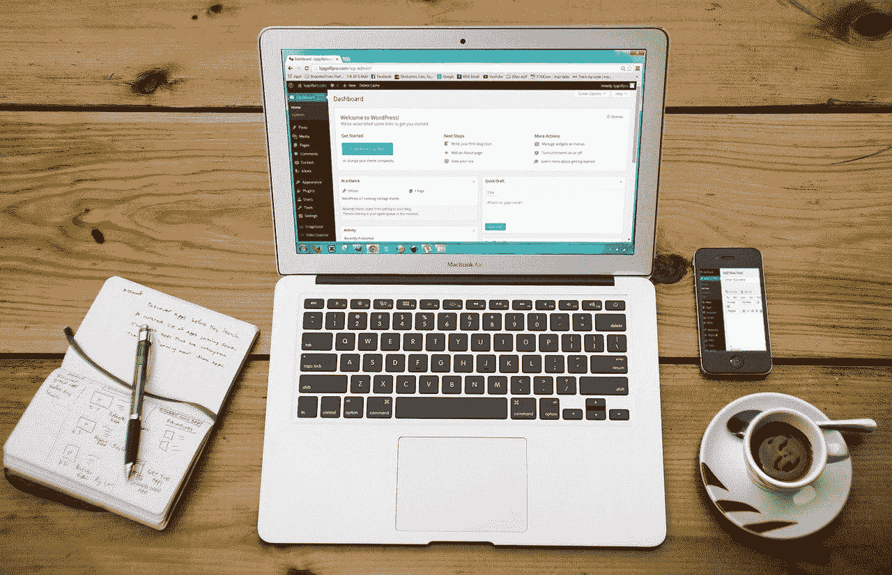
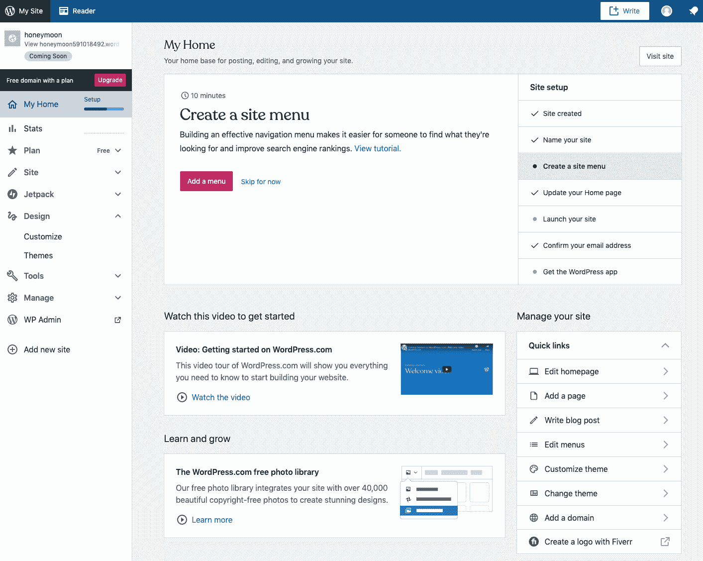
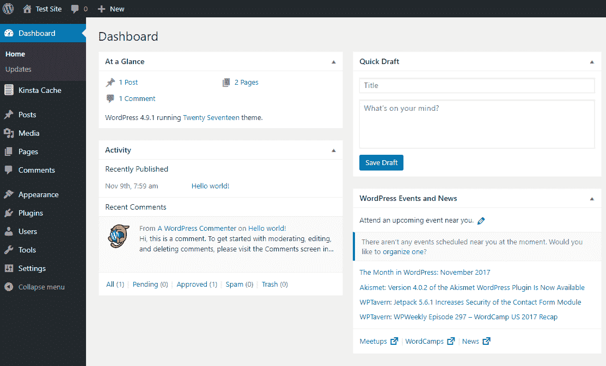
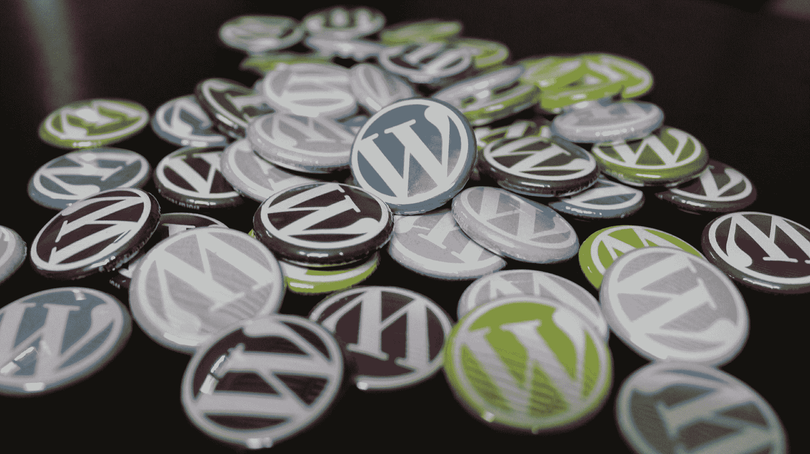

# 如何用 WordPress 免费开博客——初学者教程

> 原文：<https://www.freecodecamp.org/news/how-to-start-a-blog-with-wordpress/>

这篇文章将讨论如何用 WordPress 创建一个博客。WordPress 是世界上最流行的博客软件和内容管理系统。

如果你需要一个介绍，你可以在我之前的文章[这里](https://www.freecodecamp.org/news/what-is-wordpress/)中学习所有关于 WordPress 的基础知识。

在本帖中，我们将讨论:

*   博客基础
*   为什么你应该选择 WordPress
*   与 WordPress.com 一起免费创建博客
*   与 WordPress.org 一起创建一个自主博客

在讨论使用 WordPress 创建博客的步骤之前，我先花点时间解释一下博客的基础知识。

## 什么是博客，你为什么要开博客？

博客是在互联网上发布的讨论或信息网站。博客可以是有趣的，信息丰富的，或者鼓舞人心的，可以为高度有针对性的和小众的读者或更广泛的读者群发布(如 freeCodeCamp.org/news)。

> 博客(“网络日志”的缩写)是在互联网上发布的讨论或信息网站，由离散的、通常非正式的日记式文本条目(帖子)组成。——[维基百科](https://en.wikipedia.org/wiki/Blog)

如果你想开一个博客(我也曾经和你一样)，有几个原因可能会激励你:

1.  既好玩又有教育意义。
2.  你对一个话题超级有热情，想和读者分享你对这个话题的想法。
3.  你想用你的博客作为一个网站来赚钱。

当我创建我的第一个博客时，我既想分享我对某个主题的看法，又想了解更多关于在线出版的知识(我 13 岁时在 [GeoCities](https://en.wikipedia.org/wiki/Yahoo!_GeoCities) 上创建了一个关于视频游戏作弊代码的博客)。

那段经历让我创建了几十个网站，现在我主要用 WordPress 创建网站。

当前的环境也是创办博客的催化剂。人们有更多的时间呆在家里，正在重新考虑职业，考虑读研，并以全新和意想不到的趋势学习新的编程语言。

随着在家工作人数的大幅增加，人们有更多的时间从事副业和创业。我认为今天大多数人开博客要么是因为他们有更多的时间不用通勤，要么是因为随着世界的变化，他们走上了创业之路。

有了像 WordPress 这样的平台，开始新的冒险从未如此容易。像 SuperHuman 和 EarlyBird 这样的公司能够建立收集预注册的简单网站。像 WordPress 这样的 CMS 可以让你从小处着手，随着时间的推移，轻松扩展网站的功能。

从小创意到企业的完全数字化转型，WordPress 充满了实现你梦想的力量。无论你的想法有多小，使用 WordPress 都很容易上手。

## 你为什么要选择 WordPress？

WordPress 是世界上最流行的博客软件和内容管理系统。它目前为大约 5 亿个网站提供服务。

> 39%的网站建立在 WordPress 上。使用 WordPress 的博客作者、小企业和财富 500 强公司比所有其他选择加起来还多。加入数百万以 WordPress.com 为家的人们。——[WordPress.com](https://wordpress.com/)

如果你正在寻找博客软件，WordPress 是一个明显的选择，拥有 60%的市场份额。

你可能听说过或看过其他的内容管理，如 [Joomla](https://www.joomla.org/) 、 [Drupal](http://drupal.org/) 、 [Squarespace](https://www.squarespace.com/) 、 [Shopify](https://www.shopify.com/) 和 [Wix](https://www.wix.com/) 。这些内容管理系统提供了很棒的产品，但是这里有三个选择 WordPress 的理由。

1.  使用 WordPress 每天创建 500 多个网站，而在 Shopify 和 Squarespace 这样的平台上每天只有 60-80 个
2.  可以免费**入门。**
3.  **WordPress 有一个令人难以置信的开发者生态系统，你可以用 WordPress 快速建立你的网络开发技能。**

**因此，如果我已经说服你使用 WordPress，让我们讨论如何实际开始。**

**

Starting a blog with WordPress.org.** 

## **如何在 WordPress.com 免费创建一个 WordPress 博客**

**大多数人选择使用 WordPress.org 来创建一个自托管网站。更多信息请见下文。但是你可以在 WordPress.com 注册免费开始。你可以在[WP 初学者](https://www.wpbeginner.com/beginners-guide/self-hosted-wordpress-org-vs-free-wordpress-com-infograph/)了解更多关于 WordPress.com 和 WordPress.org 的区别。**

**免费的 WordPress.com 平台是开始使用 WordPress 的一个好选择。这是非常用户友好的，你将不必担心更新或备份。它免费提供高达 3GB 的存储空间。超过 3GB，你将不得不为更多的空间付费。**

**WordPress.com 的免费博客平台可以让你快速入门。**

**从这里开始，输入您的电子邮件、用户名和密码。**

**一旦你设置好了，你会看到 WordPress 管理后台。在这里，您可以编辑您的网站内容，选择一个主题，并审查您的网站的统计数据。**

**

[WordPress.com](https://wordpress.com) dashboard for a free prototype of a website I built.** 

**使用易于使用的可视化编辑工具定制您的网站后，您就可以开始发布帖子并与世界分享您的内容了！**

**WordPress.com 上的免费平台很大程度上是免费增值，旨在让你升级到付费计划。这是开始使用该工具并熟悉添加页面、帖子和编辑内容的好方法。**

**所有的免费网站都有一个域名*{ something)*. WordPress . com，你可以升级你的计划来选择你自己的域名，或者如果你已经有一个域名的话，从另一个服务转移过来。**

**WordPress 的真正力量是通过一个自托管版本来释放的。**

## **如何和 WordPress.org 一起开一个自主博客**

**WordPress.org**可以让你创建一个功能齐全的网站，拥有和 WordPress.com 一样的功能，没有任何限制。WordPress.org 是开源的，任何人都可以 100%免费使用，但是在开始之前你需要支付两件事情。****

****要开始自助托管你的 WordPress 网站，你需要三样东西:****

1.  ****域名****
2.  ****托管服务提供商****
3.  ****学习的意愿(这就是你加入免费代码营的原因！)****

****你可以从各种注册商那里购买域名，比如 name price、Bluehost 和 GoDaddy。域名的费用大约是每年 20 美元。****

****有数百个主机提供商可供选择。很容易像 Bluehost 或 GoDaddy 一样选择相同的主机作为您的注册器。最近，出现了像 Kinsta 这样专门从事 WordPress 的 WordPress 专用主机。****

****一旦你有了闪亮的新域名和主机提供商，你需要安装 WordPress。你的主人会帮助你做到这一点。****

****对于高级开发者来说，你可以在你自己的服务器上安装 WordPress 来完全控制你的 WordPress 安装，以获得更好的速度和安全控制。****

****安装 WordPress 时，你通常需要提供一些基本的网站和用户信息:****

*   ****网站标题(以后很容易更改)****
*   ****网站标语(以后很容易更改)****
*   ****管理员用户名(不能更改，选择安全的名称)****
*   ****管理员密码****
*   ****管理电子邮件****

****当 WordPress 已经成功安装在你的网站上时，你可以通过*yourdomain.com*/WP-admin 访问后台。输入您提供的登录信息，您将被带到您自己网站的新管理仪表板！****

****

Via What Is the WordPress Admin Dashboard?**** 

****WordPress 预装了一个主题(每年更新一次)，通常还有一些演示内容，比如一篇样本文章和一个样本页面。此内容在您的域中已经可用。****

****成功访问管理仪表板后，接下来的步骤应该是将您的自定义添加到站点。从一个主题开始，然后编辑你的页面和文章。****

### ****如何选择和安装主题****

****主题是 WordPress 的基础部分。WordPress 主题是一个文件的集合，这些文件一起工作来为一个网站产生一个具有底层统一设计的图形界面。它们是你的网站的外观和感觉。****

****主题可以无限定制，但是从一个伟大的主题开始会让你的生活变得非常容易。你可以从森林主题和 WordPress.org 主题中选择数以千计的主题。****

****主题可以很容易地通过上传一个 zip 文件到 Wordpress dashboard 来安装。改变你网站的外观就像在新安装的主题上点击“激活”一样简单。****

****在你的 WordPress 网站上添加了一些风格之后，是时候添加你的内容了。****

### ****如何添加页面和文章到你的 Wordpress 站点****

****页面和帖子构成了网站内容的大部分。页面是您的网页，如主页、关于页面、联系我们等等。帖子是更新更频繁的“博客”，可以在 WordPress [类别](https://www.wpbeginner.com/glossary/category/)下不断添加和组织。****

****无论你想让你的 WordPress 博客变成什么样，都是从内容开始的。****

****无论是像 Superhuman 这样简单的收集电子邮件的登陆页面，像 [TechCrunch](https://techcrunch.com) 这样的出版超级大国，瑞典的[官方网站，金融比较网站，还是星球大战官方博客(这些都是 WP 网站)，人们都想看到你的内容！所以从添加页面和帖子开始吧。](https://sweden.se/)****

********

## ****把一切都包起来****

****WordPress 是世界上最流行的软件平台之一。****

****它易于设置，并可无限定制，是创建自己的博客和网站的绝佳选择。当你把你的内容和想法公之于众的时候，你的网络开发技能会随着你的内容和想法而增长。****

****无论你使用免费的 WordPress.com 还是自主版本，WordPress 都是一个很好的工具。所以开始吧！****