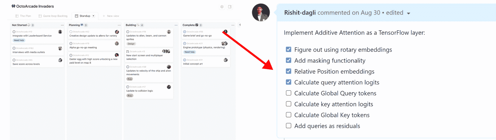
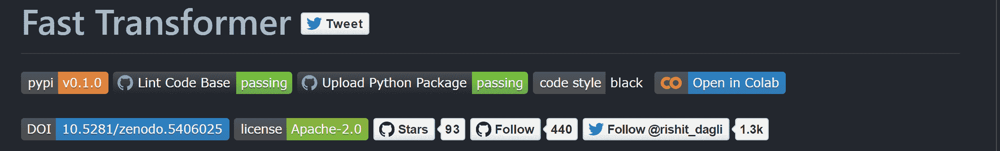
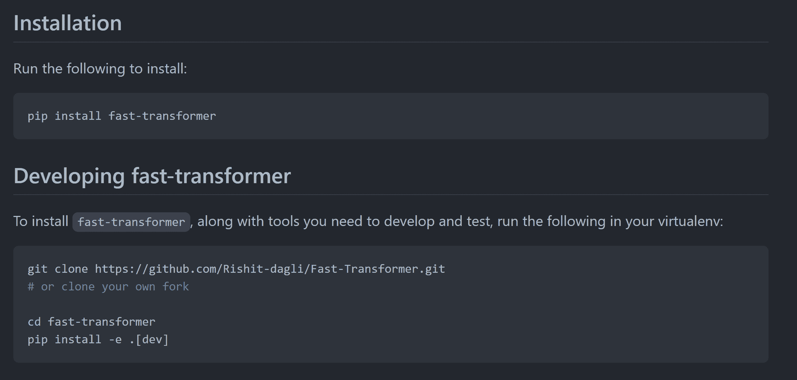
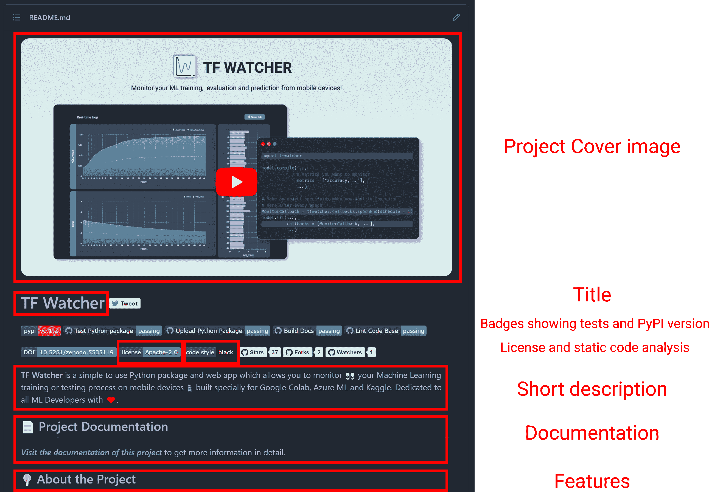

# 如何在 GitHub 上开始一个开源项目——构建我的趋势回购的技巧

> 原文：<https://www.freecodecamp.org/news/how-to-start-an-open-source-project-on-github-tips-from-building-my-trending-repo/>

世界各地的开发者使用 GitHub 与全球开发者社区分享他们的项目。

在本文中，我会给你一些有见解的提示，帮助你构建一个可以开始使用的伟大的开源项目。您也可以使用这些技巧来构建黑客马拉松项目。

最近，我出现在了令人垂涎的 GitHub 趋势页面上。我是 GitHub 和 Python 的第二大趋势开发者，这对我来说是 9 月 7 日早上的一个惊喜。它是基于我在凌晨 4 点写的代码。

我还出现在 GitHub 每日时事通讯上，这都是在开源我的一个项目之后。

我将在这篇文章中分享一些技巧，你应该能够应用于所有类型的项目，而不仅仅是像我自己的 Python 包。

你可以在这里查看我的回购协议。

My project on the [GitHub Trending](https://github.com/trending/developers) page

## 找到你的动力

几乎不可能玩 GitHub 趋势部分的游戏:

> GitHub 的(趋势)定义考虑了趋势的长期定义，并使用了比纯粹的恒星数量更复杂的测量方法，这有助于防止人们耕作系统。

创始人经常根据他们亲身遇到的问题创建创业公司。使用开源代码，你可能会试图解决**开发人员通常会遇到的**问题。

由于玩 GitHub 趋势部分几乎是不可能的，你需要一个强大的动力——一个大的、常见的开发者问题——来工作。那么，您如何偶然发现开发人员的问题呢？

首先，你可以参与黑客马拉松，构建项目，并尝试其他项目。你很快就会发现可以做成图书馆的东西，可以做成实用工具的东西，等等。

您构建项目的动机可能来自任何地方。就我而言，我每天都在 arXiv(一个开放的论文档案库)上探索新的机器学习论文，并阅读我觉得有趣的论文。我读过的一篇这样的论文激励我构建我的 Python 包。

还有一次，我参加了一个训练机器学习模型的黑客马拉松，并想参加其他庆祝活动。然后，我们的团队决定构建另一个名为 [TF-Watcher](https://www.freecodecamp.org/news/how-to-monitor-ml-projects-on-mobile-devices/) 的开源项目。

所以你看，当你建立一个项目的时候，你可能会发现各种各样你可以解决的问题。

请注意，当我说你应该有一个强烈的动机时，我并不是说这个项目应该非常大或者非常复杂。这当然可能是一个简单的项目，可以使开发人员的生活更容易。

这样想:如果有一个像你想开发的项目，**你会使用它吗**？如果答案是肯定的，那么你就有足够的动力来建设这个项目，不管它的规模或复杂程度如何。

> 上周，加州奥克兰的一名男子删除了 11 行代码，扰乱了全球的网络开发。——基思·柯林斯(Keith Collins)在[中讲述了一名程序员如何通过删除一小段代码来破坏互联网](https://qz.com/646467/how-one-programmer-broke-the-internet-by-deleting-a-tiny-piece-of-code/)

你可能知道`left-pad`，一个非常小的开源 npm 包，只有 11 行简单的代码。但是它被世界上成千上万的开发者使用，这加强了我上面所说的。

## 研究你的想法

一旦你发现了一个你想解决的开发者问题，并且有足够的动力去着手解决它，你最好花一些时间去做你的研究。

我认为通过您的研究尝试回答这些问题是一种很好的做法:

### 是否已经存在类似的项目或工具？

如果它还没有完成，并且有这个需要，那么就开始构建它吧。

如果类似的东西存在，发展良好，并且被大量使用，你可能想继续前进。

已经有了大量的开源项目，并且发现一个库做类似的事情是很常见的(比你想象的更常见)。但是你仍然可以继续你的项目，并使它变得更好。

### 如果类似的东西确实存在，你的项目能让它变得更好吗？

如果存在类似的东西，你的目标可能是使它更模块化或更有效。您可以尝试用其他语言来实现它，或者用其他方式来改进它。

一个很好的方法是查看现有存储库的问题。尝试用现有的解决方案(如果有的话)做研究，找出项目的哪些方面可以改进。你的工作甚至可以是另一个项目的衍生物。

就我而言，正如我提到的，我从我读过的一篇有趣的研究论文中获得了灵感(Fastformer: Additive Attention 可以是你所需要的全部)。我还发现了该论文的官方代码实现和社区实现，都在 PyTorch 中。

最后，尽管我的库是研究论文的衍生物，但它与现有的代码实现完全不同。

### 你能像我 5 岁一样解释你的项目吗？

ELI5，或者解释为我五岁，是一个很好的练习，我一有关于存储库的想法就喜欢做。

我试图向一个不太了解这个主题的朋友解释这个项目的目标是什么，或者它是如何工作的，或者为什么它比类似的库更好。经常有一些有用的类比。

通过这样做，它帮助我发展或清楚地了解我想在我的项目中做什么。试图向朋友解释这个项目通常也能帮助我发现我的计划中的任何缺陷或我在构思这个项目时可能做出的假设。

当我开始项目的开发阶段时，这个过程确实帮助了我。这也是我开始创建项目板的时候。你可以在 GitHub 本身上做一个项目板，也可以使用 Trello、JetBrains Spaces 等等。

我喜欢使用 GitHub 项目，并在这个阶段发布清单，以帮助我管理、区分优先级，并对我需要做的事情有一个清晰的高层次想法。

GitHub Projects and Issue checklists

### 你能从相似类别的优秀知识库中学到什么？

您经常可以从属于类似类别的存储库中获得灵感和学习。查看他们的代码是如何构建的。你应该尝试搜索其他优秀的软件仓库，通读他们写得很好的代码。

就我而言，我真的很喜欢《改革家——皮托奇——T2》的写作方式。作为 Python 库，它很容易在您的项目中使用，它希望您理想地只关心抽象了大量模型构建过程的单个类，并返回一个`torch.nn.Module`(在 Pytorch 中，是所有神经网络模块的基类)的实例，您几乎可以用它做任何事情。我最终以非常相似的方式建造了[快速变压器](https://github.com/Rishit-dagli/Fast-Transformer)。

## 如何开发你的项目回购

你可能听过一句流行的名言:

> 任何傻瓜都能写出计算机能理解的代码。优秀的程序员编写人类能够理解的代码。—马丁·福勒

如果人们不能理解你的代码，他们就不会使用它。

我在自己的存储库中注意到，当我花更多的时间试图让事情变得简单易用时，那些项目最终会得到更多的关注。所以试着花额外的时间让你的项目更有用和直观。

作为开发回购的一般经验法则:

*   当你启动一个开源项目时，你应该包括一个许可证。这允许人们使用、复制、修改和贡献你的项目，而你保留版权。您可以在 https://choosealicense.com/轻松找到适合您项目的许可证。
*   创建一个好的自述文件:接下来有一整节是关于这个的，因为它非常重要。
*   使用一致的代码约定和清晰的函数/方法/变量名称。你可以经常使用一些静态代码分析工具，比如 [black](https://github.com/psf/black) 、 [ktlint](https://ktlint.github.io/) 等等。
*   确保你的代码被清楚地注释，记录你的想法，并包括边缘案例。
*   确保修订历史、问题或提取请求中没有敏感材料(例如，API 密钥、密码或其他非公开信息)。
*   如果你正在开发一个应用程序/库，我建议你使用 GitHub 版本。尝试在每次发布新版本时保持清晰的发布说明和变更日志，以便社区可以跟踪新内容。记录修复了哪些 bug 等等。这里有一个[大回购](https://github.com/PatilShreyas/NotyKT/releases)展示了这一点。
*   最后，您还应该在存储库中包含贡献指南，告诉您的受众如何参与您的项目。您可以包括您期望的贡献类型的信息，或者如何建议一个特性请求或错误报告等等。

## 如何写好自述

一个好的自述文件无疑是知识库最重要的组成部分之一。它显示在知识库的主页上。

潜在的贡献者通常首先查看自述文件，只有当他们觉得有趣时，他们才会查看代码，甚至考虑使用该项目。

此外，这并不是撰写自述文件的权威指南。只是玩玩它，尝试一下对你的项目有用的东西。

通常，您会希望在自述文件中包含以下组件:

### 解释项目的作用

试着用 3-4 行来描述这个项目。不要担心包含太多的细节或功能，您可以在后面的部分添加它们。这也是你的知识库的访问者首先会阅读的东西，所以一定要让它有趣。

### 有一个伟大的项目封面图像或标志

如果你的项目有一个徽标或封面图片，请在此注明。这有助于贡献者有某种视觉。

### 分享您的徽章

Badges in README

您经常会在自述文件的顶部看到传达元数据的小徽章，例如项目的所有测试是否都通过了。

你可以使用 [shields.io](http://shields.io/) 在你的自述文件中添加一些。这些通常会给你的项目带来很大的可信度，而不需要访问者浏览你所有的代码。

### 包括视觉

你应该尽量在你的自述文件中包含视觉效果。这些可以是展示你的项目运行的 gif 或者是你的项目的截图。

自述文件中的好图片确实有助于说服其他开发人员使用您的项目。

### 解释如何安装或设置您的项目

您还应该包括具体的安装指南。包括所有必需的依赖项和其他开发者为了使用你的项目需要安装的任何东西。

如果您在设置项目或安装依赖项时遇到了任何问题，很可能用户也会遇到这种问题，请确保您谈到了这一点。

这些可能非常简单:

My Installation section

### 给出清晰且可重复的使用示例

我认为这在你的自述中非常重要。你不应该期望其他开发人员做大量的功课或者阅读你的代码——尽你所能让他们轻松。

始终确保并仔细检查您的代码示例或“如何做”部分是易于重现的。此外，确保它能为广大用户所理解，不要遗漏任何复制它的必要说明。

因为我的项目是一个 Python 包，所以我创建了一个附带的 Colab 笔记本来演示这个包的使用。这让人们不用在自己的机器上安装任何东西，就可以很容易地在他们的浏览器上试用它。

有相当多的产品允许您这样做，如 repl.it、Glitch、Codepen 等等。

### 解释你可以用这个项目做什么

列出您的项目具有的功能以及它可以帮助解决的问题通常会很有帮助。你不必涵盖所有你做过的功能，但要分享主要的功能。

这将有助于开发人员理解您的项目可以做什么，以及为什么他们应该使用它。

### 分享人们如何获得帮助或为项目做出贡献

最后，你应该清楚地表明你是否愿意接受贡献，以及接受贡献的条件是什么。您还应该记录命令来 lint 代码或运行测试。

这些步骤有助于确保高质量的代码，并降低变更无意中破坏某些东西的可能性。

### 外部文件

假设你认为你的自述文件太长了。在这种情况下，您可以创建一个附加的文档网站，并在自述文件中链接到该网站，而不是省略任何重要信息。

因为我经常使用 Python，所以我通常使用 [Sphinx](https://www.sphinx-doc.org/en/master/) 从 Python docstrings 生成我的文档。我发现 Sphinx 非常灵活，很容易设置。

有很多选项可以生成您的文档: [mkdocs](https://www.mkdocs.org/) 、 [Docsaurus](https://docusaurus.io/) 、 [docsify](https://docusaurus.io/) 等等。然而，对于我的开始流行的项目，我不需要外部文档网站。

下面是一个例子，我觉得这可能是我自己的一个项目的自述文件的良好开端。这不是完整的自述文件，只是我在一张图片中能看到的内容:

Example of what I add in a README

最后，为了获得更多的灵感，我建议你尝试使用[“做一个自述”指南](https://www.makeareadme.com/)。

## 如何让访问者访问你的 GitHub 页面

一旦你创建了一个漂亮的自述文件并将项目公之于众，你需要考虑将人们带到 GitHub 页面。

首先，确保在 GitHub repo 中添加相关标签。这些标签将使这个项目更容易被探索 GitHub 的人们发现。

### 在黑客新闻、Twitter 和 Reddit 上分享您的项目

黑客新闻和 Reddit 是发布你的项目的好地方。请记住，让你的帖子成为这两个平台上的头条是一项艰巨的任务。

当我的一个仓库成为头条新闻时，它在几个小时内获得了一百多颗星。

但当我最初在《黑客新闻》上发布我的回购时，我连一张赞成票都没有。直到社区里的其他人注意到我的项目，并把它发布在黑客新闻上，它才成为头条新闻。所以，要让你的项目成功，通常需要大量的计划和朋友的一点帮助。

就我而言，Twitter 是一个非常好的地方，可以让我的项目获得第一批访客，并接触到外部观众。

这通常是一种很好的方式，可以让人们快速了解他们是否有兴趣查看您的项目。你只有有限数量的角色来向人们推销你的知识库。

> 下面是我实现的“fast former:Additive Attention is All You Need”论文
> 
> 它是一个基于 Additive Attention 的 Transformer 变种
> 可以高效处理线性复杂度的长序列[https://t.co/jBfyCNGlcN](https://t.co/jBfyCNGlcN)机器学习
> 
> — Rishit Dagli (@rishit_dagli) [September 3, 2021](https://twitter.com/rishit_dagli/status/1433795914888482822?ref_src=twsrc%5Etfw)